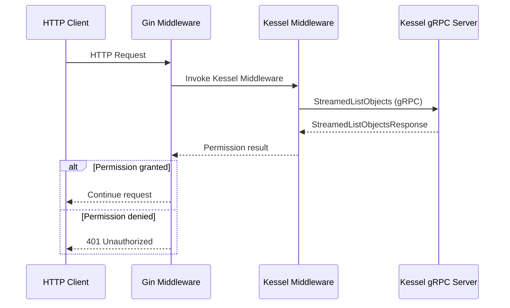
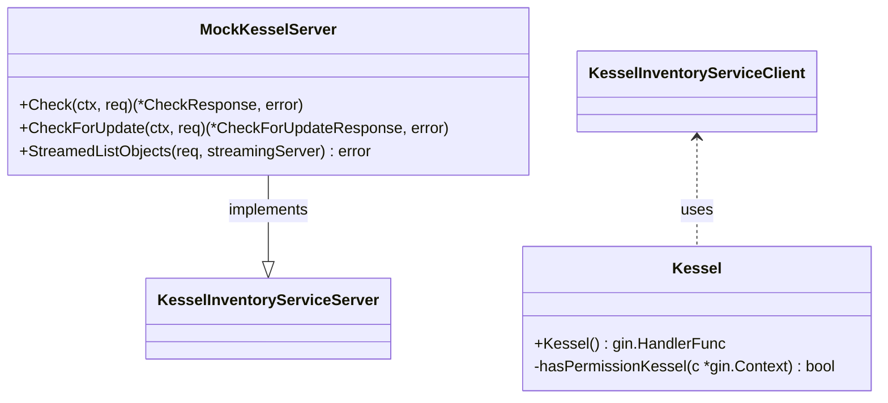

# Pull Request #1705: feat: add Kessel mock and simplified Kessel middleware

**Author**: @Dugowitch
**Created**: June 30, 2025 at 09:18 AM UTC
**Status**: Closed
**Labels**: None
**Base**: `master` ← **Head**: `kessel`

## Description

## Secure Coding Practices Checklist GitHub Link
- https://github.com/RedHatInsights/secure-coding-checklist

## Secure Coding Checklist
- [x] Input Validation
- [x] Output Encoding
- [x] Authentication and Password Management
- [x] Session Management
- [x] Access Control
- [x] Cryptographic Practices
- [x] Error Handling and Logging
- [x] Data Protection
- [x] Communication Security
- [x] System Configuration
- [x] Database Security
- [x] File Management
- [x] Memory Management
- [x] General Coding Practices

## Summary by Sourcery

Add a mock gRPC Kessel service and a simplified Kessel-based authorization middleware to replace RBAC, including config flag, Docker port bindings, and updated dependencies.

New Features:
- Introduce a mock KesselInventoryService gRPC server that always grants a fixed permission.
- Add a Gin middleware to perform Kessel-based permission checks and abort unauthorized requests.
- Add a feature flag (EnableKessel) and expose port 9005 in Docker Compose for the Kessel service.

Enhancements:
- Bump Go toolchain to 1.23.9 and update various dependencies including grpc, project-kessel/inventory-api, and go-spew.

Deployment:
- Expose port 9005 for the Kessel mock service in Docker Compose and Docker Compose test configurations.

---

## Discussion

### Comment by @jira-linking on June 30, 2025 at 09:18 AM UTC

Commits missing Jira IDs:
5270a1cbbccd506f69f49e9ddfcebfcf821904bc
Referenced Jiras:
https://issues.redhat.com/browse/RHINENG-19009

### Comment by @sourcery-ai on June 30, 2025 at 09:18 AM UTC

<!-- Generated by sourcery-ai[bot]: start review_guide -->

## Reviewer's Guide

This PR adds a new Kessel-based authorization layer by implementing a Gin middleware that streams permissions from a gRPC Kessel service and introducing a dummy gRPC server for testing. It integrates the middleware behind a feature flag, updates route definitions to use Kessel instead of RBAC, and updates Docker and module dependencies to support the new gRPC service.

#### Sequence diagram for Kessel middleware authorization flow

#### Class diagram for Kessel middleware and mock server

### File-Level Changes

| Change | Details | Files |
| ------ | ------- | ----- |
| Updated module dependencies | <ul><li>Bumped Go version and toolchain</li><li>Added project-kessel and gRPC libraries</li><li>Updated indirect dependencies</li></ul> | `go.mod` `go.sum` |
| Added Kessel middleware for gRPC authorization | <ul><li>Created Gin middleware connecting to Kessel via gRPC</li><li>Implemented StreamedListObjects RPC call and permission check</li><li>Aborts request on unauthorized outcome</li></ul> | `manager/middlewares/kessel.go` |
| Introduced mock Kessel gRPC server | <ul><li>Implemented dummy KesselInventoryServiceServer returning static response</li><li>Added initKessel to start gRPC server on port 9005</li></ul> | `platform/kessel.go` |
| Integrated Kessel middleware and configuration | <ul><li>Called initKessel in platform startup</li><li>Replaced RBAC middleware with Kessel in routes</li><li>Added EnableKessel feature flag in config</li></ul> | `platform/platform.go` `manager/routes/routes.go` `manager/config/config.go` |
| Exposed gRPC port in Docker compose | <ul><li>Mapped port 9005 in test and normal compose files</li></ul> | `docker-compose.yml` `docker-compose.test.yml` |

---

Tips and commands

#### Interacting with Sourcery

- **Trigger a new review:** Comment `@sourcery-ai review` on the pull request.
- **Continue discussions:** Reply directly to Sourcery's review comments.
- **Generate a GitHub issue from a review comment:** Ask Sourcery to create an
  issue from a review comment by replying to it. You can also reply to a
  review comment with `@sourcery-ai issue` to create an issue from it.
- **Generate a pull request title:** Write `@sourcery-ai` anywhere in the pull
  request title to generate a title at any time. You can also comment
  `@sourcery-ai title` on the pull request to (re-)generate the title at any time.
- **Generate a pull request summary:** Write `@sourcery-ai summary` anywhere in
  the pull request body to generate a PR summary at any time exactly where you
  want it. You can also comment `@sourcery-ai summary` on the pull request to
  (re-)generate the summary at any time.
- **Generate reviewer's guide:** Comment `@sourcery-ai guide` on the pull
  request to (re-)generate the reviewer's guide at any time.
- **Resolve all Sourcery comments:** Comment `@sourcery-ai resolve` on the
  pull request to resolve all Sourcery comments. Useful if you've already
  addressed all the comments and don't want to see them anymore.
- **Dismiss all Sourcery reviews:** Comment `@sourcery-ai dismiss` on the pull
  request to dismiss all existing Sourcery reviews. Especially useful if you
  want to start fresh with a new review - don't forget to comment
  `@sourcery-ai review` to trigger a new review!

#### Customizing Your Experience

Access your [dashboard](https://app.sourcery.ai) to:
- Enable or disable review features such as the Sourcery-generated pull request
  summary, the reviewer's guide, and others.
- Change the review language.
- Add, remove or edit custom review instructions.
- Adjust other review settings.

#### Getting Help

- [Contact our support team](mailto:support@sourcery.ai) for questions or feedback.
- Visit our [documentation](https://docs.sourcery.ai) for detailed guides and information.
- Keep in touch with the Sourcery team by following us on [X/Twitter](https://x.com/SourceryAI), [LinkedIn](https://www.linkedin.com/company/sourcery-ai/) or [GitHub](https://github.com/sourcery-ai).

<!-- Generated by sourcery-ai[bot]: end review_guide -->

---

## Reviews

### Review by @MichaelMraka - Commented on June 30, 2025 at 12:06 PM UTC

### Review by @MichaelMraka - Commented on June 30, 2025 at 01:12 PM UTC

### Review by @MichaelMraka - Commented on June 30, 2025 at 01:16 PM UTC

---

*Archived from: https://github.com/RedHatInsights/patchman-engine/pull/1705*
