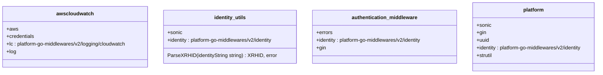

# Pull Request #1715: Update module github.com/redhatinsights/platform-go-middlewares to v2

**Author**: @red-hat-konflux
**Created**: July 06, 2025 at 08:22 AM UTC
**Status**: Closed
**Labels**: None
**Base**: `security-compliance` ← **Head**: `konflux/mintmaker/security-compliance/github.com-redhatinsights-platform-go-middlewares-2.x`

## Description

This PR contains the following updates:

| Package | Change | Age | Confidence |
|---|---|---|---|
| [github.com/redhatinsights/platform-go-middlewares](https://redirect.github.com/redhatinsights/platform-go-middlewares) | `v1.0.0` -> `v2.0.0` |  |  |

---

### Release Notes

redhatinsights/platform-go-middlewares (github.com/redhatinsights/platform-go-middlewares)

### [`v2.0.0`](https://redirect.github.com/redhatinsights/platform-go-middlewares/compare/v1.0.0...v2.0.0)

[Compare Source](https://redirect.github.com/redhatinsights/platform-go-middlewares/compare/v1.0.0...v2.0.0)

---

### Configuration

📅 **Schedule**: Branch creation - "after 5am on sunday" in timezone Europe/Prague, Automerge - At any time (no schedule defined).

🚦 **Automerge**: Enabled.

♻ **Rebasing**: Whenever PR is behind base branch, or you tick the rebase/retry checkbox.

🔕 **Ignore**: Close this PR and you won't be reminded about this update again.

---

 - [ ] <!-- rebase-check -->If you want to rebase/retry this PR, check this box

---

To execute skipped test pipelines write comment `/ok-to-test`.

This PR has been generated by [MintMaker](https://redirect.github.com/konflux-ci/mintmaker) (powered by [Renovate Bot](https://redirect.github.com/renovatebot/renovate)).
<!--renovate-debug:eyJjcmVhdGVkSW5WZXIiOiIzOS4yNjQuMC1ycG0iLCJ1cGRhdGVkSW5WZXIiOiI0MS43LjAtcnBtIiwidGFyZ2V0QnJhbmNoIjoic2VjdXJpdHktY29tcGxpYW5jZSIsImxhYmVscyI6W119-->

---

## Discussion

### Comment by @jira-linking on July 06, 2025 at 08:22 AM UTC

Commits missing Jira IDs:
b6cb0afe2fc537362ceb190be6a427c4e3ba44e9

### Comment by @sourcery-ai on July 06, 2025 at 08:22 AM UTC

<!-- Generated by sourcery-ai[bot]: start review_guide -->

## Reviewer's Guide

This PR upgrades the platform-go-middlewares dependency from v1 to v2, updating the module requirement and all related import paths to the new v2 module path.

#### Class diagram for updated platform-go-middlewares v2 imports

### File-Level Changes

| Change | Details | Files |
| ------ | ------- | ----- |
| Bump platform-go-middlewares dependency to v2.0.0 | <ul><li>Updated go.mod require line to github.com/redhatinsights/platform-go-middlewares/v2 v2.0.0</li><li>Regenerated go.sum to match updated dependency</li></ul> | `go.mod` `go.sum` |
| Update code to use v2 import paths | <ul><li>Replaced cloudwatch logging import path with v2 module</li><li>Replaced identity import path with v2 module in utilities</li><li>Updated authentication middleware import to v2 identity</li><li>Updated platform initialization import to v2 identity</li></ul> | `base/utils/awscloudwatch.go` `base/utils/identity.go` `manager/middlewares/authentication.go` `platform/platform.go` |

---

Tips and commands

#### Interacting with Sourcery

- **Trigger a new review:** Comment `@sourcery-ai review` on the pull request.
- **Continue discussions:** Reply directly to Sourcery's review comments.
- **Generate a GitHub issue from a review comment:** Ask Sourcery to create an
  issue from a review comment by replying to it. You can also reply to a
  review comment with `@sourcery-ai issue` to create an issue from it.
- **Generate a pull request title:** Write `@sourcery-ai` anywhere in the pull
  request title to generate a title at any time. You can also comment
  `@sourcery-ai title` on the pull request to (re-)generate the title at any time.
- **Generate a pull request summary:** Write `@sourcery-ai summary` anywhere in
  the pull request body to generate a PR summary at any time exactly where you
  want it. You can also comment `@sourcery-ai summary` on the pull request to
  (re-)generate the summary at any time.
- **Generate reviewer's guide:** Comment `@sourcery-ai guide` on the pull
  request to (re-)generate the reviewer's guide at any time.
- **Resolve all Sourcery comments:** Comment `@sourcery-ai resolve` on the
  pull request to resolve all Sourcery comments. Useful if you've already
  addressed all the comments and don't want to see them anymore.
- **Dismiss all Sourcery reviews:** Comment `@sourcery-ai dismiss` on the pull
  request to dismiss all existing Sourcery reviews. Especially useful if you
  want to start fresh with a new review - don't forget to comment
  `@sourcery-ai review` to trigger a new review!

#### Customizing Your Experience

Access your [dashboard](https://app.sourcery.ai) to:
- Enable or disable review features such as the Sourcery-generated pull request
  summary, the reviewer's guide, and others.
- Change the review language.
- Add, remove or edit custom review instructions.
- Adjust other review settings.

#### Getting Help

- [Contact our support team](mailto:support@sourcery.ai) for questions or feedback.
- Visit our [documentation](https://docs.sourcery.ai) for detailed guides and information.
- Keep in touch with the Sourcery team by following us on [X/Twitter](https://x.com/SourceryAI), [LinkedIn](https://www.linkedin.com/company/sourcery-ai/) or [GitHub](https://github.com/sourcery-ai).

<!-- Generated by sourcery-ai[bot]: end review_guide -->

### Comment by @red-hat-konflux on July 28, 2025 at 09:33 AM UTC

### Renovate Ignore Notification

Because you closed this PR without merging, Renovate will ignore this update. You will not get PRs for *any* future `2.x` releases. But if you manually upgrade to `2.x` then Renovate will re-enable `minor` and `patch` updates automatically.

If you accidentally closed this PR, or if you changed your mind: rename this PR to get a fresh replacement PR.

---

*Archived from: https://github.com/RedHatInsights/patchman-engine/pull/1715*
