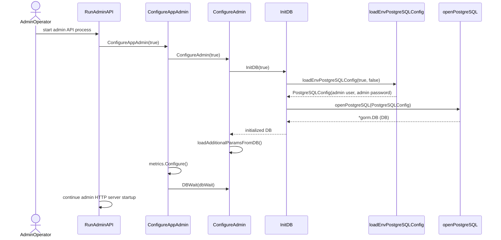
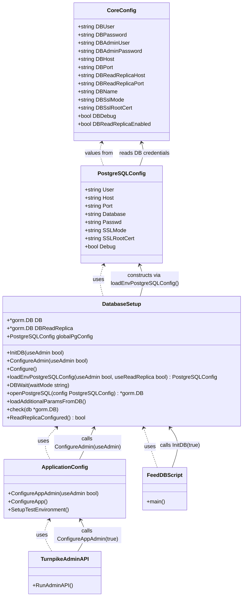
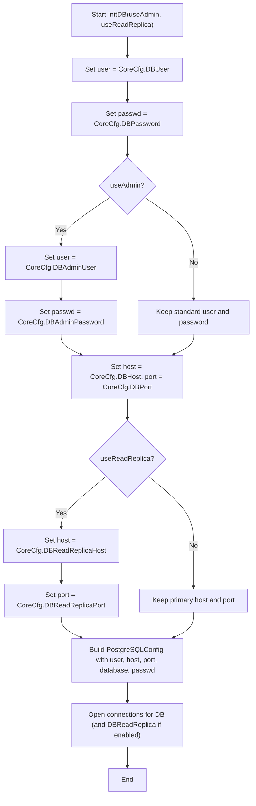

# Pull Request #1953: RHINENG-22333: fix admin failure in ephemeral

**Author**: @MichaelMraka
**Created**: November 27, 2025 at 05:12 PM UTC
**Status**: Closed
**Labels**: None
**Base**: `master` ← **Head**: `pr1`

## Description

## Secure Coding Practices Checklist GitHub Link
- https://github.com/RedHatInsights/secure-coding-checklist

## Secure Coding Checklist
- [x] Input Validation
- [x] Output Encoding
- [x] Authentication and Password Management
- [x] Session Management
- [x] Access Control
- [x] Cryptographic Practices
- [x] Error Handling and Logging
- [x] Data Protection
- [x] Communication Security
- [x] System Configuration
- [x] Database Security
- [x] File Management
- [x] Memory Management
- [x] General Coding Practices

## Summary by Sourcery

Allow configuring database connections with either standard or admin credentials and update admin API to use admin configuration.

New Features:
- Add admin-aware application and database configuration entry points to support using elevated DB credentials when needed.

Enhancements:
- Extend PostgreSQL configuration to optionally use admin user/password and support this choice across primary and read-replica connections.
- Update database feed script and admin API startup to initialize using admin credentials where required.
- Bump kessel SDK dependency from v1.3.0 to v1.4.0.

---

## Discussion

### Comment by @sourcery-ai on November 27, 2025 at 05:12 PM UTC

<!-- Generated by sourcery-ai[bot]: start review_guide -->

## Reviewer's Guide

Adds support for initializing the database and application using either standard or admin DB credentials, updates admin-related entry points to use admin mode, and bumps the kessel SDK dependency version.

#### Sequence diagram for admin API startup using admin DB credentials



#### Class diagram for updated DB and app configuration with admin support



#### Flow diagram for selecting DB credentials and host based on admin and read replica flags



### File-Level Changes

| Change | Details | Files |
| ------ | ------- | ----- |
| Allow database initialization to switch between normal and admin DB credentials and propagate this through configuration helpers. | <ul><li>Changed InitDB to accept a useAdmin flag and pass it to loadEnvPostgreSQLConfig for primary and replica connections.</li><li>Introduced ConfigureAdmin that calls InitDB with a configurable admin flag and moved shared logic from Configure into it, with Configure now defaulting to non-admin.</li><li>Refactored loadEnvPostgreSQLConfig to accept useAdmin and useReadReplica flags, selecting admin or normal DB credentials accordingly while preserving existing host/port and SSL configuration.</li></ul> | `base/database/setup.go`<br/>`base/core/config.go` |
| Update callers to explicitly use admin DB initialization where required and keep default behaviour unchanged elsewhere. | <ul><li>Adjusted feed_db script to call InitDB with useAdmin=true so it uses admin credentials when feeding the database.</li><li>Updated RunAdminAPI to call ConfigureAppAdmin(true) so admin API runs with admin DB credentials.</li><li>Kept default app configuration path via ConfigureApp and Configure using non-admin credentials for normal runtime and tests (including SetupTestEnvironment).</li></ul> | `scripts/feed_db.go`<br/>`turnpike/admin_api.go`<br/>`base/core/config.go` |
| Update kessel SDK dependency to a newer minor version. | <ul><li>Bumped github.com/project-kessel/kessel-sdk-go from v1.3.0 to v1.4.0 in go.mod and go.sum.</li></ul> | `go.mod`<br/>`go.sum` |

---

<details>
<summary>Tips and commands</summary>

#### Interacting with Sourcery

- **Trigger a new review:** Comment `@sourcery-ai review` on the pull request.
- **Continue discussions:** Reply directly to Sourcery's review comments.
- **Generate a GitHub issue from a review comment:** Ask Sourcery to create an
  issue from a review comment by replying to it. You can also reply to a
  review comment with `@sourcery-ai issue` to create an issue from it.
- **Generate a pull request title:** Write `@sourcery-ai` anywhere in the pull
  request title to generate a title at any time. You can also comment
  `@sourcery-ai title` on the pull request to (re-)generate the title at any time.
- **Generate a pull request summary:** Write `@sourcery-ai summary` anywhere in
  the pull request body to generate a PR summary at any time exactly where you
  want it. You can also comment `@sourcery-ai summary` on the pull request to
  (re-)generate the summary at any time.
- **Generate reviewer's guide:** Comment `@sourcery-ai guide` on the pull
  request to (re-)generate the reviewer's guide at any time.
- **Resolve all Sourcery comments:** Comment `@sourcery-ai resolve` on the
  pull request to resolve all Sourcery comments. Useful if you've already
  addressed all the comments and don't want to see them anymore.
- **Dismiss all Sourcery reviews:** Comment `@sourcery-ai dismiss` on the pull
  request to dismiss all existing Sourcery reviews. Especially useful if you
  want to start fresh with a new review - don't forget to comment
  `@sourcery-ai review` to trigger a new review!

#### Customizing Your Experience

Access your [dashboard](https://app.sourcery.ai) to:
- Enable or disable review features such as the Sourcery-generated pull request
  summary, the reviewer's guide, and others.
- Change the review language.
- Add, remove or edit custom review instructions.
- Adjust other review settings.

#### Getting Help

- [Contact our support team](mailto:support@sourcery.ai) for questions or feedback.
- Visit our [documentation](https://docs.sourcery.ai) for detailed guides and information.
- Keep in touch with the Sourcery team by following us on [X/Twitter](https://x.com/SourceryAI), [LinkedIn](https://www.linkedin.com/company/sourcery-ai/) or [GitHub](https://github.com/sourcery-ai).

</details>

<!-- Generated by sourcery-ai[bot]: end review_guide -->

### Comment by @codecov-commenter on November 27, 2025 at 05:17 PM UTC

## [Codecov](https://app.codecov.io/gh/RedHatInsights/patchman-engine/pull/1953?dropdown=coverage&src=pr&el=h1&utm_medium=referral&utm_source=github&utm_content=comment&utm_campaign=pr+comments&utm_term=RedHatInsights) Report
:x: Patch coverage is `48.97959%` with `25 lines` in your changes missing coverage. Please review.
:white_check_mark: Project coverage is 58.93%. Comparing base ([`caf424b`](https://app.codecov.io/gh/RedHatInsights/patchman-engine/commit/caf424be22642297c7d94c11fe5a5802df4b558c?dropdown=coverage&el=desc&utm_medium=referral&utm_source=github&utm_content=comment&utm_campaign=pr+comments&utm_term=RedHatInsights)) to head ([`3b5f69c`](https://app.codecov.io/gh/RedHatInsights/patchman-engine/commit/3b5f69c4fb3673f2ffdbc21d8fd65e2d044e3e2f?dropdown=coverage&el=desc&utm_medium=referral&utm_source=github&utm_content=comment&utm_campaign=pr+comments&utm_term=RedHatInsights)).
:warning: Report is 7 commits behind head on master.

| [Files with missing lines](https://app.codecov.io/gh/RedHatInsights/patchman-engine/pull/1953?dropdown=coverage&src=pr&el=tree&utm_medium=referral&utm_source=github&utm_content=comment&utm_campaign=pr+comments&utm_term=RedHatInsights) | Patch % | Lines |
|---|---|---|
| [base/database/setup.go](https://app.codecov.io/gh/RedHatInsights/patchman-engine/pull/1953?src=pr&el=tree&filepath=base%2Fdatabase%2Fsetup.go&utm_medium=referral&utm_source=github&utm_content=comment&utm_campaign=pr+comments&utm_term=RedHatInsights#diff-YmFzZS9kYXRhYmFzZS9zZXR1cC5nbw==) | 50.00% | [19 Missing and 1 partial :warning: ](https://app.codecov.io/gh/RedHatInsights/patchman-engine/pull/1953?src=pr&el=tree&utm_medium=referral&utm_source=github&utm_content=comment&utm_campaign=pr+comments&utm_term=RedHatInsights) |
| [base/core/config.go](https://app.codecov.io/gh/RedHatInsights/patchman-engine/pull/1953?src=pr&el=tree&filepath=base%2Fcore%2Fconfig.go&utm_medium=referral&utm_source=github&utm_content=comment&utm_campaign=pr+comments&utm_term=RedHatInsights#diff-YmFzZS9jb3JlL2NvbmZpZy5nbw==) | 57.14% | [3 Missing :warning: ](https://app.codecov.io/gh/RedHatInsights/patchman-engine/pull/1953?src=pr&el=tree&utm_medium=referral&utm_source=github&utm_content=comment&utm_campaign=pr+comments&utm_term=RedHatInsights) |
| [scripts/feed\_db.go](https://app.codecov.io/gh/RedHatInsights/patchman-engine/pull/1953?src=pr&el=tree&filepath=scripts%2Ffeed_db.go&utm_medium=referral&utm_source=github&utm_content=comment&utm_campaign=pr+comments&utm_term=RedHatInsights#diff-c2NyaXB0cy9mZWVkX2RiLmdv) | 0.00% | [1 Missing :warning: ](https://app.codecov.io/gh/RedHatInsights/patchman-engine/pull/1953?src=pr&el=tree&utm_medium=referral&utm_source=github&utm_content=comment&utm_campaign=pr+comments&utm_term=RedHatInsights) |
| [turnpike/admin\_api.go](https://app.codecov.io/gh/RedHatInsights/patchman-engine/pull/1953?src=pr&el=tree&filepath=turnpike%2Fadmin_api.go&utm_medium=referral&utm_source=github&utm_content=comment&utm_campaign=pr+comments&utm_term=RedHatInsights#diff-dHVybnBpa2UvYWRtaW5fYXBpLmdv) | 0.00% | [1 Missing :warning: ](https://app.codecov.io/gh/RedHatInsights/patchman-engine/pull/1953?src=pr&el=tree&utm_medium=referral&utm_source=github&utm_content=comment&utm_campaign=pr+comments&utm_term=RedHatInsights) |

<details><summary>Additional details and impacted files</summary>


```diff
@@            Coverage Diff             @@
##           master    #1953      +/-   ##
==========================================
+ Coverage   58.83%   58.93%   +0.09%     
==========================================
  Files         131      131              
  Lines        8407     8481      +74     
==========================================
+ Hits         4946     4998      +52     
- Misses       2927     2949      +22     
  Partials      534      534              
```

| [Flag](https://app.codecov.io/gh/RedHatInsights/patchman-engine/pull/1953/flags?src=pr&el=flags&utm_medium=referral&utm_source=github&utm_content=comment&utm_campaign=pr+comments&utm_term=RedHatInsights) | Coverage Δ | |
|---|---|---|
| [unittests](https://app.codecov.io/gh/RedHatInsights/patchman-engine/pull/1953/flags?src=pr&el=flag&utm_medium=referral&utm_source=github&utm_content=comment&utm_campaign=pr+comments&utm_term=RedHatInsights) | `58.93% <48.97%> (+0.09%)` | :arrow_up: |

Flags with carried forward coverage won't be shown. [Click here](https://docs.codecov.io/docs/carryforward-flags?utm_medium=referral&utm_source=github&utm_content=comment&utm_campaign=pr+comments&utm_term=RedHatInsights#carryforward-flags-in-the-pull-request-comment) to find out more.
</details>

[:umbrella: View full report in Codecov by Sentry](https://app.codecov.io/gh/RedHatInsights/patchman-engine/pull/1953?dropdown=coverage&src=pr&el=continue&utm_medium=referral&utm_source=github&utm_content=comment&utm_campaign=pr+comments&utm_term=RedHatInsights).   
:loudspeaker: Have feedback on the report? [Share it here](https://about.codecov.io/codecov-pr-comment-feedback/?utm_medium=referral&utm_source=github&utm_content=comment&utm_campaign=pr+comments&utm_term=RedHatInsights).
<details><summary> :rocket: New features to boost your workflow: </summary>

- :snowflake: [Test Analytics](https://docs.codecov.com/docs/test-analytics): Detect flaky tests, report on failures, and find test suite problems.
</details>

### Comment by @MichaelMraka on December 03, 2025 at 12:19 PM UTC

/retest

### Comment by @jira-linking on December 03, 2025 at 04:57 PM UTC

Commits missing Jira IDs:
0b9c69ef1d5c8fe5a9ea07edc3ab254e943e6330
3b5f69c4fb3673f2ffdbc21d8fd65e2d044e3e2f
Referenced Jiras:
https://issues.redhat.com/browse/RHINENG-22333


---

## Reviews

### Review by @sourcery-ai - Commented on November 27, 2025 at 05:13 PM UTC

Hey there - I've reviewed your changes - here's some feedback:

- The addition of `useAdmin` booleans through `InitDB`, `ConfigureAdmin`, and `ConfigureAppAdmin` makes the call graph harder to reason about; consider exposing clearly named admin vs non-admin entrypoints (e.g., `InitAdminDB` / `InitUserDB`) instead of a flag that can be accidentally mis-set at call sites.
- The `loadEnvPostgreSQLConfig(useAdmin, useReadReplica)` signature with two booleans is a bit opaque; using a small config/options struct or separate helper functions for admin vs replica config would make call sites more self-documenting and reduce the chance of argument ordering mistakes.

<details>
<summary>Prompt for AI Agents</summary>

~~~markdown
Please address the comments from this code review:

## Overall Comments
- The addition of `useAdmin` booleans through `InitDB`, `ConfigureAdmin`, and `ConfigureAppAdmin` makes the call graph harder to reason about; consider exposing clearly named admin vs non-admin entrypoints (e.g., `InitAdminDB` / `InitUserDB`) instead of a flag that can be accidentally mis-set at call sites.
- The `loadEnvPostgreSQLConfig(useAdmin, useReadReplica)` signature with two booleans is a bit opaque; using a small config/options struct or separate helper functions for admin vs replica config would make call sites more self-documenting and reduce the chance of argument ordering mistakes.

## Individual Comments

### Comment 1
<location> `base/database/setup.go:111-120` </location>
<code_context>

 // load database config from environment vars using inserted prefix
-func loadEnvPostgreSQLConfig(useReadReplica bool) *PostgreSQLConfig {
+func loadEnvPostgreSQLConfig(useAdmin bool, useReadReplica bool) *PostgreSQLConfig {
+	user := utils.CoreCfg.DBUser
+	passwd := utils.CoreCfg.DBPassword
</code_context>

<issue_to_address>
**🚨 question (security):** Consider whether admin credentials should ever be used for the read replica connection

Since `useAdmin` is passed into `loadEnvPostgreSQLConfig` and combined with `useReadReplica`, the read replica will also use admin credentials when `InitDB(true)` is called and a replica is configured. For typical setups where replicas are read-only and should use restricted users, this broadens privileges unnecessarily. Consider ignoring `useAdmin` when `useReadReplica` is true, or introducing a separate `useReplicaAdmin` flag if elevated access on the replica is explicitly required.
</issue_to_address>
~~~

</details>

***

<details>
<summary>Sourcery is free for open source - if you like our reviews please consider sharing them ✨</summary>

- [X](https://twitter.com/intent/tweet?text=I%20just%20got%20an%20instant%20code%20review%20from%20%40SourceryAI%2C%20and%20it%20was%20brilliant%21%20It%27s%20free%20for%20open%20source%20and%20has%20a%20free%20trial%20for%20private%20code.%20Check%20it%20out%20https%3A//sourcery.ai)
- [Mastodon](https://mastodon.social/share?text=I%20just%20got%20an%20instant%20code%20review%20from%20%40SourceryAI%2C%20and%20it%20was%20brilliant%21%20It%27s%20free%20for%20open%20source%20and%20has%20a%20free%20trial%20for%20private%20code.%20Check%20it%20out%20https%3A//sourcery.ai)
- [LinkedIn](https://www.linkedin.com/sharing/share-offsite/?url=https://sourcery.ai)
- [Facebook](https://www.facebook.com/sharer/sharer.php?u=https://sourcery.ai)

</details>

<sub>
Help me be more useful! Please click 👍 or 👎 on each comment and I'll use the feedback to improve your reviews.
</sub>

---

*Archived from: https://github.com/RedHatInsights/patchman-engine/pull/1953*
