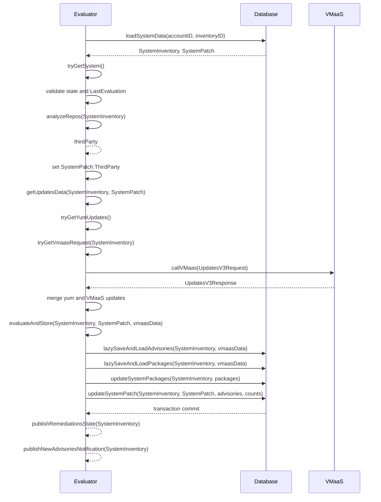
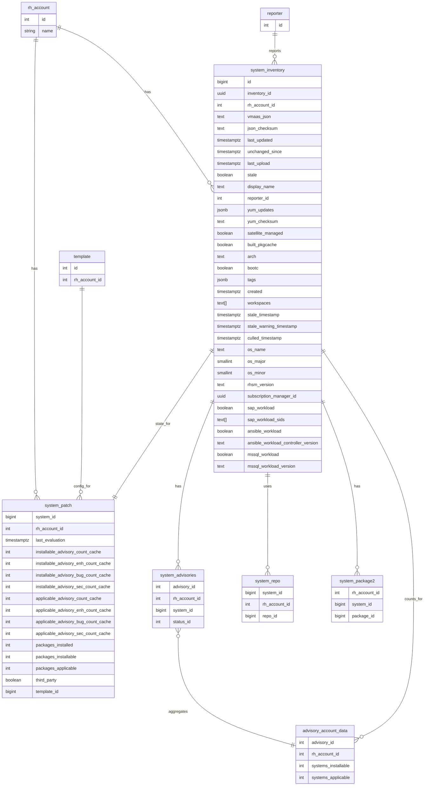

# Pull Request #2018: Cyndi2

**Author**: @MichaelMraka
**Created**: January 20, 2026 at 02:16 PM UTC
**Status**: Closed
**Labels**: None
**Base**: `master` ← **Head**: `cyndi2`

## Description

## Secure Coding Practices Checklist GitHub Link
- https://github.com/RedHatInsights/secure-coding-checklist

## Secure Coding Checklist
- [x] Input Validation
- [x] Output Encoding
- [x] Authentication and Password Management
- [x] Session Management
- [x] Access Control
- [x] Cryptographic Practices
- [x] Error Handling and Logging
- [x] Data Protection
- [x] Communication Security
- [x] System Configuration
- [x] Database Security
- [x] File Management
- [x] Memory Management
- [x] General Coding Practices

## Summary by Sourcery

Split system platform data into separate inventory and patch tables and update application logic accordingly.

New Features:
- Introduce system_inventory table and related GORM model to store static system inventory and profile fields.
- Introduce system_patch table and related GORM model to store evaluation, package, and advisory cache data separately from inventory.

Enhancements:
- Refactor database functions, triggers, and foreign keys to use system_inventory and system_patch while exposing a compatibility system_platform view.
- Update evaluator, manager controllers, notifications, and utilities to operate on the new inventory/patch models instead of the monolithic system_platform table.
- Extend dev test data and migrations to populate and validate the new schema layout.

Tests:
- Adjust and extend evaluator and notification tests to use the new SystemInventory and SystemPatch models and ensure evaluation and notification flows still work.

---

## Discussion

### Comment by @jira-linking on January 20, 2026 at 02:16 PM UTC

Commits missing Jira IDs:
267557d488c730bc866e49b008cb76a3c2c902ef
4d1cdcce0d679e7e130e6414df5fed91b88f0a7f
eb0fe486536b4a33acab3e98bb6bc34b27fe38fc
d2d03c13f2d31894ba4870d48aed2ca196d9cccf
943ebe78b04900ea2393073cbeeecd0508ac0506
c56c378be2d6203bfeafd11799286f5461f1a9d4
Referenced Jiras:
https://issues.redhat.com/browse/RHINENG-21214

### Comment by @sourcery-ai on January 20, 2026 at 02:16 PM UTC

<!-- Generated by sourcery-ai[bot]: start review_guide -->

## Reviewer's Guide

Split the monolithic system_platform table into a system_inventory table plus a system_patch table (with a compatibility view), update all PL/pgSQL functions, foreign keys, test data, and Go models/logic to use the new schema, and adjust evaluator, manager controllers, notifications, and utilities accordingly.

#### Sequence diagram for evaluation flow with SystemInventory and SystemPatch

#### ER diagram for split system_platform into system_inventory and system_patch

#### Class diagram for new SystemInventory and SystemPatch models

```mermaid
classDiagram
    class SystemInventory {
        +int64 ID
        +string InventoryID
        +int RhAccountID
        +*string VmaasJSON
        +*string JSONChecksum
        +*time.Time LastUpdated
        +*time.Time UnchangedSince
        +*time.Time LastUpload
        +bool Stale
        +string DisplayName
        +*int ReporterID
        +[]byte YumUpdates
        +*string YumChecksum
        +bool SatelliteManaged
        +bool BuiltPkgcache
        +*string Arch
        +bool Bootc
        +[]byte Tags
        +time.Time Created
        +[]string Workspaces
        +time.Time StaleTimestamp
        +time.Time StaleWarningTimestamp
        +time.Time CulledTimestamp
        +*string OSName
        +*int16 OSMajor
        +*int16 OSMinor
        +*string RhsmVersion
        +*string SubscriptionManagerID
        +bool SapWorkload
        +[]string SapWorkloadSIDs
        +bool AnsibleWorkload
        +*string AnsibleWorkloadControllerVersion
        +bool MssqlWorkload
        +*string MssqlWorkloadVersion
        +string GetInventoryID()
    }

    class SystemPatch {
        +int64 SystemID
        +int RhAccountID
        +*time.Time LastEvaluation
        +int InstallableAdvisoryCountCache
        +int InstallableAdvisoryEnhCountCache
        +int InstallableAdvisoryBugCountCache
        +int InstallableAdvisorySecCountCache
        +int PackagesInstalled
        +int PackagesInstallable
        +int PackagesApplicable
        +bool ThirdParty
        +int ApplicableAdvisoryCountCache
        +int ApplicableAdvisoryEnhCountCache
        +int ApplicableAdvisoryBugCountCache
        +int ApplicableAdvisorySecCountCache
        +*int64 TemplateID
    }

    class SystemPlatformView {
        <<view>>
        +int64 ID
        +string InventoryID
        +int RhAccountID
        +*string VmaasJSON
        +*string JSONChecksum
        +time.Time LastUpdated
        +time.Time UnchangedSince
        +*time.Time LastEvaluation
        +int InstallableAdvisoryCountCache
        +int InstallableAdvisoryEnhCountCache
        +int InstallableAdvisoryBugCountCache
        +int InstallableAdvisorySecCountCache
        +*time.Time LastUpload
        +time.Time StaleTimestamp
        +time.Time StaleWarningTimestamp
        +time.Time CulledTimestamp
        +bool Stale
        +string DisplayName
        +int PackagesInstalled
        +int PackagesInstallable
        +*int ReporterID
        +bool ThirdParty
        +[]byte YumUpdates
        +int ApplicableAdvisoryCountCache
        +int ApplicableAdvisoryEnhCountCache
        +int ApplicableAdvisoryBugCountCache
        +int ApplicableAdvisorySecCountCache
        +bool SatelliteManaged
        +bool BuiltPkgcache
        +int PackagesApplicable
        +*int64 TemplateID
        +*string YumChecksum
        +*string Arch
        +bool Bootc
    }

    SystemInventory "1" -- "1" SystemPatch : split_into
    SystemPlatformView "1" .. "1" SystemInventory : joins
    SystemPlatformView "1" .. "1" SystemPatch : joins
```

### File-Level Changes

| Change | Details | Files |
| ------ | ------- | ----- |
| Introduce system_inventory and system_patch tables and migrate data/schema from system_platform with forward/backward migrations. | <ul><li>Add 142_split_system_platform up/down migrations that create system_inventory and system_patch, move data from system_platform, recreate constraints, triggers, indexes, and privileges, and redefine system_platform as a view over the new tables</li><li>Wire system_inventory into advisory/account cache refresh functions and culling/stale-management functions to use system_patch for evaluation-related state</li><li>Update foreign keys from system_repo, system_advisories, and system_package2 to reference system_inventory instead of system_platform</li></ul> | `database_admin/schema/create_schema.sql` `database_admin/migrations/142_split_system_platform.up.sql` `database_admin/migrations/142_split_system_platform.down.sql` |
| Refactor Go models and evaluator/notification logic to separate inventory and patch state and use the new schema. | <ul><li>Add SystemInventory and SystemPatch models in base/models and update helper methods (GetInventoryID, ParseVmaasJSON) to operate on SystemInventory</li><li>Change evaluator evaluation flow to load both SystemInventory and SystemPatch, passing both through evaluateInDatabase, getUpdatesData/getVmaasUpdates, evaluateWithVmaas, and evaluateAndStore</li><li>Rename and adjust updateSystemPlatform to updateSystemPatch, updating only patch counters/flags on system_patch while leaving inventory fields on system_inventory</li><li>Simplify notification tag retrieval by reading tags JSON directly from SystemInventory instead of joining inventory.hosts; drop getSystemTags and its tests</li></ul> | `base/models/models.go` `base/utils/vmaas.go` `evaluator/evaluate.go` `evaluator/evaluate_advisories.go` `evaluator/evaluate_packages.go` `evaluator/notifications.go` `evaluator/remediations.go` `evaluator/evaluate_test.go` `evaluator/evaluate_advisories_test.go` `evaluator/evaluate_packages_test.go` `evaluator/notifications_test.go` |
| Adjust manager APIs, test data, and auxiliary components to the new schema and test scenarios. | <ul><li>Change manager controllers to query system_inventory/system_patch where appropriate (e.g., remove insights_id from extended attributes, keep third_party and packages_updatable from patch data)</li><li>Rewrite dev/test_data.sql to populate system_inventory and system_patch instead of system_platform, including tags/workloads/system_profile alignment with inventory.hosts test data</li><li>Extend platform candlepin mock handlers to treat a specific UUID like return_404 for testing culling and subscription-manager behavior and align inventory.hosts owner_id with that value</li></ul> | `manager/controllers/systems.go` `manager/controllers/system_detail.go` `manager/controllers/advisory_systems.go` `dev/test_data.sql` `platform/candlepin.go` `base/notification/notification.go` |

---

Tips and commands

#### Interacting with Sourcery

- **Trigger a new review:** Comment `@sourcery-ai review` on the pull request.
- **Continue discussions:** Reply directly to Sourcery's review comments.
- **Generate a GitHub issue from a review comment:** Ask Sourcery to create an
  issue from a review comment by replying to it. You can also reply to a
  review comment with `@sourcery-ai issue` to create an issue from it.
- **Generate a pull request title:** Write `@sourcery-ai` anywhere in the pull
  request title to generate a title at any time. You can also comment
  `@sourcery-ai title` on the pull request to (re-)generate the title at any time.
- **Generate a pull request summary:** Write `@sourcery-ai summary` anywhere in
  the pull request body to generate a PR summary at any time exactly where you
  want it. You can also comment `@sourcery-ai summary` on the pull request to
  (re-)generate the summary at any time.
- **Generate reviewer's guide:** Comment `@sourcery-ai guide` on the pull
  request to (re-)generate the reviewer's guide at any time.
- **Resolve all Sourcery comments:** Comment `@sourcery-ai resolve` on the
  pull request to resolve all Sourcery comments. Useful if you've already
  addressed all the comments and don't want to see them anymore.
- **Dismiss all Sourcery reviews:** Comment `@sourcery-ai dismiss` on the pull
  request to dismiss all existing Sourcery reviews. Especially useful if you
  want to start fresh with a new review - don't forget to comment
  `@sourcery-ai review` to trigger a new review!

#### Customizing Your Experience

Access your [dashboard](https://app.sourcery.ai) to:
- Enable or disable review features such as the Sourcery-generated pull request
  summary, the reviewer's guide, and others.
- Change the review language.
- Add, remove or edit custom review instructions.
- Adjust other review settings.

#### Getting Help

- [Contact our support team](mailto:support@sourcery.ai) for questions or feedback.
- Visit our [documentation](https://docs.sourcery.ai) for detailed guides and information.
- Keep in touch with the Sourcery team by following us on [X/Twitter](https://x.com/SourceryAI), [LinkedIn](https://www.linkedin.com/company/sourcery-ai/) or [GitHub](https://github.com/sourcery-ai).

<!-- Generated by sourcery-ai[bot]: end review_guide -->

---

*Archived from: https://github.com/RedHatInsights/patchman-engine/pull/2018*
