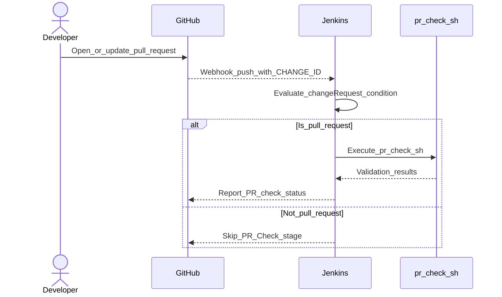
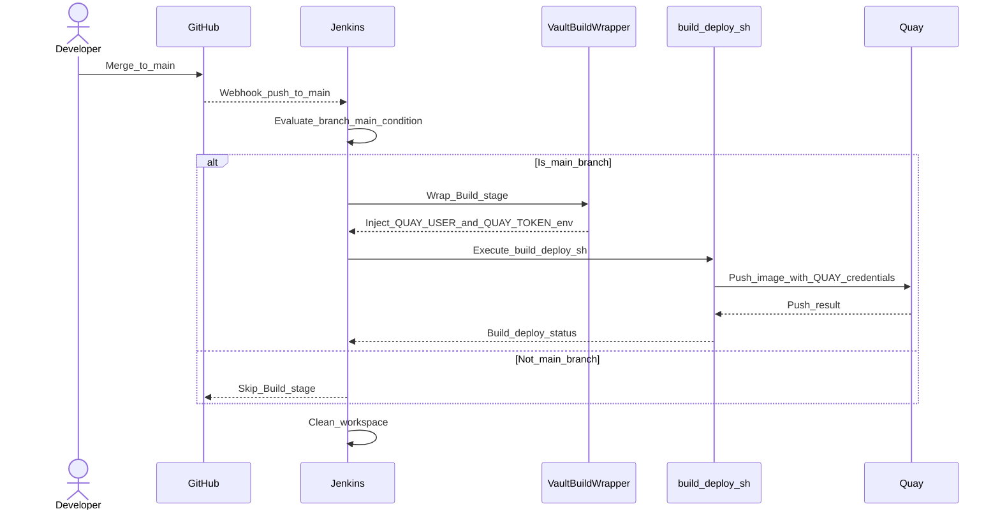
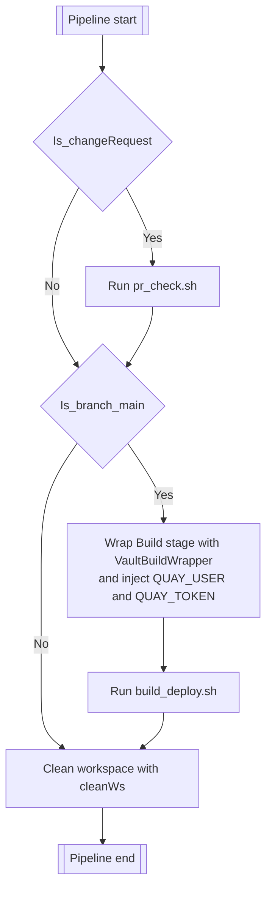

# Pull Request #2055: RHINENG-22499: jeniknsfile for gh-pr-and-build job

**Author**: @MichaelMraka
**Created**: February 13, 2026 at 01:48 PM UTC
**Status**: Closed
**Labels**: None
**Base**: `master` ← **Head**: `pr1`

## Description

replacement of gh-build-master and gh-pr-check

## Secure Coding Practices Checklist GitHub Link
- https://github.com/RedHatInsights/secure-coding-checklist

## Secure Coding Checklist
- [x] Input Validation
- [x] Output Encoding
- [x] Authentication and Password Management
- [x] Session Management
- [x] Access Control
- [x] Cryptographic Practices
- [x] Error Handling and Logging
- [x] Data Protection
- [x] Communication Security
- [x] System Configuration
- [x] Database Security
- [x] File Management
- [x] Memory Management
- [x] General Coding Practices

## Summary by Sourcery

Introduce a Jenkins pipeline to run PR checks and main-branch builds with secure secret handling and workspace cleanup.

Build:
- Add a Jenkinsfile defining the gh-pr-and-build pipeline using an rhel8-spot agent with timestamped logs.

CI:
- Configure separate PR check and main-branch build stages, including Vault-based secret injection for build/deploy and automatic workspace cleanup.

---

## Discussion

### Comment by @sourcery-ai on February 13, 2026 at 01:49 PM UTC

<!-- Generated by sourcery-ai[bot]: start review_guide -->

## Reviewer's Guide

Introduces a new Jenkins declarative pipeline (Jenkinsfile) that replaces existing gh-build-master and gh-pr-check jobs with a PR-only validation stage and a main-branch-only build/deploy stage that uses Vault-managed Quay credentials, plus workspace cleanup after each run.

#### Sequence diagram for PR-only validation stage in Jenkins pipeline

#### Sequence diagram for main branch build and deploy with Vault-managed credentials

#### Flow diagram for Jenkinsfile stages and branch conditions

### File-Level Changes

| Change | Details | Files |
| ------ | ------- | ----- |
| Add a new Jenkins declarative pipeline for PR checks and main-branch builds. | <ul><li>Define pipeline agent to run on rhel8-spot labeled nodes with timestamped logs.</li><li>Add a PR Check stage gated by changeRequest() that runs ./pr_check.sh.</li><li>Add a Build stage gated to the main branch that wraps execution in VaultBuildWrapper to inject Quay credentials and runs ./build_deploy.sh.</li><li>Configure post actions to always clean the workspace after builds.</li></ul> | `Jenkinsfile` |

---

Tips and commands

#### Interacting with Sourcery

- **Trigger a new review:** Comment `@sourcery-ai review` on the pull request.
- **Continue discussions:** Reply directly to Sourcery's review comments.
- **Generate a GitHub issue from a review comment:** Ask Sourcery to create an
  issue from a review comment by replying to it. You can also reply to a
  review comment with `@sourcery-ai issue` to create an issue from it.
- **Generate a pull request title:** Write `@sourcery-ai` anywhere in the pull
  request title to generate a title at any time. You can also comment
  `@sourcery-ai title` on the pull request to (re-)generate the title at any time.
- **Generate a pull request summary:** Write `@sourcery-ai summary` anywhere in
  the pull request body to generate a PR summary at any time exactly where you
  want it. You can also comment `@sourcery-ai summary` on the pull request to
  (re-)generate the summary at any time.
- **Generate reviewer's guide:** Comment `@sourcery-ai guide` on the pull
  request to (re-)generate the reviewer's guide at any time.
- **Resolve all Sourcery comments:** Comment `@sourcery-ai resolve` on the
  pull request to resolve all Sourcery comments. Useful if you've already
  addressed all the comments and don't want to see them anymore.
- **Dismiss all Sourcery reviews:** Comment `@sourcery-ai dismiss` on the pull
  request to dismiss all existing Sourcery reviews. Especially useful if you
  want to start fresh with a new review - don't forget to comment
  `@sourcery-ai review` to trigger a new review!

#### Customizing Your Experience

Access your [dashboard](https://app.sourcery.ai) to:
- Enable or disable review features such as the Sourcery-generated pull request
  summary, the reviewer's guide, and others.
- Change the review language.
- Add, remove or edit custom review instructions.
- Adjust other review settings.

#### Getting Help

- [Contact our support team](mailto:support@sourcery.ai) for questions or feedback.
- Visit our [documentation](https://docs.sourcery.ai) for detailed guides and information.
- Keep in touch with the Sourcery team by following us on [X/Twitter](https://x.com/SourceryAI), [LinkedIn](https://www.linkedin.com/company/sourcery-ai/) or [GitHub](https://github.com/sourcery-ai).

<!-- Generated by sourcery-ai[bot]: end review_guide -->

### Comment by @github-actions on February 13, 2026 at 01:49 PM UTC

<!-- sc-environment-impact-check -->
## SC Environment Impact Assessment

**Overall Impact:** 🟢 **LOW**

View full report

### Summary

- **Total Issues:** 1
- 🟢 Low: 1

### Detailed Findings

#### 🟢 LOW Impact

**Environment configuration change detected**
- File: `Jenkinsfile`
- Category: `environment_config`
- Details:
  - Found `Environment` in `Jenkinsfile` at line 42
  - Found `environment` in `Jenkinsfile` at line 67
- **Recommendation:** Review environment-specific settings to ensure SC Environment is properly configured.

### Required Actions

- [ ] Review all findings above
- [ ] Verify SC Environment compatibility for all detected changes
- [ ] Update deployment documentation if needed
- [ ] Coordinate with ROSA Core team or deployment timeline

---
*This assessment was automatically generated. Please review carefully and consult with the ROSA Core team for critical/high impact changes.*

### Comment by @MichaelMraka on February 17, 2026 at 10:26 AM UTC

/retest

### Comment by @MichaelMraka on February 17, 2026 at 01:15 PM UTC

moved from jenkins to konflux

---

*Archived from: https://github.com/RedHatInsights/patchman-engine/pull/2055*
