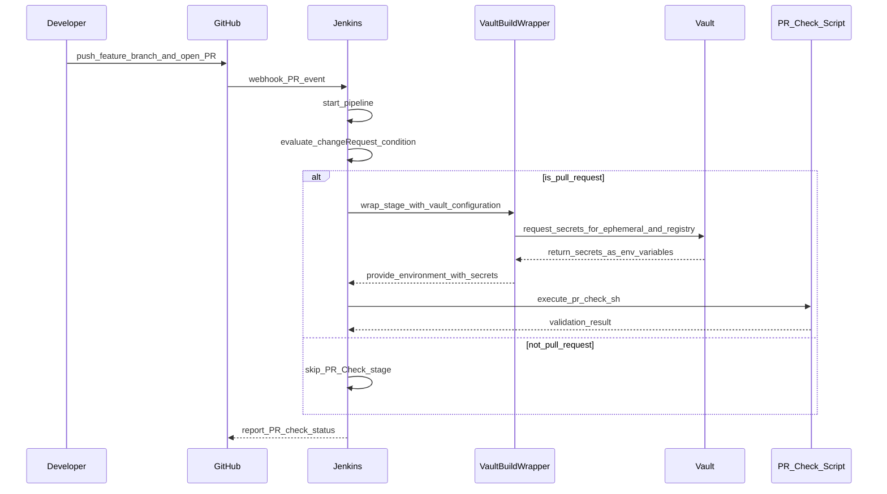
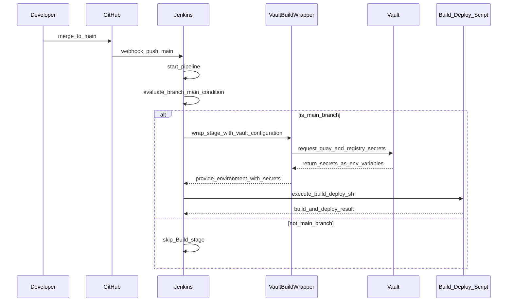
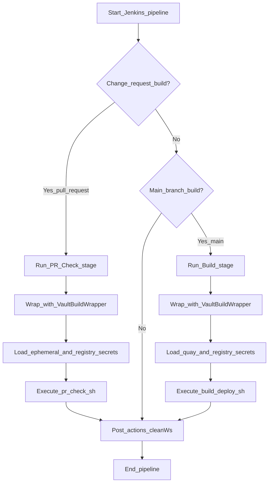

# Pull Request #2069: @sourcery

**Author**: @MichaelMraka
**Created**: February 19, 2026 at 03:12 PM UTC
**Status**: Closed
**Labels**: None
**Base**: `master` ← **Head**: `pr1`

## Description

## Secure Coding Practices Checklist GitHub Link
- https://github.com/RedHatInsights/secure-coding-checklist

## Secure Coding Checklist
- [x] Input Validation
- [x] Output Encoding
- [x] Authentication and Password Management
- [x] Session Management
- [x] Access Control
- [x] Cryptographic Practices
- [x] Error Handling and Logging
- [x] Data Protection
- [x] Communication Security
- [x] System Configuration
- [x] Database Security
- [x] File Management
- [x] Memory Management
- [x] General Coding Practices

## Summary by Sourcery

Add a Jenkins pipeline for PR checks and main-branch builds using Vault-managed secrets, and introduce a basic Sourcery configuration file.

Build:
- Introduce a Jenkinsfile defining PR validation and main-branch build/deploy stages that use Vault-injected secrets for external services.

Chores:
- Add a minimal .sourcery.yaml configuration targeting Python 3.10.

---

## Discussion

### Comment by @sourcery-ai on February 19, 2026 at 03:12 PM UTC

<!-- Generated by sourcery-ai[bot]: start review_guide -->

## Reviewer's Guide

Adds a Jenkins pipeline definition integrating Vault-managed secrets for PR checks and main-branch builds, and introduces a basic Sourcery configuration for Python code analysis.

#### Sequence diagram for Jenkins PR Check stage with Vault secrets



#### Sequence diagram for Jenkins main branch Build stage with Vault secrets



#### Flow diagram for Jenkins pipeline control flow



### File-Level Changes

| Change | Details | Files |
| ------ | ------- | ----- |
| Introduce Jenkins declarative pipeline that runs PR validation and main-branch build/deploy with Vault-injected secrets. | <ul><li>Define Vault secrets mapping and shared Vault configuration for Jenkins pipeline.</li><li>Configure agent node to use rhel8-spot label with timestamped logging.</li><li>Add PR Check stage gated on changeRequest() that wraps execution of ./pr_check.sh with VaultBuildWrapper to inject required secrets.</li><li>Add Build stage gated on main branch that wraps execution of ./build_deploy.sh with VaultBuildWrapper for access to registry and Quay credentials.</li><li>Add post-build cleanup to always clean the workspace after any pipeline run.</li></ul> | `Jenkinsfile` |
| Add minimal Sourcery configuration to target Python 3.10 without custom rules or diagrams. | <ul><li>Configure Sourcery to analyze Python code targeting version 3.10.</li><li>Disable Python and Mermaid diagram generation in Sourcery configuration.</li></ul> | `.sourcery.yaml` |

---

<details>
<summary>Tips and commands</summary>

#### Interacting with Sourcery

- **Trigger a new review:** Comment `@sourcery-ai review` on the pull request.
- **Continue discussions:** Reply directly to Sourcery's review comments.
- **Generate a GitHub issue from a review comment:** Ask Sourcery to create an
  issue from a review comment by replying to it. You can also reply to a
  review comment with `@sourcery-ai issue` to create an issue from it.
- **Generate a pull request title:** Write `@sourcery-ai` anywhere in the pull
  request title to generate a title at any time. You can also comment
  `@sourcery-ai title` on the pull request to (re-)generate the title at any time.
- **Generate a pull request summary:** Write `@sourcery-ai summary` anywhere in
  the pull request body to generate a PR summary at any time exactly where you
  want it. You can also comment `@sourcery-ai summary` on the pull request to
  (re-)generate the summary at any time.
- **Generate reviewer's guide:** Comment `@sourcery-ai guide` on the pull
  request to (re-)generate the reviewer's guide at any time.
- **Resolve all Sourcery comments:** Comment `@sourcery-ai resolve` on the
  pull request to resolve all Sourcery comments. Useful if you've already
  addressed all the comments and don't want to see them anymore.
- **Dismiss all Sourcery reviews:** Comment `@sourcery-ai dismiss` on the pull
  request to dismiss all existing Sourcery reviews. Especially useful if you
  want to start fresh with a new review - don't forget to comment
  `@sourcery-ai review` to trigger a new review!

#### Customizing Your Experience

Access your [dashboard](https://app.sourcery.ai) to:
- Enable or disable review features such as the Sourcery-generated pull request
  summary, the reviewer's guide, and others.
- Change the review language.
- Add, remove or edit custom review instructions.
- Adjust other review settings.

#### Getting Help

- [Contact our support team](mailto:support@sourcery.ai) for questions or feedback.
- Visit our [documentation](https://docs.sourcery.ai) for detailed guides and information.
- Keep in touch with the Sourcery team by following us on [X/Twitter](https://x.com/SourceryAI), [LinkedIn](https://www.linkedin.com/company/sourcery-ai/) or [GitHub](https://github.com/sourcery-ai).

</details>

<!-- Generated by sourcery-ai[bot]: end review_guide -->

### Comment by @github-actions on February 19, 2026 at 03:12 PM UTC

<!-- sc-environment-impact-check -->
## SC Environment Impact Assessment

**Overall Impact:** 🟢 **LOW**

<details>
<summary>View full report</summary>

### Summary

- **Total Issues:** 1
- 🟢 Low: 1

### Detailed Findings

#### 🟢 LOW Impact

**Environment configuration change detected**
- File: `Jenkinsfile`
- Category: `environment_config`
- Details:
  - Found `Environment` in `Jenkinsfile` at line 42
  - Found `environment` in `Jenkinsfile` at line 67
- **Recommendation:** Review environment-specific settings to ensure SC Environment is properly configured.

### Required Actions

- [ ] Review all findings above
- [ ] Verify SC Environment compatibility for all detected changes
- [ ] Update deployment documentation if needed
- [ ] Coordinate with ROSA Core team or deployment timeline

</details>

---
*This assessment was automatically generated. Please review carefully and consult with the ROSA Core team for critical/high impact changes.*

### Comment by @codecov-commenter on February 19, 2026 at 03:28 PM UTC

## [Codecov](https://app.codecov.io/gh/RedHatInsights/patchman-engine/pull/2069?dropdown=coverage&src=pr&el=h1&utm_medium=referral&utm_source=github&utm_content=comment&utm_campaign=pr+comments&utm_term=RedHatInsights) Report
:white_check_mark: All modified and coverable lines are covered by tests.
:white_check_mark: Project coverage is 59.45%. Comparing base ([`b5a0f81`](https://app.codecov.io/gh/RedHatInsights/patchman-engine/commit/b5a0f81a1bc54009a3c02d790483687d8a3726e1?dropdown=coverage&el=desc&utm_medium=referral&utm_source=github&utm_content=comment&utm_campaign=pr+comments&utm_term=RedHatInsights)) to head ([`28a6284`](https://app.codecov.io/gh/RedHatInsights/patchman-engine/commit/28a6284b91d5f5173374458866cdc9703bafffc3?dropdown=coverage&el=desc&utm_medium=referral&utm_source=github&utm_content=comment&utm_campaign=pr+comments&utm_term=RedHatInsights)).

<details><summary>Additional details and impacted files</summary>


```diff
@@           Coverage Diff           @@
##           master    #2069   +/-   ##
=======================================
  Coverage   59.45%   59.45%           
=======================================
  Files         134      134           
  Lines        8699     8699           
=======================================
  Hits         5172     5172           
  Misses       2981     2981           
  Partials      546      546           
```

| [Flag](https://app.codecov.io/gh/RedHatInsights/patchman-engine/pull/2069/flags?src=pr&el=flags&utm_medium=referral&utm_source=github&utm_content=comment&utm_campaign=pr+comments&utm_term=RedHatInsights) | Coverage Δ | |
|---|---|---|
| [unittests](https://app.codecov.io/gh/RedHatInsights/patchman-engine/pull/2069/flags?src=pr&el=flag&utm_medium=referral&utm_source=github&utm_content=comment&utm_campaign=pr+comments&utm_term=RedHatInsights) | `59.45% <ø> (ø)` | |

Flags with carried forward coverage won't be shown. [Click here](https://docs.codecov.io/docs/carryforward-flags?utm_medium=referral&utm_source=github&utm_content=comment&utm_campaign=pr+comments&utm_term=RedHatInsights#carryforward-flags-in-the-pull-request-comment) to find out more.
</details>

[:umbrella: View full report in Codecov by Sentry](https://app.codecov.io/gh/RedHatInsights/patchman-engine/pull/2069?dropdown=coverage&src=pr&el=continue&utm_medium=referral&utm_source=github&utm_content=comment&utm_campaign=pr+comments&utm_term=RedHatInsights).   
:loudspeaker: Have feedback on the report? [Share it here](https://about.codecov.io/codecov-pr-comment-feedback/?utm_medium=referral&utm_source=github&utm_content=comment&utm_campaign=pr+comments&utm_term=RedHatInsights).
<details><summary> :rocket: New features to boost your workflow: </summary>

- :snowflake: [Test Analytics](https://docs.codecov.com/docs/test-analytics): Detect flaky tests, report on failures, and find test suite problems.
</details>

---

*Archived from: https://github.com/RedHatInsights/patchman-engine/pull/2069*
