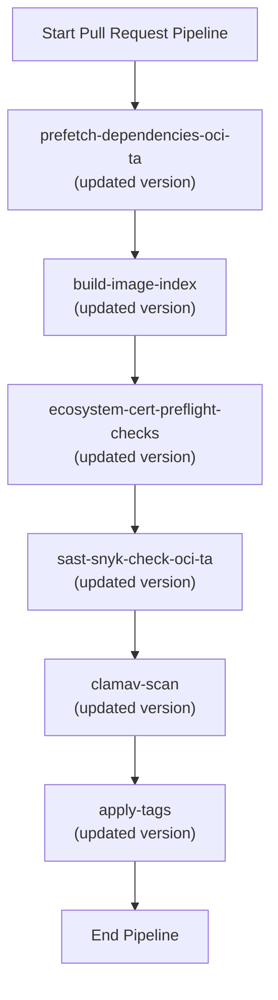

# Pull Request #1663: Update Konflux references

**Author**: @red-hat-konflux
**Created**: May 24, 2025 at 04:55 AM UTC
**Status**: Merged
**Labels**: None
**Base**: `master` ← **Head**: `konflux/references/master`

## Description

This PR contains the following updates:

| Package | Change |
|---|---|
| quay.io/konflux-ci/tekton-catalog/task-apply-tags | `3f89ba8` -> `9d98711` |
| quay.io/konflux-ci/tekton-catalog/task-build-image-index | `462ecbf` -> `1b357f2` |
| quay.io/konflux-ci/tekton-catalog/task-clamav-scan | `2418259` -> `98d9429` |
| quay.io/konflux-ci/tekton-catalog/task-ecosystem-cert-preflight-checks | `1157c6a` -> `302828e` |
| quay.io/konflux-ci/tekton-catalog/task-prefetch-dependencies-oci-ta | `d48c621` -> `3db5d3a` |
| quay.io/konflux-ci/tekton-catalog/task-sast-snyk-check-oci-ta | `89aead3` -> `6078ec8` |

---

### Configuration

📅 **Schedule**: Branch creation - "after 5am on saturday" in timezone Europe/Prague, Automerge - At any time (no schedule defined).

🚦 **Automerge**: Enabled.

♻ **Rebasing**: Whenever PR is behind base branch, or you tick the rebase/retry checkbox.

👻 **Immortal**: This PR will be recreated if closed unmerged. Get [config help](https://redirect.github.com/renovatebot/renovate/discussions) if that's undesired.

---

 - [ ] <!-- rebase-check -->If you want to rebase/retry this PR, check this box

---

To execute skipped test pipelines write comment `/ok-to-test`.

This PR has been generated by [MintMaker](https://redirect.github.com/konflux-ci/mintmaker) (powered by [Renovate Bot](https://redirect.github.com/renovatebot/renovate)).
<!--renovate-debug:eyJjcmVhdGVkSW5WZXIiOiIzOS4yNjQuMC1ycG0iLCJ1cGRhdGVkSW5WZXIiOiIzOS4yNjQuMC1ycG0iLCJ0YXJnZXRCcmFuY2giOiJtYXN0ZXIiLCJsYWJlbHMiOltdfQ==-->

## Summary by Sourcery

Enhancements:
- Bump bundle references for apply-tags, build-image-index, clamav-scan, ecosystem-cert-preflight-checks, prefetch-dependencies-oci-ta, and sast-snyk-check-oci-ta in both pull-request and push pipelines.

---

## Discussion

### Comment by @jira-linking on May 24, 2025 at 04:55 AM UTC

Commits missing Jira IDs:
66a8cabc7e32ab6d99c88b1854f3f776e70f1ab3


### Comment by @sourcery-ai on May 24, 2025 at 04:55 AM UTC

<!-- Generated by sourcery-ai[bot]: start review_guide -->

## Reviewer's Guide

This PR updates SHA256 digests for six Konflux Tekton tasks (apply-tags, build-image-index, clamav-scan, ecosystem-cert-preflight-checks, prefetch-dependencies-oci-ta, and sast-snyk-check-oci-ta) in both the pull-request and push pipeline specs to align with new task versions.

#### Flow Diagram: Execution of Updated Tasks in Pull Request Pipeline



### File-Level Changes

| Change | Details | Files |
| ------ | ------- | ----- |
| Update Konflux Tekton task bundle references | <ul><li>Bump apply-tags task bundle SHA</li><li>Bump build-image-index task bundle SHA</li><li>Bump clamav-scan task bundle SHA</li><li>Bump ecosystem-cert-preflight-checks task bundle SHA</li><li>Bump prefetch-dependencies-oci-ta task bundle SHA</li><li>Bump sast-snyk-check-oci-ta task bundle SHA</li></ul> | `.tekton/patchman-engine-pull-request.yaml`<br/>`.tekton/patchman-engine-push.yaml` |

---

<details>
<summary>Tips and commands</summary>

#### Interacting with Sourcery

- **Trigger a new review:** Comment `@sourcery-ai review` on the pull request.
- **Continue discussions:** Reply directly to Sourcery's review comments.
- **Generate a GitHub issue from a review comment:** Ask Sourcery to create an
  issue from a review comment by replying to it. You can also reply to a
  review comment with `@sourcery-ai issue` to create an issue from it.
- **Generate a pull request title:** Write `@sourcery-ai` anywhere in the pull
  request title to generate a title at any time. You can also comment
  `@sourcery-ai title` on the pull request to (re-)generate the title at any time.
- **Generate a pull request summary:** Write `@sourcery-ai summary` anywhere in
  the pull request body to generate a PR summary at any time exactly where you
  want it. You can also comment `@sourcery-ai summary` on the pull request to
  (re-)generate the summary at any time.
- **Generate reviewer's guide:** Comment `@sourcery-ai guide` on the pull
  request to (re-)generate the reviewer's guide at any time.
- **Resolve all Sourcery comments:** Comment `@sourcery-ai resolve` on the
  pull request to resolve all Sourcery comments. Useful if you've already
  addressed all the comments and don't want to see them anymore.
- **Dismiss all Sourcery reviews:** Comment `@sourcery-ai dismiss` on the pull
  request to dismiss all existing Sourcery reviews. Especially useful if you
  want to start fresh with a new review - don't forget to comment
  `@sourcery-ai review` to trigger a new review!

#### Customizing Your Experience

Access your [dashboard](https://app.sourcery.ai) to:
- Enable or disable review features such as the Sourcery-generated pull request
  summary, the reviewer's guide, and others.
- Change the review language.
- Add, remove or edit custom review instructions.
- Adjust other review settings.

#### Getting Help

- [Contact our support team](mailto:support@sourcery.ai) for questions or feedback.
- Visit our [documentation](https://docs.sourcery.ai) for detailed guides and information.
- Keep in touch with the Sourcery team by following us on [X/Twitter](https://x.com/SourceryAI), [LinkedIn](https://www.linkedin.com/company/sourcery-ai/) or [GitHub](https://github.com/sourcery-ai).

</details>

<!-- Generated by sourcery-ai[bot]: end review_guide -->

### Comment by @codecov-commenter on May 24, 2025 at 05:00 AM UTC

## [Codecov](https://app.codecov.io/gh/RedHatInsights/patchman-engine/pull/1663?dropdown=coverage&src=pr&el=h1&utm_medium=referral&utm_source=github&utm_content=comment&utm_campaign=pr+comments&utm_term=RedHatInsights) Report
All modified and coverable lines are covered by tests :white_check_mark:
> Project coverage is 58.21%. Comparing base [(`283d748`)](https://app.codecov.io/gh/RedHatInsights/patchman-engine/commit/283d748f886d5faa64264c2a121cbdd4735ddadd?dropdown=coverage&el=desc&utm_medium=referral&utm_source=github&utm_content=comment&utm_campaign=pr+comments&utm_term=RedHatInsights) to head [(`66a8cab`)](https://app.codecov.io/gh/RedHatInsights/patchman-engine/commit/66a8cabc7e32ab6d99c88b1854f3f776e70f1ab3?dropdown=coverage&el=desc&utm_medium=referral&utm_source=github&utm_content=comment&utm_campaign=pr+comments&utm_term=RedHatInsights).
> Report is 1 commits behind head on master.

<details><summary>Additional details and impacted files</summary>


```diff
@@           Coverage Diff           @@
##           master    #1663   +/-   ##
=======================================
  Coverage   58.21%   58.21%           
=======================================
  Files         146      146           
  Lines       11397    11397           
=======================================
  Hits         6635     6635           
  Misses       4175     4175           
  Partials      587      587           
```

| [Flag](https://app.codecov.io/gh/RedHatInsights/patchman-engine/pull/1663/flags?src=pr&el=flags&utm_medium=referral&utm_source=github&utm_content=comment&utm_campaign=pr+comments&utm_term=RedHatInsights) | Coverage Δ | |
|---|---|---|
| [unittests](https://app.codecov.io/gh/RedHatInsights/patchman-engine/pull/1663/flags?src=pr&el=flag&utm_medium=referral&utm_source=github&utm_content=comment&utm_campaign=pr+comments&utm_term=RedHatInsights) | `58.21% <ø> (ø)` | |

Flags with carried forward coverage won't be shown. [Click here](https://docs.codecov.io/docs/carryforward-flags?utm_medium=referral&utm_source=github&utm_content=comment&utm_campaign=pr+comments&utm_term=RedHatInsights#carryforward-flags-in-the-pull-request-comment) to find out more.

</details>

[:umbrella: View full report in Codecov by Sentry](https://app.codecov.io/gh/RedHatInsights/patchman-engine/pull/1663?dropdown=coverage&src=pr&el=continue&utm_medium=referral&utm_source=github&utm_content=comment&utm_campaign=pr+comments&utm_term=RedHatInsights).   
:loudspeaker: Have feedback on the report? [Share it here](https://about.codecov.io/codecov-pr-comment-feedback/?utm_medium=referral&utm_source=github&utm_content=comment&utm_campaign=pr+comments&utm_term=RedHatInsights).

<details><summary> :rocket: New features to boost your workflow: </summary>

- :snowflake: [Test Analytics](https://docs.codecov.com/docs/test-analytics): Detect flaky tests, report on failures, and find test suite problems.
</details>

---

*Archived from: https://github.com/RedHatInsights/patchman-engine/pull/1663*
