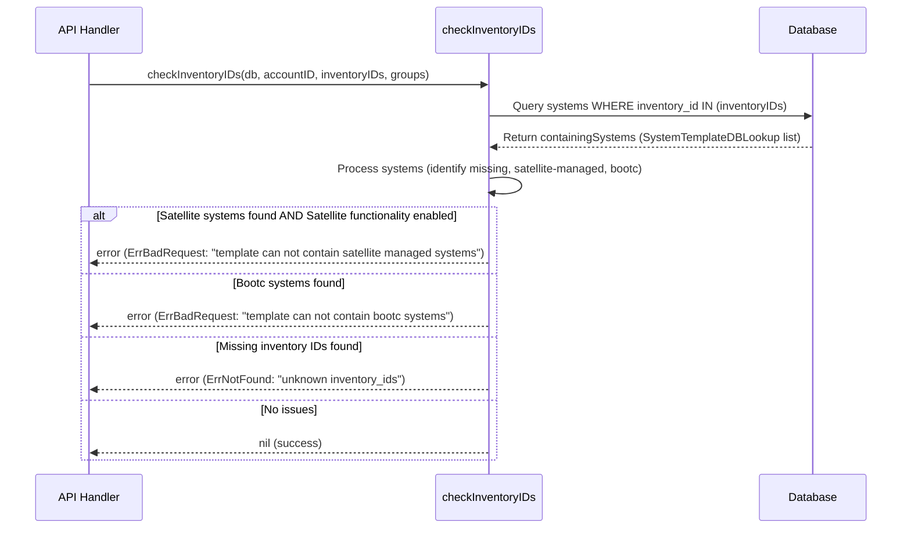
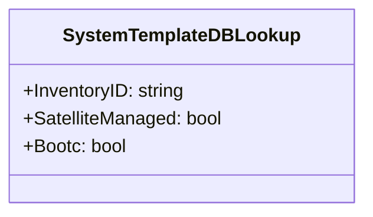
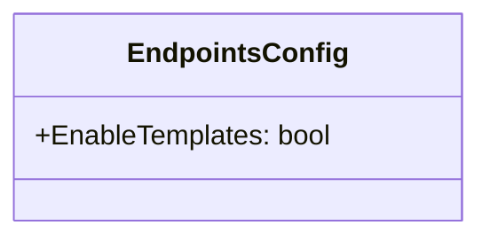

# Pull Request #1664: RHINENG-15783: remove baselines api

**Author**: @darkeriossss
**Created**: May 27, 2025 at 09:17 AM UTC
**Status**: Merged
**Labels**: None
**Base**: `master` ← **Head**: `remove-baselines-api`

## Description

## Secure Coding Practices Checklist GitHub Link
- https://github.com/RedHatInsights/secure-coding-checklist

## Secure Coding Checklist
- [x] Input Validation
- [x] Output Encoding
- [x] Authentication and Password Management
- [x] Session Management
- [x] Access Control
- [x] Cryptographic Practices
- [x] Error Handling and Logging
- [x] Data Protection
- [x] Communication Security
- [x] System Configuration
- [x] Database Security
- [x] File Management
- [x] Memory Management
- [x] General Coding Practices

## Summary by Sourcery

Remove the deprecated baselines API and associated code and enhance the template systems update endpoint with inventory ID validation.

Enhancements:
- Add inventory ID validation logic to the template systems update endpoint with specific error handling for unknown, satellite-managed, and bootc systems.

Documentation:
- Delete the EnableBaselines flag from EndpointsConfig and remove baselines entries from OpenAPI filtering logic.

Tests:
- Update OpenAPI path filter tests to expect the new count of removed paths after baselines removal.

Chores:
- Remove all baselines API routes, controllers, tests, configuration flags, and deprecation code.
- Simplify OpenAPI path filtering to drop baselines paths and adjust related code accordingly.

---

## Discussion

### Comment by @jira-linking on May 27, 2025 at 09:17 AM UTC

Referenced Jiras:
https://issues.redhat.com/browse/RHINENG-15783


### Comment by @sourcery-ai on May 27, 2025 at 09:17 AM UTC

<!-- Generated by sourcery-ai[bot]: start review_guide -->

## Reviewer's Guide

This PR removes the Baselines API feature flag and all associated endpoints, controllers, tests, deprecations, and docs, and enhances the TemplateSystemsUpdate endpoint by adding inventory ID validation with detailed error handling.

#### Sequence Diagram for Inventory ID Validation in Template Systems Update



#### Class Diagram: New SystemTemplateDBLookup Struct



#### Class Diagram: Update to EndpointsConfig Struct



### File-Level Changes

| Change | Details | Files |
| ------ | ------- | ----- |
| Remove Baselines API feature flag and all related code | <ul><li>Deleted Baselines routes from the API router</li><li>Removed EnableBaselines flag from config and endpoints config</li><li>Deleted DeprecateBaselines function and its middleware</li><li>Removed Baselines controllers, tests, and related OpenAPI paths</li><li>Adjusted docs test to expect updated path removal counts</li></ul> | `manager/routes/routes.go`<br/>`base/deprecations/deprecations.go`<br/>`manager/config/config.go`<br/>`docs/docs.go`<br/>`docs/docs_test.go`<br/>`manager/manager.go`<br/>`docs/v3/openapi.json`<br/>`manager/controllers/baseline_create.go`<br/>`manager/controllers/baseline_create_test.go`<br/>`manager/controllers/baseline_delete.go`<br/>`manager/controllers/baseline_delete_test.go`<br/>`manager/controllers/baseline_detail.go`<br/>`manager/controllers/baseline_detail_test.go`<br/>`manager/controllers/baseline_systems.go`<br/>`manager/controllers/baseline_systems_export.go`<br/>`manager/controllers/baseline_systems_export_test.go`<br/>`manager/controllers/baseline_systems_remove.go`<br/>`manager/controllers/baseline_systems_remove_test.go`<br/>`manager/controllers/baseline_systems_test.go`<br/>`manager/controllers/baseline_update.go`<br/>`manager/controllers/baseline_update_test.go`<br/>`manager/controllers/baselines.go`<br/>`manager/controllers/baselines_test.go` |
| Add inventory ID validation in TemplateSystemsUpdate endpoint | <ul><li>Introduced SystemTemplateDBLookup struct for querying system attributes</li><li>Added checkInventoryIDs function to verify presence and filter satellite/bootc systems</li><li>Sorted and joined error messages with appropriate status codes</li><li>Imported sort and defined InvalidInventoryIDsErr constant</li></ul> | `manager/controllers/template_systems_update.go` |

---

<details>
<summary>Tips and commands</summary>

#### Interacting with Sourcery

- **Trigger a new review:** Comment `@sourcery-ai review` on the pull request.
- **Continue discussions:** Reply directly to Sourcery's review comments.
- **Generate a GitHub issue from a review comment:** Ask Sourcery to create an
  issue from a review comment by replying to it. You can also reply to a
  review comment with `@sourcery-ai issue` to create an issue from it.
- **Generate a pull request title:** Write `@sourcery-ai` anywhere in the pull
  request title to generate a title at any time. You can also comment
  `@sourcery-ai title` on the pull request to (re-)generate the title at any time.
- **Generate a pull request summary:** Write `@sourcery-ai summary` anywhere in
  the pull request body to generate a PR summary at any time exactly where you
  want it. You can also comment `@sourcery-ai summary` on the pull request to
  (re-)generate the summary at any time.
- **Generate reviewer's guide:** Comment `@sourcery-ai guide` on the pull
  request to (re-)generate the reviewer's guide at any time.
- **Resolve all Sourcery comments:** Comment `@sourcery-ai resolve` on the
  pull request to resolve all Sourcery comments. Useful if you've already
  addressed all the comments and don't want to see them anymore.
- **Dismiss all Sourcery reviews:** Comment `@sourcery-ai dismiss` on the pull
  request to dismiss all existing Sourcery reviews. Especially useful if you
  want to start fresh with a new review - don't forget to comment
  `@sourcery-ai review` to trigger a new review!

#### Customizing Your Experience

Access your [dashboard](https://app.sourcery.ai) to:
- Enable or disable review features such as the Sourcery-generated pull request
  summary, the reviewer's guide, and others.
- Change the review language.
- Add, remove or edit custom review instructions.
- Adjust other review settings.

#### Getting Help

- [Contact our support team](mailto:support@sourcery.ai) for questions or feedback.
- Visit our [documentation](https://docs.sourcery.ai) for detailed guides and information.
- Keep in touch with the Sourcery team by following us on [X/Twitter](https://x.com/SourceryAI), [LinkedIn](https://www.linkedin.com/company/sourcery-ai/) or [GitHub](https://github.com/sourcery-ai).

</details>

<!-- Generated by sourcery-ai[bot]: end review_guide -->

### Comment by @codecov-commenter on May 27, 2025 at 09:23 AM UTC

## [Codecov](https://app.codecov.io/gh/RedHatInsights/patchman-engine/pull/1664?dropdown=coverage&src=pr&el=h1&utm_medium=referral&utm_source=github&utm_content=comment&utm_campaign=pr+comments&utm_term=RedHatInsights) Report
:x: Patch coverage is `62.50000%` with `15 lines` in your changes missing coverage. Please review.
:white_check_mark: Project coverage is 57.29%. Comparing base ([`fa5baeb`](https://app.codecov.io/gh/RedHatInsights/patchman-engine/commit/fa5baeb0d078eded24d9063cd96ee32b75d74736?dropdown=coverage&el=desc&utm_medium=referral&utm_source=github&utm_content=comment&utm_campaign=pr+comments&utm_term=RedHatInsights)) to head ([`11100a5`](https://app.codecov.io/gh/RedHatInsights/patchman-engine/commit/11100a5a7d63bfcf0a3ac4c3d1a91448470da9d5?dropdown=coverage&el=desc&utm_medium=referral&utm_source=github&utm_content=comment&utm_campaign=pr+comments&utm_term=RedHatInsights)).
:warning: Report is 837 commits behind head on master.

| [Files with missing lines](https://app.codecov.io/gh/RedHatInsights/patchman-engine/pull/1664?dropdown=coverage&src=pr&el=tree&utm_medium=referral&utm_source=github&utm_content=comment&utm_campaign=pr+comments&utm_term=RedHatInsights) | Patch % | Lines |
|---|---|---|
| [manager/controllers/template\_systems\_update.go](https://app.codecov.io/gh/RedHatInsights/patchman-engine/pull/1664?src=pr&el=tree&filepath=manager%2Fcontrollers%2Ftemplate_systems_update.go&utm_medium=referral&utm_source=github&utm_content=comment&utm_campaign=pr+comments&utm_term=RedHatInsights#diff-bWFuYWdlci9jb250cm9sbGVycy90ZW1wbGF0ZV9zeXN0ZW1zX3VwZGF0ZS5nbw==) | 62.50% | [12 Missing and 3 partials :warning: ](https://app.codecov.io/gh/RedHatInsights/patchman-engine/pull/1664?src=pr&el=tree&utm_medium=referral&utm_source=github&utm_content=comment&utm_campaign=pr+comments&utm_term=RedHatInsights) |

<details><summary>Additional details and impacted files</summary>


```diff
@@            Coverage Diff             @@
##           master    #1664      +/-   ##
==========================================
- Coverage   58.21%   57.29%   -0.93%     
==========================================
  Files         146      138       -8     
  Lines       11397    10790     -607     
==========================================
- Hits         6635     6182     -453     
+ Misses       4175     4048     -127     
+ Partials      587      560      -27     
```

| [Flag](https://app.codecov.io/gh/RedHatInsights/patchman-engine/pull/1664/flags?src=pr&el=flags&utm_medium=referral&utm_source=github&utm_content=comment&utm_campaign=pr+comments&utm_term=RedHatInsights) | Coverage Δ | |
|---|---|---|
| [unittests](https://app.codecov.io/gh/RedHatInsights/patchman-engine/pull/1664/flags?src=pr&el=flag&utm_medium=referral&utm_source=github&utm_content=comment&utm_campaign=pr+comments&utm_term=RedHatInsights) | `57.29% <62.50%> (-0.93%)` | :arrow_down: |

Flags with carried forward coverage won't be shown. [Click here](https://docs.codecov.io/docs/carryforward-flags?utm_medium=referral&utm_source=github&utm_content=comment&utm_campaign=pr+comments&utm_term=RedHatInsights#carryforward-flags-in-the-pull-request-comment) to find out more.
</details>

[:umbrella: View full report in Codecov by Sentry](https://app.codecov.io/gh/RedHatInsights/patchman-engine/pull/1664?dropdown=coverage&src=pr&el=continue&utm_medium=referral&utm_source=github&utm_content=comment&utm_campaign=pr+comments&utm_term=RedHatInsights).   
:loudspeaker: Have feedback on the report? [Share it here](https://about.codecov.io/codecov-pr-comment-feedback/?utm_medium=referral&utm_source=github&utm_content=comment&utm_campaign=pr+comments&utm_term=RedHatInsights).
<details><summary> :rocket: New features to boost your workflow: </summary>

- :snowflake: [Test Analytics](https://docs.codecov.com/docs/test-analytics): Detect flaky tests, report on failures, and find test suite problems.
</details>

---

## Reviews

### Review by @sourcery-ai - Commented on May 27, 2025 at 09:20 AM UTC

Hey @xmicha82 - I've reviewed your changes and they look great!

<details>
<summary>Here's what I looked at during the review</summary>

- 🟡 **General issues**: 4 issues found
- 🟢 **Security**: all looks good
- 🟢 **Testing**: all looks good
- 🟢 **Complexity**: all looks good
- 🟢 **Documentation**: all looks good
</details>

***

<details>
<summary>Sourcery is free for open source - if you like our reviews please consider sharing them ✨</summary>

- [X](https://twitter.com/intent/tweet?text=I%20just%20got%20an%20instant%20code%20review%20from%20%40SourceryAI%2C%20and%20it%20was%20brilliant%21%20It%27s%20free%20for%20open%20source%20and%20has%20a%20free%20trial%20for%20private%20code.%20Check%20it%20out%20https%3A//sourcery.ai)
- [Mastodon](https://mastodon.social/share?text=I%20just%20got%20an%20instant%20code%20review%20from%20%40SourceryAI%2C%20and%20it%20was%20brilliant%21%20It%27s%20free%20for%20open%20source%20and%20has%20a%20free%20trial%20for%20private%20code.%20Check%20it%20out%20https%3A//sourcery.ai)
- [LinkedIn](https://www.linkedin.com/sharing/share-offsite/?url=https://sourcery.ai)
- [Facebook](https://www.facebook.com/sharer/sharer.php?u=https://sourcery.ai)

</details>

<sub>
Help me be more useful! Please click 👍 or 👎 on each comment and I'll use the feedback to improve your reviews.
</sub>

### Review by @MichaelMraka - Commented on May 27, 2025 at 01:01 PM UTC

### Review by @MichaelMraka - Commented on May 27, 2025 at 01:03 PM UTC

### Review by @MichaelMraka - Commented on May 27, 2025 at 01:03 PM UTC

---

*Archived from: https://github.com/RedHatInsights/patchman-engine/pull/1664*
