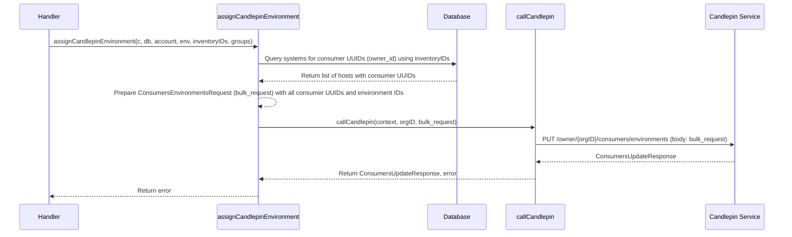
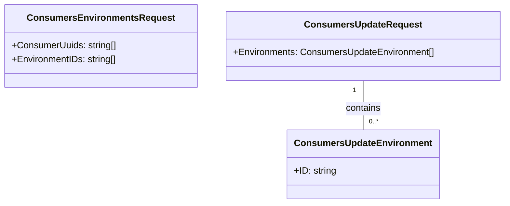

# Pull Request #1666: RHINENG-15506: use candlepin bulk API

**Author**: @MichaelMraka
**Created**: May 30, 2025 at 11:37 AM UTC
**Status**: Merged
**Labels**: None
**Base**: `master` ← **Head**: `pr2`

## Description

## Secure Coding Practices Checklist GitHub Link
- https://github.com/RedHatInsights/secure-coding-checklist

## Secure Coding Checklist
- [x] Input Validation
- [x] Output Encoding
- [x] Authentication and Password Management
- [x] Session Management
- [x] Access Control
- [x] Cryptographic Practices
- [x] Error Handling and Logging
- [x] Data Protection
- [x] Communication Security
- [x] System Configuration
- [x] Database Security
- [x] File Management
- [x] Memory Management
- [x] General Coding Practices

## Summary by Sourcery

Use Candlepin bulk API to assign systems to environments in a single request and update related logic and tests accordingly

Enhancements:
- Replace per-consumer environment assignment with a single bulk Candlepin API call at /owner/:owner/consumers/environments
- Update callCandlepin signature and request/response types to use ConsumersEnvironmentsRequest with lists of consumer UUIDs and environment IDs
- Simplify assignCandlepinEnvironment logic to aggregate consumer IDs and perform one bulk API request
- Propagate org_id through Gin context and handlers for use in bulk Candlepin calls

Tests:
- Extend mocks to support the new bulk endpoint and update tests to include org_id context
- Change test assertions to expect HTTP 400 on Candlepin errors and adjust CheckTemplateSystems utility to handle new behavior

---

## Discussion

### Comment by @jira-linking on May 30, 2025 at 11:37 AM UTC

Referenced Jiras:
https://issues.redhat.com/browse/RHINENG-15506


### Comment by @sourcery-ai on May 30, 2025 at 11:37 AM UTC

<!-- Generated by sourcery-ai[bot]: start review_guide -->

## Reviewer's Guide

This PR refactors candlepin integration to use the new bulk environments API by consolidating per-consumer calls into a single ConsumersEnvironmentsRequest, updates handlers to pass the original systems list and propagate org_id context, and aligns tests and error handling to the new flow.

#### Sequence Diagram: Bulk Candlepin Environment Assignment



#### Class Diagram: Candlepin API Request Structure Changes



### File-Level Changes

| Change | Details | Files |
| ------ | ------- | ----- |
| Adopt Candlepin bulk environments endpoint | <ul><li>Change callCandlepin signature to accept an owner and bulk request type</li><li>Update client URL to /owner/:owner/consumers/environments and router path</li><li>Introduce ConsumersEnvironmentsRequest type, remove old ConsumersUpdateRequest</li></ul> | `manager/controllers/template_systems_update.go`<br/>`manager/controllers/template_subscribed_systems_update.go`<br/>`manager/controllers/template_systems_delete.go`<br/>`base/candlepin/candlepin.go`<br/>`platform/candlepin.go` |
| Consolidate per-system candlepin calls into a single bulk request | <ul><li>Rename local slice to hosts and collect consumer UUIDs</li><li>Build lists of consumerUuids and environmentIds</li><li>Replace loop of individual API calls with one callCandlepin invocation, simplify error handling</li></ul> | `manager/controllers/template_systems_update.go` |
| Update template handlers to use original systems list | <ul><li>Pass req.Systems directly to assignTemplateSystems instead of returned modified IDs</li><li>Remove unused modified return values from assignCandlepinEnvironment</li><li>Adjust TemplateSubscribedSystemsUpdateHandler and TemplateSystemsDeleteHandler accordingly</li></ul> | `manager/controllers/template_systems_update.go`<br/>`manager/controllers/template_subscribed_systems_update.go`<br/>`manager/controllers/template_systems_delete.go` |
| Propagate org_id context through middleware and handlers | <ul><li>Add KeyOrgID constant and set org_id in authentication middleware</li><li>Retrieve org_id in callCandlepin via c.GetString(utils.KeyOrgID)</li><li>Include org_id in test router contexts via core.ContextKV</li></ul> | `base/utils/gin.go`<br/>`manager/middlewares/authentication.go`<br/>`manager/controllers/template_systems_update_test.go`<br/>`manager/controllers/template_subscribed_systems_update_test.go` |
| Align tests and database helper with new behavior | <ul><li>Change expected status codes from 424/200 to 400 BadRequest in two test suites</li><li>Simplify CheckTemplateSystems to only compare lengths when equal</li><li>Update test assertions to include orgID context</li></ul> | `manager/controllers/template_systems_update_test.go`<br/>`manager/controllers/template_subscribed_systems_update_test.go`<br/>`base/database/testing.go` |

---

<details>
<summary>Tips and commands</summary>

#### Interacting with Sourcery

- **Trigger a new review:** Comment `@sourcery-ai review` on the pull request.
- **Continue discussions:** Reply directly to Sourcery's review comments.
- **Generate a GitHub issue from a review comment:** Ask Sourcery to create an
  issue from a review comment by replying to it. You can also reply to a
  review comment with `@sourcery-ai issue` to create an issue from it.
- **Generate a pull request title:** Write `@sourcery-ai` anywhere in the pull
  request title to generate a title at any time. You can also comment
  `@sourcery-ai title` on the pull request to (re-)generate the title at any time.
- **Generate a pull request summary:** Write `@sourcery-ai summary` anywhere in
  the pull request body to generate a PR summary at any time exactly where you
  want it. You can also comment `@sourcery-ai summary` on the pull request to
  (re-)generate the summary at any time.
- **Generate reviewer's guide:** Comment `@sourcery-ai guide` on the pull
  request to (re-)generate the reviewer's guide at any time.
- **Resolve all Sourcery comments:** Comment `@sourcery-ai resolve` on the
  pull request to resolve all Sourcery comments. Useful if you've already
  addressed all the comments and don't want to see them anymore.
- **Dismiss all Sourcery reviews:** Comment `@sourcery-ai dismiss` on the pull
  request to dismiss all existing Sourcery reviews. Especially useful if you
  want to start fresh with a new review - don't forget to comment
  `@sourcery-ai review` to trigger a new review!

#### Customizing Your Experience

Access your [dashboard](https://app.sourcery.ai) to:
- Enable or disable review features such as the Sourcery-generated pull request
  summary, the reviewer's guide, and others.
- Change the review language.
- Add, remove or edit custom review instructions.
- Adjust other review settings.

#### Getting Help

- [Contact our support team](mailto:support@sourcery.ai) for questions or feedback.
- Visit our [documentation](https://docs.sourcery.ai) for detailed guides and information.
- Keep in touch with the Sourcery team by following us on [X/Twitter](https://x.com/SourceryAI), [LinkedIn](https://www.linkedin.com/company/sourcery-ai/) or [GitHub](https://github.com/sourcery-ai).

</details>

<!-- Generated by sourcery-ai[bot]: end review_guide -->

### Comment by @codecov-commenter on May 30, 2025 at 11:43 AM UTC

## [Codecov](https://app.codecov.io/gh/RedHatInsights/patchman-engine/pull/1666?dropdown=coverage&src=pr&el=h1&utm_medium=referral&utm_source=github&utm_content=comment&utm_campaign=pr+comments&utm_term=RedHatInsights) Report
:x: Patch coverage is `62.74510%` with `19 lines` in your changes missing coverage. Please review.
:white_check_mark: Project coverage is 57.25%. Comparing base ([`4261be9`](https://app.codecov.io/gh/RedHatInsights/patchman-engine/commit/4261be9179e8bb9d185a3c707cb334b0d153fd5d?dropdown=coverage&el=desc&utm_medium=referral&utm_source=github&utm_content=comment&utm_campaign=pr+comments&utm_term=RedHatInsights)) to head ([`4920ca4`](https://app.codecov.io/gh/RedHatInsights/patchman-engine/commit/4920ca43060ecf4455c29b0eb5175a2e6a1fb002?dropdown=coverage&el=desc&utm_medium=referral&utm_source=github&utm_content=comment&utm_campaign=pr+comments&utm_term=RedHatInsights)).
:warning: Report is 835 commits behind head on master.

| [Files with missing lines](https://app.codecov.io/gh/RedHatInsights/patchman-engine/pull/1666?dropdown=coverage&src=pr&el=tree&utm_medium=referral&utm_source=github&utm_content=comment&utm_campaign=pr+comments&utm_term=RedHatInsights) | Patch % | Lines |
|---|---|---|
| [platform/candlepin.go](https://app.codecov.io/gh/RedHatInsights/patchman-engine/pull/1666?src=pr&el=tree&filepath=platform%2Fcandlepin.go&utm_medium=referral&utm_source=github&utm_content=comment&utm_campaign=pr+comments&utm_term=RedHatInsights#diff-cGxhdGZvcm0vY2FuZGxlcGluLmdv) | 0.00% | [17 Missing :warning: ](https://app.codecov.io/gh/RedHatInsights/patchman-engine/pull/1666?src=pr&el=tree&utm_medium=referral&utm_source=github&utm_content=comment&utm_campaign=pr+comments&utm_term=RedHatInsights) |
| [base/database/testing.go](https://app.codecov.io/gh/RedHatInsights/patchman-engine/pull/1666?src=pr&el=tree&filepath=base%2Fdatabase%2Ftesting.go&utm_medium=referral&utm_source=github&utm_content=comment&utm_campaign=pr+comments&utm_term=RedHatInsights#diff-YmFzZS9kYXRhYmFzZS90ZXN0aW5nLmdv) | 0.00% | [1 Missing :warning: ](https://app.codecov.io/gh/RedHatInsights/patchman-engine/pull/1666?src=pr&el=tree&utm_medium=referral&utm_source=github&utm_content=comment&utm_campaign=pr+comments&utm_term=RedHatInsights) |
| [manager/controllers/template\_systems\_update.go](https://app.codecov.io/gh/RedHatInsights/patchman-engine/pull/1666?src=pr&el=tree&filepath=manager%2Fcontrollers%2Ftemplate_systems_update.go&utm_medium=referral&utm_source=github&utm_content=comment&utm_campaign=pr+comments&utm_term=RedHatInsights#diff-bWFuYWdlci9jb250cm9sbGVycy90ZW1wbGF0ZV9zeXN0ZW1zX3VwZGF0ZS5nbw==) | 96.29% | [1 Missing :warning: ](https://app.codecov.io/gh/RedHatInsights/patchman-engine/pull/1666?src=pr&el=tree&utm_medium=referral&utm_source=github&utm_content=comment&utm_campaign=pr+comments&utm_term=RedHatInsights) |

<details><summary>Additional details and impacted files</summary>


```diff
@@            Coverage Diff             @@
##           master    #1666      +/-   ##
==========================================
- Coverage   57.29%   57.25%   -0.04%     
==========================================
  Files         138      138              
  Lines       10790    10776      -14     
==========================================
- Hits         6182     6170      -12     
+ Misses       4048     4046       -2     
  Partials      560      560              
```

| [Flag](https://app.codecov.io/gh/RedHatInsights/patchman-engine/pull/1666/flags?src=pr&el=flags&utm_medium=referral&utm_source=github&utm_content=comment&utm_campaign=pr+comments&utm_term=RedHatInsights) | Coverage Δ | |
|---|---|---|
| [unittests](https://app.codecov.io/gh/RedHatInsights/patchman-engine/pull/1666/flags?src=pr&el=flag&utm_medium=referral&utm_source=github&utm_content=comment&utm_campaign=pr+comments&utm_term=RedHatInsights) | `57.25% <62.74%> (-0.04%)` | :arrow_down: |

Flags with carried forward coverage won't be shown. [Click here](https://docs.codecov.io/docs/carryforward-flags?utm_medium=referral&utm_source=github&utm_content=comment&utm_campaign=pr+comments&utm_term=RedHatInsights#carryforward-flags-in-the-pull-request-comment) to find out more.
</details>

[:umbrella: View full report in Codecov by Sentry](https://app.codecov.io/gh/RedHatInsights/patchman-engine/pull/1666?dropdown=coverage&src=pr&el=continue&utm_medium=referral&utm_source=github&utm_content=comment&utm_campaign=pr+comments&utm_term=RedHatInsights).   
:loudspeaker: Have feedback on the report? [Share it here](https://about.codecov.io/codecov-pr-comment-feedback/?utm_medium=referral&utm_source=github&utm_content=comment&utm_campaign=pr+comments&utm_term=RedHatInsights).
<details><summary> :rocket: New features to boost your workflow: </summary>

- :snowflake: [Test Analytics](https://docs.codecov.com/docs/test-analytics): Detect flaky tests, report on failures, and find test suite problems.
</details>

### Comment by @MichaelMraka on May 30, 2025 at 02:01 PM UTC

/retest

### Comment by @MichaelMraka on June 16, 2025 at 01:55 PM UTC

/retest

---

## Reviews

### Review by @sourcery-ai - Commented on May 30, 2025 at 11:40 AM UTC

Hey @MichaelMraka - I've reviewed your changes and they look great!

<details>
<summary>Here's what I looked at during the review</summary>

- 🟢 **General issues**: all looks good
- 🟢 **Security**: all looks good
- 🟢 **Testing**: all looks good
- 🟢 **Complexity**: all looks good
- 🟢 **Documentation**: all looks good
</details>

***

<details>
<summary>Sourcery is free for open source - if you like our reviews please consider sharing them ✨</summary>

- [X](https://twitter.com/intent/tweet?text=I%20just%20got%20an%20instant%20code%20review%20from%20%40SourceryAI%2C%20and%20it%20was%20brilliant%21%20It%27s%20free%20for%20open%20source%20and%20has%20a%20free%20trial%20for%20private%20code.%20Check%20it%20out%20https%3A//sourcery.ai)
- [Mastodon](https://mastodon.social/share?text=I%20just%20got%20an%20instant%20code%20review%20from%20%40SourceryAI%2C%20and%20it%20was%20brilliant%21%20It%27s%20free%20for%20open%20source%20and%20has%20a%20free%20trial%20for%20private%20code.%20Check%20it%20out%20https%3A//sourcery.ai)
- [LinkedIn](https://www.linkedin.com/sharing/share-offsite/?url=https://sourcery.ai)
- [Facebook](https://www.facebook.com/sharer/sharer.php?u=https://sourcery.ai)

</details>

<sub>
Help me be more useful! Please click 👍 or 👎 on each comment and I'll use the feedback to improve your reviews.
</sub>

### Review by @psegedy - Approved on June 02, 2025 at 11:58 AM UTC

---

*Archived from: https://github.com/RedHatInsights/patchman-engine/pull/1666*
