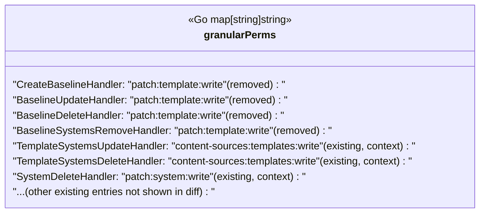

# Pull Request #1667: RHINENG-15783: remove permissions for deleted APIs

**Author**: @MichaelMraka
**Created**: May 30, 2025 at 01:59 PM UTC
**Status**: Merged
**Labels**: None
**Base**: `master` ← **Head**: `pr3`

## Description

## Secure Coding Practices Checklist GitHub Link
- https://github.com/RedHatInsights/secure-coding-checklist

## Secure Coding Checklist
- [x] Input Validation
- [x] Output Encoding
- [x] Authentication and Password Management
- [x] Session Management
- [x] Access Control
- [x] Cryptographic Practices
- [x] Error Handling and Logging
- [x] Data Protection
- [x] Communication Security
- [x] System Configuration
- [x] Database Security
- [x] File Management
- [x] Memory Management
- [x] General Coding Practices

## Summary by Sourcery

Remove outdated RBAC mappings for deleted baseline APIs and update remaining handlers to use the new "content-sources" permission scope.

Enhancements:
- Replace legacy "patch:*" permission patterns with "content-sources:*" scopes for relevant RBAC handlers

Tests:
- Update RBAC tests to reference the new handler names and "content-sources" permission strings instead of legacy "patch" patterns

---

## Discussion

### Comment by @jira-linking on May 30, 2025 at 01:59 PM UTC

Referenced Jiras:
https://issues.redhat.com/browse/RHINENG-15783


### Comment by @sourcery-ai on May 30, 2025 at 01:59 PM UTC

<!-- Generated by sourcery-ai[bot]: start review_guide -->

## Reviewer's Guide

This PR replaces the old "patch:template" permissions for several API handlers with the new "content-sources:templates" scheme, removes obsolete baseline handler mappings, and updates the corresponding tests to reflect the new permission strings.

#### Class Diagram: Modifications to `granularPerms` Permissions Map



### File-Level Changes

| Change | Details | Files |
| ------ | ------- | ----- |
| Refactor permission mappings in rbac.go | <ul><li>Remove obsolete baseline handler entries</li><li>Assign "content-sources:templates:write" to template update/delete handlers</li></ul> | `manager/middlewares/rbac.go` |
| Update RBAC tests to use new permission scheme | <ul><li>Rename handler in TestPermissionsSingleWrite</li><li>Replace all "patch:*" permission strings with "content-sources:*" in test AccessPagination cases</li></ul> | `manager/middlewares/rbac_test.go` |

---

<details>
<summary>Tips and commands</summary>

#### Interacting with Sourcery

- **Trigger a new review:** Comment `@sourcery-ai review` on the pull request.
- **Continue discussions:** Reply directly to Sourcery's review comments.
- **Generate a GitHub issue from a review comment:** Ask Sourcery to create an
  issue from a review comment by replying to it. You can also reply to a
  review comment with `@sourcery-ai issue` to create an issue from it.
- **Generate a pull request title:** Write `@sourcery-ai` anywhere in the pull
  request title to generate a title at any time. You can also comment
  `@sourcery-ai title` on the pull request to (re-)generate the title at any time.
- **Generate a pull request summary:** Write `@sourcery-ai summary` anywhere in
  the pull request body to generate a PR summary at any time exactly where you
  want it. You can also comment `@sourcery-ai summary` on the pull request to
  (re-)generate the summary at any time.
- **Generate reviewer's guide:** Comment `@sourcery-ai guide` on the pull
  request to (re-)generate the reviewer's guide at any time.
- **Resolve all Sourcery comments:** Comment `@sourcery-ai resolve` on the
  pull request to resolve all Sourcery comments. Useful if you've already
  addressed all the comments and don't want to see them anymore.
- **Dismiss all Sourcery reviews:** Comment `@sourcery-ai dismiss` on the pull
  request to dismiss all existing Sourcery reviews. Especially useful if you
  want to start fresh with a new review - don't forget to comment
  `@sourcery-ai review` to trigger a new review!

#### Customizing Your Experience

Access your [dashboard](https://app.sourcery.ai) to:
- Enable or disable review features such as the Sourcery-generated pull request
  summary, the reviewer's guide, and others.
- Change the review language.
- Add, remove or edit custom review instructions.
- Adjust other review settings.

#### Getting Help

- [Contact our support team](mailto:support@sourcery.ai) for questions or feedback.
- Visit our [documentation](https://docs.sourcery.ai) for detailed guides and information.
- Keep in touch with the Sourcery team by following us on [X/Twitter](https://x.com/SourceryAI), [LinkedIn](https://www.linkedin.com/company/sourcery-ai/) or [GitHub](https://github.com/sourcery-ai).

</details>

<!-- Generated by sourcery-ai[bot]: end review_guide -->

### Comment by @codecov-commenter on May 30, 2025 at 02:04 PM UTC

## [Codecov](https://app.codecov.io/gh/RedHatInsights/patchman-engine/pull/1667?dropdown=coverage&src=pr&el=h1&utm_medium=referral&utm_source=github&utm_content=comment&utm_campaign=pr+comments&utm_term=RedHatInsights) Report
:white_check_mark: All modified and coverable lines are covered by tests.
:white_check_mark: Project coverage is 57.29%. Comparing base ([`4261be9`](https://app.codecov.io/gh/RedHatInsights/patchman-engine/commit/4261be9179e8bb9d185a3c707cb334b0d153fd5d?dropdown=coverage&el=desc&utm_medium=referral&utm_source=github&utm_content=comment&utm_campaign=pr+comments&utm_term=RedHatInsights)) to head ([`d08dd85`](https://app.codecov.io/gh/RedHatInsights/patchman-engine/commit/d08dd858f279f6762521012e439fa32bf7fafab1?dropdown=coverage&el=desc&utm_medium=referral&utm_source=github&utm_content=comment&utm_campaign=pr+comments&utm_term=RedHatInsights)).
:warning: Report is 837 commits behind head on master.

<details><summary>Additional details and impacted files</summary>


```diff
@@           Coverage Diff           @@
##           master    #1667   +/-   ##
=======================================
  Coverage   57.29%   57.29%           
=======================================
  Files         138      138           
  Lines       10790    10790           
=======================================
  Hits         6182     6182           
  Misses       4048     4048           
  Partials      560      560           
```

| [Flag](https://app.codecov.io/gh/RedHatInsights/patchman-engine/pull/1667/flags?src=pr&el=flags&utm_medium=referral&utm_source=github&utm_content=comment&utm_campaign=pr+comments&utm_term=RedHatInsights) | Coverage Δ | |
|---|---|---|
| [unittests](https://app.codecov.io/gh/RedHatInsights/patchman-engine/pull/1667/flags?src=pr&el=flag&utm_medium=referral&utm_source=github&utm_content=comment&utm_campaign=pr+comments&utm_term=RedHatInsights) | `57.29% <ø> (ø)` | |

Flags with carried forward coverage won't be shown. [Click here](https://docs.codecov.io/docs/carryforward-flags?utm_medium=referral&utm_source=github&utm_content=comment&utm_campaign=pr+comments&utm_term=RedHatInsights#carryforward-flags-in-the-pull-request-comment) to find out more.
</details>

[:umbrella: View full report in Codecov by Sentry](https://app.codecov.io/gh/RedHatInsights/patchman-engine/pull/1667?dropdown=coverage&src=pr&el=continue&utm_medium=referral&utm_source=github&utm_content=comment&utm_campaign=pr+comments&utm_term=RedHatInsights).   
:loudspeaker: Have feedback on the report? [Share it here](https://about.codecov.io/codecov-pr-comment-feedback/?utm_medium=referral&utm_source=github&utm_content=comment&utm_campaign=pr+comments&utm_term=RedHatInsights).
<details><summary> :rocket: New features to boost your workflow: </summary>

- :snowflake: [Test Analytics](https://docs.codecov.com/docs/test-analytics): Detect flaky tests, report on failures, and find test suite problems.
</details>

---

## Reviews

### Review by @sourcery-ai - Commented on May 30, 2025 at 02:02 PM UTC

Hey @MichaelMraka - I've reviewed your changes and they look great!

<details>
<summary>Here's what I looked at during the review</summary>

- 🟢 **General issues**: all looks good
- 🟢 **Security**: all looks good
- 🟢 **Testing**: all looks good
- 🟢 **Complexity**: all looks good
- 🟢 **Documentation**: all looks good
</details>

***

<details>
<summary>Sourcery is free for open source - if you like our reviews please consider sharing them ✨</summary>

- [X](https://twitter.com/intent/tweet?text=I%20just%20got%20an%20instant%20code%20review%20from%20%40SourceryAI%2C%20and%20it%20was%20brilliant%21%20It%27s%20free%20for%20open%20source%20and%20has%20a%20free%20trial%20for%20private%20code.%20Check%20it%20out%20https%3A//sourcery.ai)
- [Mastodon](https://mastodon.social/share?text=I%20just%20got%20an%20instant%20code%20review%20from%20%40SourceryAI%2C%20and%20it%20was%20brilliant%21%20It%27s%20free%20for%20open%20source%20and%20has%20a%20free%20trial%20for%20private%20code.%20Check%20it%20out%20https%3A//sourcery.ai)
- [LinkedIn](https://www.linkedin.com/sharing/share-offsite/?url=https://sourcery.ai)
- [Facebook](https://www.facebook.com/sharer/sharer.php?u=https://sourcery.ai)

</details>

<sub>
Help me be more useful! Please click 👍 or 👎 on each comment and I'll use the feedback to improve your reviews.
</sub>

### Review by @psegedy - Approved on May 30, 2025 at 04:09 PM UTC

---

*Archived from: https://github.com/RedHatInsights/patchman-engine/pull/1667*
