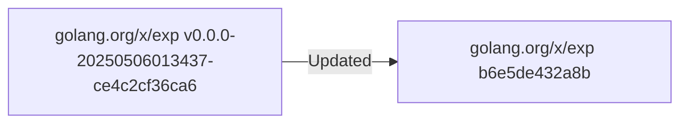

# Pull Request #1669: Update golang.org/x/exp digest to dcc06ee

**Author**: @red-hat-konflux
**Created**: June 01, 2025 at 05:42 PM UTC
**Status**: Merged
**Labels**: None
**Base**: `master` ← **Head**: `konflux/mintmaker/master/golang.org-x-exp-digest`

## Description

This PR contains the following updates:

| Package | Type | Update | Change |
|---|---|---|---|
| golang.org/x/exp | require | digest | `ce4c2cf` -> `dcc06ee` |

---

### Configuration

📅 **Schedule**: Branch creation - "after 5am on sunday" in timezone Europe/Prague, Automerge - At any time (no schedule defined).

🚦 **Automerge**: Enabled.

♻ **Rebasing**: Whenever PR is behind base branch, or you tick the rebase/retry checkbox.

🔕 **Ignore**: Close this PR and you won't be reminded about this update again.

---

 - [ ] <!-- rebase-check -->If you want to rebase/retry this PR, check this box

---

To execute skipped test pipelines write comment `/ok-to-test`.

This PR has been generated by [MintMaker](https://redirect.github.com/konflux-ci/mintmaker) (powered by [Renovate Bot](https://redirect.github.com/renovatebot/renovate)).
<!--renovate-debug:eyJjcmVhdGVkSW5WZXIiOiIzOS4yNjQuMC1ycG0iLCJ1cGRhdGVkSW5WZXIiOiIzOS4yNjQuMC1ycG0iLCJ0YXJnZXRCcmFuY2giOiJtYXN0ZXIiLCJsYWJlbHMiOltdfQ==-->


---

## Discussion

### Comment by @jira-linking on June 01, 2025 at 05:42 PM UTC

Commits missing Jira IDs:
52fb35f19361a0b0ef8bd0d12070a546cee5eb0f


### Comment by @sourcery-ai on June 01, 2025 at 05:42 PM UTC

<!-- Generated by sourcery-ai[bot]: start review_guide -->

## Reviewer's Guide

This PR updates the golang.org/x/exp dependency in go.mod to a newer commit hash, ensuring the digest package is bumped from ce4c2cf to b6e5de4 via an automated Renovate update.

#### Flow Diagram: golang.org/x/exp Dependency Version Update



### File-Level Changes

| Change | Details | Files |
| ------ | ------- | ----- |
| Bump golang.org/x/exp digest dependency version | <ul><li>Update require directive in go.mod from v0.0.0-20250506013437-ce4c2cf36ca6 to commit b6e5de432a8b</li></ul> | `go.mod` |

---

<details>
<summary>Tips and commands</summary>

#### Interacting with Sourcery

- **Trigger a new review:** Comment `@sourcery-ai review` on the pull request.
- **Continue discussions:** Reply directly to Sourcery's review comments.
- **Generate a GitHub issue from a review comment:** Ask Sourcery to create an
  issue from a review comment by replying to it. You can also reply to a
  review comment with `@sourcery-ai issue` to create an issue from it.
- **Generate a pull request title:** Write `@sourcery-ai` anywhere in the pull
  request title to generate a title at any time. You can also comment
  `@sourcery-ai title` on the pull request to (re-)generate the title at any time.
- **Generate a pull request summary:** Write `@sourcery-ai summary` anywhere in
  the pull request body to generate a PR summary at any time exactly where you
  want it. You can also comment `@sourcery-ai summary` on the pull request to
  (re-)generate the summary at any time.
- **Generate reviewer's guide:** Comment `@sourcery-ai guide` on the pull
  request to (re-)generate the reviewer's guide at any time.
- **Resolve all Sourcery comments:** Comment `@sourcery-ai resolve` on the
  pull request to resolve all Sourcery comments. Useful if you've already
  addressed all the comments and don't want to see them anymore.
- **Dismiss all Sourcery reviews:** Comment `@sourcery-ai dismiss` on the pull
  request to dismiss all existing Sourcery reviews. Especially useful if you
  want to start fresh with a new review - don't forget to comment
  `@sourcery-ai review` to trigger a new review!

#### Customizing Your Experience

Access your [dashboard](https://app.sourcery.ai) to:
- Enable or disable review features such as the Sourcery-generated pull request
  summary, the reviewer's guide, and others.
- Change the review language.
- Add, remove or edit custom review instructions.
- Adjust other review settings.

#### Getting Help

- [Contact our support team](mailto:support@sourcery.ai) for questions or feedback.
- Visit our [documentation](https://docs.sourcery.ai) for detailed guides and information.
- Keep in touch with the Sourcery team by following us on [X/Twitter](https://x.com/SourceryAI), [LinkedIn](https://www.linkedin.com/company/sourcery-ai/) or [GitHub](https://github.com/sourcery-ai).

</details>

<!-- Generated by sourcery-ai[bot]: end review_guide -->

### Comment by @red-hat-konflux on June 15, 2025 at 10:33 AM UTC

### ℹ Artifact update notice

##### File name: go.mod

In order to perform the update(s) described in the table above, Renovate ran the `go get` command, which resulted in the following additional change(s):


- 5 additional dependencies were updated


Details:


| **Package**           | **Change**             |
| :-------------------- | :--------------------- |
| `golang.org/x/net`    | `v0.40.0` -> `v0.41.0` |
| `golang.org/x/crypto` | `v0.38.0` -> `v0.39.0` |
| `golang.org/x/sync`   | `v0.14.0` -> `v0.15.0` |
| `golang.org/x/text`   | `v0.25.0` -> `v0.26.0` |
| `golang.org/x/tools`  | `v0.33.0` -> `v0.34.0` |

### Comment by @codecov-commenter on June 15, 2025 at 10:38 AM UTC

## [Codecov](https://app.codecov.io/gh/RedHatInsights/patchman-engine/pull/1669?dropdown=coverage&src=pr&el=h1&utm_medium=referral&utm_source=github&utm_content=comment&utm_campaign=pr+comments&utm_term=RedHatInsights) Report
All modified and coverable lines are covered by tests :white_check_mark:
> Project coverage is 57.29%. Comparing base [(`25b6cc2`)](https://app.codecov.io/gh/RedHatInsights/patchman-engine/commit/25b6cc296f0db1522ad5af313d6ee9d39fb257bd?dropdown=coverage&el=desc&utm_medium=referral&utm_source=github&utm_content=comment&utm_campaign=pr+comments&utm_term=RedHatInsights) to head [(`52fb35f`)](https://app.codecov.io/gh/RedHatInsights/patchman-engine/commit/52fb35f19361a0b0ef8bd0d12070a546cee5eb0f?dropdown=coverage&el=desc&utm_medium=referral&utm_source=github&utm_content=comment&utm_campaign=pr+comments&utm_term=RedHatInsights).
> Report is 1 commits behind head on master.

<details><summary>Additional details and impacted files</summary>


```diff
@@           Coverage Diff           @@
##           master    #1669   +/-   ##
=======================================
  Coverage   57.29%   57.29%           
=======================================
  Files         138      138           
  Lines       10790    10790           
=======================================
  Hits         6182     6182           
  Misses       4048     4048           
  Partials      560      560           
```

| [Flag](https://app.codecov.io/gh/RedHatInsights/patchman-engine/pull/1669/flags?src=pr&el=flags&utm_medium=referral&utm_source=github&utm_content=comment&utm_campaign=pr+comments&utm_term=RedHatInsights) | Coverage Δ | |
|---|---|---|
| [unittests](https://app.codecov.io/gh/RedHatInsights/patchman-engine/pull/1669/flags?src=pr&el=flag&utm_medium=referral&utm_source=github&utm_content=comment&utm_campaign=pr+comments&utm_term=RedHatInsights) | `57.29% <ø> (ø)` | |

Flags with carried forward coverage won't be shown. [Click here](https://docs.codecov.io/docs/carryforward-flags?utm_medium=referral&utm_source=github&utm_content=comment&utm_campaign=pr+comments&utm_term=RedHatInsights#carryforward-flags-in-the-pull-request-comment) to find out more.

</details>

[:umbrella: View full report in Codecov by Sentry](https://app.codecov.io/gh/RedHatInsights/patchman-engine/pull/1669?dropdown=coverage&src=pr&el=continue&utm_medium=referral&utm_source=github&utm_content=comment&utm_campaign=pr+comments&utm_term=RedHatInsights).   
:loudspeaker: Have feedback on the report? [Share it here](https://about.codecov.io/codecov-pr-comment-feedback/?utm_medium=referral&utm_source=github&utm_content=comment&utm_campaign=pr+comments&utm_term=RedHatInsights).

<details><summary> :rocket: New features to boost your workflow: </summary>

- :snowflake: [Test Analytics](https://docs.codecov.com/docs/test-analytics): Detect flaky tests, report on failures, and find test suite problems.
</details>

---

*Archived from: https://github.com/RedHatInsights/patchman-engine/pull/1669*
