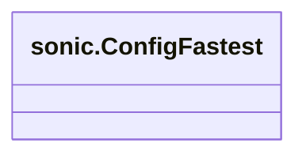
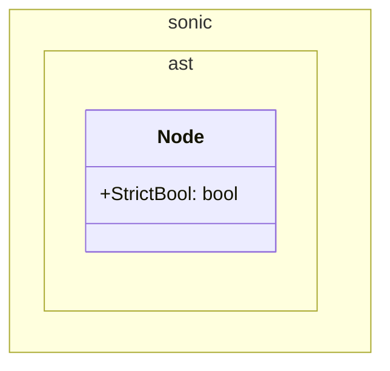

# Pull Request #1673: Update module github.com/bytedance/sonic to v1.13.3

**Author**: @red-hat-konflux
**Created**: June 08, 2025 at 01:53 PM UTC
**Status**: Merged
**Labels**: None
**Base**: `master` ← **Head**: `konflux/mintmaker/master/github.com-bytedance-sonic-1.x`

## Description

This PR contains the following updates:

| Package | Type | Update | Change |
|---|---|---|---|
| [github.com/bytedance/sonic](https://redirect.github.com/bytedance/sonic) | require | patch | `v1.13.2` -> `v1.13.3` |

---

### Release Notes

<details>
<summary>bytedance/sonic (github.com/bytedance/sonic)</summary>

### [`v1.13.3`](https://redirect.github.com/bytedance/sonic/releases/tag/v1.13.3)

[Compare Source](https://redirect.github.com/bytedance/sonic/compare/v1.13.2...v1.13.3)

#### What's Changed

-   chore: remove `NoQuoteTextMarshaler` from `ConfigFastest` and export … by [@&#8203;AsterDY](https://redirect.github.com/AsterDY) in [https://github.com/bytedance/sonic/pull/781](https://redirect.github.com/bytedance/sonic/pull/781)
-   fix: code and comment typos by [@&#8203;musvaage](https://redirect.github.com/musvaage) in [https://github.com/bytedance/sonic/pull/783](https://redirect.github.com/bytedance/sonic/pull/783)
-   fix(git): add lacking fuzz/go-fuzz-corpus submodule by [@&#8203;zchee](https://redirect.github.com/zchee) in [https://github.com/bytedance/sonic/pull/784](https://redirect.github.com/bytedance/sonic/pull/784)
-   opt:(encoder) use std `strconv.AppendInt` for better performance on arm by [@&#8203;AsterDY](https://redirect.github.com/AsterDY) in [https://github.com/bytedance/sonic/pull/789](https://redirect.github.com/bytedance/sonic/pull/789)
-   fix: not panic when marshal map key that is bool by [@&#8203;liuq19](https://redirect.github.com/liuq19) in [https://github.com/bytedance/sonic/pull/795](https://redirect.github.com/bytedance/sonic/pull/795)
-   fix: typo in ast/node.go doc comment by [@&#8203;eomhs](https://redirect.github.com/eomhs) in [https://github.com/bytedance/sonic/pull/793](https://redirect.github.com/bytedance/sonic/pull/793)
-   feat:(ast) add `Node.StrictBool` by [@&#8203;AsterDY](https://redirect.github.com/AsterDY) in [https://github.com/bytedance/sonic/pull/801](https://redirect.github.com/bytedance/sonic/pull/801)
-   fix: pass `io.Reader`'s error to `StreamDecoder` by [@&#8203;AsterDY](https://redirect.github.com/AsterDY) in [https://github.com/bytedance/sonic/pull/802](https://redirect.github.com/bytedance/sonic/pull/802)
-   fix(compat): should return error when unmarshaling json with trailing chars by [@&#8203;liuq19](https://redirect.github.com/liuq19) in [https://github.com/bytedance/sonic/pull/803](https://redirect.github.com/bytedance/sonic/pull/803)

#### New Contributors

-   [@&#8203;musvaage](https://redirect.github.com/musvaage) made their first contribution in [https://github.com/bytedance/sonic/pull/783](https://redirect.github.com/bytedance/sonic/pull/783)
-   [@&#8203;zchee](https://redirect.github.com/zchee) made their first contribution in [https://github.com/bytedance/sonic/pull/784](https://redirect.github.com/bytedance/sonic/pull/784)
-   [@&#8203;eomhs](https://redirect.github.com/eomhs) made their first contribution in [https://github.com/bytedance/sonic/pull/793](https://redirect.github.com/bytedance/sonic/pull/793)

**Full Changelog**: https://github.com/bytedance/sonic/compare/v1.13.2...v1.13.3

</details>

---

### Configuration

📅 **Schedule**: Branch creation - "after 5am on sunday" in timezone Europe/Prague, Automerge - At any time (no schedule defined).

🚦 **Automerge**: Enabled.

♻ **Rebasing**: Whenever PR is behind base branch, or you tick the rebase/retry checkbox.

🔕 **Ignore**: Close this PR and you won't be reminded about this update again.

---

 - [ ] <!-- rebase-check -->If you want to rebase/retry this PR, check this box

---

To execute skipped test pipelines write comment `/ok-to-test`.

This PR has been generated by [MintMaker](https://redirect.github.com/konflux-ci/mintmaker) (powered by [Renovate Bot](https://redirect.github.com/renovatebot/renovate)).
<!--renovate-debug:eyJjcmVhdGVkSW5WZXIiOiIzOS4yNjQuMC1ycG0iLCJ1cGRhdGVkSW5WZXIiOiIzOS4yNjQuMC1ycG0iLCJ0YXJnZXRCcmFuY2giOiJtYXN0ZXIiLCJsYWJlbHMiOltdfQ==-->


---

## Discussion

### Comment by @jira-linking on June 08, 2025 at 01:53 PM UTC

Commits missing Jira IDs:
a4314ca5f670d9976a323bdf69250fe73632d45d


### Comment by @sourcery-ai on June 08, 2025 at 01:53 PM UTC

<!-- Generated by sourcery-ai[bot]: start review_guide -->

## Reviewer's Guide

This PR updates the `github.com/bytedance/sonic` dependency from v1.13.2 to v1.13.3 in the module manifest to incorporate the latest fixes and improvements.

#### Class Diagram: Update to sonic.ConfigFastest in bytedance/sonic v1.13.3



#### Class Diagram: Update to sonic.ast.Node in bytedance/sonic v1.13.3



### File-Level Changes

| Change | Details | Files |
| ------ | ------- | ----- |
| Bump sonic dependency version | <ul><li>Replace v1.13.2 with v1.13.3 in require directive</li></ul> | `go.mod` |

---

<details>
<summary>Tips and commands</summary>

#### Interacting with Sourcery

- **Trigger a new review:** Comment `@sourcery-ai review` on the pull request.
- **Continue discussions:** Reply directly to Sourcery's review comments.
- **Generate a GitHub issue from a review comment:** Ask Sourcery to create an
  issue from a review comment by replying to it. You can also reply to a
  review comment with `@sourcery-ai issue` to create an issue from it.
- **Generate a pull request title:** Write `@sourcery-ai` anywhere in the pull
  request title to generate a title at any time. You can also comment
  `@sourcery-ai title` on the pull request to (re-)generate the title at any time.
- **Generate a pull request summary:** Write `@sourcery-ai summary` anywhere in
  the pull request body to generate a PR summary at any time exactly where you
  want it. You can also comment `@sourcery-ai summary` on the pull request to
  (re-)generate the summary at any time.
- **Generate reviewer's guide:** Comment `@sourcery-ai guide` on the pull
  request to (re-)generate the reviewer's guide at any time.
- **Resolve all Sourcery comments:** Comment `@sourcery-ai resolve` on the
  pull request to resolve all Sourcery comments. Useful if you've already
  addressed all the comments and don't want to see them anymore.
- **Dismiss all Sourcery reviews:** Comment `@sourcery-ai dismiss` on the pull
  request to dismiss all existing Sourcery reviews. Especially useful if you
  want to start fresh with a new review - don't forget to comment
  `@sourcery-ai review` to trigger a new review!

#### Customizing Your Experience

Access your [dashboard](https://app.sourcery.ai) to:
- Enable or disable review features such as the Sourcery-generated pull request
  summary, the reviewer's guide, and others.
- Change the review language.
- Add, remove or edit custom review instructions.
- Adjust other review settings.

#### Getting Help

- [Contact our support team](mailto:support@sourcery.ai) for questions or feedback.
- Visit our [documentation](https://docs.sourcery.ai) for detailed guides and information.
- Keep in touch with the Sourcery team by following us on [X/Twitter](https://x.com/SourceryAI), [LinkedIn](https://www.linkedin.com/company/sourcery-ai/) or [GitHub](https://github.com/sourcery-ai).

</details>

<!-- Generated by sourcery-ai[bot]: end review_guide -->

### Comment by @codecov-commenter on June 15, 2025 at 10:39 AM UTC

## [Codecov](https://app.codecov.io/gh/RedHatInsights/patchman-engine/pull/1673?dropdown=coverage&src=pr&el=h1&utm_medium=referral&utm_source=github&utm_content=comment&utm_campaign=pr+comments&utm_term=RedHatInsights) Report
All modified and coverable lines are covered by tests :white_check_mark:
> Project coverage is 57.29%. Comparing base [(`25b6cc2`)](https://app.codecov.io/gh/RedHatInsights/patchman-engine/commit/25b6cc296f0db1522ad5af313d6ee9d39fb257bd?dropdown=coverage&el=desc&utm_medium=referral&utm_source=github&utm_content=comment&utm_campaign=pr+comments&utm_term=RedHatInsights) to head [(`a4314ca`)](https://app.codecov.io/gh/RedHatInsights/patchman-engine/commit/a4314ca5f670d9976a323bdf69250fe73632d45d?dropdown=coverage&el=desc&utm_medium=referral&utm_source=github&utm_content=comment&utm_campaign=pr+comments&utm_term=RedHatInsights).
> Report is 3 commits behind head on master.

<details><summary>Additional details and impacted files</summary>


```diff
@@           Coverage Diff           @@
##           master    #1673   +/-   ##
=======================================
  Coverage   57.29%   57.29%           
=======================================
  Files         138      138           
  Lines       10790    10790           
=======================================
  Hits         6182     6182           
  Misses       4048     4048           
  Partials      560      560           
```

| [Flag](https://app.codecov.io/gh/RedHatInsights/patchman-engine/pull/1673/flags?src=pr&el=flags&utm_medium=referral&utm_source=github&utm_content=comment&utm_campaign=pr+comments&utm_term=RedHatInsights) | Coverage Δ | |
|---|---|---|
| [unittests](https://app.codecov.io/gh/RedHatInsights/patchman-engine/pull/1673/flags?src=pr&el=flag&utm_medium=referral&utm_source=github&utm_content=comment&utm_campaign=pr+comments&utm_term=RedHatInsights) | `57.29% <ø> (ø)` | |

Flags with carried forward coverage won't be shown. [Click here](https://docs.codecov.io/docs/carryforward-flags?utm_medium=referral&utm_source=github&utm_content=comment&utm_campaign=pr+comments&utm_term=RedHatInsights#carryforward-flags-in-the-pull-request-comment) to find out more.

</details>

[:umbrella: View full report in Codecov by Sentry](https://app.codecov.io/gh/RedHatInsights/patchman-engine/pull/1673?dropdown=coverage&src=pr&el=continue&utm_medium=referral&utm_source=github&utm_content=comment&utm_campaign=pr+comments&utm_term=RedHatInsights).   
:loudspeaker: Have feedback on the report? [Share it here](https://about.codecov.io/codecov-pr-comment-feedback/?utm_medium=referral&utm_source=github&utm_content=comment&utm_campaign=pr+comments&utm_term=RedHatInsights).

<details><summary> :rocket: New features to boost your workflow: </summary>

- :snowflake: [Test Analytics](https://docs.codecov.com/docs/test-analytics): Detect flaky tests, report on failures, and find test suite problems.
</details>

---

*Archived from: https://github.com/RedHatInsights/patchman-engine/pull/1673*
