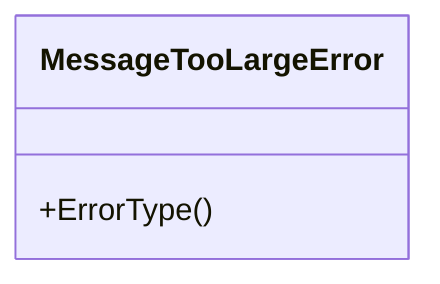

# Pull Request #1677: Update module github.com/segmentio/kafka-go to v0.4.48

**Author**: @red-hat-konflux
**Created**: June 15, 2025 at 06:27 AM UTC
**Status**: Merged
**Labels**: None
**Base**: `master` ← **Head**: `konflux/mintmaker/master/github.com-segmentio-kafka-go-0.x`

## Description

This PR contains the following updates:

| Package | Type | Update | Change |
|---|---|---|---|
| [github.com/segmentio/kafka-go](https://redirect.github.com/segmentio/kafka-go) | require | patch | `v0.4.47` -> `v0.4.48` |

---

> [!WARNING]
> Some dependencies could not be looked up. Check the warning logs for more information.

---

### Release Notes

<details>
<summary>segmentio/kafka-go (github.com/segmentio/kafka-go)</summary>

### [`v0.4.48`](https://redirect.github.com/segmentio/kafka-go/releases/tag/v0.4.48)

[Compare Source](https://redirect.github.com/segmentio/kafka-go/compare/v0.4.47...v0.4.48)

#### What's Changed

-   \[DP-1901] - Convert Wurstmeister Kafka image to Bitnami for Kafka-go by [@&#8203;ssingudasu](https://redirect.github.com/ssingudasu) in [https://github.com/segmentio/kafka-go/pull/1255](https://redirect.github.com/segmentio/kafka-go/pull/1255)
-   Fix RetentionTime error in documentation default is -1 by [@&#8203;ivanvs](https://redirect.github.com/ivanvs) in [https://github.com/segmentio/kafka-go/pull/1260](https://redirect.github.com/segmentio/kafka-go/pull/1260)
-   writer: use 'halve' instead of 'half' by [@&#8203;kevinburkesegment](https://redirect.github.com/kevinburkesegment) in [https://github.com/segmentio/kafka-go/pull/1273](https://redirect.github.com/segmentio/kafka-go/pull/1273)
-   fix typo by [@&#8203;su5kk](https://redirect.github.com/su5kk) in [https://github.com/segmentio/kafka-go/pull/1302](https://redirect.github.com/segmentio/kafka-go/pull/1302)
-   Makefile: use docker compose not docker-compose by [@&#8203;kevinburkesegment](https://redirect.github.com/kevinburkesegment) in [https://github.com/segmentio/kafka-go/pull/1309](https://redirect.github.com/segmentio/kafka-go/pull/1309)
-   Add ErrorType method to MessageTooLargeError by [@&#8203;AndrewShearBayer](https://redirect.github.com/AndrewShearBayer) in [https://github.com/segmentio/kafka-go/pull/1311](https://redirect.github.com/segmentio/kafka-go/pull/1311)
-   Fixes some flaky tests in the build as well as the case when tests start before kafka is ready by [@&#8203;nachogiljaldo](https://redirect.github.com/nachogiljaldo) in [https://github.com/segmentio/kafka-go/pull/1349](https://redirect.github.com/segmentio/kafka-go/pull/1349)
-   example groupID case fix by [@&#8203;gam6itko](https://redirect.github.com/gam6itko) in [https://github.com/segmentio/kafka-go/pull/1376](https://redirect.github.com/segmentio/kafka-go/pull/1376)
-   chore: fix flaky TestRebalanceTooManyConsumers by [@&#8203;petedannemann](https://redirect.github.com/petedannemann) in [https://github.com/segmentio/kafka-go/pull/1380](https://redirect.github.com/segmentio/kafka-go/pull/1380)
-   Add title and description for FencedInstanceID by [@&#8203;jessekempf](https://redirect.github.com/jessekempf) in [https://github.com/segmentio/kafka-go/pull/1370](https://redirect.github.com/segmentio/kafka-go/pull/1370)
-   docs: fix typos and comments by [@&#8203;KendrickLLMar](https://redirect.github.com/KendrickLLMar) in [https://github.com/segmentio/kafka-go/pull/1382](https://redirect.github.com/segmentio/kafka-go/pull/1382)
-   chore: test against kafka 3.7 and remove old versions of kafka from CI by [@&#8203;petedannemann](https://redirect.github.com/petedannemann) in [https://github.com/segmentio/kafka-go/pull/1381](https://redirect.github.com/segmentio/kafka-go/pull/1381)
-   feat: Kafka 4.0 support by [@&#8203;maxwolf8852](https://redirect.github.com/maxwolf8852) in [https://github.com/segmentio/kafka-go/pull/1384](https://redirect.github.com/segmentio/kafka-go/pull/1384)

#### New Contributors

-   [@&#8203;ssingudasu](https://redirect.github.com/ssingudasu) made their first contribution in [https://github.com/segmentio/kafka-go/pull/1255](https://redirect.github.com/segmentio/kafka-go/pull/1255)
-   [@&#8203;ivanvs](https://redirect.github.com/ivanvs) made their first contribution in [https://github.com/segmentio/kafka-go/pull/1260](https://redirect.github.com/segmentio/kafka-go/pull/1260)
-   [@&#8203;su5kk](https://redirect.github.com/su5kk) made their first contribution in [https://github.com/segmentio/kafka-go/pull/1302](https://redirect.github.com/segmentio/kafka-go/pull/1302)
-   [@&#8203;AndrewShearBayer](https://redirect.github.com/AndrewShearBayer) made their first contribution in [https://github.com/segmentio/kafka-go/pull/1311](https://redirect.github.com/segmentio/kafka-go/pull/1311)
-   [@&#8203;nachogiljaldo](https://redirect.github.com/nachogiljaldo) made their first contribution in [https://github.com/segmentio/kafka-go/pull/1349](https://redirect.github.com/segmentio/kafka-go/pull/1349)
-   [@&#8203;gam6itko](https://redirect.github.com/gam6itko) made their first contribution in [https://github.com/segmentio/kafka-go/pull/1376](https://redirect.github.com/segmentio/kafka-go/pull/1376)
-   [@&#8203;jessekempf](https://redirect.github.com/jessekempf) made their first contribution in [https://github.com/segmentio/kafka-go/pull/1370](https://redirect.github.com/segmentio/kafka-go/pull/1370)
-   [@&#8203;KendrickLLMar](https://redirect.github.com/KendrickLLMar) made their first contribution in [https://github.com/segmentio/kafka-go/pull/1382](https://redirect.github.com/segmentio/kafka-go/pull/1382)
-   [@&#8203;maxwolf8852](https://redirect.github.com/maxwolf8852) made their first contribution in [https://github.com/segmentio/kafka-go/pull/1384](https://redirect.github.com/segmentio/kafka-go/pull/1384)

**Full Changelog**: https://github.com/segmentio/kafka-go/compare/v0.4.47...v0.4.48

</details>

---

### Configuration

📅 **Schedule**: Branch creation - "after 5am on sunday" in timezone Europe/Prague, Automerge - At any time (no schedule defined).

🚦 **Automerge**: Enabled.

♻ **Rebasing**: Whenever PR is behind base branch, or you tick the rebase/retry checkbox.

🔕 **Ignore**: Close this PR and you won't be reminded about this update again.

---

 - [ ] <!-- rebase-check -->If you want to rebase/retry this PR, check this box

---

To execute skipped test pipelines write comment `/ok-to-test`.

This PR has been generated by [MintMaker](https://redirect.github.com/konflux-ci/mintmaker) (powered by [Renovate Bot](https://redirect.github.com/renovatebot/renovate)).
<!--renovate-debug:eyJjcmVhdGVkSW5WZXIiOiIzOS4yNjQuMC1ycG0iLCJ1cGRhdGVkSW5WZXIiOiIzOS4yNjQuMC1ycG0iLCJ0YXJnZXRCcmFuY2giOiJtYXN0ZXIiLCJsYWJlbHMiOltdfQ==-->

## Summary by Sourcery

Chores:
- Bump github.com/segmentio/kafka-go from v0.4.47 to v0.4.48 in go.mod

---

## Discussion

### Comment by @jira-linking on June 15, 2025 at 06:27 AM UTC

Commits missing Jira IDs:
7af25b619e6bcd08430c6ae63f56bd0bc323649e


### Comment by @sourcery-ai on June 15, 2025 at 06:27 AM UTC

<!-- Generated by sourcery-ai[bot]: start review_guide -->

## Reviewer's Guide

This PR updates the project’s Kafka client dependency to segmentio/kafka-go v0.4.48 by bumping the version in go.mod and regenerating go.sum to incorporate the latest patch fixes and improvements.

#### Updated Class Diagram for MessageTooLargeError in kafka-go



### File-Level Changes

| Change | Details | Files |
| ------ | ------- | ----- |
| Update kafka-go dependency to v0.4.48 | <ul><li>Bump version reference in go.mod to v0.4.48</li><li>Regenerate go.sum entries via go mod tidy</li></ul> | `go.mod`<br/>`go.sum` |

---

<details>
<summary>Tips and commands</summary>

#### Interacting with Sourcery

- **Trigger a new review:** Comment `@sourcery-ai review` on the pull request.
- **Continue discussions:** Reply directly to Sourcery's review comments.
- **Generate a GitHub issue from a review comment:** Ask Sourcery to create an
  issue from a review comment by replying to it. You can also reply to a
  review comment with `@sourcery-ai issue` to create an issue from it.
- **Generate a pull request title:** Write `@sourcery-ai` anywhere in the pull
  request title to generate a title at any time. You can also comment
  `@sourcery-ai title` on the pull request to (re-)generate the title at any time.
- **Generate a pull request summary:** Write `@sourcery-ai summary` anywhere in
  the pull request body to generate a PR summary at any time exactly where you
  want it. You can also comment `@sourcery-ai summary` on the pull request to
  (re-)generate the summary at any time.
- **Generate reviewer's guide:** Comment `@sourcery-ai guide` on the pull
  request to (re-)generate the reviewer's guide at any time.
- **Resolve all Sourcery comments:** Comment `@sourcery-ai resolve` on the
  pull request to resolve all Sourcery comments. Useful if you've already
  addressed all the comments and don't want to see them anymore.
- **Dismiss all Sourcery reviews:** Comment `@sourcery-ai dismiss` on the pull
  request to dismiss all existing Sourcery reviews. Especially useful if you
  want to start fresh with a new review - don't forget to comment
  `@sourcery-ai review` to trigger a new review!

#### Customizing Your Experience

Access your [dashboard](https://app.sourcery.ai) to:
- Enable or disable review features such as the Sourcery-generated pull request
  summary, the reviewer's guide, and others.
- Change the review language.
- Add, remove or edit custom review instructions.
- Adjust other review settings.

#### Getting Help

- [Contact our support team](mailto:support@sourcery.ai) for questions or feedback.
- Visit our [documentation](https://docs.sourcery.ai) for detailed guides and information.
- Keep in touch with the Sourcery team by following us on [X/Twitter](https://x.com/SourceryAI), [LinkedIn](https://www.linkedin.com/company/sourcery-ai/) or [GitHub](https://github.com/sourcery-ai).

</details>

<!-- Generated by sourcery-ai[bot]: end review_guide -->

### Comment by @codecov-commenter on June 15, 2025 at 06:32 AM UTC

## [Codecov](https://app.codecov.io/gh/RedHatInsights/patchman-engine/pull/1677?dropdown=coverage&src=pr&el=h1&utm_medium=referral&utm_source=github&utm_content=comment&utm_campaign=pr+comments&utm_term=RedHatInsights) Report
All modified and coverable lines are covered by tests :white_check_mark:
> Project coverage is 57.29%. Comparing base [(`7e86762`)](https://app.codecov.io/gh/RedHatInsights/patchman-engine/commit/7e86762bf9f80fefde1a6fd2faa32cfa3613c03f?dropdown=coverage&el=desc&utm_medium=referral&utm_source=github&utm_content=comment&utm_campaign=pr+comments&utm_term=RedHatInsights) to head [(`7af25b6`)](https://app.codecov.io/gh/RedHatInsights/patchman-engine/commit/7af25b619e6bcd08430c6ae63f56bd0bc323649e?dropdown=coverage&el=desc&utm_medium=referral&utm_source=github&utm_content=comment&utm_campaign=pr+comments&utm_term=RedHatInsights).
> Report is 1 commits behind head on master.

<details><summary>Additional details and impacted files</summary>


```diff
@@           Coverage Diff           @@
##           master    #1677   +/-   ##
=======================================
  Coverage   57.29%   57.29%           
=======================================
  Files         138      138           
  Lines       10790    10790           
=======================================
  Hits         6182     6182           
  Misses       4048     4048           
  Partials      560      560           
```

| [Flag](https://app.codecov.io/gh/RedHatInsights/patchman-engine/pull/1677/flags?src=pr&el=flags&utm_medium=referral&utm_source=github&utm_content=comment&utm_campaign=pr+comments&utm_term=RedHatInsights) | Coverage Δ | |
|---|---|---|
| [unittests](https://app.codecov.io/gh/RedHatInsights/patchman-engine/pull/1677/flags?src=pr&el=flag&utm_medium=referral&utm_source=github&utm_content=comment&utm_campaign=pr+comments&utm_term=RedHatInsights) | `57.29% <ø> (ø)` | |

Flags with carried forward coverage won't be shown. [Click here](https://docs.codecov.io/docs/carryforward-flags?utm_medium=referral&utm_source=github&utm_content=comment&utm_campaign=pr+comments&utm_term=RedHatInsights#carryforward-flags-in-the-pull-request-comment) to find out more.

</details>

[:umbrella: View full report in Codecov by Sentry](https://app.codecov.io/gh/RedHatInsights/patchman-engine/pull/1677?dropdown=coverage&src=pr&el=continue&utm_medium=referral&utm_source=github&utm_content=comment&utm_campaign=pr+comments&utm_term=RedHatInsights).   
:loudspeaker: Have feedback on the report? [Share it here](https://about.codecov.io/codecov-pr-comment-feedback/?utm_medium=referral&utm_source=github&utm_content=comment&utm_campaign=pr+comments&utm_term=RedHatInsights).

<details><summary> :rocket: New features to boost your workflow: </summary>

- :snowflake: [Test Analytics](https://docs.codecov.com/docs/test-analytics): Detect flaky tests, report on failures, and find test suite problems.
</details>

---

*Archived from: https://github.com/RedHatInsights/patchman-engine/pull/1677*
