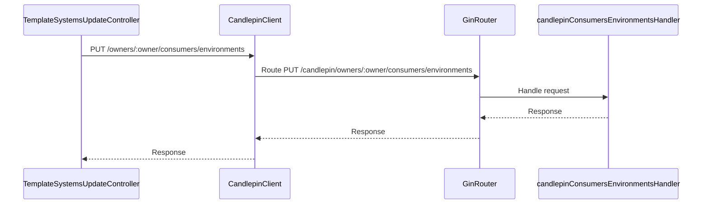

# Pull Request #1686: RHINENG-15506: fix typo in API path

**Author**: @MichaelMraka
**Created**: June 17, 2025 at 09:13 AM UTC
**Status**: Merged
**Labels**: None
**Base**: `master` ← **Head**: `pr2`

## Description

## Secure Coding Practices Checklist GitHub Link
- https://github.com/RedHatInsights/secure-coding-checklist

## Secure Coding Checklist
- [x] Input Validation
- [x] Output Encoding
- [x] Authentication and Password Management
- [x] Session Management
- [x] Access Control
- [x] Cryptographic Practices
- [x] Error Handling and Logging
- [x] Data Protection
- [x] Communication Security
- [x] System Configuration
- [x] Database Security
- [x] File Management
- [x] Memory Management
- [x] General Coding Practices

## Summary by Sourcery

Fix typo in candlepin consumers environments API path by changing the URL segment from "owner" to "owners" in both client calls and server routes

Bug Fixes:
- Correct the client request URL to use "/owners/:owner/consumers/environments" instead of "/owner/:owner/consumers/environments"
- Update the server route registration to match the corrected "/candlepin/owners/:owner/consumers/environments" path

---

## Discussion

### Comment by @jira-linking on June 17, 2025 at 09:13 AM UTC

Referenced Jiras:
https://issues.redhat.com/browse/RHINENG-15506


### Comment by @sourcery-ai on June 17, 2025 at 09:13 AM UTC

<!-- Generated by sourcery-ai[bot]: start review_guide -->

## Reviewer's Guide

Corrected a typo in the Candlepin API path by pluralizing “owner” to “owners” in both the client request URL and the Gin route registration.

#### Sequence diagram for updated Candlepin API path handling



### File-Level Changes

| Change | Details | Files |
| ------ | ------- | ----- |
| Fixed typo in client request URL for environments update | <ul><li>Replaced "/owner/" segment with "/owners/" in URL concatenation</li></ul> | `manager/controllers/template_systems_update.go` |
| Updated Gin route path to match corrected API endpoint | <ul><li>Changed PUT route from "/candlepin/owner/:owner/consumers/environments" to "/candlepin/owners/:owner/consumers/environments"</li></ul> | `platform/candlepin.go` |

---

<details>
<summary>Tips and commands</summary>

#### Interacting with Sourcery

- **Trigger a new review:** Comment `@sourcery-ai review` on the pull request.
- **Continue discussions:** Reply directly to Sourcery's review comments.
- **Generate a GitHub issue from a review comment:** Ask Sourcery to create an
  issue from a review comment by replying to it. You can also reply to a
  review comment with `@sourcery-ai issue` to create an issue from it.
- **Generate a pull request title:** Write `@sourcery-ai` anywhere in the pull
  request title to generate a title at any time. You can also comment
  `@sourcery-ai title` on the pull request to (re-)generate the title at any time.
- **Generate a pull request summary:** Write `@sourcery-ai summary` anywhere in
  the pull request body to generate a PR summary at any time exactly where you
  want it. You can also comment `@sourcery-ai summary` on the pull request to
  (re-)generate the summary at any time.
- **Generate reviewer's guide:** Comment `@sourcery-ai guide` on the pull
  request to (re-)generate the reviewer's guide at any time.
- **Resolve all Sourcery comments:** Comment `@sourcery-ai resolve` on the
  pull request to resolve all Sourcery comments. Useful if you've already
  addressed all the comments and don't want to see them anymore.
- **Dismiss all Sourcery reviews:** Comment `@sourcery-ai dismiss` on the pull
  request to dismiss all existing Sourcery reviews. Especially useful if you
  want to start fresh with a new review - don't forget to comment
  `@sourcery-ai review` to trigger a new review!

#### Customizing Your Experience

Access your [dashboard](https://app.sourcery.ai) to:
- Enable or disable review features such as the Sourcery-generated pull request
  summary, the reviewer's guide, and others.
- Change the review language.
- Add, remove or edit custom review instructions.
- Adjust other review settings.

#### Getting Help

- [Contact our support team](mailto:support@sourcery.ai) for questions or feedback.
- Visit our [documentation](https://docs.sourcery.ai) for detailed guides and information.
- Keep in touch with the Sourcery team by following us on [X/Twitter](https://x.com/SourceryAI), [LinkedIn](https://www.linkedin.com/company/sourcery-ai/) or [GitHub](https://github.com/sourcery-ai).

</details>

<!-- Generated by sourcery-ai[bot]: end review_guide -->

### Comment by @codecov-commenter on June 17, 2025 at 09:18 AM UTC

## [Codecov](https://app.codecov.io/gh/RedHatInsights/patchman-engine/pull/1686?dropdown=coverage&src=pr&el=h1&utm_medium=referral&utm_source=github&utm_content=comment&utm_campaign=pr+comments&utm_term=RedHatInsights) Report
:x: Patch coverage is `50.00000%` with `1 line` in your changes missing coverage. Please review.
:white_check_mark: Project coverage is 57.25%. Comparing base ([`cc2cb7a`](https://app.codecov.io/gh/RedHatInsights/patchman-engine/commit/cc2cb7a275a55856ce9518bb01ec5ec645e78fc8?dropdown=coverage&el=desc&utm_medium=referral&utm_source=github&utm_content=comment&utm_campaign=pr+comments&utm_term=RedHatInsights)) to head ([`3687600`](https://app.codecov.io/gh/RedHatInsights/patchman-engine/commit/36876002c1e550c11b41e2a748c0422cae2b5dde?dropdown=coverage&el=desc&utm_medium=referral&utm_source=github&utm_content=comment&utm_campaign=pr+comments&utm_term=RedHatInsights)).
:warning: Report is 798 commits behind head on master.

| [Files with missing lines](https://app.codecov.io/gh/RedHatInsights/patchman-engine/pull/1686?dropdown=coverage&src=pr&el=tree&utm_medium=referral&utm_source=github&utm_content=comment&utm_campaign=pr+comments&utm_term=RedHatInsights) | Patch % | Lines |
|---|---|---|
| [platform/candlepin.go](https://app.codecov.io/gh/RedHatInsights/patchman-engine/pull/1686?src=pr&el=tree&filepath=platform%2Fcandlepin.go&utm_medium=referral&utm_source=github&utm_content=comment&utm_campaign=pr+comments&utm_term=RedHatInsights#diff-cGxhdGZvcm0vY2FuZGxlcGluLmdv) | 0.00% | [1 Missing :warning: ](https://app.codecov.io/gh/RedHatInsights/patchman-engine/pull/1686?src=pr&el=tree&utm_medium=referral&utm_source=github&utm_content=comment&utm_campaign=pr+comments&utm_term=RedHatInsights) |

<details><summary>Additional details and impacted files</summary>


```diff
@@           Coverage Diff           @@
##           master    #1686   +/-   ##
=======================================
  Coverage   57.25%   57.25%           
=======================================
  Files         138      138           
  Lines       10776    10776           
=======================================
  Hits         6170     6170           
  Misses       4046     4046           
  Partials      560      560           
```

| [Flag](https://app.codecov.io/gh/RedHatInsights/patchman-engine/pull/1686/flags?src=pr&el=flags&utm_medium=referral&utm_source=github&utm_content=comment&utm_campaign=pr+comments&utm_term=RedHatInsights) | Coverage Δ | |
|---|---|---|
| [unittests](https://app.codecov.io/gh/RedHatInsights/patchman-engine/pull/1686/flags?src=pr&el=flag&utm_medium=referral&utm_source=github&utm_content=comment&utm_campaign=pr+comments&utm_term=RedHatInsights) | `57.25% <50.00%> (ø)` | |

Flags with carried forward coverage won't be shown. [Click here](https://docs.codecov.io/docs/carryforward-flags?utm_medium=referral&utm_source=github&utm_content=comment&utm_campaign=pr+comments&utm_term=RedHatInsights#carryforward-flags-in-the-pull-request-comment) to find out more.
</details>

[:umbrella: View full report in Codecov by Sentry](https://app.codecov.io/gh/RedHatInsights/patchman-engine/pull/1686?dropdown=coverage&src=pr&el=continue&utm_medium=referral&utm_source=github&utm_content=comment&utm_campaign=pr+comments&utm_term=RedHatInsights).   
:loudspeaker: Have feedback on the report? [Share it here](https://about.codecov.io/codecov-pr-comment-feedback/?utm_medium=referral&utm_source=github&utm_content=comment&utm_campaign=pr+comments&utm_term=RedHatInsights).
<details><summary> :rocket: New features to boost your workflow: </summary>

- :snowflake: [Test Analytics](https://docs.codecov.com/docs/test-analytics): Detect flaky tests, report on failures, and find test suite problems.
</details>

---

## Reviews

### Review by @sourcery-ai - Commented on June 17, 2025 at 09:15 AM UTC

Hey @MichaelMraka - I've reviewed your changes - here's some feedback:

- Make sure to update any integration tests or mocks that still reference the `/owner/:owner/consumers/environments` path to use `/owners/:owner/consumers/environments`.
- Please update your OpenAPI/Swagger definitions (and any generated client code) to reflect the new `/owners/:owner/consumers/environments` endpoint.
- Consider adding a temporary deprecation handler or redirect for the old `/owner/:owner/consumers/environments` route to maintain backward compatibility during rollout.

<details>
<summary>Prompt for AI Agents</summary>

~~~markdown
Please address the comments from this code review:
## Overall Comments
- Make sure to update any integration tests or mocks that still reference the `/owner/:owner/consumers/environments` path to use `/owners/:owner/consumers/environments`.
- Please update your OpenAPI/Swagger definitions (and any generated client code) to reflect the new `/owners/:owner/consumers/environments` endpoint.
- Consider adding a temporary deprecation handler or redirect for the old `/owner/:owner/consumers/environments` route to maintain backward compatibility during rollout.
~~~

</details>

***

<details>
<summary>Sourcery is free for open source - if you like our reviews please consider sharing them ✨</summary>

- [X](https://twitter.com/intent/tweet?text=I%20just%20got%20an%20instant%20code%20review%20from%20%40SourceryAI%2C%20and%20it%20was%20brilliant%21%20It%27s%20free%20for%20open%20source%20and%20has%20a%20free%20trial%20for%20private%20code.%20Check%20it%20out%20https%3A//sourcery.ai)
- [Mastodon](https://mastodon.social/share?text=I%20just%20got%20an%20instant%20code%20review%20from%20%40SourceryAI%2C%20and%20it%20was%20brilliant%21%20It%27s%20free%20for%20open%20source%20and%20has%20a%20free%20trial%20for%20private%20code.%20Check%20it%20out%20https%3A//sourcery.ai)
- [LinkedIn](https://www.linkedin.com/sharing/share-offsite/?url=https://sourcery.ai)
- [Facebook](https://www.facebook.com/sharer/sharer.php?u=https://sourcery.ai)

</details>

<sub>
Help me be more useful! Please click 👍 or 👎 on each comment and I'll use the feedback to improve your reviews.
</sub>

### Review by @Dugowitch - Approved on June 17, 2025 at 10:03 AM UTC

---

*Archived from: https://github.com/RedHatInsights/patchman-engine/pull/1686*
