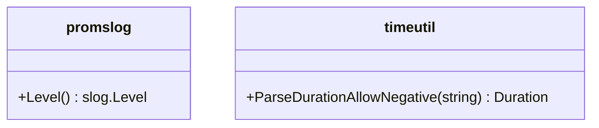

# Pull Request #1698: Update module github.com/prometheus/common to v0.65.0

**Author**: @red-hat-konflux
**Created**: June 29, 2025 at 06:22 AM UTC
**Status**: Merged
**Labels**: None
**Base**: `master` ← **Head**: `konflux/mintmaker/master/github.com-prometheus-common-0.x`

## Description

This PR contains the following updates:

| Package | Type | Update | Change |
|---|---|---|---|
| [github.com/prometheus/common](https://redirect.github.com/prometheus/common) | indirect | minor | `v0.64.0` -> `v0.65.0` |

---

> [!WARNING]
> Some dependencies could not be looked up. Check the warning logs for more information.

---

### Release Notes

<details>
<summary>prometheus/common (github.com/prometheus/common)</summary>

### [`v0.65.0`](https://redirect.github.com/prometheus/common/releases/tag/v0.65.0)

[Compare Source](https://redirect.github.com/prometheus/common/compare/v0.64.0...v0.65.0)

#### What's Changed

-   Synchronize common files from prometheus/prometheus by [@&#8203;prombot](https://redirect.github.com/prombot) in [https://github.com/prometheus/common/pull/789](https://redirect.github.com/prometheus/common/pull/789)
-   Remove otlptranslator package by [@&#8203;ArthurSens](https://redirect.github.com/ArthurSens) in [https://github.com/prometheus/common/pull/791](https://redirect.github.com/prometheus/common/pull/791)
-   feat(promslog): add Level() method to get slog.Level by [@&#8203;tjhop](https://redirect.github.com/tjhop) in [https://github.com/prometheus/common/pull/795](https://redirect.github.com/prometheus/common/pull/795)
-   feat: Support negative duration in new function ParseDurationAllowNegative by [@&#8203;iamhalje](https://redirect.github.com/iamhalje) in [https://github.com/prometheus/common/pull/793](https://redirect.github.com/prometheus/common/pull/793)

#### New Contributors

-   [@&#8203;iamhalje](https://redirect.github.com/iamhalje) made their first contribution in [https://github.com/prometheus/common/pull/793](https://redirect.github.com/prometheus/common/pull/793)

**Full Changelog**: https://github.com/prometheus/common/compare/v0.64.0...v0.65.0

</details>

---

### Configuration

📅 **Schedule**: Branch creation - "after 5am on sunday" in timezone Europe/Prague, Automerge - At any time (no schedule defined).

🚦 **Automerge**: Enabled.

♻ **Rebasing**: Whenever PR is behind base branch, or you tick the rebase/retry checkbox.

🔕 **Ignore**: Close this PR and you won't be reminded about this update again.

---

 - [ ] <!-- rebase-check -->If you want to rebase/retry this PR, check this box

---

To execute skipped test pipelines write comment `/ok-to-test`.

This PR has been generated by [MintMaker](https://redirect.github.com/konflux-ci/mintmaker) (powered by [Renovate Bot](https://redirect.github.com/renovatebot/renovate)).
<!--renovate-debug:eyJjcmVhdGVkSW5WZXIiOiIzOS4yNjQuMC1ycG0iLCJ1cGRhdGVkSW5WZXIiOiIzOS4yNjQuMC1ycG0iLCJ0YXJnZXRCcmFuY2giOiJtYXN0ZXIiLCJsYWJlbHMiOltdfQ==-->

## Summary by Sourcery

Bump indirect dependency github.com/prometheus/common from v0.64.0 to v0.65.0

Enhancements:
- Support negative durations in ParseDurationAllowNegative
- Add Level() method for slog.Level retrieval
- Remove otlptranslator package
- Synchronize common files from prometheus/prometheus

---

## Discussion

### Comment by @jira-linking on June 29, 2025 at 06:22 AM UTC

Commits missing Jira IDs:
342641ff1d95d4be4b0cee82f726ebe04cf774c6


### Comment by @sourcery-ai on June 29, 2025 at 06:22 AM UTC

<!-- Generated by sourcery-ai[bot]: start review_guide -->

## Reviewer's Guide

This PR upgrades the indirect dependency github.com/prometheus/common from v0.64.0 to v0.65.0 by updating go.mod and regenerating go.sum, bringing in recent fixes and features (e.g., ParseDurationAllowNegative, promslog.Level(), removal of otlptranslator).

#### Class diagram for changes in prometheus/common v0.65.0 update



### File-Level Changes

| Change | Details | Files |
| ------ | ------- | ----- |
| Bump prometheus/common to v0.65.0 and update checksums | <ul><li>Update module version in go.mod</li><li>Regenerate go.sum via go mod tidy</li></ul> | `go.mod`<br/>`go.sum` |

---

<details>
<summary>Tips and commands</summary>

#### Interacting with Sourcery

- **Trigger a new review:** Comment `@sourcery-ai review` on the pull request.
- **Continue discussions:** Reply directly to Sourcery's review comments.
- **Generate a GitHub issue from a review comment:** Ask Sourcery to create an
  issue from a review comment by replying to it. You can also reply to a
  review comment with `@sourcery-ai issue` to create an issue from it.
- **Generate a pull request title:** Write `@sourcery-ai` anywhere in the pull
  request title to generate a title at any time. You can also comment
  `@sourcery-ai title` on the pull request to (re-)generate the title at any time.
- **Generate a pull request summary:** Write `@sourcery-ai summary` anywhere in
  the pull request body to generate a PR summary at any time exactly where you
  want it. You can also comment `@sourcery-ai summary` on the pull request to
  (re-)generate the summary at any time.
- **Generate reviewer's guide:** Comment `@sourcery-ai guide` on the pull
  request to (re-)generate the reviewer's guide at any time.
- **Resolve all Sourcery comments:** Comment `@sourcery-ai resolve` on the
  pull request to resolve all Sourcery comments. Useful if you've already
  addressed all the comments and don't want to see them anymore.
- **Dismiss all Sourcery reviews:** Comment `@sourcery-ai dismiss` on the pull
  request to dismiss all existing Sourcery reviews. Especially useful if you
  want to start fresh with a new review - don't forget to comment
  `@sourcery-ai review` to trigger a new review!

#### Customizing Your Experience

Access your [dashboard](https://app.sourcery.ai) to:
- Enable or disable review features such as the Sourcery-generated pull request
  summary, the reviewer's guide, and others.
- Change the review language.
- Add, remove or edit custom review instructions.
- Adjust other review settings.

#### Getting Help

- [Contact our support team](mailto:support@sourcery.ai) for questions or feedback.
- Visit our [documentation](https://docs.sourcery.ai) for detailed guides and information.
- Keep in touch with the Sourcery team by following us on [X/Twitter](https://x.com/SourceryAI), [LinkedIn](https://www.linkedin.com/company/sourcery-ai/) or [GitHub](https://github.com/sourcery-ai).

</details>

<!-- Generated by sourcery-ai[bot]: end review_guide -->

### Comment by @codecov-commenter on June 29, 2025 at 06:27 AM UTC

## [Codecov](https://app.codecov.io/gh/RedHatInsights/patchman-engine/pull/1698?dropdown=coverage&src=pr&el=h1&utm_medium=referral&utm_source=github&utm_content=comment&utm_campaign=pr+comments&utm_term=RedHatInsights) Report
All modified and coverable lines are covered by tests :white_check_mark:
> Project coverage is 57.25%. Comparing base [(`3dc5b67`)](https://app.codecov.io/gh/RedHatInsights/patchman-engine/commit/3dc5b67073ed0b5b9390fcf6e489e7aacf8e7600?dropdown=coverage&el=desc&utm_medium=referral&utm_source=github&utm_content=comment&utm_campaign=pr+comments&utm_term=RedHatInsights) to head [(`342641f`)](https://app.codecov.io/gh/RedHatInsights/patchman-engine/commit/342641ff1d95d4be4b0cee82f726ebe04cf774c6?dropdown=coverage&el=desc&utm_medium=referral&utm_source=github&utm_content=comment&utm_campaign=pr+comments&utm_term=RedHatInsights).
> Report is 3 commits behind head on master.

<details><summary>Additional details and impacted files</summary>


```diff
@@           Coverage Diff           @@
##           master    #1698   +/-   ##
=======================================
  Coverage   57.25%   57.25%           
=======================================
  Files         138      138           
  Lines       10776    10776           
=======================================
  Hits         6170     6170           
  Misses       4046     4046           
  Partials      560      560           
```

| [Flag](https://app.codecov.io/gh/RedHatInsights/patchman-engine/pull/1698/flags?src=pr&el=flags&utm_medium=referral&utm_source=github&utm_content=comment&utm_campaign=pr+comments&utm_term=RedHatInsights) | Coverage Δ | |
|---|---|---|
| [unittests](https://app.codecov.io/gh/RedHatInsights/patchman-engine/pull/1698/flags?src=pr&el=flag&utm_medium=referral&utm_source=github&utm_content=comment&utm_campaign=pr+comments&utm_term=RedHatInsights) | `57.25% <ø> (ø)` | |

Flags with carried forward coverage won't be shown. [Click here](https://docs.codecov.io/docs/carryforward-flags?utm_medium=referral&utm_source=github&utm_content=comment&utm_campaign=pr+comments&utm_term=RedHatInsights#carryforward-flags-in-the-pull-request-comment) to find out more.

</details>

[:umbrella: View full report in Codecov by Sentry](https://app.codecov.io/gh/RedHatInsights/patchman-engine/pull/1698?dropdown=coverage&src=pr&el=continue&utm_medium=referral&utm_source=github&utm_content=comment&utm_campaign=pr+comments&utm_term=RedHatInsights).   
:loudspeaker: Have feedback on the report? [Share it here](https://about.codecov.io/codecov-pr-comment-feedback/?utm_medium=referral&utm_source=github&utm_content=comment&utm_campaign=pr+comments&utm_term=RedHatInsights).

<details><summary> :rocket: New features to boost your workflow: </summary>

- :snowflake: [Test Analytics](https://docs.codecov.com/docs/test-analytics): Detect flaky tests, report on failures, and find test suite problems.
</details>

---

*Archived from: https://github.com/RedHatInsights/patchman-engine/pull/1698*
