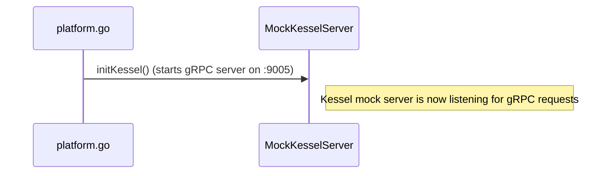
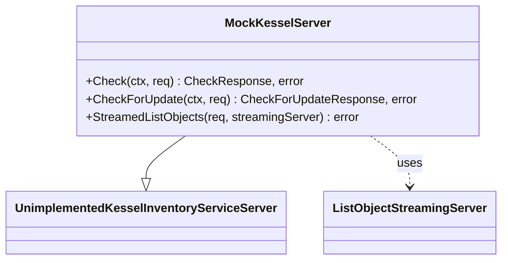

# Pull Request #1706: feat: add simple Kessel mock

**Author**: @Dugowitch
**Created**: July 01, 2025 at 09:26 AM UTC
**Status**: Merged
**Labels**: None
**Base**: `master` ← **Head**: `kessel-mock`

## Description

RHINENG-19009

## Secure Coding Practices Checklist GitHub Link
- https://github.com/RedHatInsights/secure-coding-checklist

## Secure Coding Checklist
- [x] Input Validation
- [x] Output Encoding
- [x] Authentication and Password Management
- [x] Session Management
- [x] Access Control
- [x] Cryptographic Practices
- [x] Error Handling and Logging
- [x] Data Protection
- [x] Communication Security
- [x] System Configuration
- [x] Database Security
- [x] File Management
- [x] Memory Management
- [x] General Coding Practices

## Summary by Sourcery

Introduce a simple mock for the Kessel inventory gRPC service to support local testing alongside the existing platform mock.

New Features:
- Implement MockKesselServer to serve a static StreamedListObjectsResponse over gRPC.
- Integrate the Kessel mock startup into RunPlatformMock via platformGrpcMock.
- Expose port 9005 in Docker Compose configurations to route traffic to the new gRPC mock service.

Enhancements:
- Bump Go version to 1.23.9 and toolchain to go1.23.10.
- Add project-kessel/inventory-api and grpc modules along with related dependencies.

Build:
- Update direct and indirect dependencies in go.mod to include grpc, kratos, genproto, and other required modules.

---

## Discussion

### Comment by @jira-linking on July 01, 2025 at 09:26 AM UTC

Referenced Jiras:
https://issues.redhat.com/browse/RHINENG-19009


### Comment by @sourcery-ai on July 01, 2025 at 09:26 AM UTC

<!-- Generated by sourcery-ai[bot]: start review_guide -->

## Reviewer's Guide

This PR introduces a simple standalone gRPC mock for KesselInventoryService (with a default StreamedListObjects response), integrates it into the platform mock startup, exposes its port in Docker Compose, and updates the Go toolchain and dependencies to support the new mock.

#### Sequence diagram for platform mock startup with Kessel mock integration



#### Class diagram for the new MockKesselServer and related types



### File-Level Changes

| Change | Details | Files |
| ------ | ------- | ----- |
| Upgrade Go toolchain and add gRPC dependencies | <ul><li>Bump Go version from 1.23.0 to 1.23.9</li><li>Update toolchain to go1.23.10</li><li>Add project-kessel/inventory-api and grpc dependencies</li></ul> | `go.mod`<br/>`go.sum` |
| Implement MockKesselServer gRPC service | <ul><li>Add MockKesselServer with stubbed Check and CheckForUpdate methods</li><li>Implement StreamedListObjects to send a default response</li><li>Define initKessel to listen on port 9005</li></ul> | `platform/kessel.go` |
| Integrate Kessel mock into platform mock startup | <ul><li>Introduce platformGrpcMock to invoke initKessel</li><li>Launch platformGrpcMock in RunPlatformMock goroutine</li></ul> | `platform/platform.go` |
| Expose Kessel mock port in Docker Compose | <ul><li>Add port mapping 9005:9005 to prod, test, and default configurations</li></ul> | `docker-compose.yml`<br/>`docker-compose.prod.yml`<br/>`docker-compose.test.yml` |

---

<details>
<summary>Tips and commands</summary>

#### Interacting with Sourcery

- **Trigger a new review:** Comment `@sourcery-ai review` on the pull request.
- **Continue discussions:** Reply directly to Sourcery's review comments.
- **Generate a GitHub issue from a review comment:** Ask Sourcery to create an
  issue from a review comment by replying to it. You can also reply to a
  review comment with `@sourcery-ai issue` to create an issue from it.
- **Generate a pull request title:** Write `@sourcery-ai` anywhere in the pull
  request title to generate a title at any time. You can also comment
  `@sourcery-ai title` on the pull request to (re-)generate the title at any time.
- **Generate a pull request summary:** Write `@sourcery-ai summary` anywhere in
  the pull request body to generate a PR summary at any time exactly where you
  want it. You can also comment `@sourcery-ai summary` on the pull request to
  (re-)generate the summary at any time.
- **Generate reviewer's guide:** Comment `@sourcery-ai guide` on the pull
  request to (re-)generate the reviewer's guide at any time.
- **Resolve all Sourcery comments:** Comment `@sourcery-ai resolve` on the
  pull request to resolve all Sourcery comments. Useful if you've already
  addressed all the comments and don't want to see them anymore.
- **Dismiss all Sourcery reviews:** Comment `@sourcery-ai dismiss` on the pull
  request to dismiss all existing Sourcery reviews. Especially useful if you
  want to start fresh with a new review - don't forget to comment
  `@sourcery-ai review` to trigger a new review!

#### Customizing Your Experience

Access your [dashboard](https://app.sourcery.ai) to:
- Enable or disable review features such as the Sourcery-generated pull request
  summary, the reviewer's guide, and others.
- Change the review language.
- Add, remove or edit custom review instructions.
- Adjust other review settings.

#### Getting Help

- [Contact our support team](mailto:support@sourcery.ai) for questions or feedback.
- Visit our [documentation](https://docs.sourcery.ai) for detailed guides and information.
- Keep in touch with the Sourcery team by following us on [X/Twitter](https://x.com/SourceryAI), [LinkedIn](https://www.linkedin.com/company/sourcery-ai/) or [GitHub](https://github.com/sourcery-ai).

</details>

<!-- Generated by sourcery-ai[bot]: end review_guide -->

### Comment by @codecov-commenter on July 01, 2025 at 03:11 PM UTC

## [Codecov](https://app.codecov.io/gh/RedHatInsights/patchman-engine/pull/1706?dropdown=coverage&src=pr&el=h1&utm_medium=referral&utm_source=github&utm_content=comment&utm_campaign=pr+comments&utm_term=RedHatInsights) Report
:x: Patch coverage is `0%` with `31 lines` in your changes missing coverage. Please review.
:white_check_mark: Project coverage is 57.04%. Comparing base ([`9a070e5`](https://app.codecov.io/gh/RedHatInsights/patchman-engine/commit/9a070e5430b47ea48aa7314d75f22d7d850571b8?dropdown=coverage&el=desc&utm_medium=referral&utm_source=github&utm_content=comment&utm_campaign=pr+comments&utm_term=RedHatInsights)) to head ([`4627b38`](https://app.codecov.io/gh/RedHatInsights/patchman-engine/commit/4627b388c88c84323dacd765fd2f7dff96a716d9?dropdown=coverage&el=desc&utm_medium=referral&utm_source=github&utm_content=comment&utm_campaign=pr+comments&utm_term=RedHatInsights)).
:warning: Report is 772 commits behind head on master.

| [Files with missing lines](https://app.codecov.io/gh/RedHatInsights/patchman-engine/pull/1706?dropdown=coverage&src=pr&el=tree&utm_medium=referral&utm_source=github&utm_content=comment&utm_campaign=pr+comments&utm_term=RedHatInsights) | Patch % | Lines |
|---|---|---|
| [platform/kessel.go](https://app.codecov.io/gh/RedHatInsights/patchman-engine/pull/1706?src=pr&el=tree&filepath=platform%2Fkessel.go&utm_medium=referral&utm_source=github&utm_content=comment&utm_campaign=pr+comments&utm_term=RedHatInsights#diff-cGxhdGZvcm0va2Vzc2VsLmdv) | 0.00% | [28 Missing :warning: ](https://app.codecov.io/gh/RedHatInsights/patchman-engine/pull/1706?src=pr&el=tree&utm_medium=referral&utm_source=github&utm_content=comment&utm_campaign=pr+comments&utm_term=RedHatInsights) |
| [platform/platform.go](https://app.codecov.io/gh/RedHatInsights/patchman-engine/pull/1706?src=pr&el=tree&filepath=platform%2Fplatform.go&utm_medium=referral&utm_source=github&utm_content=comment&utm_campaign=pr+comments&utm_term=RedHatInsights#diff-cGxhdGZvcm0vcGxhdGZvcm0uZ28=) | 0.00% | [3 Missing :warning: ](https://app.codecov.io/gh/RedHatInsights/patchman-engine/pull/1706?src=pr&el=tree&utm_medium=referral&utm_source=github&utm_content=comment&utm_campaign=pr+comments&utm_term=RedHatInsights) |

<details><summary>Additional details and impacted files</summary>


```diff
@@            Coverage Diff             @@
##           master    #1706      +/-   ##
==========================================
- Coverage   57.25%   57.04%   -0.22%     
==========================================
  Files         138      139       +1     
  Lines       10776    10807      +31     
==========================================
- Hits         6170     6165       -5     
- Misses       4046     4082      +36     
  Partials      560      560              
```

| [Flag](https://app.codecov.io/gh/RedHatInsights/patchman-engine/pull/1706/flags?src=pr&el=flags&utm_medium=referral&utm_source=github&utm_content=comment&utm_campaign=pr+comments&utm_term=RedHatInsights) | Coverage Δ | |
|---|---|---|
| [unittests](https://app.codecov.io/gh/RedHatInsights/patchman-engine/pull/1706/flags?src=pr&el=flag&utm_medium=referral&utm_source=github&utm_content=comment&utm_campaign=pr+comments&utm_term=RedHatInsights) | `57.04% <0.00%> (-0.22%)` | :arrow_down: |

Flags with carried forward coverage won't be shown. [Click here](https://docs.codecov.io/docs/carryforward-flags?utm_medium=referral&utm_source=github&utm_content=comment&utm_campaign=pr+comments&utm_term=RedHatInsights#carryforward-flags-in-the-pull-request-comment) to find out more.
</details>

[:umbrella: View full report in Codecov by Sentry](https://app.codecov.io/gh/RedHatInsights/patchman-engine/pull/1706?dropdown=coverage&src=pr&el=continue&utm_medium=referral&utm_source=github&utm_content=comment&utm_campaign=pr+comments&utm_term=RedHatInsights).   
:loudspeaker: Have feedback on the report? [Share it here](https://about.codecov.io/codecov-pr-comment-feedback/?utm_medium=referral&utm_source=github&utm_content=comment&utm_campaign=pr+comments&utm_term=RedHatInsights).
<details><summary> :rocket: New features to boost your workflow: </summary>

- :snowflake: [Test Analytics](https://docs.codecov.com/docs/test-analytics): Detect flaky tests, report on failures, and find test suite problems.
</details>

---

## Reviews

### Review by @sourcery-ai - Changes Requested on July 01, 2025 at 03:12 PM UTC

Hey @Dugowitch - I've reviewed your changes - here's some feedback:

**Blocking issues**:
- Found an insecure gRPC server without 'grpc.Creds()' or options with credentials. This allows for a connection without encryption to this server. A malicious attacker could tamper with the gRPC message, which could compromise the machine. Include credentials derived from an SSL certificate in order to create a secure gRPC connection. You can create credentials using 'credentials.NewServerTLSFromFile("cert.pem", "cert.key")'. ([link](https://github.com/RedHatInsights/patchman-engine/pull/1706/files#diff-4d80cce459d898ea27ea32c23c4bbf8a646ca09e5ab6d11bfaf5de256be09b48R54))

**General comments**:

- Bind the mock gRPC server to localhost (127.0.0.1) instead of all interfaces to prevent unintended external exposure.
- Extend the StreamedListObjects mock to support multiple entries or pagination tokens if tests require more realistic streaming behavior.
- Simplify or remove the custom ListObjectStreamingServer alias by using the generated service interface directly to reduce indirection.

<details>
<summary>Prompt for AI Agents</summary>

~~~markdown
Please address the comments from this code review:
## Overall Comments
- Bind the mock gRPC server to localhost (127.0.0.1) instead of all interfaces to prevent unintended external exposure.
- Extend the StreamedListObjects mock to support multiple entries or pagination tokens if tests require more realistic streaming behavior.
- Simplify or remove the custom ListObjectStreamingServer alias by using the generated service interface directly to reduce indirection.

## Security Issues

### Issue 1
<location> `platform/kessel.go:54` </location>

<issue_to_address>
**security (opengrep-rules.go.grpc.security.grpc-server-insecure-connection):** Found an insecure gRPC server without 'grpc.Creds()' or options with credentials. This allows for a connection without encryption to this server. A malicious attacker could tamper with the gRPC message, which could compromise the machine. Include credentials derived from an SSL certificate in order to create a secure gRPC connection. You can create credentials using 'credentials.NewServerTLSFromFile("cert.pem", "cert.key")'.

*Source: opengrep*
</issue_to_address>
~~~

</details>

***

<details>
<summary>Sourcery is free for open source - if you like our reviews please consider sharing them ✨</summary>

- [X](https://twitter.com/intent/tweet?text=I%20just%20got%20an%20instant%20code%20review%20from%20%40SourceryAI%2C%20and%20it%20was%20brilliant%21%20It%27s%20free%20for%20open%20source%20and%20has%20a%20free%20trial%20for%20private%20code.%20Check%20it%20out%20https%3A//sourcery.ai)
- [Mastodon](https://mastodon.social/share?text=I%20just%20got%20an%20instant%20code%20review%20from%20%40SourceryAI%2C%20and%20it%20was%20brilliant%21%20It%27s%20free%20for%20open%20source%20and%20has%20a%20free%20trial%20for%20private%20code.%20Check%20it%20out%20https%3A//sourcery.ai)
- [LinkedIn](https://www.linkedin.com/sharing/share-offsite/?url=https://sourcery.ai)
- [Facebook](https://www.facebook.com/sharer/sharer.php?u=https://sourcery.ai)

</details>

<sub>
Help me be more useful! Please click 👍 or 👎 on each comment and I'll use the feedback to improve your reviews.
</sub>

### Review by @MichaelMraka - Approved on July 02, 2025 at 07:58 AM UTC

### Review by @MichaelMraka - Commented on July 02, 2025 at 08:00 AM UTC

---

*Archived from: https://github.com/RedHatInsights/patchman-engine/pull/1706*
