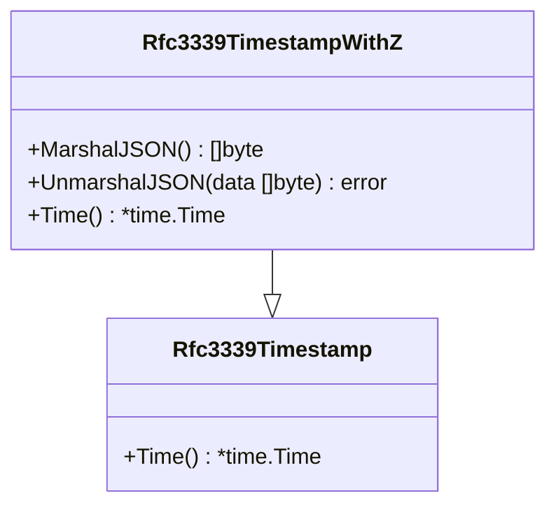
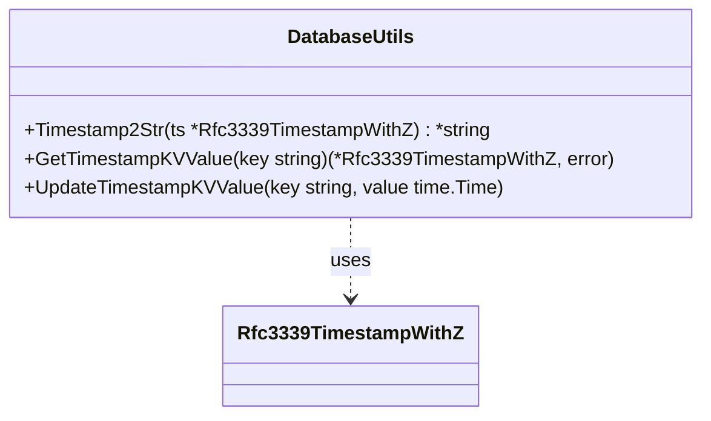

# Pull Request #1707: fix: format timestamps with nanoseconds

**Author**: @psegedy
**Created**: July 01, 2025 at 12:20 PM UTC
**Status**: Merged
**Labels**: None
**Base**: `master` ← **Head**: `sync_timestamp_nano`

## Description

vmaas sync was syncing data when there was nothing to sync, timestamp from vmaas had timestamp with nanoseconds but timestamp from db was trimmed

## Secure Coding Practices Checklist GitHub Link
- https://github.com/RedHatInsights/secure-coding-checklist

## Secure Coding Checklist
- [x] Input Validation
- [x] Output Encoding
- [x] Authentication and Password Management
- [x] Session Management
- [x] Access Control
- [x] Cryptographic Practices
- [x] Error Handling and Logging
- [x] Data Protection
- [x] Communication Security
- [x] System Configuration
- [x] Database Security
- [x] File Management
- [x] Memory Management
- [x] General Coding Practices

## Summary by Sourcery

Use nanosecond-precision formatting for all timestamps to maintain consistency and avoid false sync triggers.

Bug Fixes:
- Prevent unnecessary syncing by preserving nanosecond precision in timestamp comparisons

Enhancements:
- Switch timestamp formatting to RFC3339Nano in database utilities and JSON marshaling

---

## Discussion

### Comment by @jira-linking on July 01, 2025 at 12:21 PM UTC

Commits missing Jira IDs:
1837f9f06f74a9f51eba0d21e8ccb63c96489ec8
7ee53107dbfac7994687a8ee377d671b7ae80c5d


### Comment by @sourcery-ai on July 01, 2025 at 12:21 PM UTC

<!-- Generated by sourcery-ai[bot]: start review_guide -->

## Reviewer's Guide

Timestamps are now formatted with nanosecond precision using time.RFC3339Nano instead of trimming to seconds, ensuring consistent comparisons and preventing unnecessary syncs when nanoseconds are present.

#### Class diagram for updated timestamp formatting



#### Class diagram for database timestamp utility changes



### File-Level Changes

| Change | Details | Files |
| ------ | ------- | ----- |
| Enable nanosecond precision in database timestamp utilities | <ul><li>Updated Timestamp2Str to use time.RFC3339Nano</li><li>Updated UpdateTimestampKVValue to format values with time.RFC3339Nano</li></ul> | `base/database/utils.go` |
| Include nanoseconds in JSON marshaling of custom timestamp type | <ul><li>Changed Rfc3339TimestampWithZ.MarshalJSON to use time.RFC3339Nano</li></ul> | `base/types/timestamp.go` |

---

<details>
<summary>Tips and commands</summary>

#### Interacting with Sourcery

- **Trigger a new review:** Comment `@sourcery-ai review` on the pull request.
- **Continue discussions:** Reply directly to Sourcery's review comments.
- **Generate a GitHub issue from a review comment:** Ask Sourcery to create an
  issue from a review comment by replying to it. You can also reply to a
  review comment with `@sourcery-ai issue` to create an issue from it.
- **Generate a pull request title:** Write `@sourcery-ai` anywhere in the pull
  request title to generate a title at any time. You can also comment
  `@sourcery-ai title` on the pull request to (re-)generate the title at any time.
- **Generate a pull request summary:** Write `@sourcery-ai summary` anywhere in
  the pull request body to generate a PR summary at any time exactly where you
  want it. You can also comment `@sourcery-ai summary` on the pull request to
  (re-)generate the summary at any time.
- **Generate reviewer's guide:** Comment `@sourcery-ai guide` on the pull
  request to (re-)generate the reviewer's guide at any time.
- **Resolve all Sourcery comments:** Comment `@sourcery-ai resolve` on the
  pull request to resolve all Sourcery comments. Useful if you've already
  addressed all the comments and don't want to see them anymore.
- **Dismiss all Sourcery reviews:** Comment `@sourcery-ai dismiss` on the pull
  request to dismiss all existing Sourcery reviews. Especially useful if you
  want to start fresh with a new review - don't forget to comment
  `@sourcery-ai review` to trigger a new review!

#### Customizing Your Experience

Access your [dashboard](https://app.sourcery.ai) to:
- Enable or disable review features such as the Sourcery-generated pull request
  summary, the reviewer's guide, and others.
- Change the review language.
- Add, remove or edit custom review instructions.
- Adjust other review settings.

#### Getting Help

- [Contact our support team](mailto:support@sourcery.ai) for questions or feedback.
- Visit our [documentation](https://docs.sourcery.ai) for detailed guides and information.
- Keep in touch with the Sourcery team by following us on [X/Twitter](https://x.com/SourceryAI), [LinkedIn](https://www.linkedin.com/company/sourcery-ai/) or [GitHub](https://github.com/sourcery-ai).

</details>

<!-- Generated by sourcery-ai[bot]: end review_guide -->

### Comment by @codecov-commenter on July 01, 2025 at 04:46 PM UTC

## [Codecov](https://app.codecov.io/gh/RedHatInsights/patchman-engine/pull/1707?dropdown=coverage&src=pr&el=h1&utm_medium=referral&utm_source=github&utm_content=comment&utm_campaign=pr+comments&utm_term=RedHatInsights) Report
:x: Patch coverage is `33.33333%` with `2 lines` in your changes missing coverage. Please review.
:white_check_mark: Project coverage is 57.21%. Comparing base ([`9a070e5`](https://app.codecov.io/gh/RedHatInsights/patchman-engine/commit/9a070e5430b47ea48aa7314d75f22d7d850571b8?dropdown=coverage&el=desc&utm_medium=referral&utm_source=github&utm_content=comment&utm_campaign=pr+comments&utm_term=RedHatInsights)) to head ([`7ee5310`](https://app.codecov.io/gh/RedHatInsights/patchman-engine/commit/7ee53107dbfac7994687a8ee377d671b7ae80c5d?dropdown=coverage&el=desc&utm_medium=referral&utm_source=github&utm_content=comment&utm_campaign=pr+comments&utm_term=RedHatInsights)).
:warning: Report is 327 commits behind head on master.

| [Files with missing lines](https://app.codecov.io/gh/RedHatInsights/patchman-engine/pull/1707?dropdown=coverage&src=pr&el=tree&utm_medium=referral&utm_source=github&utm_content=comment&utm_campaign=pr+comments&utm_term=RedHatInsights) | Patch % | Lines |
|---|---|---|
| [base/database/utils.go](https://app.codecov.io/gh/RedHatInsights/patchman-engine/pull/1707?src=pr&el=tree&filepath=base%2Fdatabase%2Futils.go&utm_medium=referral&utm_source=github&utm_content=comment&utm_campaign=pr+comments&utm_term=RedHatInsights#diff-YmFzZS9kYXRhYmFzZS91dGlscy5nbw==) | 0.00% | [2 Missing :warning: ](https://app.codecov.io/gh/RedHatInsights/patchman-engine/pull/1707?src=pr&el=tree&utm_medium=referral&utm_source=github&utm_content=comment&utm_campaign=pr+comments&utm_term=RedHatInsights) |

<details><summary>Additional details and impacted files</summary>


```diff
@@            Coverage Diff             @@
##           master    #1707      +/-   ##
==========================================
- Coverage   57.25%   57.21%   -0.04%     
==========================================
  Files         138      138              
  Lines       10776    10776              
==========================================
- Hits         6170     6166       -4     
- Misses       4046     4050       +4     
  Partials      560      560              
```

| [Flag](https://app.codecov.io/gh/RedHatInsights/patchman-engine/pull/1707/flags?src=pr&el=flags&utm_medium=referral&utm_source=github&utm_content=comment&utm_campaign=pr+comments&utm_term=RedHatInsights) | Coverage Δ | |
|---|---|---|
| [unittests](https://app.codecov.io/gh/RedHatInsights/patchman-engine/pull/1707/flags?src=pr&el=flag&utm_medium=referral&utm_source=github&utm_content=comment&utm_campaign=pr+comments&utm_term=RedHatInsights) | `57.21% <33.33%> (-0.04%)` | :arrow_down: |

Flags with carried forward coverage won't be shown. [Click here](https://docs.codecov.io/docs/carryforward-flags?utm_medium=referral&utm_source=github&utm_content=comment&utm_campaign=pr+comments&utm_term=RedHatInsights#carryforward-flags-in-the-pull-request-comment) to find out more.
</details>

[:umbrella: View full report in Codecov by Sentry](https://app.codecov.io/gh/RedHatInsights/patchman-engine/pull/1707?dropdown=coverage&src=pr&el=continue&utm_medium=referral&utm_source=github&utm_content=comment&utm_campaign=pr+comments&utm_term=RedHatInsights).   
:loudspeaker: Have feedback on the report? [Share it here](https://about.codecov.io/codecov-pr-comment-feedback/?utm_medium=referral&utm_source=github&utm_content=comment&utm_campaign=pr+comments&utm_term=RedHatInsights).
<details><summary> :rocket: New features to boost your workflow: </summary>

- :snowflake: [Test Analytics](https://docs.codecov.com/docs/test-analytics): Detect flaky tests, report on failures, and find test suite problems.
</details>

### Comment by @MichaelMraka on July 02, 2025 at 07:55 AM UTC

/retest

---

## Reviews

### Review by @sourcery-ai - Commented on July 01, 2025 at 12:21 PM UTC

Hey @psegedy - I've reviewed your changes and they look great!

***

<details>
<summary>Sourcery is free for open source - if you like our reviews please consider sharing them ✨</summary>

- [X](https://twitter.com/intent/tweet?text=I%20just%20got%20an%20instant%20code%20review%20from%20%40SourceryAI%2C%20and%20it%20was%20brilliant%21%20It%27s%20free%20for%20open%20source%20and%20has%20a%20free%20trial%20for%20private%20code.%20Check%20it%20out%20https%3A//sourcery.ai)
- [Mastodon](https://mastodon.social/share?text=I%20just%20got%20an%20instant%20code%20review%20from%20%40SourceryAI%2C%20and%20it%20was%20brilliant%21%20It%27s%20free%20for%20open%20source%20and%20has%20a%20free%20trial%20for%20private%20code.%20Check%20it%20out%20https%3A//sourcery.ai)
- [LinkedIn](https://www.linkedin.com/sharing/share-offsite/?url=https://sourcery.ai)
- [Facebook](https://www.facebook.com/sharer/sharer.php?u=https://sourcery.ai)

</details>

<sub>
Help me be more useful! Please click 👍 or 👎 on each comment and I'll use the feedback to improve your reviews.
</sub>

### Review by @MichaelMraka - Approved on July 02, 2025 at 12:07 PM UTC

---

*Archived from: https://github.com/RedHatInsights/patchman-engine/pull/1707*
