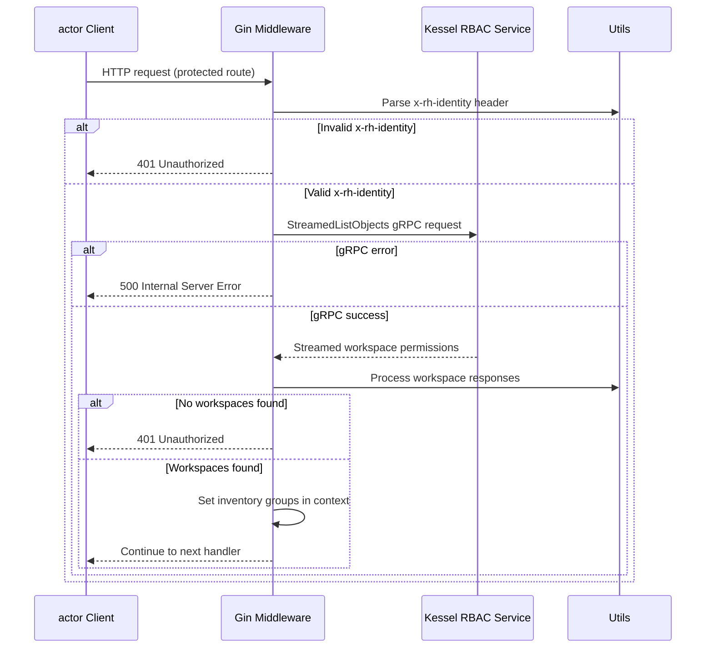
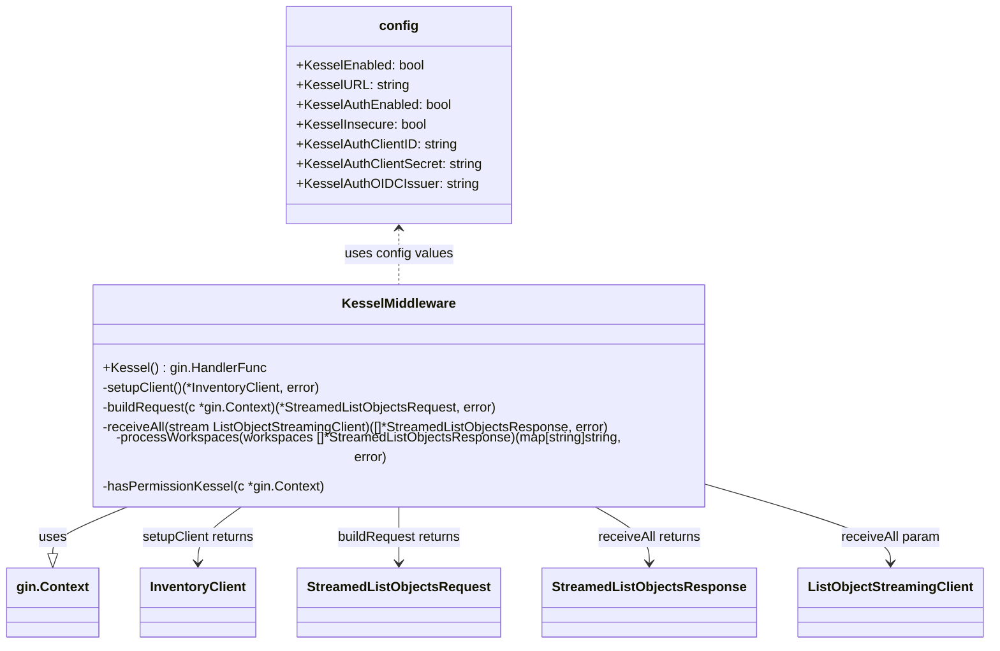

# Pull Request #1708: feat: add basic Kessel middleware

**Author**: @Dugowitch
**Created**: July 04, 2025 at 11:40 AM UTC
**Status**: Merged
**Labels**: None
**Base**: `master` ← **Head**: `kessel-basic`

## Description

RHINENG-19105

## Secure Coding Practices Checklist GitHub Link
- https://github.com/RedHatInsights/secure-coding-checklist

## Secure Coding Checklist
- [x] Input Validation
- [x] Output Encoding
- [x] Authentication and Password Management
- [x] Session Management
- [x] Access Control
- [x] Cryptographic Practices
- [x] Error Handling and Logging
- [x] Data Protection
- [x] Communication Security
- [x] System Configuration
- [x] Database Security
- [x] File Management
- [x] Memory Management
- [x] General Coding Practices

## Summary by Sourcery

Introduce basic Kessel middleware for conditional RBAC enforcement by integrating with the Kessel inventory service via gRPC, add corresponding configuration options, hook the middleware into API routes, and include unit tests for the new functionality

New Features:
- Add Kessel middleware for RBAC that communicates with the Kessel inventory service over gRPC
- Expose Kessel integration via new configuration flags (enabled, URL, TLS and auth settings)
- Conditionally inject Kessel middleware into API routes when the feature flag is enabled

Enhancements:
- Rename API initializer parameter from config to cfg for consistency

Build:
- Add project-kessel inventory-client-go and related dependencies to go.mod

Tests:
- Introduce unit tests for Kessel middleware components (request building, stream reception, workspace processing, permission handler)

---

## Discussion

### Comment by @jira-linking on July 04, 2025 at 11:40 AM UTC

Referenced Jiras:
https://issues.redhat.com/browse/RHINENG-19105


### Comment by @sourcery-ai on July 04, 2025 at 11:40 AM UTC

<!-- Generated by sourcery-ai[bot]: start review_guide -->

## Reviewer's Guide

This PR adds a new Gin middleware that integrates with the Kessel RBAC service: it conditionally attaches to protected routes based on configuration, streams workspace permissions over gRPC, processes them into inventory groups, and stores them in the request context. It also introduces feature flags, updates routes and module dependencies, and provides unit tests for the Kessel middleware.

#### Sequence diagram for Kessel middleware permission check



#### Class diagram for new Kessel middleware and related config



### File-Level Changes

| Change | Details | Files |
| ------ | ------- | ----- |
| Introduce Kessel-based RBAC middleware | <ul><li>Implement setupClient, buildRequest, receiveAll, processWorkspaces and hasPermissionKessel in kessel.go</li><li>Create Kessel() handler and stream permissions from Kessel service over gRPC</li><li>Add kessel_test.go with unit tests for each middleware helper function</li></ul> | `manager/middlewares/kessel.go`<br/>`manager/middlewares/kessel_test.go` |
| Register conditional Kessel middleware in routes | <ul><li>Rename config param to cfg for consistency</li><li>Wrap userAuth group with Kessel middleware when KesselEnabled is true</li></ul> | `manager/routes/routes.go` |
| Add Kessel integration configuration flags | <ul><li>Define KesselEnabled, KesselURL, KesselAuthEnabled, KesselInsecure</li><li>Add OIDC client settings: KesselAuthClientID, KesselAuthClientSecret, KesselAuthOIDCIssuer</li></ul> | `manager/config/config.go` |
| Update module dependencies for Kessel client and related packages | <ul><li>Add inventory-client-go and update inventory-api versions</li><li>Include grpcutil, jwt, grpc-middleware, go-cache and certifi libraries</li></ul> | `go.mod` |

---

<details>
<summary>Tips and commands</summary>

#### Interacting with Sourcery

- **Trigger a new review:** Comment `@sourcery-ai review` on the pull request.
- **Continue discussions:** Reply directly to Sourcery's review comments.
- **Generate a GitHub issue from a review comment:** Ask Sourcery to create an
  issue from a review comment by replying to it. You can also reply to a
  review comment with `@sourcery-ai issue` to create an issue from it.
- **Generate a pull request title:** Write `@sourcery-ai` anywhere in the pull
  request title to generate a title at any time. You can also comment
  `@sourcery-ai title` on the pull request to (re-)generate the title at any time.
- **Generate a pull request summary:** Write `@sourcery-ai summary` anywhere in
  the pull request body to generate a PR summary at any time exactly where you
  want it. You can also comment `@sourcery-ai summary` on the pull request to
  (re-)generate the summary at any time.
- **Generate reviewer's guide:** Comment `@sourcery-ai guide` on the pull
  request to (re-)generate the reviewer's guide at any time.
- **Resolve all Sourcery comments:** Comment `@sourcery-ai resolve` on the
  pull request to resolve all Sourcery comments. Useful if you've already
  addressed all the comments and don't want to see them anymore.
- **Dismiss all Sourcery reviews:** Comment `@sourcery-ai dismiss` on the pull
  request to dismiss all existing Sourcery reviews. Especially useful if you
  want to start fresh with a new review - don't forget to comment
  `@sourcery-ai review` to trigger a new review!

#### Customizing Your Experience

Access your [dashboard](https://app.sourcery.ai) to:
- Enable or disable review features such as the Sourcery-generated pull request
  summary, the reviewer's guide, and others.
- Change the review language.
- Add, remove or edit custom review instructions.
- Adjust other review settings.

#### Getting Help

- [Contact our support team](mailto:support@sourcery.ai) for questions or feedback.
- Visit our [documentation](https://docs.sourcery.ai) for detailed guides and information.
- Keep in touch with the Sourcery team by following us on [X/Twitter](https://x.com/SourceryAI), [LinkedIn](https://www.linkedin.com/company/sourcery-ai/) or [GitHub](https://github.com/sourcery-ai).

</details>

<!-- Generated by sourcery-ai[bot]: end review_guide -->

### Comment by @codecov-commenter on July 04, 2025 at 11:46 AM UTC

## [Codecov](https://app.codecov.io/gh/RedHatInsights/patchman-engine/pull/1708?dropdown=coverage&src=pr&el=h1&utm_medium=referral&utm_source=github&utm_content=comment&utm_campaign=pr+comments&utm_term=RedHatInsights) Report
:x: Patch coverage is `59.09091%` with `45 lines` in your changes missing coverage. Please review.
:white_check_mark: Project coverage is 54.81%. Comparing base ([`6f09d1e`](https://app.codecov.io/gh/RedHatInsights/patchman-engine/commit/6f09d1ea5559e194caa5bbf1b32f55eff4ae7318?dropdown=coverage&el=desc&utm_medium=referral&utm_source=github&utm_content=comment&utm_campaign=pr+comments&utm_term=RedHatInsights)) to head ([`31503b0`](https://app.codecov.io/gh/RedHatInsights/patchman-engine/commit/31503b0a9263e87ae17605219b931f22109697d6?dropdown=coverage&el=desc&utm_medium=referral&utm_source=github&utm_content=comment&utm_campaign=pr+comments&utm_term=RedHatInsights)).
:warning: Report is 735 commits behind head on master.

| [Files with missing lines](https://app.codecov.io/gh/RedHatInsights/patchman-engine/pull/1708?dropdown=coverage&src=pr&el=tree&utm_medium=referral&utm_source=github&utm_content=comment&utm_campaign=pr+comments&utm_term=RedHatInsights) | Patch % | Lines |
|---|---|---|
| [manager/middlewares/kessel.go](https://app.codecov.io/gh/RedHatInsights/patchman-engine/pull/1708?src=pr&el=tree&filepath=manager%2Fmiddlewares%2Fkessel.go&utm_medium=referral&utm_source=github&utm_content=comment&utm_campaign=pr+comments&utm_term=RedHatInsights#diff-bWFuYWdlci9taWRkbGV3YXJlcy9rZXNzZWwuZ28=) | 57.14% | [34 Missing and 8 partials :warning: ](https://app.codecov.io/gh/RedHatInsights/patchman-engine/pull/1708?src=pr&el=tree&utm_medium=referral&utm_source=github&utm_content=comment&utm_campaign=pr+comments&utm_term=RedHatInsights) |
| [manager/routes/routes.go](https://app.codecov.io/gh/RedHatInsights/patchman-engine/pull/1708?src=pr&el=tree&filepath=manager%2Froutes%2Froutes.go&utm_medium=referral&utm_source=github&utm_content=comment&utm_campaign=pr+comments&utm_term=RedHatInsights#diff-bWFuYWdlci9yb3V0ZXMvcm91dGVzLmdv) | 0.00% | [3 Missing :warning: ](https://app.codecov.io/gh/RedHatInsights/patchman-engine/pull/1708?src=pr&el=tree&utm_medium=referral&utm_source=github&utm_content=comment&utm_campaign=pr+comments&utm_term=RedHatInsights) |

<details><summary>Additional details and impacted files</summary>


```diff
@@            Coverage Diff             @@
##           master    #1708      +/-   ##
==========================================
+ Coverage   54.77%   54.81%   +0.04%     
==========================================
  Files         139      140       +1     
  Lines       10752    10862     +110     
==========================================
+ Hits         5889     5954      +65     
- Misses       4333     4370      +37     
- Partials      530      538       +8     
```

| [Flag](https://app.codecov.io/gh/RedHatInsights/patchman-engine/pull/1708/flags?src=pr&el=flags&utm_medium=referral&utm_source=github&utm_content=comment&utm_campaign=pr+comments&utm_term=RedHatInsights) | Coverage Δ | |
|---|---|---|
| [unittests](https://app.codecov.io/gh/RedHatInsights/patchman-engine/pull/1708/flags?src=pr&el=flag&utm_medium=referral&utm_source=github&utm_content=comment&utm_campaign=pr+comments&utm_term=RedHatInsights) | `54.81% <59.09%> (+0.04%)` | :arrow_up: |

Flags with carried forward coverage won't be shown. [Click here](https://docs.codecov.io/docs/carryforward-flags?utm_medium=referral&utm_source=github&utm_content=comment&utm_campaign=pr+comments&utm_term=RedHatInsights#carryforward-flags-in-the-pull-request-comment) to find out more.
</details>

[:umbrella: View full report in Codecov by Sentry](https://app.codecov.io/gh/RedHatInsights/patchman-engine/pull/1708?dropdown=coverage&src=pr&el=continue&utm_medium=referral&utm_source=github&utm_content=comment&utm_campaign=pr+comments&utm_term=RedHatInsights).   
:loudspeaker: Have feedback on the report? [Share it here](https://about.codecov.io/codecov-pr-comment-feedback/?utm_medium=referral&utm_source=github&utm_content=comment&utm_campaign=pr+comments&utm_term=RedHatInsights).
<details><summary> :rocket: New features to boost your workflow: </summary>

- :snowflake: [Test Analytics](https://docs.codecov.com/docs/test-analytics): Detect flaky tests, report on failures, and find test suite problems.
</details>

### Comment by @Dugowitch on July 11, 2025 at 02:47 PM UTC

/retest

---

## Reviews

### Review by @MichaelMraka - Changes Requested on July 04, 2025 at 12:32 PM UTC

### Review by @MichaelMraka - Commented on July 04, 2025 at 01:09 PM UTC

Also please add test for new functions.

### Review by @MichaelMraka - Commented on July 11, 2025 at 08:35 AM UTC

please tak a look at test failure
`test      | ./scripts/go_test_on_ci.sh: line 15:   258 Killed                  golangci-lint run --timeout 5m`

### Review by @sourcery-ai - Commented on July 14, 2025 at 02:39 PM UTC

Hey @Dugowitch - I've reviewed your changes and found some issues that need to be addressed.

- Add a call to c.Next() at the end of hasPermissionKessel so that downstream handlers are executed after a successful permission check.
- setupClient only configures gRPC URL and TLS insecure—leverage the new KesselAuthEnabled, client ID/secret, and OIDC flags to enable proper authentication instead of skipping it.
- Tests currently invoke the real KesselInventoryService—swap in a mocked or fake gRPC client to remove external dependencies and make the tests deterministic.

<details>
<summary>Prompt for AI Agents</summary>

~~~markdown
Please address the comments from this code review:
## Overall Comments
- Add a call to c.Next() at the end of hasPermissionKessel so that downstream handlers are executed after a successful permission check.
- setupClient only configures gRPC URL and TLS insecure—leverage the new KesselAuthEnabled, client ID/secret, and OIDC flags to enable proper authentication instead of skipping it.
- Tests currently invoke the real KesselInventoryService—swap in a mocked or fake gRPC client to remove external dependencies and make the tests deterministic.

## Individual Comments

### Comment 1
<location> `manager/middlewares/kessel_test.go:42` </location>
<code_context>
+	}
+}
+
+func TestReceiveAll(t *testing.T) {
+	options := []func(*kesselClientCommon.Config){
+		kesselClientCommon.WithgRPCUrl(config.KesselURL),
</code_context>

<issue_to_address>
TestReceiveAll appears to depend on a real gRPC service and may not be reliable in CI.

Consider mocking the gRPC stream or using a test double to avoid reliance on external services and improve test reliability.

Suggested implementation:

```golang
type mockStreamedListObjectsClient struct {
	responses []*kesselClientV2.WorkspaceResponse
	index     int
}

func (m *mockStreamedListObjectsClient) Recv() (*kesselClientV2.WorkspaceResponse, error) {
	if m.index >= len(m.responses) {
		return nil, io.EOF
	}
	resp := m.responses[m.index]
	m.index++
	return resp, nil
}

// Add any other methods required by the interface here, as no-ops or mocks.

func TestReceiveAll(t *testing.T) {
	mockResponses := []*kesselClientV2.WorkspaceResponse{
		{
			Object: &kesselClientV2.Workspace{
				ResourceId: "inventory-group-1",
			},
		},
		// Add more mock responses as needed
	}
	mockStream := &mockStreamedListObjectsClient{
		responses: mockResponses,
	}

	workspaces, err := receiveAll(mockStream)
	if assert.NoError(t, err) {
		assert.Equal(t, "inventory-group-1", workspaces[0].Object.ResourceId)

```

- You may need to adjust the mockStreamedListObjectsClient to fully implement the interface expected by receiveAll (e.g., KesselInventoryService_StreamedListObjectsClient).
- Import "io" at the top of the file if not already present.
- Replace kesselClientV2.WorkspaceResponse and kesselClientV2.Workspace with the correct types if they are named differently in your codebase.
- If receiveAll expects context or other methods, stub them as needed in the mock.
</issue_to_address>
~~~

</details>

***

<details>
<summary>Sourcery is free for open source - if you like our reviews please consider sharing them ✨</summary>

- [X](https://twitter.com/intent/tweet?text=I%20just%20got%20an%20instant%20code%20review%20from%20%40SourceryAI%2C%20and%20it%20was%20brilliant%21%20It%27s%20free%20for%20open%20source%20and%20has%20a%20free%20trial%20for%20private%20code.%20Check%20it%20out%20https%3A//sourcery.ai)
- [Mastodon](https://mastodon.social/share?text=I%20just%20got%20an%20instant%20code%20review%20from%20%40SourceryAI%2C%20and%20it%20was%20brilliant%21%20It%27s%20free%20for%20open%20source%20and%20has%20a%20free%20trial%20for%20private%20code.%20Check%20it%20out%20https%3A//sourcery.ai)
- [LinkedIn](https://www.linkedin.com/sharing/share-offsite/?url=https://sourcery.ai)
- [Facebook](https://www.facebook.com/sharer/sharer.php?u=https://sourcery.ai)

</details>

<sub>
Help me be more useful! Please click 👍 or 👎 on each comment and I'll use the feedback to improve your reviews.
</sub>

### Review by @MichaelMraka - Approved on July 22, 2025 at 02:25 PM UTC

---

*Archived from: https://github.com/RedHatInsights/patchman-engine/pull/1708*
