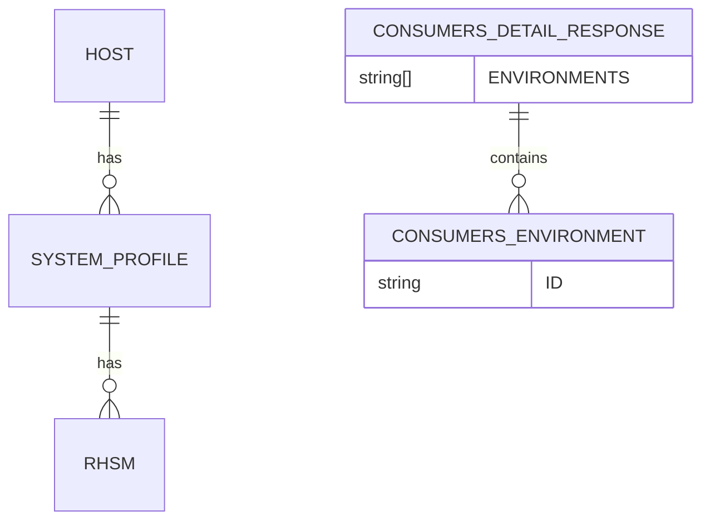
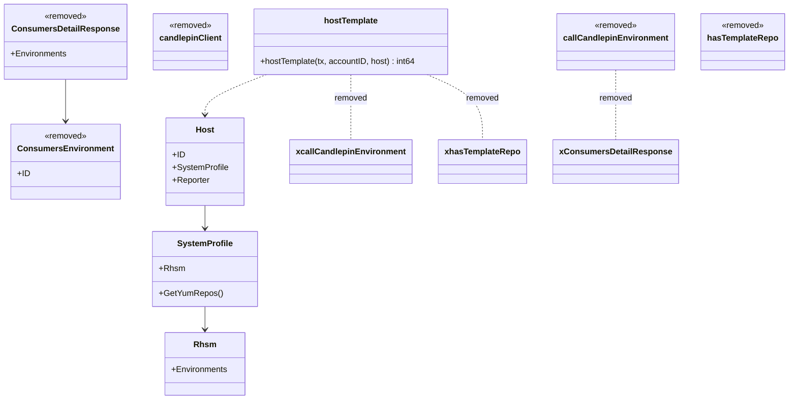

# Pull Request #1720: RHINENG-18242: remove workaround for 'Associated hosts are getting removed from the content templates'

**Author**: @MichaelMraka
**Created**: July 07, 2025 at 01:29 PM UTC
**Status**: Merged
**Labels**: None
**Base**: `master` ← **Head**: `pr1`

## Description

## Secure Coding Practices Checklist GitHub Link
- https://github.com/RedHatInsights/secure-coding-checklist

## Secure Coding Checklist
- [x] Input Validation
- [x] Output Encoding
- [x] Authentication and Password Management
- [x] Session Management
- [x] Access Control
- [x] Cryptographic Practices
- [x] Error Handling and Logging
- [x] Data Protection
- [x] Communication Security
- [x] System Configuration
- [x] Database Security
- [x] File Management
- [x] Memory Management
- [x] General Coding Practices

## Summary by Sourcery

Remove legacy workaround for puptoo reporter environment retrieval via Candlepin and streamline host template assignment, clean up related code and regex, update tests to use direct environments field, remove unused Candlepin config from deployment, downgrade Go version, and fix time comparison logic.

Bug Fixes:
- Use time.Time.Equal for empty PublicDate comparison in advisory cache lookup

Enhancements:
- Simplify host template assignment to include puptoo reporter under existing RHSM logic and remove Candlepin-based workaround
- Remove unused Candlepin API call functions, handlers, and TemplateRepoPattern regex
- Refactor regex variable declarations for consistency

Build:
- Downgrade Go module version from 1.23.9 to 1.23.6

Deployment:
- Remove CANDLEPIN_* environment variables from ClowdApp deployment configuration

Tests:
- Update host template tests to use direct Rhsm.Environments field instead of YumRepos workaround

---

## Discussion

### Comment by @jira-linking on July 07, 2025 at 01:29 PM UTC

Referenced Jiras:
https://issues.redhat.com/browse/RHINENG-18242


### Comment by @sourcery-ai on July 07, 2025 at 01:30 PM UTC

<!-- Generated by sourcery-ai[bot]: start review_guide -->

## Reviewer's Guide

Removes the legacy template repo workaround and candlepin integration for host template assignment, simplifies the hostTemplate logic, updates tests and configuration, and includes minor refinements to variable initialization, Go version, and time comparison in advisory caching.

#### ER diagram for removed Candlepin-related data structures



#### Class diagram for removed Candlepin integration and hostTemplate simplification



### File-Level Changes

| Change | Details | Files |
| ------ | ------- | ----- |
| Removed template repo workaround and candlepin dependencies | <ul><li>Deleted TemplateRepoPattern constant and templateRepoPath regex initialization</li><li>Removed hasTemplateRepo and callCandlepinEnvironment functions</li><li>Removed GET consumer handler stub and base type definitions in platform/base</li><li>Dropped CANDLEPIN_* environment variables from deployment config</li></ul> | `listener/upload.go`<br/>`listener/rhsm.go`<br/>`platform/candlepin.go`<br/>`base/candlepin/candlepin.go`<br/>`deploy/clowdapp.yaml` |
| Simplified hostTemplate switch logic | <ul><li>Merged rhsmReporter and puptooReporter cases into one branch</li><li>Eliminated nested candlepin environment API calls and loops</li></ul> | `listener/upload.go` |
| Updated tests to use new Rhsm.Environments field | <ul><li>Replaced YumRepos-based setup with direct Rhsm.Environments slice in TestHostTemplatePuptoo</li></ul> | `listener/upload_test.go` |
| Cleaned up variable declarations in upload.go | <ul><li>Reordered and streamlined regex and client variable initializations</li><li>Removed unused candlepinClient initialization</li></ul> | `listener/upload.go` |
| Aligned Go module version | <ul><li>Changed go directive from 1.23.9 to 1.23.6</li></ul> | `go.mod` |
| Improved time comparison in advisory_detail | <ul><li>Replaced explicit zero-time comparison with time.Equal method</li></ul> | `manager/controllers/advisory_detail.go` |

---

<details>
<summary>Tips and commands</summary>

#### Interacting with Sourcery

- **Trigger a new review:** Comment `@sourcery-ai review` on the pull request.
- **Continue discussions:** Reply directly to Sourcery's review comments.
- **Generate a GitHub issue from a review comment:** Ask Sourcery to create an
  issue from a review comment by replying to it. You can also reply to a
  review comment with `@sourcery-ai issue` to create an issue from it.
- **Generate a pull request title:** Write `@sourcery-ai` anywhere in the pull
  request title to generate a title at any time. You can also comment
  `@sourcery-ai title` on the pull request to (re-)generate the title at any time.
- **Generate a pull request summary:** Write `@sourcery-ai summary` anywhere in
  the pull request body to generate a PR summary at any time exactly where you
  want it. You can also comment `@sourcery-ai summary` on the pull request to
  (re-)generate the summary at any time.
- **Generate reviewer's guide:** Comment `@sourcery-ai guide` on the pull
  request to (re-)generate the reviewer's guide at any time.
- **Resolve all Sourcery comments:** Comment `@sourcery-ai resolve` on the
  pull request to resolve all Sourcery comments. Useful if you've already
  addressed all the comments and don't want to see them anymore.
- **Dismiss all Sourcery reviews:** Comment `@sourcery-ai dismiss` on the pull
  request to dismiss all existing Sourcery reviews. Especially useful if you
  want to start fresh with a new review - don't forget to comment
  `@sourcery-ai review` to trigger a new review!

#### Customizing Your Experience

Access your [dashboard](https://app.sourcery.ai) to:
- Enable or disable review features such as the Sourcery-generated pull request
  summary, the reviewer's guide, and others.
- Change the review language.
- Add, remove or edit custom review instructions.
- Adjust other review settings.

#### Getting Help

- [Contact our support team](mailto:support@sourcery.ai) for questions or feedback.
- Visit our [documentation](https://docs.sourcery.ai) for detailed guides and information.
- Keep in touch with the Sourcery team by following us on [X/Twitter](https://x.com/SourceryAI), [LinkedIn](https://www.linkedin.com/company/sourcery-ai/) or [GitHub](https://github.com/sourcery-ai).

</details>

<!-- Generated by sourcery-ai[bot]: end review_guide -->

### Comment by @codecov-commenter on July 07, 2025 at 02:30 PM UTC

## [Codecov](https://app.codecov.io/gh/RedHatInsights/patchman-engine/pull/1720?dropdown=coverage&src=pr&el=h1&utm_medium=referral&utm_source=github&utm_content=comment&utm_campaign=pr+comments&utm_term=RedHatInsights) Report
:x: Patch coverage is `50.00000%` with `1 line` in your changes missing coverage. Please review.
:white_check_mark: Project coverage is 57.04%. Comparing base ([`9746ff3`](https://app.codecov.io/gh/RedHatInsights/patchman-engine/commit/9746ff3a5d66004aaecc9fec905c95f09512f622?dropdown=coverage&el=desc&utm_medium=referral&utm_source=github&utm_content=comment&utm_campaign=pr+comments&utm_term=RedHatInsights)) to head ([`43835a9`](https://app.codecov.io/gh/RedHatInsights/patchman-engine/commit/43835a9278c87169a01eada4a117674e7ccf7f00?dropdown=coverage&el=desc&utm_medium=referral&utm_source=github&utm_content=comment&utm_campaign=pr+comments&utm_term=RedHatInsights)).
:warning: Report is 759 commits behind head on master.

| [Files with missing lines](https://app.codecov.io/gh/RedHatInsights/patchman-engine/pull/1720?dropdown=coverage&src=pr&el=tree&utm_medium=referral&utm_source=github&utm_content=comment&utm_campaign=pr+comments&utm_term=RedHatInsights) | Patch % | Lines |
|---|---|---|
| [manager/controllers/advisory\_detail.go](https://app.codecov.io/gh/RedHatInsights/patchman-engine/pull/1720?src=pr&el=tree&filepath=manager%2Fcontrollers%2Fadvisory_detail.go&utm_medium=referral&utm_source=github&utm_content=comment&utm_campaign=pr+comments&utm_term=RedHatInsights#diff-bWFuYWdlci9jb250cm9sbGVycy9hZHZpc29yeV9kZXRhaWwuZ28=) | 0.00% | [0 Missing and 1 partial :warning: ](https://app.codecov.io/gh/RedHatInsights/patchman-engine/pull/1720?src=pr&el=tree&utm_medium=referral&utm_source=github&utm_content=comment&utm_campaign=pr+comments&utm_term=RedHatInsights) |

<details><summary>Additional details and impacted files</summary>


```diff
@@            Coverage Diff             @@
##           master    #1720      +/-   ##
==========================================
- Coverage   57.05%   57.04%   -0.01%     
==========================================
  Files         139      139              
  Lines       10807    10752      -55     
==========================================
- Hits         6166     6134      -32     
+ Misses       4081     4062      -19     
+ Partials      560      556       -4     
```

| [Flag](https://app.codecov.io/gh/RedHatInsights/patchman-engine/pull/1720/flags?src=pr&el=flags&utm_medium=referral&utm_source=github&utm_content=comment&utm_campaign=pr+comments&utm_term=RedHatInsights) | Coverage Δ | |
|---|---|---|
| [unittests](https://app.codecov.io/gh/RedHatInsights/patchman-engine/pull/1720/flags?src=pr&el=flag&utm_medium=referral&utm_source=github&utm_content=comment&utm_campaign=pr+comments&utm_term=RedHatInsights) | `57.04% <50.00%> (-0.01%)` | :arrow_down: |

Flags with carried forward coverage won't be shown. [Click here](https://docs.codecov.io/docs/carryforward-flags?utm_medium=referral&utm_source=github&utm_content=comment&utm_campaign=pr+comments&utm_term=RedHatInsights#carryforward-flags-in-the-pull-request-comment) to find out more.
</details>

[:umbrella: View full report in Codecov by Sentry](https://app.codecov.io/gh/RedHatInsights/patchman-engine/pull/1720?dropdown=coverage&src=pr&el=continue&utm_medium=referral&utm_source=github&utm_content=comment&utm_campaign=pr+comments&utm_term=RedHatInsights).   
:loudspeaker: Have feedback on the report? [Share it here](https://about.codecov.io/codecov-pr-comment-feedback/?utm_medium=referral&utm_source=github&utm_content=comment&utm_campaign=pr+comments&utm_term=RedHatInsights).
<details><summary> :rocket: New features to boost your workflow: </summary>

- :snowflake: [Test Analytics](https://docs.codecov.com/docs/test-analytics): Detect flaky tests, report on failures, and find test suite problems.
</details>

---

## Reviews

### Review by @sourcery-ai - Commented on July 07, 2025 at 01:30 PM UTC

Hey @MichaelMraka - I've reviewed your changes and they look great!

***

<details>
<summary>Sourcery is free for open source - if you like our reviews please consider sharing them ✨</summary>

- [X](https://twitter.com/intent/tweet?text=I%20just%20got%20an%20instant%20code%20review%20from%20%40SourceryAI%2C%20and%20it%20was%20brilliant%21%20It%27s%20free%20for%20open%20source%20and%20has%20a%20free%20trial%20for%20private%20code.%20Check%20it%20out%20https%3A//sourcery.ai)
- [Mastodon](https://mastodon.social/share?text=I%20just%20got%20an%20instant%20code%20review%20from%20%40SourceryAI%2C%20and%20it%20was%20brilliant%21%20It%27s%20free%20for%20open%20source%20and%20has%20a%20free%20trial%20for%20private%20code.%20Check%20it%20out%20https%3A//sourcery.ai)
- [LinkedIn](https://www.linkedin.com/sharing/share-offsite/?url=https://sourcery.ai)
- [Facebook](https://www.facebook.com/sharer/sharer.php?u=https://sourcery.ai)

</details>

<sub>
Help me be more useful! Please click 👍 or 👎 on each comment and I'll use the feedback to improve your reviews.
</sub>

### Review by @Dugowitch - Commented on July 08, 2025 at 10:18 AM UTC

### Review by @Dugowitch - Approved on July 08, 2025 at 10:18 AM UTC

### Review by @MichaelMraka - Commented on July 08, 2025 at 11:13 AM UTC

---

*Archived from: https://github.com/RedHatInsights/patchman-engine/pull/1720*
