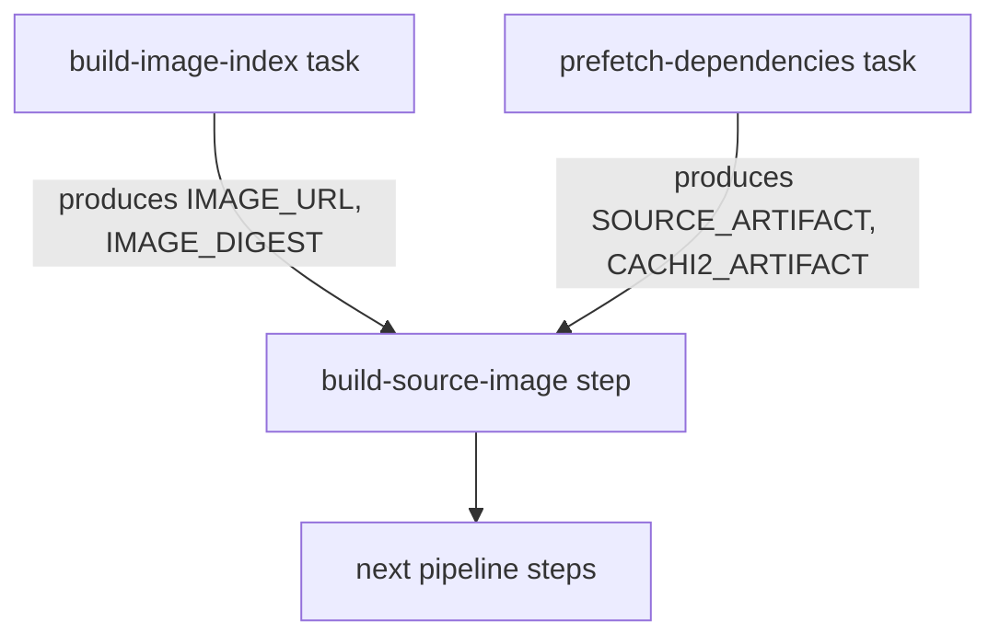

# Pull Request #1721: Update Konflux references

**Author**: @red-hat-konflux
**Created**: July 12, 2025 at 05:53 AM UTC
**Status**: Merged
**Labels**: None
**Base**: `security-compliance` ← **Head**: `konflux/references/security-compliance`

## Description

This PR contains the following updates:

| Package | Change | Notes |
|---|---|---|
| quay.io/konflux-ci/tekton-catalog/task-ecosystem-cert-preflight-checks | `b550ff4` -> `abbe195` |  |
| quay.io/konflux-ci/tekton-catalog/task-prefetch-dependencies-oci-ta | `a1ddc34` -> `f10a484` |  |
| quay.io/konflux-ci/tekton-catalog/task-sast-coverity-check-oci-ta | `d3fdca2` -> `c926568` |  |
| quay.io/konflux-ci/tekton-catalog/task-source-build-oci-ta | `0.2` -> `0.3` | :warning:[migration](https://redirect.github.com/redhat-appstudio/build-definitions/blob/main/task/source-build-oci-ta/0.3/MIGRATION.md):warning: |

---

### Configuration

📅 **Schedule**: Branch creation - "after 5am on saturday" in timezone Europe/Prague, Automerge - At any time (no schedule defined).

🚦 **Automerge**: Enabled.

♻ **Rebasing**: Whenever PR is behind base branch, or you tick the rebase/retry checkbox.

👻 **Immortal**: This PR will be recreated if closed unmerged. Get [config help](https://redirect.github.com/renovatebot/renovate/discussions) if that's undesired.

---

 - [ ] <!-- rebase-check -->If you want to rebase/retry this PR, check this box

---

To execute skipped test pipelines write comment `/ok-to-test`.

This PR has been generated by [MintMaker](https://redirect.github.com/konflux-ci/mintmaker) (powered by [Renovate Bot](https://redirect.github.com/renovatebot/renovate)).
<!--renovate-debug:eyJjcmVhdGVkSW5WZXIiOiIzOS4yNjQuMC1ycG0iLCJ1cGRhdGVkSW5WZXIiOiIzOS4yNjQuMC1ycG0iLCJ0YXJnZXRCcmFuY2giOiJzZWN1cml0eS1jb21wbGlhbmNlIiwibGFiZWxzIjpbXX0=-->

## Summary by Sourcery

Update Tekton pipeline configurations to reference new Konflux task bundle SHAs, bump source-build-oci-ta to v0.3, and expose build image URL and digest parameters

Enhancements:
- Update Tekton task bundles for prefetch-dependencies-oci-ta, ecosystem-cert-preflight-checks, and sast-coverity-check-oci-ta to new image digests
- Bump source-build-oci-ta bundle from v0.2 to v0.3
- Replace BINARY_IMAGE parameter with build-image-index result (IMAGE_URL) and add BINARY_IMAGE_DIGEST (IMAGE_DIGEST) to the build-source-image step
- Apply all changes to both pull-request and push pipeline configurations

---

## Discussion

### Comment by @jira-linking on July 12, 2025 at 05:53 AM UTC

Commits missing Jira IDs:
19bf04eddaa9d88c5bcf136094077f28ee8993e2

### Comment by @sourcery-ai on July 12, 2025 at 05:53 AM UTC

<!-- Generated by sourcery-ai[bot]: start review_guide -->

## Reviewer's Guide

This PR updates bundle references for multiple Konflux Tekton tasks in the patchman-engine pull and push configurations and enhances the build-source-image step by sourcing its output URL and digest directly from the build-image-index task.

#### Flow diagram for updated build-source-image step in Tekton pipeline

### File-Level Changes

| Change | Details | Files |
| ------ | ------- | ----- |
| Update prefetch-dependencies-oci-ta bundle digest | <ul><li>Replaced sha256 digest a1ddc34… with f10a484… in bundle value</li></ul> | `.tekton/patchman-engine-pull-request.yaml` `.tekton/patchman-engine-push.yaml` |
| Adjust build-source-image task parameters | <ul><li>Changed BINARY_IMAGE param to use tasks.build-image-index.results.IMAGE_URL</li><li>Added BINARY_IMAGE_DIGEST param from tasks.build-image-index.results.IMAGE_DIGEST</li></ul> | `.tekton/patchman-engine-pull-request.yaml` `.tekton/patchman-engine-push.yaml` |
| Bump source-build-oci-ta task version and digest | <ul><li>Upgraded version from 0.2 to 0.3</li><li>Updated sha256 digest accordingly</li></ul> | `.tekton/patchman-engine-pull-request.yaml` `.tekton/patchman-engine-push.yaml` |
| Refresh ecosystem-cert-preflight-checks bundle digest | <ul><li>Replaced old sha256 digest b550ff4… with abbe195…</li></ul> | `.tekton/patchman-engine-pull-request.yaml` `.tekton/patchman-engine-push.yaml` |
| Refresh sast-coverity-check-oci-ta bundle digest | <ul><li>Replaced old sha256 digest d3fdca2… with c926568…</li></ul> | `.tekton/patchman-engine-pull-request.yaml` `.tekton/patchman-engine-push.yaml` |

---

Tips and commands

#### Interacting with Sourcery

- **Trigger a new review:** Comment `@sourcery-ai review` on the pull request.
- **Continue discussions:** Reply directly to Sourcery's review comments.
- **Generate a GitHub issue from a review comment:** Ask Sourcery to create an
  issue from a review comment by replying to it. You can also reply to a
  review comment with `@sourcery-ai issue` to create an issue from it.
- **Generate a pull request title:** Write `@sourcery-ai` anywhere in the pull
  request title to generate a title at any time. You can also comment
  `@sourcery-ai title` on the pull request to (re-)generate the title at any time.
- **Generate a pull request summary:** Write `@sourcery-ai summary` anywhere in
  the pull request body to generate a PR summary at any time exactly where you
  want it. You can also comment `@sourcery-ai summary` on the pull request to
  (re-)generate the summary at any time.
- **Generate reviewer's guide:** Comment `@sourcery-ai guide` on the pull
  request to (re-)generate the reviewer's guide at any time.
- **Resolve all Sourcery comments:** Comment `@sourcery-ai resolve` on the
  pull request to resolve all Sourcery comments. Useful if you've already
  addressed all the comments and don't want to see them anymore.
- **Dismiss all Sourcery reviews:** Comment `@sourcery-ai dismiss` on the pull
  request to dismiss all existing Sourcery reviews. Especially useful if you
  want to start fresh with a new review - don't forget to comment
  `@sourcery-ai review` to trigger a new review!

#### Customizing Your Experience

Access your [dashboard](https://app.sourcery.ai) to:
- Enable or disable review features such as the Sourcery-generated pull request
  summary, the reviewer's guide, and others.
- Change the review language.
- Add, remove or edit custom review instructions.
- Adjust other review settings.

#### Getting Help

- [Contact our support team](mailto:support@sourcery.ai) for questions or feedback.
- Visit our [documentation](https://docs.sourcery.ai) for detailed guides and information.
- Keep in touch with the Sourcery team by following us on [X/Twitter](https://x.com/SourceryAI), [LinkedIn](https://www.linkedin.com/company/sourcery-ai/) or [GitHub](https://github.com/sourcery-ai).

<!-- Generated by sourcery-ai[bot]: end review_guide -->

---

*Archived from: https://github.com/RedHatInsights/patchman-engine/pull/1721*
