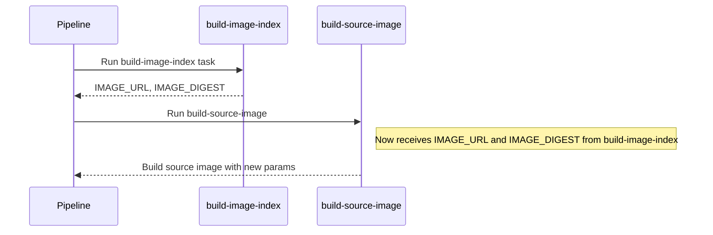
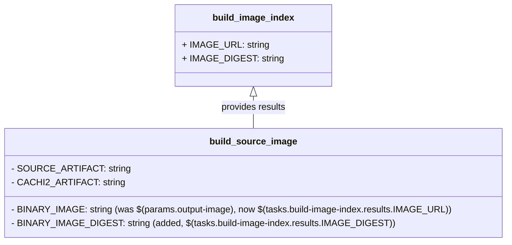

# Pull Request #1722: Update Konflux references

**Author**: @red-hat-konflux
**Created**: July 12, 2025 at 06:12 AM UTC
**Status**: Merged
**Labels**: None
**Base**: `master` ← **Head**: `konflux/references/master`

## Description

This PR contains the following updates:

| Package | Change | Notes |
|---|---|---|
| quay.io/konflux-ci/tekton-catalog/task-build-image-index | `846dc99` -> `3499772` |  |
| quay.io/konflux-ci/tekton-catalog/task-buildah-oci-ta | `48b99ad` -> `9e9bac2` |  |
| quay.io/konflux-ci/tekton-catalog/task-clair-scan | `d354939` -> `417f441` |  |
| quay.io/konflux-ci/tekton-catalog/task-clamav-scan | `9cab95a` -> `7749146` |  |
| quay.io/konflux-ci/tekton-catalog/task-ecosystem-cert-preflight-checks | `b550ff4` -> `f99d2bd` |  |
| quay.io/konflux-ci/tekton-catalog/task-init | `66e90d3` -> `1d8221c` |  |
| quay.io/konflux-ci/tekton-catalog/task-prefetch-dependencies-oci-ta | `a1ddc34` -> `092491a` |  |
| quay.io/konflux-ci/tekton-catalog/task-push-dockerfile-oci-ta | `5d8013b` -> `8c75c4a` |  |
| quay.io/konflux-ci/tekton-catalog/task-sast-coverity-check-oci-ta | `d3fdca2` -> `f9ca942` |  |
| quay.io/konflux-ci/tekton-catalog/task-sast-shell-check-oci-ta | `808bcaf` -> `bf7bdde` |  |
| quay.io/konflux-ci/tekton-catalog/task-sast-snyk-check-oci-ta | `e61f541` -> `fe5e5ba` |  |
| quay.io/konflux-ci/tekton-catalog/task-show-sbom | `1b1df4d` -> `86c069c` |  |
| quay.io/konflux-ci/tekton-catalog/task-source-build-oci-ta | `0.2` -> `0.3` | :warning:[migration](https://redirect.github.com/redhat-appstudio/build-definitions/blob/main/task/source-build-oci-ta/0.3/MIGRATION.md):warning: |

---

### Configuration

📅 **Schedule**: Branch creation - "after 5am on saturday" in timezone Europe/Prague, Automerge - At any time (no schedule defined).

🚦 **Automerge**: Enabled.

♻ **Rebasing**: Whenever PR is behind base branch, or you tick the rebase/retry checkbox.

👻 **Immortal**: This PR will be recreated if closed unmerged. Get [config help](https://redirect.github.com/renovatebot/renovate/discussions) if that's undesired.

---

 - [ ] <!-- rebase-check -->If you want to rebase/retry this PR, check this box

---

To execute skipped test pipelines write comment `/ok-to-test`.

This PR has been generated by [MintMaker](https://redirect.github.com/konflux-ci/mintmaker) (powered by [Renovate Bot](https://redirect.github.com/renovatebot/renovate)).
<!--renovate-debug:eyJjcmVhdGVkSW5WZXIiOiIzOS4yNjQuMC1ycG0iLCJ1cGRhdGVkSW5WZXIiOiIzOS4yNjQuMC1ycG0iLCJ0YXJnZXRCcmFuY2giOiJtYXN0ZXIiLCJsYWJlbHMiOltdfQ==-->


---

## Discussion

### Comment by @jira-linking on July 12, 2025 at 06:12 AM UTC

Commits missing Jira IDs:
340a077b794da81c574059dced959ce9ca106e98


### Comment by @sourcery-ai on July 12, 2025 at 06:12 AM UTC

<!-- Generated by sourcery-ai[bot]: start review_guide -->

## Reviewer's Guide

This PR updates bundle image references for several Tekton catalog tasks, bumps the source-build OCI task version, and refactors pipeline parameters for the build-source-image step.

#### Sequence diagram for updated build-source-image step parameter flow



#### Class diagram for build-source-image step parameter changes



### File-Level Changes

| Change | Details | Files |
| ------ | ------- | ----- |
| Updated bundle digests for Tekton catalog tasks | <ul><li>prefetch-dependencies-oci-ta SHA updated</li><li>ecosystem-cert-preflight-checks SHA updated</li><li>sast-coverity-check-oci-ta SHA updated</li></ul> | `.tekton/patchman-engine-pull-request.yaml`<br/>`.tekton/patchman-engine-push.yaml` |
| Bumped source-build-oci-ta task version and digest | <ul><li>task version updated from 0.2 to 0.3</li><li>bundle SHA updated to new digest</li></ul> | `.tekton/patchman-engine-pull-request.yaml`<br/>`.tekton/patchman-engine-push.yaml` |
| Refactored build-source-image task parameters | <ul><li>BINARY_IMAGE param now uses IMAGE_URL result</li><li>added BINARY_IMAGE_DIGEST param from IMAGE_DIGEST result</li></ul> | `.tekton/patchman-engine-pull-request.yaml`<br/>`.tekton/patchman-engine-push.yaml` |

---

<details>
<summary>Tips and commands</summary>

#### Interacting with Sourcery

- **Trigger a new review:** Comment `@sourcery-ai review` on the pull request.
- **Continue discussions:** Reply directly to Sourcery's review comments.
- **Generate a GitHub issue from a review comment:** Ask Sourcery to create an
  issue from a review comment by replying to it. You can also reply to a
  review comment with `@sourcery-ai issue` to create an issue from it.
- **Generate a pull request title:** Write `@sourcery-ai` anywhere in the pull
  request title to generate a title at any time. You can also comment
  `@sourcery-ai title` on the pull request to (re-)generate the title at any time.
- **Generate a pull request summary:** Write `@sourcery-ai summary` anywhere in
  the pull request body to generate a PR summary at any time exactly where you
  want it. You can also comment `@sourcery-ai summary` on the pull request to
  (re-)generate the summary at any time.
- **Generate reviewer's guide:** Comment `@sourcery-ai guide` on the pull
  request to (re-)generate the reviewer's guide at any time.
- **Resolve all Sourcery comments:** Comment `@sourcery-ai resolve` on the
  pull request to resolve all Sourcery comments. Useful if you've already
  addressed all the comments and don't want to see them anymore.
- **Dismiss all Sourcery reviews:** Comment `@sourcery-ai dismiss` on the pull
  request to dismiss all existing Sourcery reviews. Especially useful if you
  want to start fresh with a new review - don't forget to comment
  `@sourcery-ai review` to trigger a new review!

#### Customizing Your Experience

Access your [dashboard](https://app.sourcery.ai) to:
- Enable or disable review features such as the Sourcery-generated pull request
  summary, the reviewer's guide, and others.
- Change the review language.
- Add, remove or edit custom review instructions.
- Adjust other review settings.

#### Getting Help

- [Contact our support team](mailto:support@sourcery.ai) for questions or feedback.
- Visit our [documentation](https://docs.sourcery.ai) for detailed guides and information.
- Keep in touch with the Sourcery team by following us on [X/Twitter](https://x.com/SourceryAI), [LinkedIn](https://www.linkedin.com/company/sourcery-ai/) or [GitHub](https://github.com/sourcery-ai).

</details>

<!-- Generated by sourcery-ai[bot]: end review_guide -->

### Comment by @codecov-commenter on July 19, 2025 at 05:16 AM UTC

## [Codecov](https://app.codecov.io/gh/RedHatInsights/patchman-engine/pull/1722?dropdown=coverage&src=pr&el=h1&utm_medium=referral&utm_source=github&utm_content=comment&utm_campaign=pr+comments&utm_term=RedHatInsights) Report
All modified and coverable lines are covered by tests :white_check_mark:
> Project coverage is 54.77%. Comparing base [(`8e1a4e4`)](https://app.codecov.io/gh/RedHatInsights/patchman-engine/commit/8e1a4e498ab9ea13c2a68e910d88bac12d3db9d7?dropdown=coverage&el=desc&utm_medium=referral&utm_source=github&utm_content=comment&utm_campaign=pr+comments&utm_term=RedHatInsights) to head [(`340a077`)](https://app.codecov.io/gh/RedHatInsights/patchman-engine/commit/340a077b794da81c574059dced959ce9ca106e98?dropdown=coverage&el=desc&utm_medium=referral&utm_source=github&utm_content=comment&utm_campaign=pr+comments&utm_term=RedHatInsights).
> Report is 1 commits behind head on master.

<details><summary>Additional details and impacted files</summary>


```diff
@@           Coverage Diff           @@
##           master    #1722   +/-   ##
=======================================
  Coverage   54.77%   54.77%           
=======================================
  Files         139      139           
  Lines       10752    10752           
=======================================
  Hits         5889     5889           
  Misses       4333     4333           
  Partials      530      530           
```

| [Flag](https://app.codecov.io/gh/RedHatInsights/patchman-engine/pull/1722/flags?src=pr&el=flags&utm_medium=referral&utm_source=github&utm_content=comment&utm_campaign=pr+comments&utm_term=RedHatInsights) | Coverage Δ | |
|---|---|---|
| [unittests](https://app.codecov.io/gh/RedHatInsights/patchman-engine/pull/1722/flags?src=pr&el=flag&utm_medium=referral&utm_source=github&utm_content=comment&utm_campaign=pr+comments&utm_term=RedHatInsights) | `54.77% <ø> (ø)` | |

Flags with carried forward coverage won't be shown. [Click here](https://docs.codecov.io/docs/carryforward-flags?utm_medium=referral&utm_source=github&utm_content=comment&utm_campaign=pr+comments&utm_term=RedHatInsights#carryforward-flags-in-the-pull-request-comment) to find out more.

</details>

[:umbrella: View full report in Codecov by Sentry](https://app.codecov.io/gh/RedHatInsights/patchman-engine/pull/1722?dropdown=coverage&src=pr&el=continue&utm_medium=referral&utm_source=github&utm_content=comment&utm_campaign=pr+comments&utm_term=RedHatInsights).   
:loudspeaker: Have feedback on the report? [Share it here](https://about.codecov.io/codecov-pr-comment-feedback/?utm_medium=referral&utm_source=github&utm_content=comment&utm_campaign=pr+comments&utm_term=RedHatInsights).

<details><summary> :rocket: New features to boost your workflow: </summary>

- :snowflake: [Test Analytics](https://docs.codecov.com/docs/test-analytics): Detect flaky tests, report on failures, and find test suite problems.
</details>

---

*Archived from: https://github.com/RedHatInsights/patchman-engine/pull/1722*
