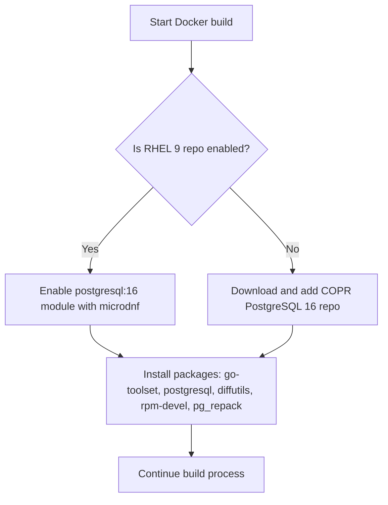

# Pull Request #1736: chore: build from rhel repo on registered rhel system

**Author**: @psegedy
**Created**: July 17, 2025 at 11:42 AM UTC
**Status**: Merged
**Labels**: None
**Base**: `master` ← **Head**: `nocopr`

## Description

konflux hermetic build does not allow installation of packages from copr

postgresql 16 module may contain incompatible pg_repack version, it must be tested in stage

## Secure Coding Practices Checklist GitHub Link
- https://github.com/RedHatInsights/secure-coding-checklist

## Secure Coding Checklist
- [x] Input Validation
- [x] Output Encoding
- [x] Authentication and Password Management
- [x] Session Management
- [x] Access Control
- [x] Cryptographic Practices
- [x] Error Handling and Logging
- [x] Data Protection
- [x] Communication Security
- [x] System Configuration
- [x] Database Security
- [x] File Management
- [x] Memory Management
- [x] General Coding Practices

## Summary by Sourcery

Update Dockerfile to conditionally use the RHEL-9 native PostgreSQL 16 module when the build image is registered, and fall back to adding the Copr repository otherwise to ensure compatible pg_repack versions.

Enhancements:
- Add logic to detect a registered RHEL-9 system and enable the postgresql:16 module
- Fall back to installing from the Copr PostgreSQL 16 repo if the RHEL module is not available

Build:
- Adjust Dockerfile build stage to use microdnf module enable for PostgreSQL on RHEL or curl to add the Copr repo

---

## Discussion

### Comment by @jira-linking on July 17, 2025 at 11:42 AM UTC

Commits missing Jira IDs:
a9b4b0193aeed78d8bbb4e8b5c2fe58f146e1f8d


### Comment by @sourcery-ai on July 17, 2025 at 11:42 AM UTC

<!-- Generated by sourcery-ai[bot]: start review_guide -->

## Reviewer's Guide

This PR updates the Dockerfile’s PostgreSQL setup to detect if it’s running on a registered RHEL 9 system and, if so, enable the built-in PostgreSQL 16 module; otherwise it falls back to the existing COPR repo. This ensures compatibility of pg_repack and leverages RHEL’s native packaging when available.

#### Flow diagram for conditional PostgreSQL repository setup in Dockerfile



### File-Level Changes

| Change | Details | Files |
| ------ | ------- | ----- |
| Add conditional logic for PostgreSQL 16 source selection in the build stage | <ul><li>Check for enabled RHEL 9 repository via microdnf repolist</li><li>If present, enable postgresql:16 module with microdnf</li><li>Otherwise download the COPR repository file via curl</li><li>Replace the unconditional COPR curl step with this conditional block</li></ul> | `Dockerfile` |

---

<details>
<summary>Tips and commands</summary>

#### Interacting with Sourcery

- **Trigger a new review:** Comment `@sourcery-ai review` on the pull request.
- **Continue discussions:** Reply directly to Sourcery's review comments.
- **Generate a GitHub issue from a review comment:** Ask Sourcery to create an
  issue from a review comment by replying to it. You can also reply to a
  review comment with `@sourcery-ai issue` to create an issue from it.
- **Generate a pull request title:** Write `@sourcery-ai` anywhere in the pull
  request title to generate a title at any time. You can also comment
  `@sourcery-ai title` on the pull request to (re-)generate the title at any time.
- **Generate a pull request summary:** Write `@sourcery-ai summary` anywhere in
  the pull request body to generate a PR summary at any time exactly where you
  want it. You can also comment `@sourcery-ai summary` on the pull request to
  (re-)generate the summary at any time.
- **Generate reviewer's guide:** Comment `@sourcery-ai guide` on the pull
  request to (re-)generate the reviewer's guide at any time.
- **Resolve all Sourcery comments:** Comment `@sourcery-ai resolve` on the
  pull request to resolve all Sourcery comments. Useful if you've already
  addressed all the comments and don't want to see them anymore.
- **Dismiss all Sourcery reviews:** Comment `@sourcery-ai dismiss` on the pull
  request to dismiss all existing Sourcery reviews. Especially useful if you
  want to start fresh with a new review - don't forget to comment
  `@sourcery-ai review` to trigger a new review!

#### Customizing Your Experience

Access your [dashboard](https://app.sourcery.ai) to:
- Enable or disable review features such as the Sourcery-generated pull request
  summary, the reviewer's guide, and others.
- Change the review language.
- Add, remove or edit custom review instructions.
- Adjust other review settings.

#### Getting Help

- [Contact our support team](mailto:support@sourcery.ai) for questions or feedback.
- Visit our [documentation](https://docs.sourcery.ai) for detailed guides and information.
- Keep in touch with the Sourcery team by following us on [X/Twitter](https://x.com/SourceryAI), [LinkedIn](https://www.linkedin.com/company/sourcery-ai/) or [GitHub](https://github.com/sourcery-ai).

</details>

<!-- Generated by sourcery-ai[bot]: end review_guide -->

### Comment by @codecov-commenter on July 17, 2025 at 11:48 AM UTC

## [Codecov](https://app.codecov.io/gh/RedHatInsights/patchman-engine/pull/1736?dropdown=coverage&src=pr&el=h1&utm_medium=referral&utm_source=github&utm_content=comment&utm_campaign=pr+comments&utm_term=RedHatInsights) Report
:white_check_mark: All modified and coverable lines are covered by tests.
:white_check_mark: Project coverage is 54.77%. Comparing base ([`8e1a4e4`](https://app.codecov.io/gh/RedHatInsights/patchman-engine/commit/8e1a4e498ab9ea13c2a68e910d88bac12d3db9d7?dropdown=coverage&el=desc&utm_medium=referral&utm_source=github&utm_content=comment&utm_campaign=pr+comments&utm_term=RedHatInsights)) to head ([`a9b4b01`](https://app.codecov.io/gh/RedHatInsights/patchman-engine/commit/a9b4b0193aeed78d8bbb4e8b5c2fe58f146e1f8d?dropdown=coverage&el=desc&utm_medium=referral&utm_source=github&utm_content=comment&utm_campaign=pr+comments&utm_term=RedHatInsights)).
:warning: Report is 755 commits behind head on master.

<details><summary>Additional details and impacted files</summary>


```diff
@@           Coverage Diff           @@
##           master    #1736   +/-   ##
=======================================
  Coverage   54.77%   54.77%           
=======================================
  Files         139      139           
  Lines       10752    10752           
=======================================
  Hits         5889     5889           
  Misses       4333     4333           
  Partials      530      530           
```

| [Flag](https://app.codecov.io/gh/RedHatInsights/patchman-engine/pull/1736/flags?src=pr&el=flags&utm_medium=referral&utm_source=github&utm_content=comment&utm_campaign=pr+comments&utm_term=RedHatInsights) | Coverage Δ | |
|---|---|---|
| [unittests](https://app.codecov.io/gh/RedHatInsights/patchman-engine/pull/1736/flags?src=pr&el=flag&utm_medium=referral&utm_source=github&utm_content=comment&utm_campaign=pr+comments&utm_term=RedHatInsights) | `54.77% <ø> (ø)` | |

Flags with carried forward coverage won't be shown. [Click here](https://docs.codecov.io/docs/carryforward-flags?utm_medium=referral&utm_source=github&utm_content=comment&utm_campaign=pr+comments&utm_term=RedHatInsights#carryforward-flags-in-the-pull-request-comment) to find out more.
</details>

[:umbrella: View full report in Codecov by Sentry](https://app.codecov.io/gh/RedHatInsights/patchman-engine/pull/1736?dropdown=coverage&src=pr&el=continue&utm_medium=referral&utm_source=github&utm_content=comment&utm_campaign=pr+comments&utm_term=RedHatInsights).   
:loudspeaker: Have feedback on the report? [Share it here](https://about.codecov.io/codecov-pr-comment-feedback/?utm_medium=referral&utm_source=github&utm_content=comment&utm_campaign=pr+comments&utm_term=RedHatInsights).
<details><summary> :rocket: New features to boost your workflow: </summary>

- :snowflake: [Test Analytics](https://docs.codecov.com/docs/test-analytics): Detect flaky tests, report on failures, and find test suite problems.
</details>

### Comment by @MichaelMraka on July 22, 2025 at 02:12 PM UTC

/retest

### Comment by @MichaelMraka on July 23, 2025 at 10:04 AM UTC

/retest

---

## Reviews

### Review by @MichaelMraka - Approved on July 22, 2025 at 02:11 PM UTC

---

*Archived from: https://github.com/RedHatInsights/patchman-engine/pull/1736*
