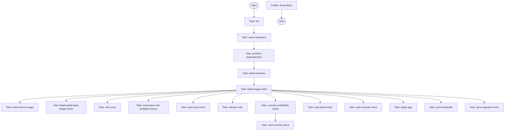

# Pull Request #1745: Red Hat Konflux update patchman-engine-sc

**Author**: @red-hat-konflux
**Created**: July 23, 2025 at 02:50 PM UTC
**Status**: Merged
**Labels**: None
**Base**: `security-compliance` ← **Head**: `konflux-patchman-engine-sc`

## Description

# Pipelines as Code configuration proposal

To start the PipelineRun, add a new comment with content `/ok-to-test`

For more detailed information about running a PipelineRun, please refer to Pipelines as Code documentation [Running the PipelineRun](https://pipelinesascode.com/docs/guide/running/)

To customize the proposed PipelineRuns after merge, please refer to [Build Pipeline customization](https://konflux-ci.dev/docs/how-tos/configuring/)

Please follow the block sequence indentation style introduced by the proprosed PipelineRuns YAMLs, or keep using consistent indentation level through your customized PipelineRuns. When different levels are mixed, it will be changed to the proposed style.

## Summary by Sourcery

Add Pipelines as Code configuration for the patchman-engine-sc component by defining two Tekton PipelineRun specs that automatically build and scan container images on pull request and push events to the security-compliance branch.

New Features:
- Add a pull request-triggered PipelineRun spec for patchman-engine-sc
- Add a push-triggered PipelineRun spec for patchman-engine-sc

CI:
- Configure Pipelines as Code annotations and parameters to manage run triggers, cancellation policy, and image expiration

---

## Discussion

### Comment by @jira-linking on July 23, 2025 at 02:50 PM UTC

Commits missing Jira IDs:
066904d6ef7544bec7ee5fc1cc495f0fc9d65c8f
70f5d49e911b3806c3e901cf9b661f209cd124e6

### Comment by @sourcery-ai on July 23, 2025 at 02:50 PM UTC

<!-- Generated by sourcery-ai[bot]: start review_guide -->

## Reviewer's Guide

This PR introduces two new Tekton PipelineRun templates for the patchman-engine-sc component, one targeting pull_request events and the other for push events against the security-compliance branch. Each YAML defines Pipelines as Code metadata annotations, templated parameters, a full pipelineSpec (tasks, params, results, finally block) and workspaces, following the block sequence indentation style.

#### Flow diagram for patchman-engine-sc PipelineRun task sequence

### File-Level Changes

| Change | Details | Files |
| ------ | ------- | ----- |
| Add PipelineRun template for pull_request triggers | <ul><li>Create .tekton/patchman-engine-sc-pull-request.yaml</li><li>Configure annotations with event ‘pull_request’ and cancel-in-progress=true</li><li>Templatize repo URL, revision, pull_request_number, target_branch, git_auth_secret</li><li>Define pipelineSpec with params, tasks chain (init→clone→build→checks), results and finally show-sbom</li><li>Set serviceAccountName to build-pipeline-patchman-engine-sc</li></ul> | `.tekton/patchman-engine-sc-pull-request.yaml` |
| Add PipelineRun template for push triggers | <ul><li>Create .tekton/patchman-engine-sc-push.yaml</li><li>Configure annotations with event ‘push’ and cancel-in-progress=false</li><li>Templatize repo URL, revision, target_branch, git_auth_secret</li><li>Mirror pipelineSpec structure from pull_request template with adjusted output-image tag</li><li>Reuse serviceAccountName and workspaces configuration</li></ul> | `.tekton/patchman-engine-sc-push.yaml` |

---

Tips and commands

#### Interacting with Sourcery

- **Trigger a new review:** Comment `@sourcery-ai review` on the pull request.
- **Continue discussions:** Reply directly to Sourcery's review comments.
- **Generate a GitHub issue from a review comment:** Ask Sourcery to create an
  issue from a review comment by replying to it. You can also reply to a
  review comment with `@sourcery-ai issue` to create an issue from it.
- **Generate a pull request title:** Write `@sourcery-ai` anywhere in the pull
  request title to generate a title at any time. You can also comment
  `@sourcery-ai title` on the pull request to (re-)generate the title at any time.
- **Generate a pull request summary:** Write `@sourcery-ai summary` anywhere in
  the pull request body to generate a PR summary at any time exactly where you
  want it. You can also comment `@sourcery-ai summary` on the pull request to
  (re-)generate the summary at any time.
- **Generate reviewer's guide:** Comment `@sourcery-ai guide` on the pull
  request to (re-)generate the reviewer's guide at any time.
- **Resolve all Sourcery comments:** Comment `@sourcery-ai resolve` on the
  pull request to resolve all Sourcery comments. Useful if you've already
  addressed all the comments and don't want to see them anymore.
- **Dismiss all Sourcery reviews:** Comment `@sourcery-ai dismiss` on the pull
  request to dismiss all existing Sourcery reviews. Especially useful if you
  want to start fresh with a new review - don't forget to comment
  `@sourcery-ai review` to trigger a new review!

#### Customizing Your Experience

Access your [dashboard](https://app.sourcery.ai) to:
- Enable or disable review features such as the Sourcery-generated pull request
  summary, the reviewer's guide, and others.
- Change the review language.
- Add, remove or edit custom review instructions.
- Adjust other review settings.

#### Getting Help

- [Contact our support team](mailto:support@sourcery.ai) for questions or feedback.
- Visit our [documentation](https://docs.sourcery.ai) for detailed guides and information.
- Keep in touch with the Sourcery team by following us on [X/Twitter](https://x.com/SourceryAI), [LinkedIn](https://www.linkedin.com/company/sourcery-ai/) or [GitHub](https://github.com/sourcery-ai).

<!-- Generated by sourcery-ai[bot]: end review_guide -->

---

*Archived from: https://github.com/RedHatInsights/patchman-engine/pull/1745*
