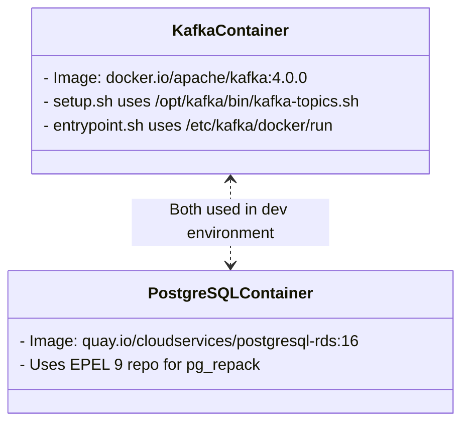
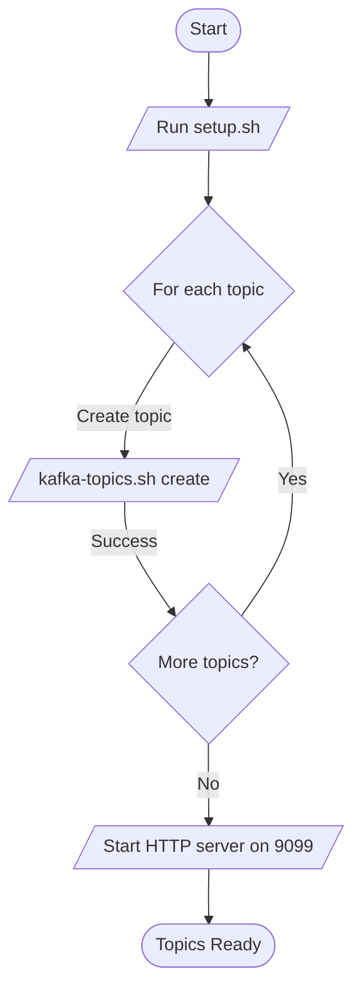

# Pull Request #1747: RHINENG-19571: update container images

**Author**: @MichaelMraka
**Created**: July 24, 2025 at 12:51 PM UTC
**Status**: Merged
**Labels**: None
**Base**: `master` ← **Head**: `pr1`

## Description

## Secure Coding Practices Checklist GitHub Link
- https://github.com/RedHatInsights/secure-coding-checklist

## Secure Coding Checklist
- [x] Input Validation
- [x] Output Encoding
- [x] Authentication and Password Management
- [x] Session Management
- [x] Access Control
- [x] Cryptographic Practices
- [x] Error Handling and Logging
- [x] Data Protection
- [x] Communication Security
- [x] System Configuration
- [x] Database Security
- [x] File Management
- [x] Memory Management
- [x] General Coding Practices

## Summary by Sourcery

Update development container images for Kafka and PostgreSQL, adjust related setup and entrypoint scripts to match new image layouts, and clean up test compose port mappings

Enhancements:
- Adjust Kafka setup script to use the new kafka-topics.sh path and updated netcat flags
- Update Kafka entrypoint to invoke the correct /etc/kafka/docker/run script
- Remove obsolete Kafka port mappings from the test Docker Compose configuration

Build:
- Bump PostgreSQL dev image to quay.io/cloudservices/postgresql-rds:16 and switch the Copr repo to the epel-9 variant
- Switch Kafka dev image from the custom Confluent build to the official Apache Kafka 4.0.0 image

---

## Discussion

### Comment by @jira-linking on July 24, 2025 at 12:51 PM UTC

Referenced Jiras:
https://issues.redhat.com/browse/RHINENG-19571


### Comment by @sourcery-ai on July 24, 2025 at 12:51 PM UTC

<!-- Generated by sourcery-ai[bot]: start review_guide -->

## Reviewer's Guide

This PR refreshes development container images for Kafka and PostgreSQL to their latest upstream versions, adjusts accompanying setup and entrypoint scripts to align with new binary locations and flags, and removes obsolete port mappings from the test compose configuration.

#### Class diagram for updated Kafka and PostgreSQL container scripts



#### Flow diagram for updated Kafka topic setup script



### File-Level Changes

| Change | Details | Files |
| ------ | ------- | ----- |
| Swap kafka-topics binary path and update netcat invocation in setup script | <ul><li>Use /opt/kafka/bin/kafka-topics.sh instead of /usr/bin/kafka-topics</li><li>Reformat topic creation command for readability</li><li>Replace nc flags from -l -p -c to -lk -p -e and adjust echo syntax</li></ul> | `dev/kafka/setup.sh` |
| Bump PostgreSQL development image and EPEL repo to version 16 on EL9 | <ul><li>Update base image tag from 16-4649c84 to 16</li><li>Switch EPEL repo URL from epel-8 to epel-9</li></ul> | `dev/database/Dockerfile` |
| Switch Kafka development image to apache/kafka:4.0.0 and update entrypoint binary | <ul><li>Change base image from Confluent CP to apache/kafka:4.0.0</li><li>Invoke /etc/kafka/docker/run instead of Confluent run script</li></ul> | `dev/kafka/Dockerfile`<br/>`dev/kafka/entrypoint.sh` |
| Clean up test compose port mappings by removing legacy Kafka ports | <ul><li>Remove mappings for ports 29092 and 29093</li></ul> | `docker-compose.test.yml` |

---

<details>
<summary>Tips and commands</summary>

#### Interacting with Sourcery

- **Trigger a new review:** Comment `@sourcery-ai review` on the pull request.
- **Continue discussions:** Reply directly to Sourcery's review comments.
- **Generate a GitHub issue from a review comment:** Ask Sourcery to create an
  issue from a review comment by replying to it. You can also reply to a
  review comment with `@sourcery-ai issue` to create an issue from it.
- **Generate a pull request title:** Write `@sourcery-ai` anywhere in the pull
  request title to generate a title at any time. You can also comment
  `@sourcery-ai title` on the pull request to (re-)generate the title at any time.
- **Generate a pull request summary:** Write `@sourcery-ai summary` anywhere in
  the pull request body to generate a PR summary at any time exactly where you
  want it. You can also comment `@sourcery-ai summary` on the pull request to
  (re-)generate the summary at any time.
- **Generate reviewer's guide:** Comment `@sourcery-ai guide` on the pull
  request to (re-)generate the reviewer's guide at any time.
- **Resolve all Sourcery comments:** Comment `@sourcery-ai resolve` on the
  pull request to resolve all Sourcery comments. Useful if you've already
  addressed all the comments and don't want to see them anymore.
- **Dismiss all Sourcery reviews:** Comment `@sourcery-ai dismiss` on the pull
  request to dismiss all existing Sourcery reviews. Especially useful if you
  want to start fresh with a new review - don't forget to comment
  `@sourcery-ai review` to trigger a new review!

#### Customizing Your Experience

Access your [dashboard](https://app.sourcery.ai) to:
- Enable or disable review features such as the Sourcery-generated pull request
  summary, the reviewer's guide, and others.
- Change the review language.
- Add, remove or edit custom review instructions.
- Adjust other review settings.

#### Getting Help

- [Contact our support team](mailto:support@sourcery.ai) for questions or feedback.
- Visit our [documentation](https://docs.sourcery.ai) for detailed guides and information.
- Keep in touch with the Sourcery team by following us on [X/Twitter](https://x.com/SourceryAI), [LinkedIn](https://www.linkedin.com/company/sourcery-ai/) or [GitHub](https://github.com/sourcery-ai).

</details>

<!-- Generated by sourcery-ai[bot]: end review_guide -->

### Comment by @codecov-commenter on July 24, 2025 at 01:35 PM UTC

## [Codecov](https://app.codecov.io/gh/RedHatInsights/patchman-engine/pull/1747?dropdown=coverage&src=pr&el=h1&utm_medium=referral&utm_source=github&utm_content=comment&utm_campaign=pr+comments&utm_term=RedHatInsights) Report
All modified and coverable lines are covered by tests :white_check_mark:
> Project coverage is 54.83%. Comparing base [(`22a60ca`)](https://app.codecov.io/gh/RedHatInsights/patchman-engine/commit/22a60ca7baa112e4e36ebc1f124f232650a8065c?dropdown=coverage&el=desc&utm_medium=referral&utm_source=github&utm_content=comment&utm_campaign=pr+comments&utm_term=RedHatInsights) to head [(`b67ec95`)](https://app.codecov.io/gh/RedHatInsights/patchman-engine/commit/b67ec95f10f8a60825a878cb4178fc18ba0154e1?dropdown=coverage&el=desc&utm_medium=referral&utm_source=github&utm_content=comment&utm_campaign=pr+comments&utm_term=RedHatInsights).

<details><summary>Additional details and impacted files</summary>


```diff
@@           Coverage Diff           @@
##           master    #1747   +/-   ##
=======================================
  Coverage   54.83%   54.83%           
=======================================
  Files         140      140           
  Lines       10860    10860           
=======================================
  Hits         5955     5955           
  Misses       4368     4368           
  Partials      537      537           
```

| [Flag](https://app.codecov.io/gh/RedHatInsights/patchman-engine/pull/1747/flags?src=pr&el=flags&utm_medium=referral&utm_source=github&utm_content=comment&utm_campaign=pr+comments&utm_term=RedHatInsights) | Coverage Δ | |
|---|---|---|
| [unittests](https://app.codecov.io/gh/RedHatInsights/patchman-engine/pull/1747/flags?src=pr&el=flag&utm_medium=referral&utm_source=github&utm_content=comment&utm_campaign=pr+comments&utm_term=RedHatInsights) | `54.83% <ø> (ø)` | |

Flags with carried forward coverage won't be shown. [Click here](https://docs.codecov.io/docs/carryforward-flags?utm_medium=referral&utm_source=github&utm_content=comment&utm_campaign=pr+comments&utm_term=RedHatInsights#carryforward-flags-in-the-pull-request-comment) to find out more.

</details>

[:umbrella: View full report in Codecov by Sentry](https://app.codecov.io/gh/RedHatInsights/patchman-engine/pull/1747?dropdown=coverage&src=pr&el=continue&utm_medium=referral&utm_source=github&utm_content=comment&utm_campaign=pr+comments&utm_term=RedHatInsights).   
:loudspeaker: Have feedback on the report? [Share it here](https://about.codecov.io/codecov-pr-comment-feedback/?utm_medium=referral&utm_source=github&utm_content=comment&utm_campaign=pr+comments&utm_term=RedHatInsights).

<details><summary> :rocket: New features to boost your workflow: </summary>

- :snowflake: [Test Analytics](https://docs.codecov.com/docs/test-analytics): Detect flaky tests, report on failures, and find test suite problems.
</details>

### Comment by @MichaelMraka on July 24, 2025 at 03:08 PM UTC

/retest

---

## Reviews

### Review by @sourcery-ai - Commented on July 24, 2025 at 12:52 PM UTC

Hey @MichaelMraka - I've reviewed your changes - here's some feedback:

- Confirm that the netcat binary in the new Kafka image supports the '-e' and '-k' flags—if not, consider swapping to a minimal HTTP server for the health check.
- Ensure the switch to apache/kafka:4.0.0 and the new entrypoint '/etc/kafka/docker/run' are functionally equivalent to the previous Confluent script to avoid unexpected behavior.
- Verify that using the epel-9 PostgreSQL repo aligns with your base image OS version, otherwise you may encounter package resolution conflicts during 'dnf install'.

<details>
<summary>Prompt for AI Agents</summary>

~~~markdown
Please address the comments from this code review:
## Overall Comments
- Confirm that the netcat binary in the new Kafka image supports the '-e' and '-k' flags—if not, consider swapping to a minimal HTTP server for the health check.
- Ensure the switch to apache/kafka:4.0.0 and the new entrypoint '/etc/kafka/docker/run' are functionally equivalent to the previous Confluent script to avoid unexpected behavior.
- Verify that using the epel-9 PostgreSQL repo aligns with your base image OS version, otherwise you may encounter package resolution conflicts during 'dnf install'.

## Individual Comments

### Comment 1
<location> `dev/kafka/setup.sh:21` </location>
<code_context>
 # start simple http server so other components can check that kafka has fully started
 while : ; do
-    nc -l -p 9099 -c 'echo -e "HTTP/1.1 200 OK\n\nTOPICS READY"';
+    nc -lk -p 9099 -e echo -e "HTTP/1.1 200 OK\n\nTOPICS READY"
 done
</code_context>

<issue_to_address>
Use of 'nc -e' can introduce security risks and is not supported in all netcat versions.

The '-e' flag is insecure and often disabled, which may cause security and compatibility issues. Please use a more secure and portable method, such as a Python HTTP server or a safer netcat alternative.
</issue_to_address>
~~~

</details>

***

<details>
<summary>Sourcery is free for open source - if you like our reviews please consider sharing them ✨</summary>

- [X](https://twitter.com/intent/tweet?text=I%20just%20got%20an%20instant%20code%20review%20from%20%40SourceryAI%2C%20and%20it%20was%20brilliant%21%20It%27s%20free%20for%20open%20source%20and%20has%20a%20free%20trial%20for%20private%20code.%20Check%20it%20out%20https%3A//sourcery.ai)
- [Mastodon](https://mastodon.social/share?text=I%20just%20got%20an%20instant%20code%20review%20from%20%40SourceryAI%2C%20and%20it%20was%20brilliant%21%20It%27s%20free%20for%20open%20source%20and%20has%20a%20free%20trial%20for%20private%20code.%20Check%20it%20out%20https%3A//sourcery.ai)
- [LinkedIn](https://www.linkedin.com/sharing/share-offsite/?url=https://sourcery.ai)
- [Facebook](https://www.facebook.com/sharer/sharer.php?u=https://sourcery.ai)

</details>

<sub>
Help me be more useful! Please click 👍 or 👎 on each comment and I'll use the feedback to improve your reviews.
</sub>

### Review by @MichaelMraka - Commented on July 24, 2025 at 12:53 PM UTC

---

*Archived from: https://github.com/RedHatInsights/patchman-engine/pull/1747*
