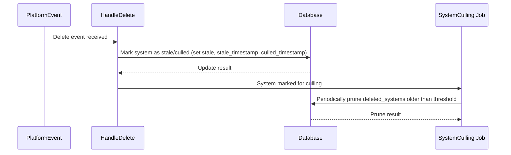
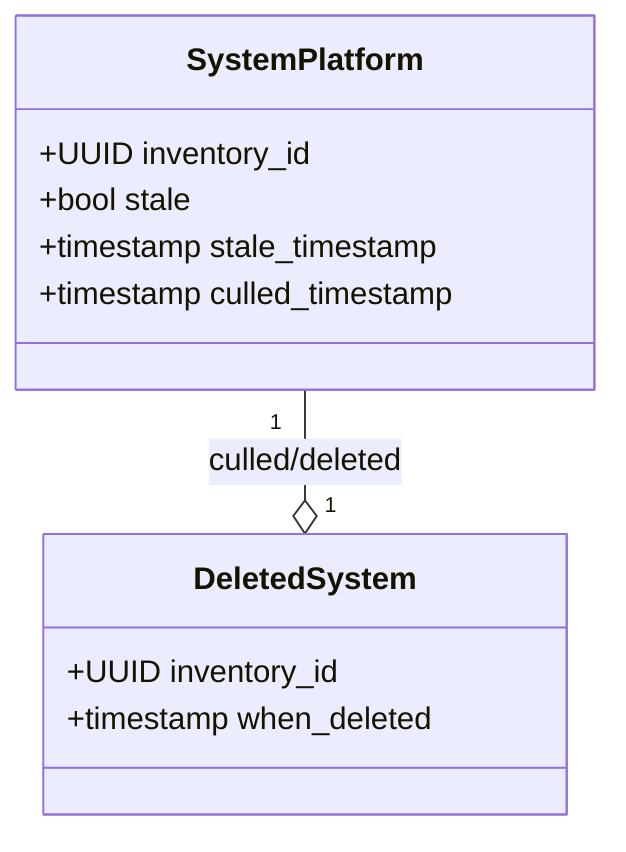
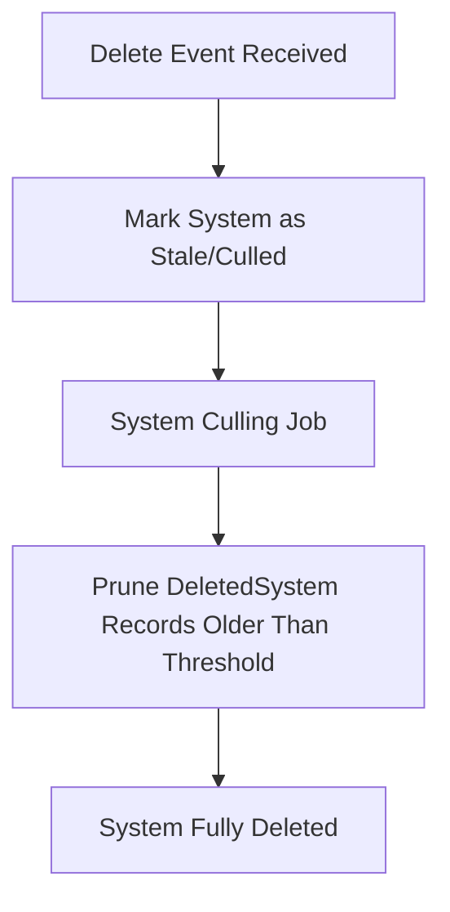

# Pull Request #1782: RHINENG-19880: defer system deletion using stale/culled markers

**Author**: @MichaelMraka
**Created**: August 13, 2025 at 09:39 AM UTC
**Status**: Merged
**Labels**: None
**Base**: `master` ← **Head**: `pr1`

## Description

## Secure Coding Practices Checklist GitHub Link
- https://github.com/RedHatInsights/secure-coding-checklist

## Secure Coding Checklist
- [x] Input Validation
- [x] Output Encoding
- [x] Authentication and Password Management
- [x] Session Management
- [x] Access Control
- [x] Cryptographic Practices
- [x] Error Handling and Logging
- [x] Data Protection
- [x] Communication Security
- [x] System Configuration
- [x] Database Security
- [x] File Management
- [x] Memory Management
- [x] General Coding Practices

## Summary by Sourcery

Defer system deletion by marking records as stale and culled and prune them in the background system_culling job, update HandleDelete accordingly, and revise tests to cover the new deletion and pruning workflows

New Features:
- Mark systems as stale and culled instead of immediately removing them to defer physical deletion
- Introduce pruneDeletedSystems function in the system_culling task to purge old DeletedSystem entries

Enhancements:
- Modify HandleDelete to update stale and culled timestamps rather than calling the delete_system stored procedure
- Add DeletedSystemsThreshold configuration for controlling how long deleted records are retained

Tests:
- Update listener tests to assert stale and culled markers and cover delete–upload interactions
- Add TestPruneDeletedSystems to verify pruning of DeletedSystem records
- Introduce assertSystemStaleAndCulled test helper and include DeletedSystem cleanup in common test teardown

---

## Discussion

### Comment by @jira-linking on August 13, 2025 at 09:39 AM UTC

Referenced Jiras:
https://issues.redhat.com/browse/RHINENG-19880


### Comment by @sourcery-ai on August 13, 2025 at 09:39 AM UTC

<!-- Generated by sourcery-ai[bot]: start review_guide -->

## Reviewer's Guide

Instead of immediately deleting systems, this PR updates HandleDelete to mark records as stale/culled, adds a pruneDeletedSystems routine (with a configurable threshold) to the system_culling job, and adjusts tests to validate the new stale/cull and pruning behavior.

#### Sequence diagram for deferred system deletion in HandleDelete



#### Class diagram for updated SystemPlatform and DeletedSystem handling



#### Flow diagram for system deletion and culling process



### File-Level Changes

| Change | Details | Files |
| ------ | ------- | ----- |
| Defer system deletion by marking records rather than removing them immediately | <ul><li>Replaced delete_system SQL call with GORM Updates setting stale, stale_timestamp, and culled_timestamp</li><li>Removed immediate cleanup of DeletedSystem entries from HandleDelete</li><li>Enhanced error wrapping and logging in HandleDelete</li></ul> | `listener/events.go` |
| Implement pruning of deleted_systems with limit and threshold | <ul><li>Added pruneDeletedSystems(tx, limit) to delete aged DeletedSystem rows in batches</li><li>Integrated pruneDeletedSystems into runSystemCulling with logging of pruned count</li><li>Introduced DeletedSystemsThreshold config in tasks/config.go</li></ul> | `tasks/system_culling/system_culling.go`<br/>`tasks/config.go` |
| Update tests to assert stale/cull semantics and pruning | <ul><li>Modified deletion tests to use assertSystemStaleAndCulled and clean up DeletedSystem table</li><li>Added assertSystemStaleAndCulled helper in listener/common_test.go</li><li>Added TestPruneDeletedSystems in system_culling tests</li></ul> | `listener/events_test.go`<br/>`listener/common_test.go`<br/>`tasks/system_culling/system_culling_test.go` |

---

<details>
<summary>Tips and commands</summary>

#### Interacting with Sourcery

- **Trigger a new review:** Comment `@sourcery-ai review` on the pull request.
- **Continue discussions:** Reply directly to Sourcery's review comments.
- **Generate a GitHub issue from a review comment:** Ask Sourcery to create an
  issue from a review comment by replying to it. You can also reply to a
  review comment with `@sourcery-ai issue` to create an issue from it.
- **Generate a pull request title:** Write `@sourcery-ai` anywhere in the pull
  request title to generate a title at any time. You can also comment
  `@sourcery-ai title` on the pull request to (re-)generate the title at any time.
- **Generate a pull request summary:** Write `@sourcery-ai summary` anywhere in
  the pull request body to generate a PR summary at any time exactly where you
  want it. You can also comment `@sourcery-ai summary` on the pull request to
  (re-)generate the summary at any time.
- **Generate reviewer's guide:** Comment `@sourcery-ai guide` on the pull
  request to (re-)generate the reviewer's guide at any time.
- **Resolve all Sourcery comments:** Comment `@sourcery-ai resolve` on the
  pull request to resolve all Sourcery comments. Useful if you've already
  addressed all the comments and don't want to see them anymore.
- **Dismiss all Sourcery reviews:** Comment `@sourcery-ai dismiss` on the pull
  request to dismiss all existing Sourcery reviews. Especially useful if you
  want to start fresh with a new review - don't forget to comment
  `@sourcery-ai review` to trigger a new review!

#### Customizing Your Experience

Access your [dashboard](https://app.sourcery.ai) to:
- Enable or disable review features such as the Sourcery-generated pull request
  summary, the reviewer's guide, and others.
- Change the review language.
- Add, remove or edit custom review instructions.
- Adjust other review settings.

#### Getting Help

- [Contact our support team](mailto:support@sourcery.ai) for questions or feedback.
- Visit our [documentation](https://docs.sourcery.ai) for detailed guides and information.
- Keep in touch with the Sourcery team by following us on [X/Twitter](https://x.com/SourceryAI), [LinkedIn](https://www.linkedin.com/company/sourcery-ai/) or [GitHub](https://github.com/sourcery-ai).

</details>

<!-- Generated by sourcery-ai[bot]: end review_guide -->

### Comment by @codecov-commenter on August 13, 2025 at 09:44 AM UTC

## [Codecov](https://app.codecov.io/gh/RedHatInsights/patchman-engine/pull/1782?dropdown=coverage&src=pr&el=h1&utm_medium=referral&utm_source=github&utm_content=comment&utm_campaign=pr+comments&utm_term=RedHatInsights) Report
:x: Patch coverage is `58.33333%` with `10 lines` in your changes missing coverage. Please review.
:warning: Please [upload](https://docs.codecov.com/docs/codecov-uploader) report for BASE (`master@a93aa88`). [Learn more](https://docs.codecov.io/docs/error-reference?utm_medium=referral&utm_source=github&utm_content=comment&utm_campaign=pr+comments&utm_term=RedHatInsights#section-missing-base-commit) about missing BASE report.

| [Files with missing lines](https://app.codecov.io/gh/RedHatInsights/patchman-engine/pull/1782?dropdown=coverage&src=pr&el=tree&utm_medium=referral&utm_source=github&utm_content=comment&utm_campaign=pr+comments&utm_term=RedHatInsights) | Patch % | Lines |
|---|---|---|
| [tasks/system\_culling/system\_culling.go](https://app.codecov.io/gh/RedHatInsights/patchman-engine/pull/1782?src=pr&el=tree&filepath=tasks%2Fsystem_culling%2Fsystem_culling.go&utm_medium=referral&utm_source=github&utm_content=comment&utm_campaign=pr+comments&utm_term=RedHatInsights#diff-dGFza3Mvc3lzdGVtX2N1bGxpbmcvc3lzdGVtX2N1bGxpbmcuZ28=) | 53.33% | [7 Missing :warning: ](https://app.codecov.io/gh/RedHatInsights/patchman-engine/pull/1782?src=pr&el=tree&utm_medium=referral&utm_source=github&utm_content=comment&utm_campaign=pr+comments&utm_term=RedHatInsights) |
| [listener/events.go](https://app.codecov.io/gh/RedHatInsights/patchman-engine/pull/1782?src=pr&el=tree&filepath=listener%2Fevents.go&utm_medium=referral&utm_source=github&utm_content=comment&utm_campaign=pr+comments&utm_term=RedHatInsights#diff-bGlzdGVuZXIvZXZlbnRzLmdv) | 66.66% | [3 Missing :warning: ](https://app.codecov.io/gh/RedHatInsights/patchman-engine/pull/1782?src=pr&el=tree&utm_medium=referral&utm_source=github&utm_content=comment&utm_campaign=pr+comments&utm_term=RedHatInsights) |

<details><summary>Additional details and impacted files</summary>


```diff
@@            Coverage Diff            @@
##             master    #1782   +/-   ##
=========================================
  Coverage          ?   54.85%           
=========================================
  Files             ?      140           
  Lines             ?    10875           
  Branches          ?        0           
=========================================
  Hits              ?     5966           
  Misses            ?     4373           
  Partials          ?      536           
```

| [Flag](https://app.codecov.io/gh/RedHatInsights/patchman-engine/pull/1782/flags?src=pr&el=flags&utm_medium=referral&utm_source=github&utm_content=comment&utm_campaign=pr+comments&utm_term=RedHatInsights) | Coverage Δ | |
|---|---|---|
| [unittests](https://app.codecov.io/gh/RedHatInsights/patchman-engine/pull/1782/flags?src=pr&el=flag&utm_medium=referral&utm_source=github&utm_content=comment&utm_campaign=pr+comments&utm_term=RedHatInsights) | `54.85% <58.33%> (?)` | |

Flags with carried forward coverage won't be shown. [Click here](https://docs.codecov.io/docs/carryforward-flags?utm_medium=referral&utm_source=github&utm_content=comment&utm_campaign=pr+comments&utm_term=RedHatInsights#carryforward-flags-in-the-pull-request-comment) to find out more.
</details>

[:umbrella: View full report in Codecov by Sentry](https://app.codecov.io/gh/RedHatInsights/patchman-engine/pull/1782?dropdown=coverage&src=pr&el=continue&utm_medium=referral&utm_source=github&utm_content=comment&utm_campaign=pr+comments&utm_term=RedHatInsights).   
:loudspeaker: Have feedback on the report? [Share it here](https://about.codecov.io/codecov-pr-comment-feedback/?utm_medium=referral&utm_source=github&utm_content=comment&utm_campaign=pr+comments&utm_term=RedHatInsights).
<details><summary> :rocket: New features to boost your workflow: </summary>

- :snowflake: [Test Analytics](https://docs.codecov.com/docs/test-analytics): Detect flaky tests, report on failures, and find test suite problems.
</details>

### Comment by @MichaelMraka on August 13, 2025 at 10:26 AM UTC

/retest

### Comment by @MichaelMraka on August 14, 2025 at 01:29 PM UTC

/retest

---

## Reviews

### Review by @sourcery-ai - Commented on August 13, 2025 at 09:39 AM UTC

Hey @MichaelMraka - I've reviewed your changes - here's some feedback:

- Ensure that HandleDelete also creates entries in the DeletedSystem table (or otherwise populates it) so that pruneDeletedSystems can actually find and prune stale records.
- Tests that assert against time.Now() on stale_timestamp and culled_timestamp may be flaky—consider injecting a clock or using a time window assertion instead.
- Consider making the pruneDeletedSystems limit configurable via the tasks config rather than relying on the hardcoded tasks.DeleteCulledSystemsLimit for easier tuning.

<details>
<summary>Prompt for AI Agents</summary>

~~~markdown
Please address the comments from this code review:
## Overall Comments
- Ensure that HandleDelete also creates entries in the DeletedSystem table (or otherwise populates it) so that pruneDeletedSystems can actually find and prune stale records.
- Tests that assert against time.Now() on stale_timestamp and culled_timestamp may be flaky—consider injecting a clock or using a time window assertion instead.
- Consider making the pruneDeletedSystems limit configurable via the tasks config rather than relying on the hardcoded tasks.DeleteCulledSystemsLimit for easier tuning.
~~~

</details>

***

<details>
<summary>Sourcery is free for open source - if you like our reviews please consider sharing them ✨</summary>

- [X](https://twitter.com/intent/tweet?text=I%20just%20got%20an%20instant%20code%20review%20from%20%40SourceryAI%2C%20and%20it%20was%20brilliant%21%20It%27s%20free%20for%20open%20source%20and%20has%20a%20free%20trial%20for%20private%20code.%20Check%20it%20out%20https%3A//sourcery.ai)
- [Mastodon](https://mastodon.social/share?text=I%20just%20got%20an%20instant%20code%20review%20from%20%40SourceryAI%2C%20and%20it%20was%20brilliant%21%20It%27s%20free%20for%20open%20source%20and%20has%20a%20free%20trial%20for%20private%20code.%20Check%20it%20out%20https%3A//sourcery.ai)
- [LinkedIn](https://www.linkedin.com/sharing/share-offsite/?url=https://sourcery.ai)
- [Facebook](https://www.facebook.com/sharer/sharer.php?u=https://sourcery.ai)

</details>

<sub>
Help me be more useful! Please click 👍 or 👎 on each comment and I'll use the feedback to improve your reviews.
</sub>

### Review by @Dugowitch - Approved on August 14, 2025 at 03:09 PM UTC

---

*Archived from: https://github.com/RedHatInsights/patchman-engine/pull/1782*
