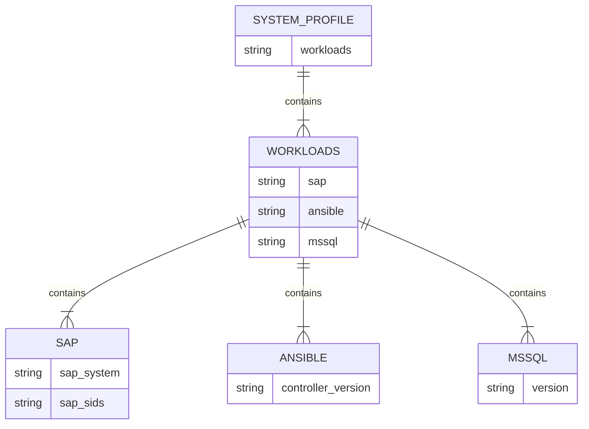
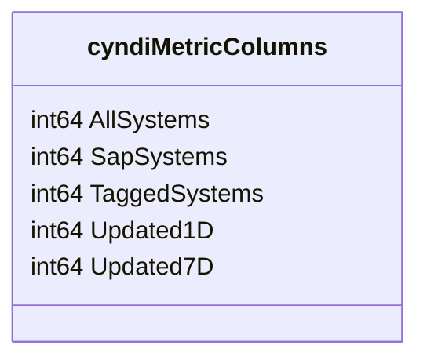

# Pull Request #1792: RHINENG-20067: workload json change

**Author**: @MichaelMraka
**Created**: August 19, 2025 at 12:28 PM UTC
**Status**: Merged
**Labels**: None
**Base**: `master` ← **Head**: `pr2`

## Description

## Secure Coding Practices Checklist GitHub Link
- https://github.com/RedHatInsights/secure-coding-checklist

## Secure Coding Checklist
- [x] Input Validation
- [x] Output Encoding
- [x] Authentication and Password Management
- [x] Session Management
- [x] Access Control
- [x] Cryptographic Practices
- [x] Error Handling and Logging
- [x] Data Protection
- [x] Communication Security
- [x] System Configuration
- [x] Database Security
- [x] File Management
- [x] Memory Management
- [x] General Coding Practices

## Summary by Sourcery

Move workload-related system_profile fields under a new "workloads" JSON key and update query builders, filter mappings, metrics queries, and test data to use the new JSON paths.

Enhancements:
- Migrate sap, ansible, and mssql attributes in system_profile into a unified "workloads" object
- Refactor nestedFilters and buildInventoryQuery to use direct mappings for new JSON workload paths
- Simplify SQL JSON query construction by removing dynamic key splitting and using predefined nestedFilters entries

Tests:
- Update dev/test_data.sql entries to reflect the new "workloads" JSON structure

---

## Discussion

### Comment by @jira-linking on August 19, 2025 at 12:28 PM UTC

Referenced Jiras:
https://issues.redhat.com/browse/RHINENG-20067


### Comment by @sourcery-ai on August 19, 2025 at 12:28 PM UTC

<!-- Generated by sourcery-ai[bot]: start review_guide -->

## Reviewer's Guide

This PR restructures system_profile JSON handling by moving SAP, Ansible, and MSSQL fields under a new “workloads” node and updates the filtering and query logic throughout the codebase to reference the new paths.

#### Entity relationship diagram for updated system_profile JSON structure



#### Class diagram for updated cyndiMetricColumns struct



### File-Level Changes

| Change | Details | Files |
| ------ | ------- | ----- |
| Refactor nestedFilters mapping to use workloads JSON paths | <ul><li>Removed obsolete backward-compatibility keys</li><li>Replaced map values with explicit ‘workloads’ path expressions</li></ul> | `manager/controllers/utils.go` |
| Simplify filter update logic and query building | <ul><li>Changed filters.Update to use the subject key directly</li><li>Replaced manual JSON path string construction in buildInventoryQuery with nestedFilters lookup</li><li>Removed custom JSON path assembly logic</li></ul> | `manager/controllers/utils.go` |
| Revise test data to wrap workload fields under workloads key | <ul><li>Updated system_profile JSON in INSERTs to nest sap, ansible, mssql under workloads</li></ul> | `dev/test_data.sql` |
| Adjust metrics query to reference new workloads path | <ul><li>Updated SapSystems query filter to ‘system_profile -> workloads -> sap -> sap_system’</li></ul> | `tasks/vmaas_sync/metrics_cyndi.go` |

---

<details>
<summary>Tips and commands</summary>

#### Interacting with Sourcery

- **Trigger a new review:** Comment `@sourcery-ai review` on the pull request.
- **Continue discussions:** Reply directly to Sourcery's review comments.
- **Generate a GitHub issue from a review comment:** Ask Sourcery to create an
  issue from a review comment by replying to it. You can also reply to a
  review comment with `@sourcery-ai issue` to create an issue from it.
- **Generate a pull request title:** Write `@sourcery-ai` anywhere in the pull
  request title to generate a title at any time. You can also comment
  `@sourcery-ai title` on the pull request to (re-)generate the title at any time.
- **Generate a pull request summary:** Write `@sourcery-ai summary` anywhere in
  the pull request body to generate a PR summary at any time exactly where you
  want it. You can also comment `@sourcery-ai summary` on the pull request to
  (re-)generate the summary at any time.
- **Generate reviewer's guide:** Comment `@sourcery-ai guide` on the pull
  request to (re-)generate the reviewer's guide at any time.
- **Resolve all Sourcery comments:** Comment `@sourcery-ai resolve` on the
  pull request to resolve all Sourcery comments. Useful if you've already
  addressed all the comments and don't want to see them anymore.
- **Dismiss all Sourcery reviews:** Comment `@sourcery-ai dismiss` on the pull
  request to dismiss all existing Sourcery reviews. Especially useful if you
  want to start fresh with a new review - don't forget to comment
  `@sourcery-ai review` to trigger a new review!

#### Customizing Your Experience

Access your [dashboard](https://app.sourcery.ai) to:
- Enable or disable review features such as the Sourcery-generated pull request
  summary, the reviewer's guide, and others.
- Change the review language.
- Add, remove or edit custom review instructions.
- Adjust other review settings.

#### Getting Help

- [Contact our support team](mailto:support@sourcery.ai) for questions or feedback.
- Visit our [documentation](https://docs.sourcery.ai) for detailed guides and information.
- Keep in touch with the Sourcery team by following us on [X/Twitter](https://x.com/SourceryAI), [LinkedIn](https://www.linkedin.com/company/sourcery-ai/) or [GitHub](https://github.com/sourcery-ai).

</details>

<!-- Generated by sourcery-ai[bot]: end review_guide -->

### Comment by @Dugowitch on August 20, 2025 at 06:33 AM UTC

/retest

### Comment by @codecov-commenter on August 20, 2025 at 08:24 AM UTC

## [Codecov](https://app.codecov.io/gh/RedHatInsights/patchman-engine/pull/1792?dropdown=coverage&src=pr&el=h1&utm_medium=referral&utm_source=github&utm_content=comment&utm_campaign=pr+comments&utm_term=RedHatInsights) Report
:white_check_mark: All modified and coverable lines are covered by tests.
:white_check_mark: Project coverage is 54.83%. Comparing base ([`b60c1c4`](https://app.codecov.io/gh/RedHatInsights/patchman-engine/commit/b60c1c4102e9b4bb16b05c26af048dc88630f6c5?dropdown=coverage&el=desc&utm_medium=referral&utm_source=github&utm_content=comment&utm_campaign=pr+comments&utm_term=RedHatInsights)) to head ([`abdd9f9`](https://app.codecov.io/gh/RedHatInsights/patchman-engine/commit/abdd9f9bdad8fb920581e9cc349e94e137076e6b?dropdown=coverage&el=desc&utm_medium=referral&utm_source=github&utm_content=comment&utm_campaign=pr+comments&utm_term=RedHatInsights)).

<details><summary>Additional details and impacted files</summary>


```diff
@@            Coverage Diff             @@
##           master    #1792      +/-   ##
==========================================
- Coverage   54.87%   54.83%   -0.05%     
==========================================
  Files         140      140              
  Lines       10879    10869      -10     
==========================================
- Hits         5970     5960      -10     
  Misses       4373     4373              
  Partials      536      536              
```

| [Flag](https://app.codecov.io/gh/RedHatInsights/patchman-engine/pull/1792/flags?src=pr&el=flags&utm_medium=referral&utm_source=github&utm_content=comment&utm_campaign=pr+comments&utm_term=RedHatInsights) | Coverage Δ | |
|---|---|---|
| [unittests](https://app.codecov.io/gh/RedHatInsights/patchman-engine/pull/1792/flags?src=pr&el=flag&utm_medium=referral&utm_source=github&utm_content=comment&utm_campaign=pr+comments&utm_term=RedHatInsights) | `54.83% <100.00%> (-0.05%)` | :arrow_down: |

Flags with carried forward coverage won't be shown. [Click here](https://docs.codecov.io/docs/carryforward-flags?utm_medium=referral&utm_source=github&utm_content=comment&utm_campaign=pr+comments&utm_term=RedHatInsights#carryforward-flags-in-the-pull-request-comment) to find out more.
</details>

[:umbrella: View full report in Codecov by Sentry](https://app.codecov.io/gh/RedHatInsights/patchman-engine/pull/1792?dropdown=coverage&src=pr&el=continue&utm_medium=referral&utm_source=github&utm_content=comment&utm_campaign=pr+comments&utm_term=RedHatInsights).   
:loudspeaker: Have feedback on the report? [Share it here](https://about.codecov.io/codecov-pr-comment-feedback/?utm_medium=referral&utm_source=github&utm_content=comment&utm_campaign=pr+comments&utm_term=RedHatInsights).
<details><summary> :rocket: New features to boost your workflow: </summary>

- :snowflake: [Test Analytics](https://docs.codecov.com/docs/test-analytics): Detect flaky tests, report on failures, and find test suite problems.
</details>

---

## Reviews

### Review by @sourcery-ai - Commented on August 19, 2025 at 12:29 PM UTC

Hey there - I've reviewed your changes - here's some feedback:

- nestedFilters now holds raw SQL path expressions rather than simple map keys; consider renaming it (e.g. sqlFieldPaths) to better convey its purpose.
- The buildInventoryQuery comments and examples are outdated and no longer match the implementation; please update or remove them for clarity.
- Consider adding a fallback or error handling in buildInventoryQuery when a key is missing from nestedFilters to avoid potential panics or unexpected SQL output.

<details>
<summary>Prompt for AI Agents</summary>

~~~markdown
Please address the comments from this code review:
## Overall Comments
- nestedFilters now holds raw SQL path expressions rather than simple map keys; consider renaming it (e.g. sqlFieldPaths) to better convey its purpose.
- The buildInventoryQuery comments and examples are outdated and no longer match the implementation; please update or remove them for clarity.
- Consider adding a fallback or error handling in buildInventoryQuery when a key is missing from nestedFilters to avoid potential panics or unexpected SQL output.
~~~

</details>

***

<details>
<summary>Sourcery is free for open source - if you like our reviews please consider sharing them ✨</summary>

- [X](https://twitter.com/intent/tweet?text=I%20just%20got%20an%20instant%20code%20review%20from%20%40SourceryAI%2C%20and%20it%20was%20brilliant%21%20It%27s%20free%20for%20open%20source%20and%20has%20a%20free%20trial%20for%20private%20code.%20Check%20it%20out%20https%3A//sourcery.ai)
- [Mastodon](https://mastodon.social/share?text=I%20just%20got%20an%20instant%20code%20review%20from%20%40SourceryAI%2C%20and%20it%20was%20brilliant%21%20It%27s%20free%20for%20open%20source%20and%20has%20a%20free%20trial%20for%20private%20code.%20Check%20it%20out%20https%3A//sourcery.ai)
- [LinkedIn](https://www.linkedin.com/sharing/share-offsite/?url=https://sourcery.ai)
- [Facebook](https://www.facebook.com/sharer/sharer.php?u=https://sourcery.ai)

</details>

<sub>
Help me be more useful! Please click 👍 or 👎 on each comment and I'll use the feedback to improve your reviews.
</sub>

### Review by @Dugowitch - Approved on August 20, 2025 at 12:09 PM UTC

looks good to me 🚀

### Review by @strider - Commented on September 09, 2025 at 01:59 PM UTC

### Review by @MichaelMraka - Commented on September 10, 2025 at 09:08 AM UTC

---

*Archived from: https://github.com/RedHatInsights/patchman-engine/pull/1792*
