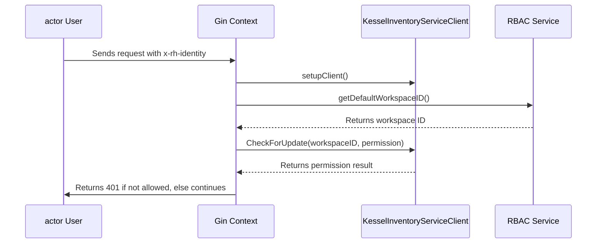
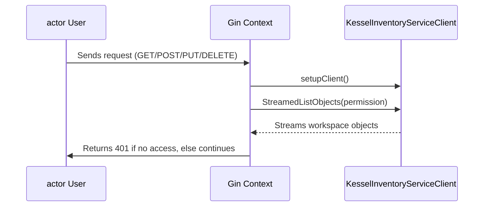
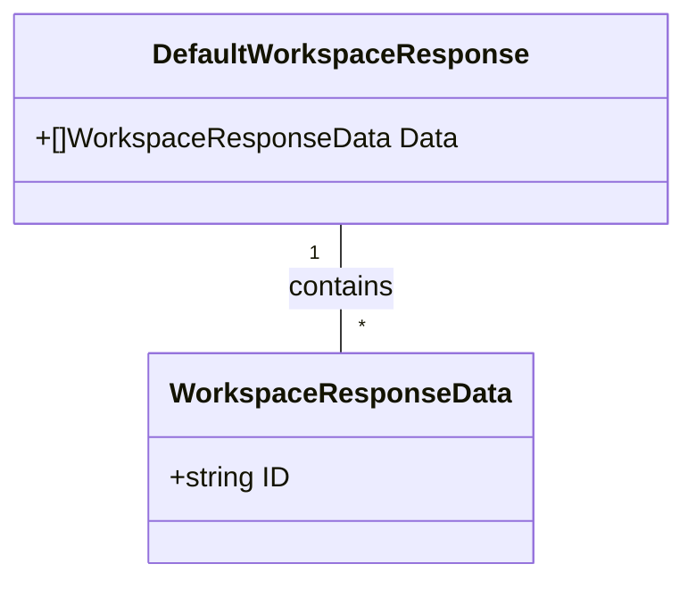
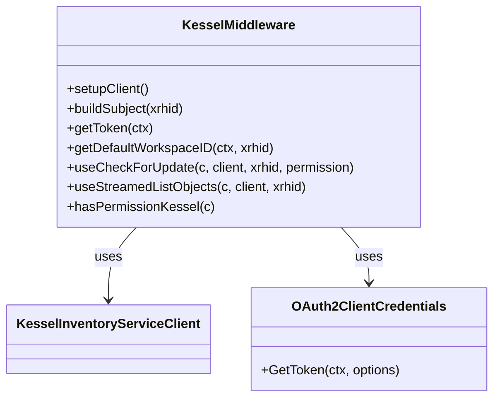

# Pull Request #1832: RHINENG-16026: implement the rest of kessel integration

**Author**: @Dugowitch
**Created**: September 10, 2025 at 09:58 AM UTC
**Status**: Merged
**Labels**: None
**Base**: `master` ← **Head**: `kessel-unite`

## Description

## Secure Coding Practices Checklist GitHub Link
- https://github.com/RedHatInsights/secure-coding-checklist

## Secure Coding Checklist
- [x] Input Validation
- [x] Output Encoding
- [x] Authentication and Password Management
- [x] Session Management
- [x] Access Control
- [x] Cryptographic Practices
- [x] Error Handling and Logging
- [x] Data Protection
- [x] Communication Security
- [x] System Configuration
- [x] Database Security
- [x] File Management
- [x] Memory Management
- [x] General Coding Practices

## Summary by Sourcery

Integrate the new kessel-sdk-go client into Kessel middleware with OAuth2 authentication, default workspace scoping, method- and handler-based permission checks, and update related mocks, handlers, and tests.

New Features:
- Introduce OAuth2 client credentials flow for authenticating with Kessel inventory service
- Add RBAC default workspace lookup to enforce workspace scoping in middleware
- Implement granular permission checks via CheckForUpdate in Kessel middleware
- Implement streaming inventory group retrieval via StreamedListObjects

Enhancements:
- Refactor hasPermissionKessel middleware to use new Kessel SDK client builder and unified permission flows
- Replace old inventory-client-go usage with kessel-sdk-go v1beta2 and update import paths
- Consolidate workspace grouping logic into processWorkspaces helper

Tests:
- Add tests for getDefaultWorkspaceID, useCheckForUpdate, useStreamedListObjects, and updated setupClient scenarios

Chores:
- Update go.mod to replace old Kessel modules with kessel-sdk-go v1.1.0
- Extend platform mock server to serve RBAC v2 workspaces endpoint
- Define WorkspaceResponseData and DefaultWorkspaceResponse types in base/rbac

---

## Discussion

### Comment by @jira-linking on September 10, 2025 at 09:58 AM UTC

Referenced Jiras:
https://issues.redhat.com/browse/RHINENG-20576
https://issues.redhat.com/browse/RHINENG-20577
https://issues.redhat.com/browse/RHINENG-19163


### Comment by @sourcery-ai on September 10, 2025 at 09:58 AM UTC

<!-- Generated by sourcery-ai[bot]: start review_guide -->

## Reviewer's Guide

This PR replaces the legacy project-kessel client with the new kessel-sdk-go v1beta2, implements OAuth2 client credentials and dynamic RBAC workspace lookup, refactors the Gin middleware to perform both granular and method-based Kessel permission checks, and updates tests and platform mocks to cover the new flows.

#### Sequence diagram for Kessel permission check middleware



#### Sequence diagram for method-based permission check with StreamedListObjects



#### Class diagram for new RBAC workspace response types



#### Class diagram for Kessel middleware refactor



### File-Level Changes

| Change | Details | Files |
| ------ | ------- | ----- |
| Migrate from project-kessel to kessel-sdk-go v1beta2 | <ul><li>Switched import paths to kessel-sdk-go</li><li>Updated setupClient builder to use new ClientBuilder</li><li>Replaced streaming server and client types to v1beta2</li><li>Bumped go.mod/go.sum to v1.1.0</li><li>Removed old inventory-client-go code</li></ul> | `manager/middlewares/kessel.go`<br/>`go.mod`<br/>`go.sum`<br/>`platform/kessel.go`<br/>`manager/middlewares/kessel_test.go` |
| Add OAuth2 client credentials and default workspace lookup | <ul><li>Defined credentials with NewOAuth2ClientCredentials</li><li>Extended setupClient to enable OAuth2 and insecure TLS</li><li>Implemented getToken and getDefaultWorkspaceID calling RBAC v2 workspaces API</li><li>Added DefaultWorkspaceResponse types</li></ul> | `manager/middlewares/kessel.go`<br/>`platform/rbac.go`<br/>`base/rbac/rbac.go` |
| Refactor permission middleware for granular and method-based checks | <ul><li>Introduced granularPermissions map for specific handlers</li><li>Created useCheckForUpdate for update/delete operations</li><li>Created useStreamedListObjects for view/edit operations</li><li>Integrated both flows in hasPermissionKessel</li></ul> | `manager/middlewares/kessel.go` |
| Revise and extend unit tests and mocks | <ul><li>Updated TestSetupClient to handle client and conn</li><li>Added tests for processWorkspaces, getDefaultWorkspaceID, useCheckForUpdate, useStreamedListObjects</li><li>Mocked XRHID and gRPC client in helpers</li><li>Extended platform rbac mock endpoint</li></ul> | `manager/middlewares/kessel_test.go`<br/>`platform/kessel.go`<br/>`platform/rbac.go` |

---

<details>
<summary>Tips and commands</summary>

#### Interacting with Sourcery

- **Trigger a new review:** Comment `@sourcery-ai review` on the pull request.
- **Continue discussions:** Reply directly to Sourcery's review comments.
- **Generate a GitHub issue from a review comment:** Ask Sourcery to create an
  issue from a review comment by replying to it. You can also reply to a
  review comment with `@sourcery-ai issue` to create an issue from it.
- **Generate a pull request title:** Write `@sourcery-ai` anywhere in the pull
  request title to generate a title at any time. You can also comment
  `@sourcery-ai title` on the pull request to (re-)generate the title at any time.
- **Generate a pull request summary:** Write `@sourcery-ai summary` anywhere in
  the pull request body to generate a PR summary at any time exactly where you
  want it. You can also comment `@sourcery-ai summary` on the pull request to
  (re-)generate the summary at any time.
- **Generate reviewer's guide:** Comment `@sourcery-ai guide` on the pull
  request to (re-)generate the reviewer's guide at any time.
- **Resolve all Sourcery comments:** Comment `@sourcery-ai resolve` on the
  pull request to resolve all Sourcery comments. Useful if you've already
  addressed all the comments and don't want to see them anymore.
- **Dismiss all Sourcery reviews:** Comment `@sourcery-ai dismiss` on the pull
  request to dismiss all existing Sourcery reviews. Especially useful if you
  want to start fresh with a new review - don't forget to comment
  `@sourcery-ai review` to trigger a new review!

#### Customizing Your Experience

Access your [dashboard](https://app.sourcery.ai) to:
- Enable or disable review features such as the Sourcery-generated pull request
  summary, the reviewer's guide, and others.
- Change the review language.
- Add, remove or edit custom review instructions.
- Adjust other review settings.

#### Getting Help

- [Contact our support team](mailto:support@sourcery.ai) for questions or feedback.
- Visit our [documentation](https://docs.sourcery.ai) for detailed guides and information.
- Keep in touch with the Sourcery team by following us on [X/Twitter](https://x.com/SourceryAI), [LinkedIn](https://www.linkedin.com/company/sourcery-ai/) or [GitHub](https://github.com/sourcery-ai).

</details>

<!-- Generated by sourcery-ai[bot]: end review_guide -->

### Comment by @codecov-commenter on September 10, 2025 at 10:03 AM UTC

## [Codecov](https://app.codecov.io/gh/RedHatInsights/patchman-engine/pull/1832?dropdown=coverage&src=pr&el=h1&utm_medium=referral&utm_source=github&utm_content=comment&utm_campaign=pr+comments&utm_term=RedHatInsights) Report
:x: Patch coverage is `47.33333%` with `79 lines` in your changes missing coverage. Please review.
:white_check_mark: Project coverage is 54.65%. Comparing base ([`a7b2ba3`](https://app.codecov.io/gh/RedHatInsights/patchman-engine/commit/a7b2ba3012c6e7b30484a19c6f516b992125671f?dropdown=coverage&el=desc&utm_medium=referral&utm_source=github&utm_content=comment&utm_campaign=pr+comments&utm_term=RedHatInsights)) to head ([`c467b12`](https://app.codecov.io/gh/RedHatInsights/patchman-engine/commit/c467b128d01e71f9daf20b5cc49c2858125090c4?dropdown=coverage&el=desc&utm_medium=referral&utm_source=github&utm_content=comment&utm_campaign=pr+comments&utm_term=RedHatInsights)).

| [Files with missing lines](https://app.codecov.io/gh/RedHatInsights/patchman-engine/pull/1832?dropdown=coverage&src=pr&el=tree&utm_medium=referral&utm_source=github&utm_content=comment&utm_campaign=pr+comments&utm_term=RedHatInsights) | Patch % | Lines |
|---|---|---|
| [manager/middlewares/kessel.go](https://app.codecov.io/gh/RedHatInsights/patchman-engine/pull/1832?src=pr&el=tree&filepath=manager%2Fmiddlewares%2Fkessel.go&utm_medium=referral&utm_source=github&utm_content=comment&utm_campaign=pr+comments&utm_term=RedHatInsights#diff-bWFuYWdlci9taWRkbGV3YXJlcy9rZXNzZWwuZ28=) | 53.78% | [50 Missing and 11 partials :warning: ](https://app.codecov.io/gh/RedHatInsights/patchman-engine/pull/1832?src=pr&el=tree&utm_medium=referral&utm_source=github&utm_content=comment&utm_campaign=pr+comments&utm_term=RedHatInsights) |
| [platform/rbac.go](https://app.codecov.io/gh/RedHatInsights/patchman-engine/pull/1832?src=pr&el=tree&filepath=platform%2Frbac.go&utm_medium=referral&utm_source=github&utm_content=comment&utm_campaign=pr+comments&utm_term=RedHatInsights#diff-cGxhdGZvcm0vcmJhYy5nbw==) | 0.00% | [18 Missing :warning: ](https://app.codecov.io/gh/RedHatInsights/patchman-engine/pull/1832?src=pr&el=tree&utm_medium=referral&utm_source=github&utm_content=comment&utm_campaign=pr+comments&utm_term=RedHatInsights) |

<details><summary>Additional details and impacted files</summary>


```diff
@@            Coverage Diff             @@
##           master    #1832      +/-   ##
==========================================
- Coverage   54.87%   54.65%   -0.22%     
==========================================
  Files         140      140              
  Lines       10878    10960      +82     
==========================================
+ Hits         5969     5990      +21     
- Misses       4373     4425      +52     
- Partials      536      545       +9     
```

| [Flag](https://app.codecov.io/gh/RedHatInsights/patchman-engine/pull/1832/flags?src=pr&el=flags&utm_medium=referral&utm_source=github&utm_content=comment&utm_campaign=pr+comments&utm_term=RedHatInsights) | Coverage Δ | |
|---|---|---|
| [unittests](https://app.codecov.io/gh/RedHatInsights/patchman-engine/pull/1832/flags?src=pr&el=flag&utm_medium=referral&utm_source=github&utm_content=comment&utm_campaign=pr+comments&utm_term=RedHatInsights) | `54.65% <47.33%> (-0.22%)` | :arrow_down: |

Flags with carried forward coverage won't be shown. [Click here](https://docs.codecov.io/docs/carryforward-flags?utm_medium=referral&utm_source=github&utm_content=comment&utm_campaign=pr+comments&utm_term=RedHatInsights#carryforward-flags-in-the-pull-request-comment) to find out more.
</details>

[:umbrella: View full report in Codecov by Sentry](https://app.codecov.io/gh/RedHatInsights/patchman-engine/pull/1832?dropdown=coverage&src=pr&el=continue&utm_medium=referral&utm_source=github&utm_content=comment&utm_campaign=pr+comments&utm_term=RedHatInsights).   
:loudspeaker: Have feedback on the report? [Share it here](https://about.codecov.io/codecov-pr-comment-feedback/?utm_medium=referral&utm_source=github&utm_content=comment&utm_campaign=pr+comments&utm_term=RedHatInsights).
<details><summary> :rocket: New features to boost your workflow: </summary>

- :snowflake: [Test Analytics](https://docs.codecov.com/docs/test-analytics): Detect flaky tests, report on failures, and find test suite problems.
</details>

---

## Reviews

### Review by @sourcery-ai - Commented on September 10, 2025 at 09:59 AM UTC

Hey there - I've reviewed your changes - here's some feedback:

- Extract common context and timeout handling for both gRPC and HTTP client calls into a shared helper to reduce duplication and ensure consistent cancellation behavior.
- Enhance `processWorkspaces` to log or return parse errors when skipping invalid groups, aiding debugging when no inventory groups are returned.
- Replace hardcoded handler names in the `granularPermissions` map with constants or a registration mechanism to prevent mismatches when handlers are refactored.

<details>
<summary>Prompt for AI Agents</summary>

~~~markdown
Please address the comments from this code review:
## Overall Comments
- Extract common context and timeout handling for both gRPC and HTTP client calls into a shared helper to reduce duplication and ensure consistent cancellation behavior.
- Enhance `processWorkspaces` to log or return parse errors when skipping invalid groups, aiding debugging when no inventory groups are returned.
- Replace hardcoded handler names in the `granularPermissions` map with constants or a registration mechanism to prevent mismatches when handlers are refactored.
~~~

</details>

***

<details>
<summary>Sourcery is free for open source - if you like our reviews please consider sharing them ✨</summary>

- [X](https://twitter.com/intent/tweet?text=I%20just%20got%20an%20instant%20code%20review%20from%20%40SourceryAI%2C%20and%20it%20was%20brilliant%21%20It%27s%20free%20for%20open%20source%20and%20has%20a%20free%20trial%20for%20private%20code.%20Check%20it%20out%20https%3A//sourcery.ai)
- [Mastodon](https://mastodon.social/share?text=I%20just%20got%20an%20instant%20code%20review%20from%20%40SourceryAI%2C%20and%20it%20was%20brilliant%21%20It%27s%20free%20for%20open%20source%20and%20has%20a%20free%20trial%20for%20private%20code.%20Check%20it%20out%20https%3A//sourcery.ai)
- [LinkedIn](https://www.linkedin.com/sharing/share-offsite/?url=https://sourcery.ai)
- [Facebook](https://www.facebook.com/sharer/sharer.php?u=https://sourcery.ai)

</details>

<sub>
Help me be more useful! Please click 👍 or 👎 on each comment and I'll use the feedback to improve your reviews.
</sub>

### Review by @MichaelMraka - Commented on September 10, 2025 at 11:14 AM UTC

### Review by @MichaelMraka - Commented on September 10, 2025 at 12:03 PM UTC

### Review by @MichaelMraka - Commented on September 10, 2025 at 12:04 PM UTC

### Review by @MichaelMraka - Commented on September 10, 2025 at 12:13 PM UTC

### Review by @Dugowitch - Commented on September 11, 2025 at 08:55 AM UTC

### Review by @Dugowitch - Commented on September 11, 2025 at 09:08 AM UTC

### Review by @Dugowitch - Commented on September 11, 2025 at 09:11 AM UTC

### Review by @MichaelMraka - Approved on September 11, 2025 at 01:03 PM UTC

---

*Archived from: https://github.com/RedHatInsights/patchman-engine/pull/1832*
