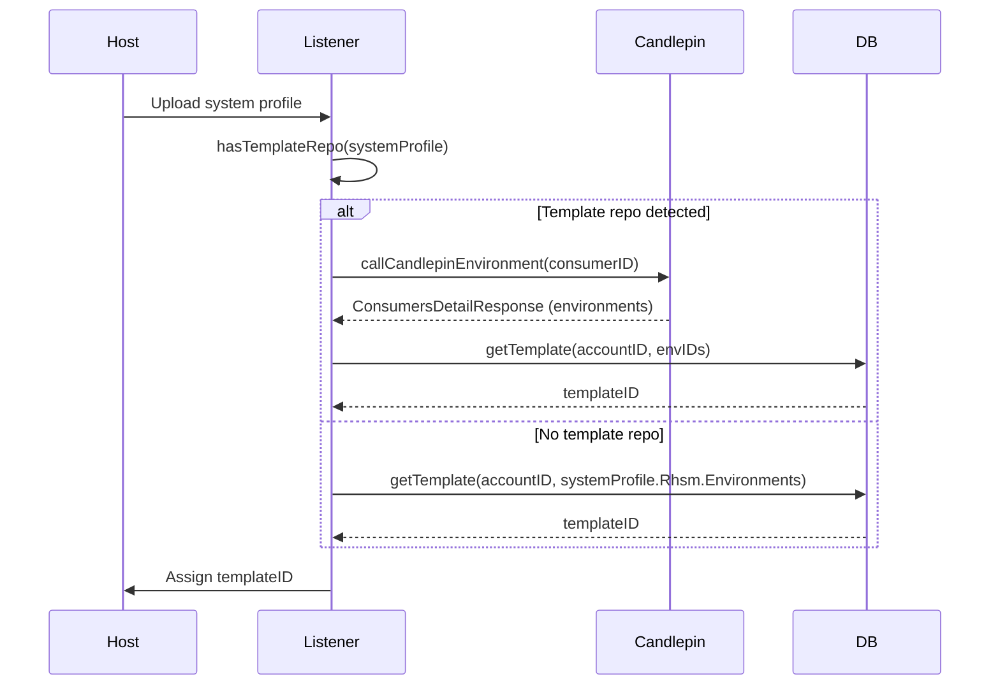
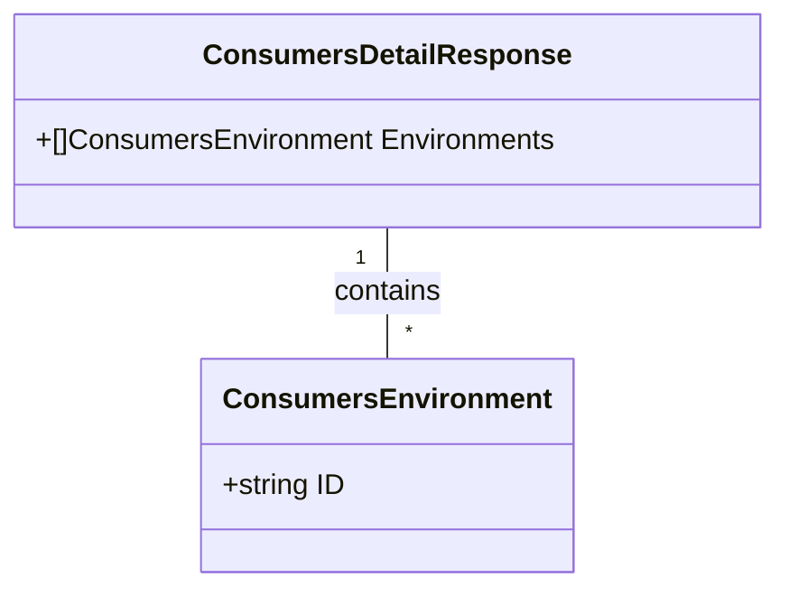

# Pull Request #1866: RHINENG-20967: improve template assignment

**Author**: @MichaelMraka
**Created**: October 03, 2025 at 04:19 PM UTC
**Status**: Merged
**Labels**: None
**Base**: `master` ← **Head**: `pr3`

## Description

## Secure Coding Practices Checklist GitHub Link
- https://github.com/RedHatInsights/secure-coding-checklist

## Secure Coding Checklist
- [x] Input Validation
- [x] Output Encoding
- [x] Authentication and Password Management
- [x] Session Management
- [x] Access Control
- [x] Cryptographic Practices
- [x] Error Handling and Logging
- [x] Data Protection
- [x] Communication Security
- [x] System Configuration
- [x] Database Security
- [x] File Management
- [x] Memory Management
- [x] General Coding Practices

## Summary by Sourcery

Add support for template repository detection and dynamic template assignment via Candlepin, enhance logging, update YAML and test configurations, and extend testing suite accordingly.

New Features:
- Integrate Candlepin API call to fetch consumer environments for template assignment
- Support detection of enabled template repositories and conditional template assignment based on repository URLs
- Implement HTTP GET handler in the platform service to simulate Candlepin consumer responses for testing

Enhancements:
- Introduce regex pattern and hasTemplateRepo helper for identifying template repositories
- Add debug logging in event flushing, host template assignment, yum updates parsing, and system recalculation
- Refactor getYumUpdates to only unmarshal legacy updates when payload is non-empty
- Extend base candlepin types to include ConsumersDetailResponse and ConsumersEnvironment

CI:
- Include gorun.env in the Docker Compose test setup

Deployment:
- Add CANDLEPIN_ADDRESS and certificate secrets to the listener service deployment configuration

Tests:
- Add TestNoHostTemplate to verify absence of template assignment when no template repo is configured
- Update existing hostTemplate tests to use YumRepo-based setup and consumer ID tracking

---

## Discussion

### Comment by @jira-linking on October 03, 2025 at 04:19 PM UTC

Commits missing Jira IDs:
7fb8e1eabb60f0a52f8afe2327ae967b19f21104
Referenced Jiras:
https://issues.redhat.com/browse/RHINENG-20967


### Comment by @sourcery-ai on October 03, 2025 at 04:19 PM UTC

<!-- Generated by sourcery-ai[bot]: start review_guide -->

## Reviewer's Guide

This PR refactors the template assignment flow by introducing a regex-based detection of template repositories, integrating with Candlepin to retrieve environment IDs, and updating hostTemplate to leverage this data; it also adds necessary HTTP handlers and types for Candlepin, enhances debug logging across key modules, updates tests to cover the new logic, and adjusts deployment and compose configurations to supply Candlepin credentials.

#### Sequence diagram for host template assignment with Candlepin integration



#### Class diagram for new and updated Candlepin response types



### File-Level Changes

| Change | Details | Files |
| ------ | ------- | ----- |
| Template repository detection and template assignment overhaul | <ul><li>Defined TemplateRepoPattern and compiled templateRepoPath regex</li><li>Added hasTemplateRepo helper to identify enabled template repos</li><li>Updated hostTemplate to call callCandlepinEnvironment, collect env IDs, and fetch templates</li><li>Logged template assignment details in updateSystemPlatform</li></ul> | `listener/upload.go` |
| Candlepin client integration and HTTP handlers | <ul><li>Initialized candlepinClient via CreateCandlepinClient</li><li>Implemented callCandlepinEnvironment with HTTPCallRetry wrapper</li><li>Added GET consumer handler in platform/candlepin and new ConsumersDetailResponse types</li><li>Updated initCandlepin to register consumer GET route</li></ul> | `listener/rhsm.go`<br/>`listener/upload.go`<br/>`platform/candlepin.go`<br/>`base/candlepin/candlepin.go` |
| Enhanced debug logging | <ul><li>Changed legacy yum updates log from Warn to Debug with emptiness check</li><li>Added LogDebug calls in flushEvalEvents, getYumUpdates, updateSystemPlatform, and Kafka recalc path</li></ul> | `listener/upload.go`<br/>`manager/kafka/kafka.go` |
| Test suite updates for new template logic | <ul><li>Adapted TestHostTemplateRhsmReporter and TestHostTemplatePuptoo to include ConsumerID and YumRepos</li><li>Added TestNoHostTemplate to assert no template on non-matching repos</li></ul> | `listener/upload_test.go` |
| Deployment and test environment configuration | <ul><li>Injected Candlepin env vars (address, cert, key, ca) in clowdapp.yaml</li><li>Included gorun.env in docker-compose.test.yml for local test context</li></ul> | `deploy/clowdapp.yaml`<br/>`docker-compose.test.yml` |

---

<details>
<summary>Tips and commands</summary>

#### Interacting with Sourcery

- **Trigger a new review:** Comment `@sourcery-ai review` on the pull request.
- **Continue discussions:** Reply directly to Sourcery's review comments.
- **Generate a GitHub issue from a review comment:** Ask Sourcery to create an
  issue from a review comment by replying to it. You can also reply to a
  review comment with `@sourcery-ai issue` to create an issue from it.
- **Generate a pull request title:** Write `@sourcery-ai` anywhere in the pull
  request title to generate a title at any time. You can also comment
  `@sourcery-ai title` on the pull request to (re-)generate the title at any time.
- **Generate a pull request summary:** Write `@sourcery-ai summary` anywhere in
  the pull request body to generate a PR summary at any time exactly where you
  want it. You can also comment `@sourcery-ai summary` on the pull request to
  (re-)generate the summary at any time.
- **Generate reviewer's guide:** Comment `@sourcery-ai guide` on the pull
  request to (re-)generate the reviewer's guide at any time.
- **Resolve all Sourcery comments:** Comment `@sourcery-ai resolve` on the
  pull request to resolve all Sourcery comments. Useful if you've already
  addressed all the comments and don't want to see them anymore.
- **Dismiss all Sourcery reviews:** Comment `@sourcery-ai dismiss` on the pull
  request to dismiss all existing Sourcery reviews. Especially useful if you
  want to start fresh with a new review - don't forget to comment
  `@sourcery-ai review` to trigger a new review!

#### Customizing Your Experience

Access your [dashboard](https://app.sourcery.ai) to:
- Enable or disable review features such as the Sourcery-generated pull request
  summary, the reviewer's guide, and others.
- Change the review language.
- Add, remove or edit custom review instructions.
- Adjust other review settings.

#### Getting Help

- [Contact our support team](mailto:support@sourcery.ai) for questions or feedback.
- Visit our [documentation](https://docs.sourcery.ai) for detailed guides and information.
- Keep in touch with the Sourcery team by following us on [X/Twitter](https://x.com/SourceryAI), [LinkedIn](https://www.linkedin.com/company/sourcery-ai/) or [GitHub](https://github.com/sourcery-ai).

</details>

<!-- Generated by sourcery-ai[bot]: end review_guide -->

### Comment by @codecov-commenter on October 03, 2025 at 04:24 PM UTC

## [Codecov](https://app.codecov.io/gh/RedHatInsights/patchman-engine/pull/1866?dropdown=coverage&src=pr&el=h1&utm_medium=referral&utm_source=github&utm_content=comment&utm_campaign=pr+comments&utm_term=RedHatInsights) Report
:x: Patch coverage is `75.92593%` with `13 lines` in your changes missing coverage. Please review.
:white_check_mark: Project coverage is 57.34%. Comparing base ([`0644576`](https://app.codecov.io/gh/RedHatInsights/patchman-engine/commit/064457692bc7f0bc0b50e30bec11e17ef6bcaa83?dropdown=coverage&el=desc&utm_medium=referral&utm_source=github&utm_content=comment&utm_campaign=pr+comments&utm_term=RedHatInsights)) to head ([`347ab8f`](https://app.codecov.io/gh/RedHatInsights/patchman-engine/commit/347ab8f794854308614046f5183ccb2f4a067b1a?dropdown=coverage&el=desc&utm_medium=referral&utm_source=github&utm_content=comment&utm_campaign=pr+comments&utm_term=RedHatInsights)).
:warning: Report is 3 commits behind head on master.

| [Files with missing lines](https://app.codecov.io/gh/RedHatInsights/patchman-engine/pull/1866?dropdown=coverage&src=pr&el=tree&utm_medium=referral&utm_source=github&utm_content=comment&utm_campaign=pr+comments&utm_term=RedHatInsights) | Patch % | Lines |
|---|---|---|
| [listener/upload.go](https://app.codecov.io/gh/RedHatInsights/patchman-engine/pull/1866?src=pr&el=tree&filepath=listener%2Fupload.go&utm_medium=referral&utm_source=github&utm_content=comment&utm_campaign=pr+comments&utm_term=RedHatInsights#diff-bGlzdGVuZXIvdXBsb2FkLmdv) | 66.66% | [8 Missing and 2 partials :warning: ](https://app.codecov.io/gh/RedHatInsights/patchman-engine/pull/1866?src=pr&el=tree&utm_medium=referral&utm_source=github&utm_content=comment&utm_campaign=pr+comments&utm_term=RedHatInsights) |
| [listener/rhsm.go](https://app.codecov.io/gh/RedHatInsights/patchman-engine/pull/1866?src=pr&el=tree&filepath=listener%2Frhsm.go&utm_medium=referral&utm_source=github&utm_content=comment&utm_campaign=pr+comments&utm_term=RedHatInsights#diff-bGlzdGVuZXIvcmhzbS5nbw==) | 86.95% | [2 Missing and 1 partial :warning: ](https://app.codecov.io/gh/RedHatInsights/patchman-engine/pull/1866?src=pr&el=tree&utm_medium=referral&utm_source=github&utm_content=comment&utm_campaign=pr+comments&utm_term=RedHatInsights) |

<details><summary>Additional details and impacted files</summary>


```diff
@@            Coverage Diff             @@
##           master    #1866      +/-   ##
==========================================
+ Coverage   54.44%   57.34%   +2.89%     
==========================================
  Files         138      131       -7     
  Lines       10735    10259     -476     
==========================================
+ Hits         5845     5883      +38     
+ Misses       4350     3834     -516     
- Partials      540      542       +2     
```

| [Flag](https://app.codecov.io/gh/RedHatInsights/patchman-engine/pull/1866/flags?src=pr&el=flags&utm_medium=referral&utm_source=github&utm_content=comment&utm_campaign=pr+comments&utm_term=RedHatInsights) | Coverage Δ | |
|---|---|---|
| [unittests](https://app.codecov.io/gh/RedHatInsights/patchman-engine/pull/1866/flags?src=pr&el=flag&utm_medium=referral&utm_source=github&utm_content=comment&utm_campaign=pr+comments&utm_term=RedHatInsights) | `57.34% <75.92%> (+2.89%)` | :arrow_up: |

Flags with carried forward coverage won't be shown. [Click here](https://docs.codecov.io/docs/carryforward-flags?utm_medium=referral&utm_source=github&utm_content=comment&utm_campaign=pr+comments&utm_term=RedHatInsights#carryforward-flags-in-the-pull-request-comment) to find out more.
</details>

[:umbrella: View full report in Codecov by Sentry](https://app.codecov.io/gh/RedHatInsights/patchman-engine/pull/1866?dropdown=coverage&src=pr&el=continue&utm_medium=referral&utm_source=github&utm_content=comment&utm_campaign=pr+comments&utm_term=RedHatInsights).   
:loudspeaker: Have feedback on the report? [Share it here](https://about.codecov.io/codecov-pr-comment-feedback/?utm_medium=referral&utm_source=github&utm_content=comment&utm_campaign=pr+comments&utm_term=RedHatInsights).
<details><summary> :rocket: New features to boost your workflow: </summary>

- :snowflake: [Test Analytics](https://docs.codecov.com/docs/test-analytics): Detect flaky tests, report on failures, and find test suite problems.
</details>

---

## Reviews

### Review by @sourcery-ai - Commented on October 03, 2025 at 04:20 PM UTC

Hey there - I've reviewed your changes - here's some feedback:

- Consider injecting the candlepinClient (rather than relying on a package-level global) to improve test isolation and make dependencies more explicit.
- Extract the candlepin lookup and template resolution logic out of hostTemplate into its own helper or service so hostTemplate stays focused and easier to maintain.
- When callCandlepinEnvironment fails, it logs a warning but still continues on a nil response—consider returning early or skipping further processing to make error handling more explicit.

<details>
<summary>Prompt for AI Agents</summary>

~~~markdown
Please address the comments from this code review:

## Overall Comments
- Consider injecting the candlepinClient (rather than relying on a package-level global) to improve test isolation and make dependencies more explicit.
- Extract the candlepin lookup and template resolution logic out of hostTemplate into its own helper or service so hostTemplate stays focused and easier to maintain.
- When callCandlepinEnvironment fails, it logs a warning but still continues on a nil response—consider returning early or skipping further processing to make error handling more explicit.

## Individual Comments

### Comment 1
<location> `listener/upload_test.go:500-479` </location>
<code_context>
+	}
+
+	templateID := hostTemplate(database.DB, accountID, host)
+	assert.Nil(t, templateID)
+}
</code_context>

<issue_to_address>
**suggestion (testing):** Missing test for error handling in candlepin API call.

Please add a test that simulates a candlepin API failure to verify error handling and logging in hostTemplate.

Suggested implementation:

```golang
func TestNoHostTemplate(t *testing.T) {
	utils.SkipWithoutDB(t)
	core.SetupTestEnvironment()
	configure()

	accountID := int(1)
	host := &Host{
		ID:       id,
		Reporter: puptooReporter,
	}

	templateID := hostTemplate(database.DB, accountID, host)
	assert.Nil(t, templateID)
}

// Test for error handling in candlepin API call
func TestHostTemplateCandlepinAPIFailure(t *testing.T) {
	utils.SkipWithoutDB(t)
	core.SetupTestEnvironment()
	configure()

	accountID := int(1)
	host := &Host{
		ID:       id,
		Reporter: puptooReporter,
	}

	// Mock candlepin API to simulate failure
	originalCandlepinFunc := candlepin.GetTemplateIDForHost
	candlepin.GetTemplateIDForHost = func(db *gorm.DB, accountID int, host *Host) (string, error) {
		return "", errors.New("candlepin API failure")
	}
	defer func() { candlepin.GetTemplateIDForHost = originalCandlepinFunc }()

	templateID := hostTemplate(database.DB, accountID, host)
	assert.Nil(t, templateID)
	// Optionally, check for log output if your code logs errors
}

```

- Ensure that `candlepin.GetTemplateIDForHost` is the correct function to mock for the API call in your codebase.
- If your error handling in `hostTemplate` logs errors, you may want to add assertions for log output using a log capturing library.
- If `hostTemplate` returns an error instead of nil, adjust the assertion accordingly.
- Make sure to import `"errors"` at the top of the file if not already present.
</issue_to_address>

### Comment 2
<location> `listener/upload.go:333` </location>
<code_context>

 func hostTemplate(tx *gorm.DB, accountID int, host *Host) *int64 {
 	var templateID *int64
-	var err error
</code_context>

<issue_to_address>
**issue (complexity):** Consider refactoring Candlepin environment fetching and template assignment into a helper to simplify control flow and error handling.

```go
// helper to fetch & map Candlepin env IDs (or return nil if none)
func collectTemplateEnvIDs(ctx context.Context, sp *inventory.SystemProfile) ([]string, error) {
    if !hasTemplateRepo(sp) {
        return nil, nil
    }
    resp, err := callCandlepinEnvironment(ctx, sp.ConsumerID)
    if err != nil {
        return nil, errors.Wrap(err, "fetching Candlepin environments")
    }
    if resp == nil || len(resp.Environments) == 0 {
        return nil, nil
    }
    ids := make([]string, len(resp.Environments))
    for i, env := range resp.Environments {
        ids[i] = env.ID
    }
    return ids, nil
}

func hostTemplate(tx *gorm.DB, accountID int, host *Host) *int64 {
    envIDs, err := collectTemplateEnvIDs(base.Context, &host.SystemProfile)
    if err != nil {
        utils.LogWarn("inventoryID", host.ID, "err", err)
        return nil
    }
    if len(envIDs) == 0 {
        return nil
    }

    tmplID, err := getTemplate(tx, accountID, envIDs)
    if err != nil {
        utils.LogWarn("inventoryID", host.ID, "err", errors.Wrap(err, "assigning template"))
    }
    return tmplID
}
```

Steps:
1. Extract Candlepin call + env‐ID mapping into `collectTemplateEnvIDs`.
2. Early return when no template repo or no environments.
3. Keep single `getTemplate` invocation & error path.
4. This flattens nesting, merges duplicate logging, and preserves behavior.
</issue_to_address>

### Comment 3
<location> `listener/rhsm.go:45` </location>
<code_context>
 	return templateID, nil
 }
+
+func callCandlepinEnvironment(ctx context.Context, consumer string) (
+	*candlepin.ConsumersDetailResponse, error) {
+	candlepinEnvConsumersURL := utils.CoreCfg.CandlepinAddress + "/consumers/" + consumer
</code_context>

<issue_to_address>
**issue (complexity):** Consider refactoring by extracting request and URL-building logic into dedicated helper functions to keep callCandlepinEnvironment concise.

Consider extracting the anonymous “do the request + validate status” block into a focused helper (and even pulling URL‐building into its own function). That makes `callCandlepinEnvironment` read almost like:

```go
func callCandlepinEnvironment(ctx context.Context, consumer string) (*candlepin.ConsumersDetailResponse, error) {
    result, err := utils.HTTPCallRetry(
        func() (interface{}, *http.Response, error) {
            return fetchConsumerDetail(ctx, consumer)
        },
        candlepin.CandlepinExpRetries,
        candlepin.CandlepinRetries,
        http.StatusServiceUnavailable,
    )
    if err != nil {
        return nil, errors.Wrap(err, "candlepin /consumers call failed")
    }
    return result.(*candlepin.ConsumersDetailResponse), nil
}
```

And push all the meat into small, reusable helpers:

```go
func fetchConsumerDetail(ctx context.Context, consumer string) (interface{}, *http.Response, error) {
    var detail candlepin.ConsumersDetailResponse
    url := consumerURL(consumer)

    resp, err := candlepinClient.Request(&ctx, http.MethodGet, url, nil, &detail)
    if err != nil {
        return nil, resp, errors.Wrap(candlepin.ErrCandlepin, err.Error())
    }

    status := utils.TryGetStatusCode(resp)
    if status != http.StatusOK && status != http.StatusNoContent {
        return nil, resp, errors.Errorf("candlepin API status %d", status)
    }

    return &detail, resp, nil
}

func consumerURL(consumer string) string {
    return utils.CoreCfg.CandlepinAddress + "/consumers/" + consumer
}
```

This:

- Pulls URL construction into `consumerURL`
- Names the HTTP + status‐check logic in `fetchConsumerDetail`
- Keeps `callCandlepinEnvironment` lean and focused on retry/wrapping only
</issue_to_address>
~~~

</details>

***

<details>
<summary>Sourcery is free for open source - if you like our reviews please consider sharing them ✨</summary>

- [X](https://twitter.com/intent/tweet?text=I%20just%20got%20an%20instant%20code%20review%20from%20%40SourceryAI%2C%20and%20it%20was%20brilliant%21%20It%27s%20free%20for%20open%20source%20and%20has%20a%20free%20trial%20for%20private%20code.%20Check%20it%20out%20https%3A//sourcery.ai)
- [Mastodon](https://mastodon.social/share?text=I%20just%20got%20an%20instant%20code%20review%20from%20%40SourceryAI%2C%20and%20it%20was%20brilliant%21%20It%27s%20free%20for%20open%20source%20and%20has%20a%20free%20trial%20for%20private%20code.%20Check%20it%20out%20https%3A//sourcery.ai)
- [LinkedIn](https://www.linkedin.com/sharing/share-offsite/?url=https://sourcery.ai)
- [Facebook](https://www.facebook.com/sharer/sharer.php?u=https://sourcery.ai)

</details>

<sub>
Help me be more useful! Please click 👍 or 👎 on each comment and I'll use the feedback to improve your reviews.
</sub>

### Review by @jlsherrill - Commented on October 06, 2025 at 12:58 PM UTC

### Review by @jlsherrill - Commented on October 06, 2025 at 01:05 PM UTC

### Review by @MichaelMraka - Commented on October 06, 2025 at 01:09 PM UTC

### Review by @jlsherrill - Approved on October 06, 2025 at 01:10 PM UTC

ACK, happy to test in stage once its there!

### Review by @MichaelMraka - Commented on October 06, 2025 at 01:14 PM UTC

---

*Archived from: https://github.com/RedHatInsights/patchman-engine/pull/1866*
