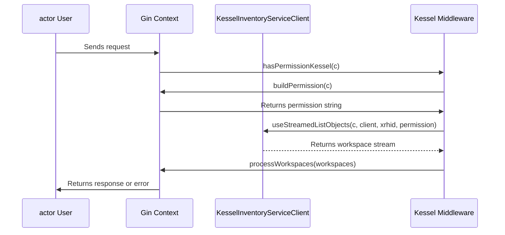

# Pull Request #1878: RHINENG-21230: update Kessel middleware after v2 permission changes

**Author**: @Dugowitch
**Created**: October 10, 2025 at 03:15 PM UTC
**Status**: Merged
**Labels**: None
**Base**: `master` ← **Head**: `RHINENG-21230`

## Description

## Secure Coding Practices Checklist GitHub Link
- https://github.com/RedHatInsights/secure-coding-checklist

## Secure Coding Checklist
- [x] Input Validation
- [x] Output Encoding
- [x] Authentication and Password Management
- [x] Session Management
- [x] Access Control
- [x] Cryptographic Practices
- [x] Error Handling and Logging
- [x] Data Protection
- [x] Communication Security
- [x] System Configuration
- [x] Database Security
- [x] File Management
- [x] Memory Management
- [x] General Coding Practices

## Summary by Sourcery

Update Kessel middleware to align with v2 permission model by removing legacy RBAC token logic, deriving permissions dynamically from handler names and HTTP methods, and simplifying the streamed list workflow

Enhancements:
- Replace granularPermissions map and getDefaultWorkspaceID/useCheckForUpdate logic with a buildPermission function that derives permissions based on handler name and HTTP method
- Refactor useStreamedListObjects to return streamed responses directly, remove aborting logic, and simplify hasPermissionKessel flow
- Remove unused imports, obsolete helper functions, and legacy RBAC token retrieval logic

Tests:
- Add TestBuildPermission and update useStreamedListObjects test to match the new signature
- Remove tests for getDefaultWorkspaceID and useCheckForUpdate and update TestHasPermissionKessel assertions to validate new behavior

---

## Discussion

### Comment by @jira-linking on October 10, 2025 at 03:15 PM UTC

Referenced Jiras:
https://issues.redhat.com/browse/RHINENG-21230


### Comment by @sourcery-ai on October 10, 2025 at 03:15 PM UTC

<!-- Generated by sourcery-ai[bot]: start review_guide -->

## Reviewer's Guide

Refactor Kessel middleware to replace static, legacy permission checks with a dynamic builder, streamline workspace streaming and error handling, and update tests to match the new signatures.

#### Sequence diagram for dynamic permission building and workspace streaming



#### Class diagram for updated Kessel middleware permission handling

```mermaid
classDiagram
    class KesselMiddleware {
    }
    class "buildPermission(c *gin.Context)" {
        +string buildPermission(c)
    }
    class "useStreamedListObjects(c, client, xrhid, permission)" {
        +[]StreamedListObjectsResponse useStreamedListObjects(c, client, xrhid, permission)
    }
    class "hasPermissionKessel(c *gin.Context)" {
        +void hasPermissionKessel(c)
    }
    KesselMiddleware <|-- "buildPermission(c *gin.Context)"
    KesselMiddleware <|-- "useStreamedListObjects(c, client, xrhid, permission)"
    KesselMiddleware <|-- "hasPermissionKessel(c *gin.Context)"
    "hasPermissionKessel(c *gin.Context)" o-- "buildPermission(c *gin.Context)"
    "hasPermissionKessel(c *gin.Context)" o-- "useStreamedListObjects(c, client, xrhid, permission)"
```

### File-Level Changes

| Change | Details | Files |
| ------ | ------- | ----- |
| Remove legacy permission retrieval and static configuration | <ul><li>Delete getToken and getDefaultWorkspaceID functions</li><li>Remove granularPermissions map</li><li>Remove useCheckForUpdate middleware logic</li></ul> | `manager/middlewares/kessel.go` |
| Introduce buildPermission for dynamic permission derivation | <ul><li>Add buildPermission to derive permission strings from handler names and HTTP methods</li></ul> | `manager/middlewares/kessel.go` |
| Refactor useStreamedListObjects signature and error handling | <ul><li>Accept a permission argument and return a slice of workspace responses</li><li>Remove internal abort logic and change errors to be returned instead</li></ul> | `manager/middlewares/kessel.go` |
| Streamline hasPermissionKessel to leverage the new flow | <ul><li>Use buildPermission and updated useStreamedListObjects in sequence</li><li>Process workspace streams via processWorkspaces and abort on missing permissions</li><li>Set inventory groups after successful streaming</li></ul> | `manager/middlewares/kessel.go` |
| Update middleware tests to match new implementations | <ul><li>Add TestBuildPermission for the new builder</li><li>Adapt TestUseStreamedListObjects to assert returned workspaces</li><li>Enhance TestHasPermissionKessel with stronger require/assert checks</li><li>Remove obsolete tests for getDefaultWorkspaceID and useCheckForUpdate</li></ul> | `manager/middlewares/kessel_test.go` |

---

<details>
<summary>Tips and commands</summary>

#### Interacting with Sourcery

- **Trigger a new review:** Comment `@sourcery-ai review` on the pull request.
- **Continue discussions:** Reply directly to Sourcery's review comments.
- **Generate a GitHub issue from a review comment:** Ask Sourcery to create an
  issue from a review comment by replying to it. You can also reply to a
  review comment with `@sourcery-ai issue` to create an issue from it.
- **Generate a pull request title:** Write `@sourcery-ai` anywhere in the pull
  request title to generate a title at any time. You can also comment
  `@sourcery-ai title` on the pull request to (re-)generate the title at any time.
- **Generate a pull request summary:** Write `@sourcery-ai summary` anywhere in
  the pull request body to generate a PR summary at any time exactly where you
  want it. You can also comment `@sourcery-ai summary` on the pull request to
  (re-)generate the summary at any time.
- **Generate reviewer's guide:** Comment `@sourcery-ai guide` on the pull
  request to (re-)generate the reviewer's guide at any time.
- **Resolve all Sourcery comments:** Comment `@sourcery-ai resolve` on the
  pull request to resolve all Sourcery comments. Useful if you've already
  addressed all the comments and don't want to see them anymore.
- **Dismiss all Sourcery reviews:** Comment `@sourcery-ai dismiss` on the pull
  request to dismiss all existing Sourcery reviews. Especially useful if you
  want to start fresh with a new review - don't forget to comment
  `@sourcery-ai review` to trigger a new review!

#### Customizing Your Experience

Access your [dashboard](https://app.sourcery.ai) to:
- Enable or disable review features such as the Sourcery-generated pull request
  summary, the reviewer's guide, and others.
- Change the review language.
- Add, remove or edit custom review instructions.
- Adjust other review settings.

#### Getting Help

- [Contact our support team](mailto:support@sourcery.ai) for questions or feedback.
- Visit our [documentation](https://docs.sourcery.ai) for detailed guides and information.
- Keep in touch with the Sourcery team by following us on [X/Twitter](https://x.com/SourceryAI), [LinkedIn](https://www.linkedin.com/company/sourcery-ai/) or [GitHub](https://github.com/sourcery-ai).

</details>

<!-- Generated by sourcery-ai[bot]: end review_guide -->

### Comment by @codecov-commenter on October 10, 2025 at 03:20 PM UTC

## [Codecov](https://app.codecov.io/gh/RedHatInsights/patchman-engine/pull/1878?dropdown=coverage&src=pr&el=h1&utm_medium=referral&utm_source=github&utm_content=comment&utm_campaign=pr+comments&utm_term=RedHatInsights) Report
:x: Patch coverage is `66.66667%` with `8 lines` in your changes missing coverage. Please review.
:white_check_mark: Project coverage is 57.50%. Comparing base ([`2bc0949`](https://app.codecov.io/gh/RedHatInsights/patchman-engine/commit/2bc0949caf98c6bbccb149b801da187a02629b78?dropdown=coverage&el=desc&utm_medium=referral&utm_source=github&utm_content=comment&utm_campaign=pr+comments&utm_term=RedHatInsights)) to head ([`347493b`](https://app.codecov.io/gh/RedHatInsights/patchman-engine/commit/347493b901b70f401dafd55dd0152dbd589469e3?dropdown=coverage&el=desc&utm_medium=referral&utm_source=github&utm_content=comment&utm_campaign=pr+comments&utm_term=RedHatInsights)).
:warning: Report is 481 commits behind head on master.

| [Files with missing lines](https://app.codecov.io/gh/RedHatInsights/patchman-engine/pull/1878?dropdown=coverage&src=pr&el=tree&utm_medium=referral&utm_source=github&utm_content=comment&utm_campaign=pr+comments&utm_term=RedHatInsights) | Patch % | Lines |
|---|---|---|
| [manager/middlewares/kessel.go](https://app.codecov.io/gh/RedHatInsights/patchman-engine/pull/1878?src=pr&el=tree&filepath=manager%2Fmiddlewares%2Fkessel.go&utm_medium=referral&utm_source=github&utm_content=comment&utm_campaign=pr+comments&utm_term=RedHatInsights#diff-bWFuYWdlci9taWRkbGV3YXJlcy9rZXNzZWwuZ28=) | 66.66% | [6 Missing and 2 partials :warning: ](https://app.codecov.io/gh/RedHatInsights/patchman-engine/pull/1878?src=pr&el=tree&utm_medium=referral&utm_source=github&utm_content=comment&utm_campaign=pr+comments&utm_term=RedHatInsights) |

<details><summary>Additional details and impacted files</summary>


```diff
@@            Coverage Diff             @@
##           master    #1878      +/-   ##
==========================================
+ Coverage   57.34%   57.50%   +0.16%     
==========================================
  Files         131      131              
  Lines       10259    10188      -71     
==========================================
- Hits         5883     5859      -24     
+ Misses       3834     3795      -39     
+ Partials      542      534       -8     
```

| [Flag](https://app.codecov.io/gh/RedHatInsights/patchman-engine/pull/1878/flags?src=pr&el=flags&utm_medium=referral&utm_source=github&utm_content=comment&utm_campaign=pr+comments&utm_term=RedHatInsights) | Coverage Δ | |
|---|---|---|
| [unittests](https://app.codecov.io/gh/RedHatInsights/patchman-engine/pull/1878/flags?src=pr&el=flag&utm_medium=referral&utm_source=github&utm_content=comment&utm_campaign=pr+comments&utm_term=RedHatInsights) | `57.50% <66.66%> (+0.16%)` | :arrow_up: |

Flags with carried forward coverage won't be shown. [Click here](https://docs.codecov.io/docs/carryforward-flags?utm_medium=referral&utm_source=github&utm_content=comment&utm_campaign=pr+comments&utm_term=RedHatInsights#carryforward-flags-in-the-pull-request-comment) to find out more.
</details>

[:umbrella: View full report in Codecov by Sentry](https://app.codecov.io/gh/RedHatInsights/patchman-engine/pull/1878?dropdown=coverage&src=pr&el=continue&utm_medium=referral&utm_source=github&utm_content=comment&utm_campaign=pr+comments&utm_term=RedHatInsights).   
:loudspeaker: Have feedback on the report? [Share it here](https://about.codecov.io/codecov-pr-comment-feedback/?utm_medium=referral&utm_source=github&utm_content=comment&utm_campaign=pr+comments&utm_term=RedHatInsights).
<details><summary> :rocket: New features to boost your workflow: </summary>

- :snowflake: [Test Analytics](https://docs.codecov.com/docs/test-analytics): Detect flaky tests, report on failures, and find test suite problems.
</details>

### Comment by @Dugowitch on October 10, 2025 at 03:26 PM UTC

This PR contains the changes we discussed:
- replacing `CheckForUpdate` with `StreamedListObjects` where empty list means *permission not granted*
- the middleware checks just system permission unless it's a template handler (not requiring both like before)

---

## Reviews

### Review by @MichaelMraka - Changes Requested on October 13, 2025 at 08:27 AM UTC

### Review by @MichaelMraka - Commented on October 13, 2025 at 09:50 AM UTC

### Review by @Dugowitch - Commented on October 13, 2025 at 11:15 AM UTC

### Review by @Dugowitch - Commented on October 13, 2025 at 11:15 AM UTC

### Review by @Dugowitch - Commented on October 13, 2025 at 11:19 AM UTC

### Review by @sourcery-ai - Commented on October 13, 2025 at 11:38 AM UTC

Hey there - I've reviewed your changes and they look great!

<details>
<summary>Prompt for AI Agents</summary>

~~~markdown
Please address the comments from this code review:

## Individual Comments

### Comment 1
<location> `manager/middlewares/kessel.go:114` </location>
<code_context>
+	return workspaces, nil
 }

 func hasPermissionKessel(c *gin.Context) {
</code_context>

<issue_to_address>
**suggestion (bug_risk):** The error handling in hasPermissionKessel may result in multiple aborts.

Add return statements after each abort to ensure no further processing occurs in the request context.
</issue_to_address>

### Comment 2
<location> `manager/middlewares/kessel.go:66` </location>
<code_context>
-	err = sonic.ConfigDefault.NewDecoder(httpRes.Body).Decode(&res)
-	if err != nil && err != io.EOF {
-		return "", errors.Wrap(err, "Response body reading failed")
+func buildPermission(c *gin.Context) string {
+	permission := "patch_system_"
+	nameSplit := strings.Split(c.HandlerName(), ".")
</code_context>

<issue_to_address>
**issue (complexity):** Consider keeping the current abstraction, as the permission-building logic is now cleanly separated and used correctly.

No actionable changes—`permission` is now properly used in the gRPC request, and abstracting permission‐building into `buildPermission` cleanly separates concerns. Everything looks appropriately factored.
</issue_to_address>
~~~

</details>

***

<details>
<summary>Sourcery is free for open source - if you like our reviews please consider sharing them ✨</summary>

- [X](https://twitter.com/intent/tweet?text=I%20just%20got%20an%20instant%20code%20review%20from%20%40SourceryAI%2C%20and%20it%20was%20brilliant%21%20It%27s%20free%20for%20open%20source%20and%20has%20a%20free%20trial%20for%20private%20code.%20Check%20it%20out%20https%3A//sourcery.ai)
- [Mastodon](https://mastodon.social/share?text=I%20just%20got%20an%20instant%20code%20review%20from%20%40SourceryAI%2C%20and%20it%20was%20brilliant%21%20It%27s%20free%20for%20open%20source%20and%20has%20a%20free%20trial%20for%20private%20code.%20Check%20it%20out%20https%3A//sourcery.ai)
- [LinkedIn](https://www.linkedin.com/sharing/share-offsite/?url=https://sourcery.ai)
- [Facebook](https://www.facebook.com/sharer/sharer.php?u=https://sourcery.ai)

</details>

<sub>
Help me be more useful! Please click 👍 or 👎 on each comment and I'll use the feedback to improve your reviews.
</sub>

### Review by @MichaelMraka - Approved on October 13, 2025 at 01:24 PM UTC

---

*Archived from: https://github.com/RedHatInsights/patchman-engine/pull/1878*
