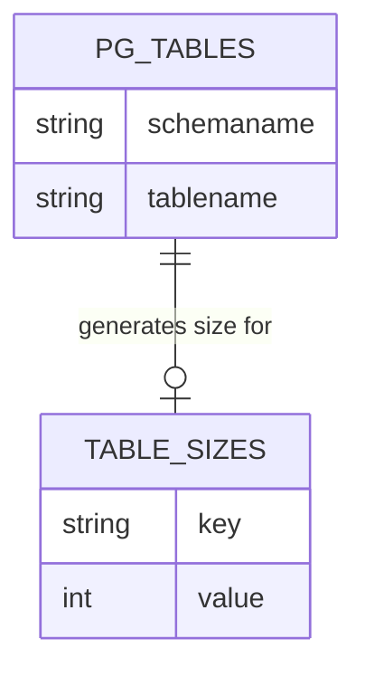
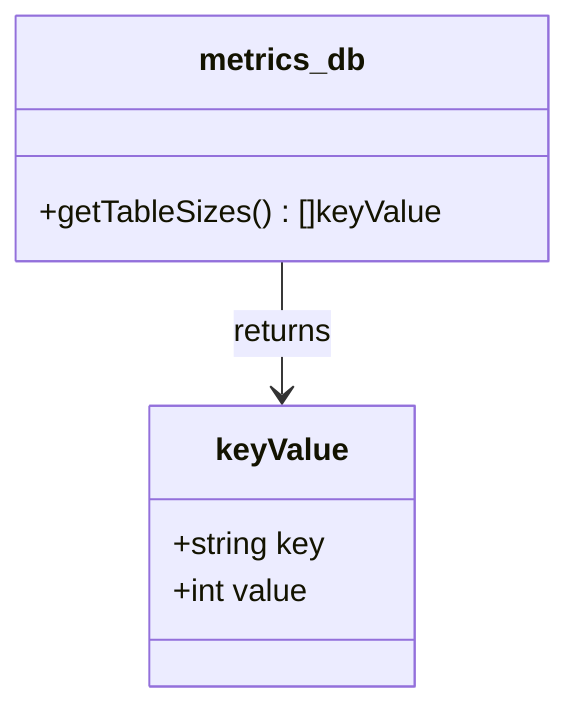

# Pull Request #1883: RHINENG-16453: gather table sizes from all used schemas, not only public

**Author**: @TenSt
**Created**: October 15, 2025 at 04:10 PM UTC
**Status**: Merged
**Labels**: None
**Base**: `master` ← **Head**: `stepan/RHINENG-16453-get-table-sizes-from-all-used-schemas`

## Description

## Description

This PR:
- updates the `getTableSizes` function to gather data about tables from all used schemas, not just public
- updates tests
- updates readme on how to run single or a set of tests in containers (vs. local)

## Secure Coding Practices Checklist GitHub Link
- https://github.com/RedHatInsights/secure-coding-checklist

## Secure Coding Checklist
- [x] Input Validation
- [x] Output Encoding
- [x] Authentication and Password Management
- [x] Session Management
- [x] Access Control
- [x] Cryptographic Practices
- [x] Error Handling and Logging
- [x] Data Protection
- [x] Communication Security
- [x] System Configuration
- [x] Database Security
- [x] File Management
- [x] Memory Management
- [x] General Coding Practices

## Summary by Sourcery

Fix table size collection to include all schemas, update tests to reflect schema-qualified table names, and improve test-run documentation.

Bug Fixes:
- Fix getTableSizes to fetch table sizes from public, inventory, and repack schemas with schema-qualified keys.

Documentation:
- Update README and go_test.sh with instructions for running individual tests or test sets in containers and locally.

Tests:
- Adjust metrics_db_test to expect schema-qualified table names and include inventory schema tables.

---

## Discussion

### Comment by @jira-linking on October 15, 2025 at 04:10 PM UTC

Referenced Jiras:
https://issues.redhat.com/browse/RHINENG-16453


### Comment by @sourcery-ai on October 15, 2025 at 04:10 PM UTC

<!-- Generated by sourcery-ai[bot]: start review_guide -->

<details>
<summary>Reviewer's guide (collapsed on small PRs)</summary>

## Reviewer's Guide

The PR enhances table size gathering by fully qualifying table names across multiple schemas, updates corresponding tests for the new key format, and refines the README and test script to simplify running individual tests in containers or locally.

#### ER diagram for table size gathering across multiple schemas



#### Class diagram for updated getTableSizes function and keyValue usage



### File-Level Changes

| Change | Details | Files |
| ------ | ------- | ----- |
| Expand table size query to cover all relevant schemas and qualify table names | <ul><li>Changed SQL select to concat schemaname and tablename as key</li><li>Updated pg_total_relation_size call to use schema-qualified names</li><li>Adjusted schema filter to include public, inventory, and repack</li></ul> | `tasks/vmaas_sync/metrics_db.go` |
| Adapt tests to validate schema-qualified table size keys | <ul><li>Prefixed expected table keys with schema</li><li>Added assertion for an inventory schema table</li><li>Retained length checks for consistency</li></ul> | `tasks/vmaas_sync/metrics_db_test.go` |
| Enhance documentation and scripts for running targeted tests | <ul><li>Added instructions in README for single-test execution in containers and locally</li><li>Modified go_test.sh to include commented example for running one test</li><li>Preserved existing all-tests execution command</li></ul> | `README.md`<br/>`scripts/go_test.sh` |

</details>

---

<details>
<summary>Tips and commands</summary>

#### Interacting with Sourcery

- **Trigger a new review:** Comment `@sourcery-ai review` on the pull request.
- **Continue discussions:** Reply directly to Sourcery's review comments.
- **Generate a GitHub issue from a review comment:** Ask Sourcery to create an
  issue from a review comment by replying to it. You can also reply to a
  review comment with `@sourcery-ai issue` to create an issue from it.
- **Generate a pull request title:** Write `@sourcery-ai` anywhere in the pull
  request title to generate a title at any time. You can also comment
  `@sourcery-ai title` on the pull request to (re-)generate the title at any time.
- **Generate a pull request summary:** Write `@sourcery-ai summary` anywhere in
  the pull request body to generate a PR summary at any time exactly where you
  want it. You can also comment `@sourcery-ai summary` on the pull request to
  (re-)generate the summary at any time.
- **Generate reviewer's guide:** Comment `@sourcery-ai guide` on the pull
  request to (re-)generate the reviewer's guide at any time.
- **Resolve all Sourcery comments:** Comment `@sourcery-ai resolve` on the
  pull request to resolve all Sourcery comments. Useful if you've already
  addressed all the comments and don't want to see them anymore.
- **Dismiss all Sourcery reviews:** Comment `@sourcery-ai dismiss` on the pull
  request to dismiss all existing Sourcery reviews. Especially useful if you
  want to start fresh with a new review - don't forget to comment
  `@sourcery-ai review` to trigger a new review!

#### Customizing Your Experience

Access your [dashboard](https://app.sourcery.ai) to:
- Enable or disable review features such as the Sourcery-generated pull request
  summary, the reviewer's guide, and others.
- Change the review language.
- Add, remove or edit custom review instructions.
- Adjust other review settings.

#### Getting Help

- [Contact our support team](mailto:support@sourcery.ai) for questions or feedback.
- Visit our [documentation](https://docs.sourcery.ai) for detailed guides and information.
- Keep in touch with the Sourcery team by following us on [X/Twitter](https://x.com/SourceryAI), [LinkedIn](https://www.linkedin.com/company/sourcery-ai/) or [GitHub](https://github.com/sourcery-ai).

</details>

<!-- Generated by sourcery-ai[bot]: end review_guide -->

### Comment by @app-sre-bot on October 15, 2025 at 04:14 PM UTC

Can one of the admins verify this patch?

### Comment by @MichaelMraka on October 17, 2025 at 03:22 PM UTC

/ok-to-test

### Comment by @codecov-commenter on October 20, 2025 at 01:35 PM UTC

## [Codecov](https://app.codecov.io/gh/RedHatInsights/patchman-engine/pull/1883?dropdown=coverage&src=pr&el=h1&utm_medium=referral&utm_source=github&utm_content=comment&utm_campaign=pr+comments&utm_term=RedHatInsights) Report
:white_check_mark: All modified and coverable lines are covered by tests.
:white_check_mark: Project coverage is 57.58%. Comparing base ([`29c09c3`](https://app.codecov.io/gh/RedHatInsights/patchman-engine/commit/29c09c3d4950e6acd0592acc882d7c372556ae06?dropdown=coverage&el=desc&utm_medium=referral&utm_source=github&utm_content=comment&utm_campaign=pr+comments&utm_term=RedHatInsights)) to head ([`33973ec`](https://app.codecov.io/gh/RedHatInsights/patchman-engine/commit/33973ec798954a1d0c97c7e3bfa3475b40b4d883?dropdown=coverage&el=desc&utm_medium=referral&utm_source=github&utm_content=comment&utm_campaign=pr+comments&utm_term=RedHatInsights)).

<details><summary>Additional details and impacted files</summary>


```diff
@@           Coverage Diff           @@
##           master    #1883   +/-   ##
=======================================
  Coverage   57.58%   57.58%           
=======================================
  Files         131      131           
  Lines       10197    10198    +1     
=======================================
+ Hits         5872     5873    +1     
  Misses       3791     3791           
  Partials      534      534           
```

| [Flag](https://app.codecov.io/gh/RedHatInsights/patchman-engine/pull/1883/flags?src=pr&el=flags&utm_medium=referral&utm_source=github&utm_content=comment&utm_campaign=pr+comments&utm_term=RedHatInsights) | Coverage Δ | |
|---|---|---|
| [unittests](https://app.codecov.io/gh/RedHatInsights/patchman-engine/pull/1883/flags?src=pr&el=flag&utm_medium=referral&utm_source=github&utm_content=comment&utm_campaign=pr+comments&utm_term=RedHatInsights) | `57.58% <100.00%> (+<0.01%)` | :arrow_up: |

Flags with carried forward coverage won't be shown. [Click here](https://docs.codecov.io/docs/carryforward-flags?utm_medium=referral&utm_source=github&utm_content=comment&utm_campaign=pr+comments&utm_term=RedHatInsights#carryforward-flags-in-the-pull-request-comment) to find out more.
</details>

[:umbrella: View full report in Codecov by Sentry](https://app.codecov.io/gh/RedHatInsights/patchman-engine/pull/1883?dropdown=coverage&src=pr&el=continue&utm_medium=referral&utm_source=github&utm_content=comment&utm_campaign=pr+comments&utm_term=RedHatInsights).   
:loudspeaker: Have feedback on the report? [Share it here](https://about.codecov.io/codecov-pr-comment-feedback/?utm_medium=referral&utm_source=github&utm_content=comment&utm_campaign=pr+comments&utm_term=RedHatInsights).
<details><summary> :rocket: New features to boost your workflow: </summary>

- :snowflake: [Test Analytics](https://docs.codecov.com/docs/test-analytics): Detect flaky tests, report on failures, and find test suite problems.
</details>

### Comment by @MichaelMraka on October 20, 2025 at 01:40 PM UTC

/ok-to-test

### Comment by @MichaelMraka on October 21, 2025 at 12:30 PM UTC

/retest

---

## Reviews

### Review by @sourcery-ai - Commented on October 15, 2025 at 04:11 PM UTC

Hey there - I've reviewed your changes - here's some feedback:

- Consider dynamically determining which schemas to include (e.g. exclude system schemas) instead of hardcoding public, inventory, and repack.
- Use quote_ident on both schemaname and tablename when building the identifier in pg_total_relation_size to avoid any edge cases with special characters.
- Add an assertion in TestTableSizes to verify that tables from the repack schema are included, similar to the inventory.hosts_v1_0 check.

<details>
<summary>Prompt for AI Agents</summary>

~~~markdown
Please address the comments from this code review:

## Overall Comments
- Consider dynamically determining which schemas to include (e.g. exclude system schemas) instead of hardcoding public, inventory, and repack.
- Use quote_ident on both schemaname and tablename when building the identifier in pg_total_relation_size to avoid any edge cases with special characters.
- Add an assertion in TestTableSizes to verify that tables from the repack schema are included, similar to the inventory.hosts_v1_0 check.

## Individual Comments

### Comment 1
<location> `README.md:68` </location>
<code_context>
+- Run the same command as for running all tests (from above)
+
+### Run single test locally
 After running all test suit, testing platform components are still running (kafka, platform, db). This is especially useful when fixing some test or adding a new one. You need to have golang installed.
 ~~~bash
 podman-compose -f docker-compose.test.yml up --build --no-start # build images
</code_context>

<issue_to_address>
**issue (typo):** Typo: 'test suit' should be 'test suite'.

Please update the wording to 'test suite'.

```suggestion
After running all test suite, testing platform components are still running (kafka, platform, db). This is especially useful when fixing some test or adding a new one. You need to have golang installed.
```
</issue_to_address>
~~~

</details>

***

<details>
<summary>Sourcery is free for open source - if you like our reviews please consider sharing them ✨</summary>

- [X](https://twitter.com/intent/tweet?text=I%20just%20got%20an%20instant%20code%20review%20from%20%40SourceryAI%2C%20and%20it%20was%20brilliant%21%20It%27s%20free%20for%20open%20source%20and%20has%20a%20free%20trial%20for%20private%20code.%20Check%20it%20out%20https%3A//sourcery.ai)
- [Mastodon](https://mastodon.social/share?text=I%20just%20got%20an%20instant%20code%20review%20from%20%40SourceryAI%2C%20and%20it%20was%20brilliant%21%20It%27s%20free%20for%20open%20source%20and%20has%20a%20free%20trial%20for%20private%20code.%20Check%20it%20out%20https%3A//sourcery.ai)
- [LinkedIn](https://www.linkedin.com/sharing/share-offsite/?url=https://sourcery.ai)
- [Facebook](https://www.facebook.com/sharer/sharer.php?u=https://sourcery.ai)

</details>

<sub>
Help me be more useful! Please click 👍 or 👎 on each comment and I'll use the feedback to improve your reviews.
</sub>

### Review by @MichaelMraka - Commented on October 16, 2025 at 01:12 PM UTC

### Review by @TenSt - Commented on October 16, 2025 at 01:27 PM UTC

### Review by @TenSt - Commented on October 16, 2025 at 01:36 PM UTC

### Review by @MichaelMraka - Commented on October 16, 2025 at 02:44 PM UTC

### Review by @TenSt - Commented on October 17, 2025 at 11:35 AM UTC

---

*Archived from: https://github.com/RedHatInsights/patchman-engine/pull/1883*
