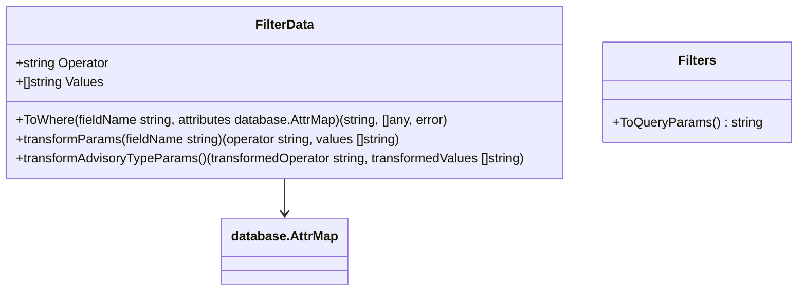
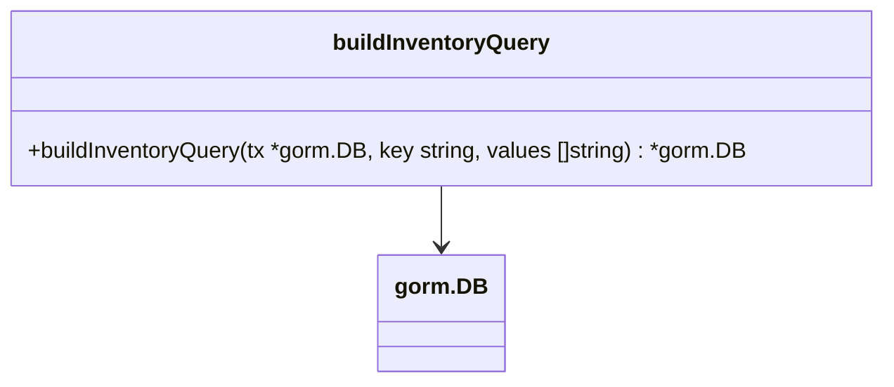

# Pull Request #1885: RHINENG-21424: add filter[severity]=null

**Author**: @MichaelMraka
**Created**: October 17, 2025 at 09:02 AM UTC
**Status**: Merged
**Labels**: None
**Base**: `master` ← **Head**: `pr2`

## Description

## Secure Coding Practices Checklist GitHub Link
- https://github.com/RedHatInsights/secure-coding-checklist

## Secure Coding Checklist
- [x] Input Validation
- [x] Output Encoding
- [x] Authentication and Password Management
- [x] Session Management
- [x] Access Control
- [x] Cryptographic Practices
- [x] Error Handling and Logging
- [x] Data Protection
- [x] Communication Security
- [x] System Configuration
- [x] Database Security
- [x] File Management
- [x] Memory Management
- [x] General Coding Practices

## Summary by Sourcery

Add support for null and notnull filters while renaming comparison operators and refactoring filter parameter handling to use generics, and update related query builder and tests accordingly

New Features:
- Add OpNull and OpNotNull operators for IS NULL and IS NOT NULL filtering
- Rename OpGeq/OpLeq operators to OpGte/OpLte

Enhancements:
- Refactor transformFilterParams into methods on FilterData and unify parameter slices to []any
- Simplify buildInventoryQuery to pass variadic []any arguments

Tests:
- Add tests for severity filters including eq, in, and null cases
- Extend filter parsing and SQL generation tests to cover the null operator

---

## Discussion

### Comment by @jira-linking on October 17, 2025 at 09:02 AM UTC

Referenced Jiras:
https://issues.redhat.com/browse/RHINENG-21424


### Comment by @sourcery-ai on October 17, 2025 at 09:02 AM UTC

<!-- Generated by sourcery-ai[bot]: start review_guide -->

## Reviewer's Guide

This PR standardizes comparison operators, adds support for null/notnull filters, refactors filter parameter transformation into methods, updates method signatures to use generic any arrays, adjusts inventory query construction accordingly, and extends tests to cover the new null filter behavior.

#### Class diagram for updated FilterData and related methods



#### Class diagram for buildInventoryQuery changes



### File-Level Changes

| Change | Details | Files |
| ------ | ------- | ----- |
| Enhance FilterData with null/notnull support and refactor filter logic | <ul><li>Add OpNull and OpNotNull constants</li><li>Rename geq/leq to gte/lte and update ToWhere comparisons</li><li>Change ToWhere signature to return []any and update IN/NOTIN branches</li><li>Refactor transformFilterParams into FilterData.transformParams and transformAdvisoryTypeParams methods</li></ul> | `manager/controllers/filter.go` |
| Adjust buildInventoryQuery to use generic any slices | <ul><li>Change val variable to []any</li><li>Map values[0] into []any for different cases</li><li>Spread val in tx.Where call instead of single argument</li></ul> | `manager/controllers/utils.go` |
| Extend test suite for severity null filtering | <ul><li>Add TestAdvisoriesFilterSeverityEq, In, and Null in advisories_test.go</li><li>Include "null:" in testFilters and corresponding SQL expectations in filter_test.go</li></ul> | `manager/controllers/advisories_test.go`<br/>`manager/controllers/filter_test.go` |

---

<details>
<summary>Tips and commands</summary>

#### Interacting with Sourcery

- **Trigger a new review:** Comment `@sourcery-ai review` on the pull request.
- **Continue discussions:** Reply directly to Sourcery's review comments.
- **Generate a GitHub issue from a review comment:** Ask Sourcery to create an
  issue from a review comment by replying to it. You can also reply to a
  review comment with `@sourcery-ai issue` to create an issue from it.
- **Generate a pull request title:** Write `@sourcery-ai` anywhere in the pull
  request title to generate a title at any time. You can also comment
  `@sourcery-ai title` on the pull request to (re-)generate the title at any time.
- **Generate a pull request summary:** Write `@sourcery-ai summary` anywhere in
  the pull request body to generate a PR summary at any time exactly where you
  want it. You can also comment `@sourcery-ai summary` on the pull request to
  (re-)generate the summary at any time.
- **Generate reviewer's guide:** Comment `@sourcery-ai guide` on the pull
  request to (re-)generate the reviewer's guide at any time.
- **Resolve all Sourcery comments:** Comment `@sourcery-ai resolve` on the
  pull request to resolve all Sourcery comments. Useful if you've already
  addressed all the comments and don't want to see them anymore.
- **Dismiss all Sourcery reviews:** Comment `@sourcery-ai dismiss` on the pull
  request to dismiss all existing Sourcery reviews. Especially useful if you
  want to start fresh with a new review - don't forget to comment
  `@sourcery-ai review` to trigger a new review!

#### Customizing Your Experience

Access your [dashboard](https://app.sourcery.ai) to:
- Enable or disable review features such as the Sourcery-generated pull request
  summary, the reviewer's guide, and others.
- Change the review language.
- Add, remove or edit custom review instructions.
- Adjust other review settings.

#### Getting Help

- [Contact our support team](mailto:support@sourcery.ai) for questions or feedback.
- Visit our [documentation](https://docs.sourcery.ai) for detailed guides and information.
- Keep in touch with the Sourcery team by following us on [X/Twitter](https://x.com/SourceryAI), [LinkedIn](https://www.linkedin.com/company/sourcery-ai/) or [GitHub](https://github.com/sourcery-ai).

</details>

<!-- Generated by sourcery-ai[bot]: end review_guide -->

### Comment by @codecov-commenter on October 17, 2025 at 09:08 AM UTC

## [Codecov](https://app.codecov.io/gh/RedHatInsights/patchman-engine/pull/1885?dropdown=coverage&src=pr&el=h1&utm_medium=referral&utm_source=github&utm_content=comment&utm_campaign=pr+comments&utm_term=RedHatInsights) Report
:x: Patch coverage is `96.77419%` with `1 line` in your changes missing coverage. Please review.
:white_check_mark: Project coverage is 57.58%. Comparing base ([`17f7e34`](https://app.codecov.io/gh/RedHatInsights/patchman-engine/commit/17f7e34f68607ca13c67ca943610f38786d25add?dropdown=coverage&el=desc&utm_medium=referral&utm_source=github&utm_content=comment&utm_campaign=pr+comments&utm_term=RedHatInsights)) to head ([`7f35a48`](https://app.codecov.io/gh/RedHatInsights/patchman-engine/commit/7f35a4847cc4e932b46f7f2d1b659d8dfc492cdd?dropdown=coverage&el=desc&utm_medium=referral&utm_source=github&utm_content=comment&utm_campaign=pr+comments&utm_term=RedHatInsights)).
:warning: Report is 6 commits behind head on master.

| [Files with missing lines](https://app.codecov.io/gh/RedHatInsights/patchman-engine/pull/1885?dropdown=coverage&src=pr&el=tree&utm_medium=referral&utm_source=github&utm_content=comment&utm_campaign=pr+comments&utm_term=RedHatInsights) | Patch % | Lines |
|---|---|---|
| [manager/controllers/filter.go](https://app.codecov.io/gh/RedHatInsights/patchman-engine/pull/1885?src=pr&el=tree&filepath=manager%2Fcontrollers%2Ffilter.go&utm_medium=referral&utm_source=github&utm_content=comment&utm_campaign=pr+comments&utm_term=RedHatInsights#diff-bWFuYWdlci9jb250cm9sbGVycy9maWx0ZXIuZ28=) | 96.15% | [1 Missing :warning: ](https://app.codecov.io/gh/RedHatInsights/patchman-engine/pull/1885?src=pr&el=tree&utm_medium=referral&utm_source=github&utm_content=comment&utm_campaign=pr+comments&utm_term=RedHatInsights) |

<details><summary>Additional details and impacted files</summary>


```diff
@@            Coverage Diff             @@
##           master    #1885      +/-   ##
==========================================
+ Coverage   57.51%   57.58%   +0.06%     
==========================================
  Files         131      131              
  Lines       10190    10197       +7     
==========================================
+ Hits         5861     5872      +11     
+ Misses       3795     3791       -4     
  Partials      534      534              
```

| [Flag](https://app.codecov.io/gh/RedHatInsights/patchman-engine/pull/1885/flags?src=pr&el=flags&utm_medium=referral&utm_source=github&utm_content=comment&utm_campaign=pr+comments&utm_term=RedHatInsights) | Coverage Δ | |
|---|---|---|
| [unittests](https://app.codecov.io/gh/RedHatInsights/patchman-engine/pull/1885/flags?src=pr&el=flag&utm_medium=referral&utm_source=github&utm_content=comment&utm_campaign=pr+comments&utm_term=RedHatInsights) | `57.58% <96.77%> (+0.06%)` | :arrow_up: |

Flags with carried forward coverage won't be shown. [Click here](https://docs.codecov.io/docs/carryforward-flags?utm_medium=referral&utm_source=github&utm_content=comment&utm_campaign=pr+comments&utm_term=RedHatInsights#carryforward-flags-in-the-pull-request-comment) to find out more.
</details>

[:umbrella: View full report in Codecov by Sentry](https://app.codecov.io/gh/RedHatInsights/patchman-engine/pull/1885?dropdown=coverage&src=pr&el=continue&utm_medium=referral&utm_source=github&utm_content=comment&utm_campaign=pr+comments&utm_term=RedHatInsights).   
:loudspeaker: Have feedback on the report? [Share it here](https://about.codecov.io/codecov-pr-comment-feedback/?utm_medium=referral&utm_source=github&utm_content=comment&utm_campaign=pr+comments&utm_term=RedHatInsights).
<details><summary> :rocket: New features to boost your workflow: </summary>

- :snowflake: [Test Analytics](https://docs.codecov.com/docs/test-analytics): Detect flaky tests, report on failures, and find test suite problems.
</details>

### Comment by @MichaelMraka on October 20, 2025 at 01:40 PM UTC

/retest

### Comment by @Dugowitch on October 21, 2025 at 07:35 AM UTC

/retest

---

## Reviews

### Review by @sourcery-ai - Commented on October 17, 2025 at 09:03 AM UTC

Hey there - I've reviewed your changes - here's some feedback:

- Consider simplifying transformParams so it doesn't inject a dummy "0" value for null/notnull operators, since ToWhere ignores that placeholder entirely.
- In filter_test.go you only cover the null operator—add a test for notnull to ensure parsing and SQL generation handle both cases correctly.
- The buildInventoryQuery function initializes val as an empty slice at the top but only populates it in certain branches; moving its declaration/assignment closer to each case would improve readability.

<details>
<summary>Prompt for AI Agents</summary>

~~~markdown
Please address the comments from this code review:

## Overall Comments
- Consider simplifying transformParams so it doesn't inject a dummy "0" value for null/notnull operators, since ToWhere ignores that placeholder entirely.
- In filter_test.go you only cover the null operator—add a test for notnull to ensure parsing and SQL generation handle both cases correctly.
- The buildInventoryQuery function initializes val as an empty slice at the top but only populates it in certain branches; moving its declaration/assignment closer to each case would improve readability.

## Individual Comments

### Comment 1
<location> `manager/controllers/advisories_test.go:226` </location>
<code_context>
+	assert.Equal(t, "RH-6", output.Data[1].ID)
+}
+
+func TestAdvisoriesFilterSeverityNull(t *testing.T) {
+	output := testAdvisories(t, "/?sort=id&filter[severity]=null")
+	assert.Equal(t, 10, len(output.Data))
</code_context>

<issue_to_address>
**suggestion (testing):** Missing test for filter[severity]=notnull edge case.

Please add a test for 'filter[severity]=notnull' to confirm advisories with non-null severity are returned and both 'null' and 'notnull' operators are covered.

Suggested implementation:

```golang
func TestAdvisoriesFilterSeverityNull(t *testing.T) {
	output := testAdvisories(t, "/?sort=id&filter[severity]=null")
	assert.Equal(t, 10, len(output.Data))
	assert.Equal(t, "CUSTOM-12", output.Data[0].ID)
}

func TestAdvisoriesFilterSeverityNotNull(t *testing.T) {
	output := testAdvisories(t, "/?sort=id&filter[severity]=notnull")
	// The expected count should be the number of advisories with non-null severity in your test data.
	// Adjust the expected count and IDs below as needed.
	assert.Equal(t, 2, len(output.Data))
	assert.Equal(t, "RH-3", output.Data[0].ID)
	assert.Equal(t, "RH-6", output.Data[1].ID)
}

```

If your test data contains a different number of advisories with non-null severity, adjust the expected count and IDs in the assertions accordingly.
</issue_to_address>

### Comment 2
<location> `manager/controllers/filter_test.go:17` </location>
<code_context>
 	"gt:13",
 	"lt:12",
 	"between:12,13",
+	"null:",
 }

</code_context>

<issue_to_address>
**suggestion (testing):** Missing test for 'notnull' operator in filter parsing and SQL generation.

Please add a test case for 'notnull:' to the testFilters array, along with the expected output and SQL, to ensure both operators are covered.

Suggested implementation:

```golang
	"gt:13",
	"lt:12",
	"between:12,13",
	"null:",
	"notnull:",
}

```

```golang
	operators := []string{
		"eq", "in", "gt", "lt", "between", "null", "notnull",
	}

	values := [][]string{
		{"13"},
		// ... other values ...
		{}, // for "null:"
		{}, // for "notnull:"

```

You will also need to:
1. Add expected parsed output and SQL for the "notnull:" test case, similar to how "null:" is handled in your test assertions.
2. Ensure your filter parsing and SQL generation logic supports "notnull:" and returns the correct output for the test.
</issue_to_address>

### Comment 3
<location> `manager/controllers/filter.go:130` </location>
<code_context>
-	transformedValues []string, transformedOperator string) {
-	if fieldName != "advisory_type_name" {
-		return originalValues, originalOperator
+func (t *FilterData) transformParams(fieldName string) (operator string, values []string) {
+	if len(t.Values) == 1 && (t.Values[0] == "null" || t.Values[0] == "notnull") {
+		// handle special cases filter=null and filter=notnull
</code_context>

<issue_to_address>
**issue (complexity):** Consider merging both parameter transformation methods into one and switching only on the returned operator in ToWhere for clarity and reduced indirection.

You can collapse both your `transformParams` and `transformAdvisoryTypeParams` into one method, and then only ever switch on the *returned* operator in `ToWhere`.  This removes the dummy‐value hack, the extra indirection, and guarantees you’re always using the transformed operator:

```go
// collapse both transforms into one
func (t *FilterData) transformParams(field string) (op string, values []string) {
  // special null/notnull case
  if len(t.Values) == 1 {
    switch v := t.Values[0]; v {
    case OpNull, OpNotNull:
      return v, nil
    }
  }

  // special advisory_type_name case
  if field == "advisory_type_name" {
    expanded := make([]string, 0, len(t.Values))
    for _, v := range t.Values {
      if v == "other" {
        expanded = append(expanded, database.OtherAdvisoryTypes...)
      } else {
        expanded = append(expanded, v)
      }
    }
    if len(expanded) != len(t.Values) {
      switch t.Operator {
      case OpEq:
        return OpIn, expanded
      case OpNeq:
        return OpNotIn, expanded
      }
      return t.Operator, expanded
    }
  }

  // default: no change
  return t.Operator, t.Values
}
```

Then in `ToWhere`, only call and switch on that returned `op`:

```go
func (t *FilterData) ToWhere(fieldName string, attrs database.AttrMap) (string, []any, error) {
  op, raw := t.transformParams(fieldName)

  // parse into args
  args := make([]any, len(raw))
  for i, s := range raw {
    info, ok := attrs[fieldName]
    if !ok {
      return "", nil, errors.Errorf("unknown field: %s", fieldName)
    }
    v, err := info.Parser(s)
    if err != nil {
      return "", nil, errors.Wrapf(err, "invalid filter value %q for %s", s, fieldName)
    }
    args[i] = v
  }

  col := attrs[fieldName].DataQuery
  switch op {
  case OpEq:
    return fmt.Sprintf("%s = ?", col), args, nil
  case OpNeq:
    return fmt.Sprintf("%s <> ?", col), args, nil
  // ...
  case OpIn, OpNotIn:
    template := "%s IN (?)"
    if op == OpNotIn {
      template = "%s NOT IN (?)"
    }
    return fmt.Sprintf(template, col), []any{args}, nil
  case OpNull:
    return fmt.Sprintf("%s IS NULL", col), nil, nil
  case OpNotNull:
    return fmt.Sprintf("%s IS NOT NULL", col), nil, nil
  default:
    return "", nil, errors.Errorf("unknown filter op %q", op)
  }
}
```

This:

- gets rid of your dummy `[]string{"0"}` hack  
- merges both transforms into one clear flow  
- always switches on the *actual* operator you want to use (never `t.Operator`)  
- preserves *all* existing functionality.
</issue_to_address>
~~~

</details>

***

<details>
<summary>Sourcery is free for open source - if you like our reviews please consider sharing them ✨</summary>

- [X](https://twitter.com/intent/tweet?text=I%20just%20got%20an%20instant%20code%20review%20from%20%40SourceryAI%2C%20and%20it%20was%20brilliant%21%20It%27s%20free%20for%20open%20source%20and%20has%20a%20free%20trial%20for%20private%20code.%20Check%20it%20out%20https%3A//sourcery.ai)
- [Mastodon](https://mastodon.social/share?text=I%20just%20got%20an%20instant%20code%20review%20from%20%40SourceryAI%2C%20and%20it%20was%20brilliant%21%20It%27s%20free%20for%20open%20source%20and%20has%20a%20free%20trial%20for%20private%20code.%20Check%20it%20out%20https%3A//sourcery.ai)
- [LinkedIn](https://www.linkedin.com/sharing/share-offsite/?url=https://sourcery.ai)
- [Facebook](https://www.facebook.com/sharer/sharer.php?u=https://sourcery.ai)

</details>

<sub>
Help me be more useful! Please click 👍 or 👎 on each comment and I'll use the feedback to improve your reviews.
</sub>

### Review by @Dugowitch - Approved on October 21, 2025 at 08:13 AM UTC

Overall, the change looks great. Adding receiver to `transformParams` improves readability :+1:  I have just a few style remarks

---

*Archived from: https://github.com/RedHatInsights/patchman-engine/pull/1885*
