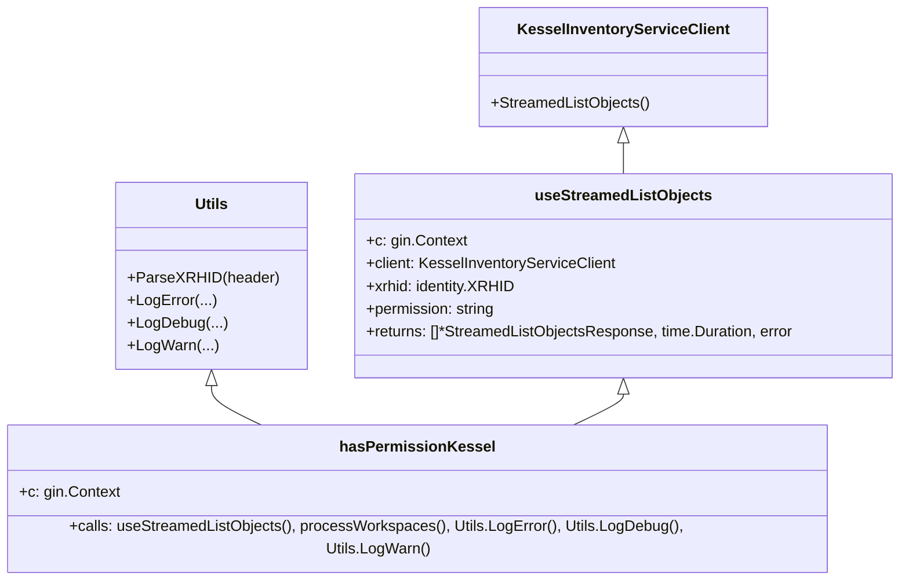

# Pull Request #1894: RHINENG-21521: improve kessel logs

**Author**: @Dugowitch
**Created**: October 24, 2025 at 05:16 PM UTC
**Status**: Merged
**Labels**: None
**Base**: `master` ← **Head**: `improve-logs`

## Description

Improve wording of the existing logs. Add debug logs with focus on gRPC receiving, which seems to time out too often.

## Secure Coding Practices Checklist GitHub Link
- https://github.com/RedHatInsights/secure-coding-checklist

## Secure Coding Checklist
- [x] Input Validation
- [x] Output Encoding
- [x] Authentication and Password Management
- [x] Session Management
- [x] Access Control
- [x] Cryptographic Practices
- [x] Error Handling and Logging
- [x] Data Protection
- [x] Communication Security
- [x] System Configuration
- [x] Database Security
- [x] File Management
- [x] Memory Management
- [x] General Coding Practices

## Summary by Sourcery

Enhance Kessel middleware logging by adding timing metrics, improving log wording and levels, updating error responses to JSON, and adjusting tests for the new return signature

Enhancements:
- Measure and log the duration of the gRPC stream receive in useStreamedListObjects
- Refine log messages and levels in the Kessel middleware (LogError, LogWarn, LogDebug)
- Return detailed JSON error responses for unauthorized or internal failures in Kessel checks

Tests:
- Update TestUseStreamedListObjects to account for the additional duration return value

---

## Discussion

### Comment by @sourcery-ai on October 24, 2025 at 05:16 PM UTC

<!-- Generated by sourcery-ai[bot]: start review_guide -->

## Reviewer's Guide

This PR enriches Kessel middleware logging by measuring gRPC stream durations, refining error messages with context, and introducing detailed debug logs across permission checks, while also adjusting a test to handle the new return signature.

#### Class diagram for updated useStreamedListObjects and logging in Kessel middleware



### File-Level Changes

| Change | Details | Files |
| ------ | ------- | ----- |
| Measure and return gRPC stream receiving durations | <ul><li>Extend useStreamedListObjects signature to include time.Duration</li><li>Record start time before stream.Recv loop</li><li>Include elapsed duration in error returns</li><li>Return duration on successful completion</li></ul> | `manager/middlewares/kessel.go` |
| Add detailed error and debug logs in permission flow | <ul><li>Log identity parsing errors explicitly before aborting</li><li>Log errors from useStreamedListObjects with receivingDuration and permission context</li><li>Emit debug logs for retrieved workspaces and final Kessel check success</li><li>Switch to utils.LogWarn for workspace processing failures</li></ul> | `manager/middlewares/kessel.go` |
| Refine workspace-not-found error message | <ul><li>Shorten message from 'no workspaces were found' to 'no workspaces found'</li></ul> | `manager/middlewares/kessel.go` |
| Update test to match new useStreamedListObjects signature | <ul><li>Unpack and ignore the new duration return value in TestUseStreamedListObjects</li></ul> | `manager/middlewares/kessel_test.go` |

---

<details>
<summary>Tips and commands</summary>

#### Interacting with Sourcery

- **Trigger a new review:** Comment `@sourcery-ai review` on the pull request.
- **Continue discussions:** Reply directly to Sourcery's review comments.
- **Generate a GitHub issue from a review comment:** Ask Sourcery to create an
  issue from a review comment by replying to it. You can also reply to a
  review comment with `@sourcery-ai issue` to create an issue from it.
- **Generate a pull request title:** Write `@sourcery-ai` anywhere in the pull
  request title to generate a title at any time. You can also comment
  `@sourcery-ai title` on the pull request to (re-)generate the title at any time.
- **Generate a pull request summary:** Write `@sourcery-ai summary` anywhere in
  the pull request body to generate a PR summary at any time exactly where you
  want it. You can also comment `@sourcery-ai summary` on the pull request to
  (re-)generate the summary at any time.
- **Generate reviewer's guide:** Comment `@sourcery-ai guide` on the pull
  request to (re-)generate the reviewer's guide at any time.
- **Resolve all Sourcery comments:** Comment `@sourcery-ai resolve` on the
  pull request to resolve all Sourcery comments. Useful if you've already
  addressed all the comments and don't want to see them anymore.
- **Dismiss all Sourcery reviews:** Comment `@sourcery-ai dismiss` on the pull
  request to dismiss all existing Sourcery reviews. Especially useful if you
  want to start fresh with a new review - don't forget to comment
  `@sourcery-ai review` to trigger a new review!

#### Customizing Your Experience

Access your [dashboard](https://app.sourcery.ai) to:
- Enable or disable review features such as the Sourcery-generated pull request
  summary, the reviewer's guide, and others.
- Change the review language.
- Add, remove or edit custom review instructions.
- Adjust other review settings.

#### Getting Help

- [Contact our support team](mailto:support@sourcery.ai) for questions or feedback.
- Visit our [documentation](https://docs.sourcery.ai) for detailed guides and information.
- Keep in touch with the Sourcery team by following us on [X/Twitter](https://x.com/SourceryAI), [LinkedIn](https://www.linkedin.com/company/sourcery-ai/) or [GitHub](https://github.com/sourcery-ai).

</details>

<!-- Generated by sourcery-ai[bot]: end review_guide -->

### Comment by @codecov-commenter on October 24, 2025 at 05:28 PM UTC

## [Codecov](https://app.codecov.io/gh/RedHatInsights/patchman-engine/pull/1894?dropdown=coverage&src=pr&el=h1&utm_medium=referral&utm_source=github&utm_content=comment&utm_campaign=pr+comments&utm_term=RedHatInsights) Report
:x: Patch coverage is `33.33333%` with `12 lines` in your changes missing coverage. Please review.
:white_check_mark: Project coverage is 58.96%. Comparing base ([`fca8b58`](https://app.codecov.io/gh/RedHatInsights/patchman-engine/commit/fca8b58b1b17c24dedb585fb637bd7941e1f50e3?dropdown=coverage&el=desc&utm_medium=referral&utm_source=github&utm_content=comment&utm_campaign=pr+comments&utm_term=RedHatInsights)) to head ([`285f947`](https://app.codecov.io/gh/RedHatInsights/patchman-engine/commit/285f947f50712aec37f06fa30473c114f606e2e6?dropdown=coverage&el=desc&utm_medium=referral&utm_source=github&utm_content=comment&utm_campaign=pr+comments&utm_term=RedHatInsights)).

| [Files with missing lines](https://app.codecov.io/gh/RedHatInsights/patchman-engine/pull/1894?dropdown=coverage&src=pr&el=tree&utm_medium=referral&utm_source=github&utm_content=comment&utm_campaign=pr+comments&utm_term=RedHatInsights) | Patch % | Lines |
|---|---|---|
| [manager/middlewares/kessel.go](https://app.codecov.io/gh/RedHatInsights/patchman-engine/pull/1894?src=pr&el=tree&filepath=manager%2Fmiddlewares%2Fkessel.go&utm_medium=referral&utm_source=github&utm_content=comment&utm_campaign=pr+comments&utm_term=RedHatInsights#diff-bWFuYWdlci9taWRkbGV3YXJlcy9rZXNzZWwuZ28=) | 33.33% | [12 Missing :warning: ](https://app.codecov.io/gh/RedHatInsights/patchman-engine/pull/1894?src=pr&el=tree&utm_medium=referral&utm_source=github&utm_content=comment&utm_campaign=pr+comments&utm_term=RedHatInsights) |

<details><summary>Additional details and impacted files</summary>


```diff
@@            Coverage Diff             @@
##           master    #1894      +/-   ##
==========================================
- Coverage   58.99%   58.96%   -0.03%     
==========================================
  Files         131      131              
  Lines        8398     8407       +9     
==========================================
+ Hits         4954     4957       +3     
- Misses       2910     2916       +6     
  Partials      534      534              
```

| [Flag](https://app.codecov.io/gh/RedHatInsights/patchman-engine/pull/1894/flags?src=pr&el=flags&utm_medium=referral&utm_source=github&utm_content=comment&utm_campaign=pr+comments&utm_term=RedHatInsights) | Coverage Δ | |
|---|---|---|
| [unittests](https://app.codecov.io/gh/RedHatInsights/patchman-engine/pull/1894/flags?src=pr&el=flag&utm_medium=referral&utm_source=github&utm_content=comment&utm_campaign=pr+comments&utm_term=RedHatInsights) | `58.96% <33.33%> (-0.03%)` | :arrow_down: |

Flags with carried forward coverage won't be shown. [Click here](https://docs.codecov.io/docs/carryforward-flags?utm_medium=referral&utm_source=github&utm_content=comment&utm_campaign=pr+comments&utm_term=RedHatInsights#carryforward-flags-in-the-pull-request-comment) to find out more.
</details>

[:umbrella: View full report in Codecov by Sentry](https://app.codecov.io/gh/RedHatInsights/patchman-engine/pull/1894?dropdown=coverage&src=pr&el=continue&utm_medium=referral&utm_source=github&utm_content=comment&utm_campaign=pr+comments&utm_term=RedHatInsights).   
:loudspeaker: Have feedback on the report? [Share it here](https://about.codecov.io/codecov-pr-comment-feedback/?utm_medium=referral&utm_source=github&utm_content=comment&utm_campaign=pr+comments&utm_term=RedHatInsights).
<details><summary> :rocket: New features to boost your workflow: </summary>

- :snowflake: [Test Analytics](https://docs.codecov.com/docs/test-analytics): Detect flaky tests, report on failures, and find test suite problems.
</details>

---

## Reviews

### Review by @MichaelMraka - Approved on October 29, 2025 at 09:43 AM UTC

### Review by @sourcery-ai - Commented on October 29, 2025 at 10:11 AM UTC

Hey there - I've reviewed your changes and they look great!

***

<details>
<summary>Sourcery is free for open source - if you like our reviews please consider sharing them ✨</summary>

- [X](https://twitter.com/intent/tweet?text=I%20just%20got%20an%20instant%20code%20review%20from%20%40SourceryAI%2C%20and%20it%20was%20brilliant%21%20It%27s%20free%20for%20open%20source%20and%20has%20a%20free%20trial%20for%20private%20code.%20Check%20it%20out%20https%3A//sourcery.ai)
- [Mastodon](https://mastodon.social/share?text=I%20just%20got%20an%20instant%20code%20review%20from%20%40SourceryAI%2C%20and%20it%20was%20brilliant%21%20It%27s%20free%20for%20open%20source%20and%20has%20a%20free%20trial%20for%20private%20code.%20Check%20it%20out%20https%3A//sourcery.ai)
- [LinkedIn](https://www.linkedin.com/sharing/share-offsite/?url=https://sourcery.ai)
- [Facebook](https://www.facebook.com/sharer/sharer.php?u=https://sourcery.ai)

</details>

<sub>
Help me be more useful! Please click 👍 or 👎 on each comment and I'll use the feedback to improve your reviews.
</sub>

---

*Archived from: https://github.com/RedHatInsights/patchman-engine/pull/1894*
