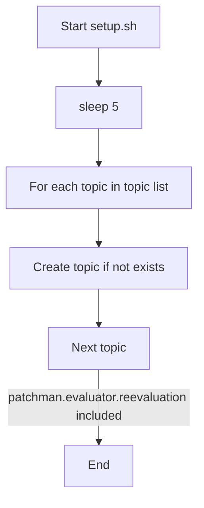

# Pull Request #1905: RHINENG-21216: add new kafka topic for re-evaluation

**Author**: @TenSt
**Created**: October 29, 2025 at 11:24 AM UTC
**Status**: Merged
**Labels**: None
**Base**: `master` ← **Head**: `stepan/RHINENG-21216`

## Description

This PR:
- adds new kafka topic for re-evaluation events
- re-configures manager to use new topic

## Summary by Sourcery

Add a new Kafka topic for reevaluation events and update configurations to use it

New Features:
- Introduce the patchman.evaluator.reevaluation Kafka topic for re-evaluation events

Enhancements:
- Reconfigure the manager to publish to the new reevaluation topic instead of the upload topic

Chores:
- Update the Kafka setup script to create the new reevaluation topic

---

## Discussion

### Comment by @sourcery-ai on October 29, 2025 at 11:24 AM UTC

<!-- Generated by sourcery-ai[bot]: start review_guide -->

<details>
<summary>Reviewer's guide (collapsed on small PRs)</summary>

## Reviewer's Guide

This PR adds and configures a new Kafka topic for re-evaluation by extending the deployment manifest, updating the manager’s topic reference, and registering it in the local Kafka setup script.

#### Flow diagram for Kafka topic creation in setup script



### File-Level Changes

| Change | Details | Files |
| ------ | ------- | ----- |
| Extend deployment manifest with re-evaluation topic and update manager config | <ul><li>Add patchman.evaluator.reevaluation topic (3 replicas, 4 partitions)</li><li>Change EVAL_TOPIC_MANAGER to patchman.evaluator.reevaluation</li></ul> | `deploy/clowdapp.yaml` |
| Register the new topic in local Kafka setup | <ul><li>Append patchman.evaluator.reevaluation to the topics list in setup.sh</li></ul> | `dev/kafka/setup.sh` |

</details>

---

<details>
<summary>Tips and commands</summary>

#### Interacting with Sourcery

- **Trigger a new review:** Comment `@sourcery-ai review` on the pull request.
- **Continue discussions:** Reply directly to Sourcery's review comments.
- **Generate a GitHub issue from a review comment:** Ask Sourcery to create an
  issue from a review comment by replying to it. You can also reply to a
  review comment with `@sourcery-ai issue` to create an issue from it.
- **Generate a pull request title:** Write `@sourcery-ai` anywhere in the pull
  request title to generate a title at any time. You can also comment
  `@sourcery-ai title` on the pull request to (re-)generate the title at any time.
- **Generate a pull request summary:** Write `@sourcery-ai summary` anywhere in
  the pull request body to generate a PR summary at any time exactly where you
  want it. You can also comment `@sourcery-ai summary` on the pull request to
  (re-)generate the summary at any time.
- **Generate reviewer's guide:** Comment `@sourcery-ai guide` on the pull
  request to (re-)generate the reviewer's guide at any time.
- **Resolve all Sourcery comments:** Comment `@sourcery-ai resolve` on the
  pull request to resolve all Sourcery comments. Useful if you've already
  addressed all the comments and don't want to see them anymore.
- **Dismiss all Sourcery reviews:** Comment `@sourcery-ai dismiss` on the pull
  request to dismiss all existing Sourcery reviews. Especially useful if you
  want to start fresh with a new review - don't forget to comment
  `@sourcery-ai review` to trigger a new review!

#### Customizing Your Experience

Access your [dashboard](https://app.sourcery.ai) to:
- Enable or disable review features such as the Sourcery-generated pull request
  summary, the reviewer's guide, and others.
- Change the review language.
- Add, remove or edit custom review instructions.
- Adjust other review settings.

#### Getting Help

- [Contact our support team](mailto:support@sourcery.ai) for questions or feedback.
- Visit our [documentation](https://docs.sourcery.ai) for detailed guides and information.
- Keep in touch with the Sourcery team by following us on [X/Twitter](https://x.com/SourceryAI), [LinkedIn](https://www.linkedin.com/company/sourcery-ai/) or [GitHub](https://github.com/sourcery-ai).

</details>

<!-- Generated by sourcery-ai[bot]: end review_guide -->

### Comment by @codecov-commenter on October 29, 2025 at 11:29 AM UTC

## [Codecov](https://app.codecov.io/gh/RedHatInsights/patchman-engine/pull/1905?dropdown=coverage&src=pr&el=h1&utm_medium=referral&utm_source=github&utm_content=comment&utm_campaign=pr+comments&utm_term=RedHatInsights) Report
:white_check_mark: All modified and coverable lines are covered by tests.
:white_check_mark: Project coverage is 58.96%. Comparing base ([`d6e9b61`](https://app.codecov.io/gh/RedHatInsights/patchman-engine/commit/d6e9b615da76a8548167a9ed4088716e06abba8a?dropdown=coverage&el=desc&utm_medium=referral&utm_source=github&utm_content=comment&utm_campaign=pr+comments&utm_term=RedHatInsights)) to head ([`fe512b9`](https://app.codecov.io/gh/RedHatInsights/patchman-engine/commit/fe512b9aea71f22f45d0c92a75a6fff16378fd66?dropdown=coverage&el=desc&utm_medium=referral&utm_source=github&utm_content=comment&utm_campaign=pr+comments&utm_term=RedHatInsights)).

<details><summary>Additional details and impacted files</summary>


```diff
@@           Coverage Diff           @@
##           master    #1905   +/-   ##
=======================================
  Coverage   58.96%   58.96%           
=======================================
  Files         131      131           
  Lines        8407     8407           
=======================================
  Hits         4957     4957           
  Misses       2916     2916           
  Partials      534      534           
```

| [Flag](https://app.codecov.io/gh/RedHatInsights/patchman-engine/pull/1905/flags?src=pr&el=flags&utm_medium=referral&utm_source=github&utm_content=comment&utm_campaign=pr+comments&utm_term=RedHatInsights) | Coverage Δ | |
|---|---|---|
| [unittests](https://app.codecov.io/gh/RedHatInsights/patchman-engine/pull/1905/flags?src=pr&el=flag&utm_medium=referral&utm_source=github&utm_content=comment&utm_campaign=pr+comments&utm_term=RedHatInsights) | `58.96% <ø> (ø)` | |

Flags with carried forward coverage won't be shown. [Click here](https://docs.codecov.io/docs/carryforward-flags?utm_medium=referral&utm_source=github&utm_content=comment&utm_campaign=pr+comments&utm_term=RedHatInsights#carryforward-flags-in-the-pull-request-comment) to find out more.
</details>

[:umbrella: View full report in Codecov by Sentry](https://app.codecov.io/gh/RedHatInsights/patchman-engine/pull/1905?dropdown=coverage&src=pr&el=continue&utm_medium=referral&utm_source=github&utm_content=comment&utm_campaign=pr+comments&utm_term=RedHatInsights).   
:loudspeaker: Have feedback on the report? [Share it here](https://about.codecov.io/codecov-pr-comment-feedback/?utm_medium=referral&utm_source=github&utm_content=comment&utm_campaign=pr+comments&utm_term=RedHatInsights).
<details><summary> :rocket: New features to boost your workflow: </summary>

- :snowflake: [Test Analytics](https://docs.codecov.com/docs/test-analytics): Detect flaky tests, report on failures, and find test suite problems.
</details>

### Comment by @MichaelMraka on October 29, 2025 at 04:07 PM UTC

Be aware that if you merge this PR manager will start sending message to the new topic. But there's no reader yet so it will broke template feature.
E.g. in stage.

Ideally add new evaluator as a part of this PR as well.

### Comment by @TenSt on October 30, 2025 at 11:20 AM UTC

/retest

### Comment by @TenSt on October 30, 2025 at 11:51 AM UTC

> Be aware that if you merge this PR manager will start sending message to the new topic. But there's no reader yet so it will broke template feature. E.g. in stage.
> 
> Ideally add new evaluator as a part of this PR as well.

Oh, got it. Right now these events are processed by "evaluator-upload" component as "manager" writes them to the "upload" topic. With new topic, we need another evaluator that will read and process these messages. Thanks, will work on it.

### Comment by @TenSt on October 30, 2025 at 03:22 PM UTC

/retest

---

## Reviews

### Review by @sourcery-ai - Commented on October 29, 2025 at 11:24 AM UTC

Hey there - I've reviewed your changes and they look great!

***

<details>
<summary>Sourcery is free for open source - if you like our reviews please consider sharing them ✨</summary>

- [X](https://twitter.com/intent/tweet?text=I%20just%20got%20an%20instant%20code%20review%20from%20%40SourceryAI%2C%20and%20it%20was%20brilliant%21%20It%27s%20free%20for%20open%20source%20and%20has%20a%20free%20trial%20for%20private%20code.%20Check%20it%20out%20https%3A//sourcery.ai)
- [Mastodon](https://mastodon.social/share?text=I%20just%20got%20an%20instant%20code%20review%20from%20%40SourceryAI%2C%20and%20it%20was%20brilliant%21%20It%27s%20free%20for%20open%20source%20and%20has%20a%20free%20trial%20for%20private%20code.%20Check%20it%20out%20https%3A//sourcery.ai)
- [LinkedIn](https://www.linkedin.com/sharing/share-offsite/?url=https://sourcery.ai)
- [Facebook](https://www.facebook.com/sharer/sharer.php?u=https://sourcery.ai)

</details>

<sub>
Help me be more useful! Please click 👍 or 👎 on each comment and I'll use the feedback to improve your reviews.
</sub>

### Review by @MichaelMraka - Commented on October 29, 2025 at 04:01 PM UTC

### Review by @TenSt - Commented on October 29, 2025 at 11:13 PM UTC

### Review by @TenSt - Commented on October 30, 2025 at 09:07 AM UTC

### Review by @MichaelMraka - Approved on October 30, 2025 at 02:17 PM UTC

looks good

---

*Archived from: https://github.com/RedHatInsights/patchman-engine/pull/1905*
