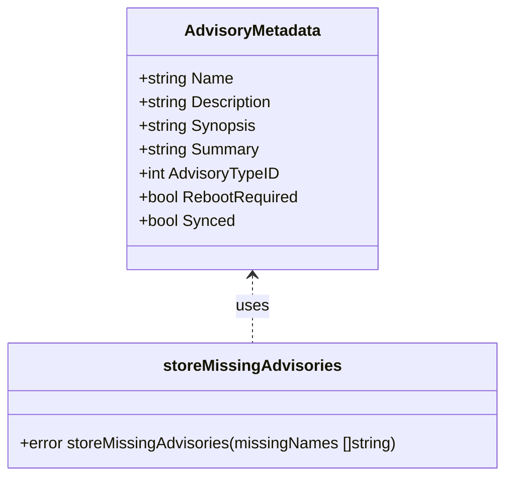
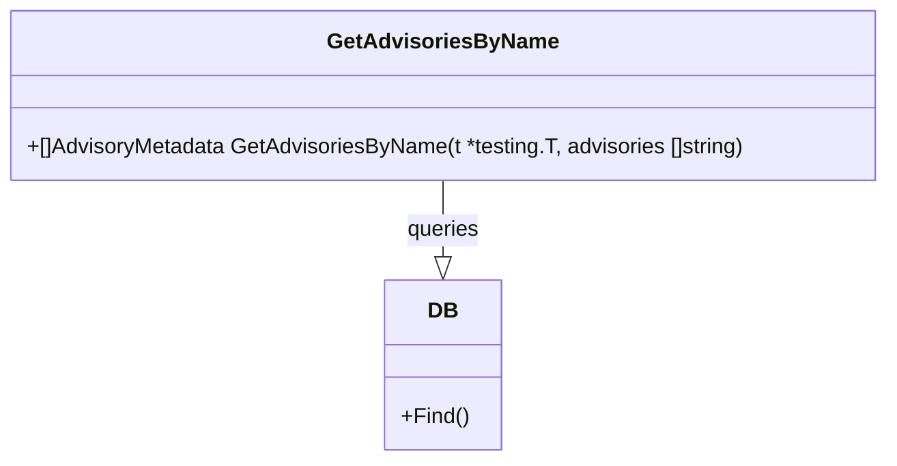

# Pull Request #1906: RHINENG-21485: add advisory link if data is missing

**Author**: @TenSt
**Created**: October 31, 2025 at 03:29 PM UTC
**Status**: Merged
**Labels**: None
**Base**: `master` ← **Head**: `stepan/RHINENG-21485-add-advisory-link-if-data-is-missing`

## Description

This PR:
- changes `storeMissingAdvisories` to store pre-defined text for 3rd party advisories or link for RH advisories
- adds test for `storeMissingAdvisories`
- adds `GetAdvisoriesByName` supporting function

## Summary by Sourcery

Update storeMissingAdvisories to assign context-aware placeholder or access link for missing advisories and introduce a helper and test to validate the behavior.

New Features:
- Differentiate advisory text for third-party and RH advisories in storeMissingAdvisories using a static placeholder or Red Hat errata URLs
- Add GetAdvisoriesByName test helper to fetch stored advisories by name

Tests:
- Add TestStoreMissingAdvisories to verify placeholder text and link assignment for missing advisories

---

## Discussion

### Comment by @sourcery-ai on October 31, 2025 at 03:29 PM UTC

<!-- Generated by sourcery-ai[bot]: start review_guide -->

## Reviewer's Guide

This PR refactors the advisory-store logic to provide a meaningful default text or a direct RH errata link for missing advisories, adds a new database helper for tests, and introduces a unit test covering both third-party and RH advisory scenarios.

#### Sequence diagram for storing missing advisories with new logic

```mermaid
sequenceDiagram
    participant "storeMissingAdvisories()"
    participant "rhelRegexp"
    participant "models.AdvisoryMetadata"
    participant "DB"
    "storeMissingAdvisories()"->>"rhelRegexp": Check if advisory name matches RH pattern
    alt RH advisory
        "storeMissingAdvisories()"->>"models.AdvisoryMetadata": Set Description/Synopsis/Summary to RH errata link
    else Third-party advisory
        "storeMissingAdvisories()"->>"models.AdvisoryMetadata": Set Description/Synopsis/Summary to default text
    end
    "storeMissingAdvisories()"->>"DB": Store AdvisoryMetadata
```

#### Class diagram for updated AdvisoryMetadata storage logic



#### Class diagram for new GetAdvisoriesByName test helper



### File-Level Changes

| Change | Details | Files |
| ------ | ------- | ----- |
| Conditional advisory storage: default text for third-party vs RH link | <ul><li>Import fmt and regexp</li><li>Define rhelRegexp to detect RH advisories</li><li>Compute text variable per advisory name</li><li>Assign Description, Synopsis, Summary to text</li></ul> | `evaluator/evaluate_advisories.go` |
| Test helper to fetch advisories by name | <ul><li>Add GetAdvisoriesByName in database testing package</li><li>Assert no errors and correct count</li></ul> | `base/database/testing.go` |
| Unit test for storeMissingAdvisories | <ul><li>Setup test environment with DB skip flag</li><li>Store and retrieve third-party advisories and assert default text</li><li>Store and retrieve RH advisories and assert generated links</li></ul> | `evaluator/evaluate_advisories_test.go` |

---

<details>
<summary>Tips and commands</summary>

#### Interacting with Sourcery

- **Trigger a new review:** Comment `@sourcery-ai review` on the pull request.
- **Continue discussions:** Reply directly to Sourcery's review comments.
- **Generate a GitHub issue from a review comment:** Ask Sourcery to create an
  issue from a review comment by replying to it. You can also reply to a
  review comment with `@sourcery-ai issue` to create an issue from it.
- **Generate a pull request title:** Write `@sourcery-ai` anywhere in the pull
  request title to generate a title at any time. You can also comment
  `@sourcery-ai title` on the pull request to (re-)generate the title at any time.
- **Generate a pull request summary:** Write `@sourcery-ai summary` anywhere in
  the pull request body to generate a PR summary at any time exactly where you
  want it. You can also comment `@sourcery-ai summary` on the pull request to
  (re-)generate the summary at any time.
- **Generate reviewer's guide:** Comment `@sourcery-ai guide` on the pull
  request to (re-)generate the reviewer's guide at any time.
- **Resolve all Sourcery comments:** Comment `@sourcery-ai resolve` on the
  pull request to resolve all Sourcery comments. Useful if you've already
  addressed all the comments and don't want to see them anymore.
- **Dismiss all Sourcery reviews:** Comment `@sourcery-ai dismiss` on the pull
  request to dismiss all existing Sourcery reviews. Especially useful if you
  want to start fresh with a new review - don't forget to comment
  `@sourcery-ai review` to trigger a new review!

#### Customizing Your Experience

Access your [dashboard](https://app.sourcery.ai) to:
- Enable or disable review features such as the Sourcery-generated pull request
  summary, the reviewer's guide, and others.
- Change the review language.
- Add, remove or edit custom review instructions.
- Adjust other review settings.

#### Getting Help

- [Contact our support team](mailto:support@sourcery.ai) for questions or feedback.
- Visit our [documentation](https://docs.sourcery.ai) for detailed guides and information.
- Keep in touch with the Sourcery team by following us on [X/Twitter](https://x.com/SourceryAI), [LinkedIn](https://www.linkedin.com/company/sourcery-ai/) or [GitHub](https://github.com/sourcery-ai).

</details>

<!-- Generated by sourcery-ai[bot]: end review_guide -->

### Comment by @MichaelMraka on November 03, 2025 at 09:53 AM UTC

/retest

### Comment by @codecov-commenter on November 03, 2025 at 11:30 AM UTC

## [Codecov](https://app.codecov.io/gh/RedHatInsights/patchman-engine/pull/1906?dropdown=coverage&src=pr&el=h1&utm_medium=referral&utm_source=github&utm_content=comment&utm_campaign=pr+comments&utm_term=RedHatInsights) Report
:x: Patch coverage is `35.29412%` with `11 lines` in your changes missing coverage. Please review.
:white_check_mark: Project coverage is 58.90%. Comparing base ([`156ca08`](https://app.codecov.io/gh/RedHatInsights/patchman-engine/commit/156ca0808fb21d0d168348f49e53730230923cf1?dropdown=coverage&el=desc&utm_medium=referral&utm_source=github&utm_content=comment&utm_campaign=pr+comments&utm_term=RedHatInsights)) to head ([`d87c97d`](https://app.codecov.io/gh/RedHatInsights/patchman-engine/commit/d87c97d7fdde0345569c455ab1638e611f79303e?dropdown=coverage&el=desc&utm_medium=referral&utm_source=github&utm_content=comment&utm_campaign=pr+comments&utm_term=RedHatInsights)).
:warning: Report is 2 commits behind head on master.

| [Files with missing lines](https://app.codecov.io/gh/RedHatInsights/patchman-engine/pull/1906?dropdown=coverage&src=pr&el=tree&utm_medium=referral&utm_source=github&utm_content=comment&utm_campaign=pr+comments&utm_term=RedHatInsights) | Patch % | Lines |
|---|---|---|
| [base/database/testing.go](https://app.codecov.io/gh/RedHatInsights/patchman-engine/pull/1906?src=pr&el=tree&filepath=base%2Fdatabase%2Ftesting.go&utm_medium=referral&utm_source=github&utm_content=comment&utm_campaign=pr+comments&utm_term=RedHatInsights#diff-YmFzZS9kYXRhYmFzZS90ZXN0aW5nLmdv) | 0.00% | [11 Missing :warning: ](https://app.codecov.io/gh/RedHatInsights/patchman-engine/pull/1906?src=pr&el=tree&utm_medium=referral&utm_source=github&utm_content=comment&utm_campaign=pr+comments&utm_term=RedHatInsights) |

<details><summary>Additional details and impacted files</summary>


```diff
@@            Coverage Diff             @@
##           master    #1906      +/-   ##
==========================================
- Coverage   58.96%   58.90%   -0.07%     
==========================================
  Files         131      131              
  Lines        8407     8421      +14     
==========================================
+ Hits         4957     4960       +3     
- Misses       2916     2927      +11     
  Partials      534      534              
```

| [Flag](https://app.codecov.io/gh/RedHatInsights/patchman-engine/pull/1906/flags?src=pr&el=flags&utm_medium=referral&utm_source=github&utm_content=comment&utm_campaign=pr+comments&utm_term=RedHatInsights) | Coverage Δ | |
|---|---|---|
| [unittests](https://app.codecov.io/gh/RedHatInsights/patchman-engine/pull/1906/flags?src=pr&el=flag&utm_medium=referral&utm_source=github&utm_content=comment&utm_campaign=pr+comments&utm_term=RedHatInsights) | `58.90% <35.29%> (-0.07%)` | :arrow_down: |

Flags with carried forward coverage won't be shown. [Click here](https://docs.codecov.io/docs/carryforward-flags?utm_medium=referral&utm_source=github&utm_content=comment&utm_campaign=pr+comments&utm_term=RedHatInsights#carryforward-flags-in-the-pull-request-comment) to find out more.
</details>

[:umbrella: View full report in Codecov by Sentry](https://app.codecov.io/gh/RedHatInsights/patchman-engine/pull/1906?dropdown=coverage&src=pr&el=continue&utm_medium=referral&utm_source=github&utm_content=comment&utm_campaign=pr+comments&utm_term=RedHatInsights).   
:loudspeaker: Have feedback on the report? [Share it here](https://about.codecov.io/codecov-pr-comment-feedback/?utm_medium=referral&utm_source=github&utm_content=comment&utm_campaign=pr+comments&utm_term=RedHatInsights).
<details><summary> :rocket: New features to boost your workflow: </summary>

- :snowflake: [Test Analytics](https://docs.codecov.com/docs/test-analytics): Detect flaky tests, report on failures, and find test suite problems.
</details>

### Comment by @TenSt on November 03, 2025 at 11:49 AM UTC

@MichaelMraka tests are fixed

### Comment by @TenSt on November 03, 2025 at 12:13 PM UTC

/retest

### Comment by @MichaelMraka on November 03, 2025 at 12:44 PM UTC

This is not a proper way to fix it.
The issue is not in TestCleanUnusedAdvisories() but in the new TestStoreMissingAdvisories() which does not clean up created advisories after itself.

### Comment by @TenSt on November 03, 2025 at 02:21 PM UTC

> This is not a proper way to fix it. The issue is not in TestCleanUnusedAdvisories() but in the new TestStoreMissingAdvisories() which does not clean up created advisories after itself.

I say it all depends on the approach. I saw that this approach was used with other tests (keeping data afterwards), so this is why I went for it and just altered the counts properly. 
Sure, I'll go with clean up in the end of the test.

### Comment by @TenSt on November 03, 2025 at 03:05 PM UTC

/retest

---

## Reviews

### Review by @sourcery-ai - Commented on October 31, 2025 at 03:30 PM UTC

Hey there - I've reviewed your changes - here's some feedback:

- Replace the regex-based RHSA prefix check with a simple strings.HasPrefix("RHSA-") (or rename rhelRegexp to rhelAdvisoryRegexp) for clarity and performance.
- Extract the hardcoded texts (“Not Available for 3rd party systems” and the errata URL format) into package‐level constants to avoid magic strings.
- Refactor TestStoreMissingAdvisories into a table‐driven test with distinct cases for third‐party vs RH advisories to reduce duplication and improve readability.

<details>
<summary>Prompt for AI Agents</summary>

~~~markdown
Please address the comments from this code review:

## Overall Comments
- Replace the regex-based RHSA prefix check with a simple strings.HasPrefix("RHSA-") (or rename rhelRegexp to rhelAdvisoryRegexp) for clarity and performance.
- Extract the hardcoded texts (“Not Available for 3rd party systems” and the errata URL format) into package‐level constants to avoid magic strings.
- Refactor TestStoreMissingAdvisories into a table‐driven test with distinct cases for third‐party vs RH advisories to reduce duplication and improve readability.

## Individual Comments

### Comment 1
<location> `evaluator/evaluate_advisories.go:33` </location>
<code_context>

 type extendedAdvisoryMap map[string]extendedAdvisory

+var rhelRegexp = regexp.MustCompile("^RH.A-")
+
 // LazySaveAndLoadAdvisories lazy saves missing advisories from reported, loads stored ones from DB,
</code_context>

<issue_to_address>
**suggestion:** Consider making the regular expression more robust for RHEL advisories.

The regex currently only matches 'RH.A-'. Consider updating it to include other valid RHEL prefixes like 'RHSA-' or 'RHEA-' to ensure broader coverage.

```suggestion
var rhelRegexp = regexp.MustCompile(`^(RHSA|RHEA|RHBA)-`)
```
</issue_to_address>

### Comment 2
<location> `evaluator/evaluate_advisories.go:163-165` </location>
<code_context>
 	toStore := make(models.AdvisoryMetadataSlice, 0, len(missingNames))
 	for _, name := range missingNames {
 		if len(name) > 0 && len(name) < 100 {
+			text := "Not Available for 3rd party systems"
+			if rhelRegexp.MatchString(name) {
+				text = fmt.Sprintf("https://access.redhat.com/errata/%s", name)
+			}
 			toStore = append(toStore, models.AdvisoryMetadata{
</code_context>

<issue_to_address>
**suggestion:** Using the advisory name directly in the Red Hat URL may not always yield a valid link.

Validate the advisory name format before constructing the Red Hat errata URL to prevent broken links.

Suggested implementation:

```golang
var rhelRegexp = regexp.MustCompile(`^RHSA-\d{4}:\d{4,}$`)

```

```golang
			text := "Not Available for 3rd party systems"
			if rhelRegexp.MatchString(name) {
				text = fmt.Sprintf("https://access.redhat.com/errata/%s", name)
			}

```
</issue_to_address>

### Comment 3
<location> `evaluator/evaluate_advisories_test.go:312` </location>
<code_context>
 	}
 }

+func TestStoreMissingAdvisories(t *testing.T) {
+	utils.SkipWithoutDB(t)
+	core.SetupTestEnvironment()
</code_context>

<issue_to_address>
**suggestion (testing):** Missing test for invalid advisory names (e.g., empty string, overly long name).

Please add tests for empty strings and names exceeding 100 characters to verify error handling in `storeMissingAdvisories`.
</issue_to_address>
~~~

</details>

***

<details>
<summary>Sourcery is free for open source - if you like our reviews please consider sharing them ✨</summary>

- [X](https://twitter.com/intent/tweet?text=I%20just%20got%20an%20instant%20code%20review%20from%20%40SourceryAI%2C%20and%20it%20was%20brilliant%21%20It%27s%20free%20for%20open%20source%20and%20has%20a%20free%20trial%20for%20private%20code.%20Check%20it%20out%20https%3A//sourcery.ai)
- [Mastodon](https://mastodon.social/share?text=I%20just%20got%20an%20instant%20code%20review%20from%20%40SourceryAI%2C%20and%20it%20was%20brilliant%21%20It%27s%20free%20for%20open%20source%20and%20has%20a%20free%20trial%20for%20private%20code.%20Check%20it%20out%20https%3A//sourcery.ai)
- [LinkedIn](https://www.linkedin.com/sharing/share-offsite/?url=https://sourcery.ai)
- [Facebook](https://www.facebook.com/sharer/sharer.php?u=https://sourcery.ai)

</details>

<sub>
Help me be more useful! Please click 👍 or 👎 on each comment and I'll use the feedback to improve your reviews.
</sub>

### Review by @MichaelMraka - Commented on November 03, 2025 at 09:47 AM UTC

### Review by @MichaelMraka - Approved on November 03, 2025 at 09:52 AM UTC

### Review by @MichaelMraka - Changes Requested on November 03, 2025 at 10:27 AM UTC

Please fix failing unit test
```
 test      | === FAIL: tasks/cleaning TestCleanUnusedAdvisories (0.03s)
test      | time="2025-11-03T10:22:29Z" level=info msg="config for aws CloudWatch not loaded"
test      | time="2025-11-03T10:22:29Z" level=debug msg="Other advisory types loaded from DB" other_advisory_types="[unknown unspecified]"
test      | time="2025-11-03T10:22:29Z" level=debug msg="Advisory types loaded from DB" advisory_types="[{0 unknown 0} {1 enhancement 0} {2 bugfix 0} {3 security 0} {4 unspecified 0}]"
test      | time="2025-11-03T10:22:29Z" level=info msg="Checking if PostgreSQL is up"
test      | time="2025-11-03T10:22:29Z" level=info msg="Everything is up - executing command"
test      | time="2025-11-03T10:22:29Z" level=info msg="DeleteUnusedAdvisories tasks performed successfully"
test      |     clean_unused_data_test.go:96: 
test      |         	Error Trace:	/go/src/app/tasks/cleaning/clean_unused_data_test.go:96
test      |         	Error:      	Not equal: 
test      |         	            	expected: 20
test      |         	            	actual  : 14
test      |         	Test:       	TestCleanUnusedAdvisories
```

### Review by @MichaelMraka - Approved on November 03, 2025 at 03:18 PM UTC

---

*Archived from: https://github.com/RedHatInsights/patchman-engine/pull/1906*
