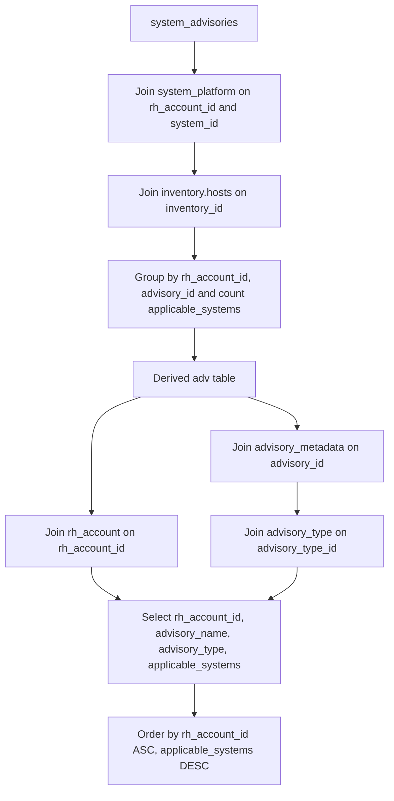

# Pull Request #1936: RHINENG-22130: speedup floorist query

**Author**: @MichaelMraka
**Created**: November 18, 2025 at 12:50 PM UTC
**Status**: Merged
**Labels**: None
**Base**: `master` ← **Head**: `pr2`

## Description

explain plan
before: Incremental Sort  (cost=3505293039.17..10602506999.69 rows=26292076404 width=65)
after:              Sort  (cost=302599403.97..302599503.97 rows=40000 width=65)

## Secure Coding Practices Checklist GitHub Link
- https://github.com/RedHatInsights/secure-coding-checklist

## Secure Coding Checklist
- [x] Input Validation
- [x] Output Encoding
- [x] Authentication and Password Management
- [x] Session Management
- [x] Access Control
- [x] Cryptographic Practices
- [x] Error Handling and Logging
- [x] Data Protection
- [x] Communication Security
- [x] System Configuration
- [x] Database Security
- [x] File Management
- [x] Memory Management
- [x] General Coding Practices

## Summary by Sourcery

Enhancements:
- Replace the multi-table aggregation in clowdapp.yaml with a derived table to pre-compute counts and improve query performance

---

## Discussion

### Comment by @sourcery-ai on November 18, 2025 at 12:51 PM UTC

<!-- Generated by sourcery-ai[bot]: start review_guide -->

<details>
<summary>Reviewer's guide (collapsed on small PRs)</summary>

## Reviewer's Guide

Refactor the Florist data pipeline query to pre-aggregate advisory counts using a derived table, replacing the original multi-join grouping and incremental sort with a more efficient straight sort over a smaller result set.

#### Flow diagram for new Florist query aggregation process



### File-Level Changes

| Change | Details | Files |
| ------ | ------- | ----- |
| Refactor SQL to pre-aggregate counts in a subquery | <ul><li>Extract COUNT(sa.*) with GROUP BY into derived table adv</li><li>Remove inline GROUP BY and aggregation in main query</li><li>Join adv to rh_account, advisory_metadata, and advisory_type</li><li>Update SELECT and ORDER BY to reference adv.applicable_systems</li></ul> | `deploy/clowdapp.yaml` |

</details>

---

<details>
<summary>Tips and commands</summary>

#### Interacting with Sourcery

- **Trigger a new review:** Comment `@sourcery-ai review` on the pull request.
- **Continue discussions:** Reply directly to Sourcery's review comments.
- **Generate a GitHub issue from a review comment:** Ask Sourcery to create an
  issue from a review comment by replying to it. You can also reply to a
  review comment with `@sourcery-ai issue` to create an issue from it.
- **Generate a pull request title:** Write `@sourcery-ai` anywhere in the pull
  request title to generate a title at any time. You can also comment
  `@sourcery-ai title` on the pull request to (re-)generate the title at any time.
- **Generate a pull request summary:** Write `@sourcery-ai summary` anywhere in
  the pull request body to generate a PR summary at any time exactly where you
  want it. You can also comment `@sourcery-ai summary` on the pull request to
  (re-)generate the summary at any time.
- **Generate reviewer's guide:** Comment `@sourcery-ai guide` on the pull
  request to (re-)generate the reviewer's guide at any time.
- **Resolve all Sourcery comments:** Comment `@sourcery-ai resolve` on the
  pull request to resolve all Sourcery comments. Useful if you've already
  addressed all the comments and don't want to see them anymore.
- **Dismiss all Sourcery reviews:** Comment `@sourcery-ai dismiss` on the pull
  request to dismiss all existing Sourcery reviews. Especially useful if you
  want to start fresh with a new review - don't forget to comment
  `@sourcery-ai review` to trigger a new review!

#### Customizing Your Experience

Access your [dashboard](https://app.sourcery.ai) to:
- Enable or disable review features such as the Sourcery-generated pull request
  summary, the reviewer's guide, and others.
- Change the review language.
- Add, remove or edit custom review instructions.
- Adjust other review settings.

#### Getting Help

- [Contact our support team](mailto:support@sourcery.ai) for questions or feedback.
- Visit our [documentation](https://docs.sourcery.ai) for detailed guides and information.
- Keep in touch with the Sourcery team by following us on [X/Twitter](https://x.com/SourceryAI), [LinkedIn](https://www.linkedin.com/company/sourcery-ai/) or [GitHub](https://github.com/sourcery-ai).

</details>

<!-- Generated by sourcery-ai[bot]: end review_guide -->

### Comment by @codecov-commenter on November 18, 2025 at 12:57 PM UTC

## [Codecov](https://app.codecov.io/gh/RedHatInsights/patchman-engine/pull/1936?dropdown=coverage&src=pr&el=h1&utm_medium=referral&utm_source=github&utm_content=comment&utm_campaign=pr+comments&utm_term=RedHatInsights) Report
:white_check_mark: All modified and coverable lines are covered by tests.
:white_check_mark: Project coverage is 58.90%. Comparing base ([`4da7772`](https://app.codecov.io/gh/RedHatInsights/patchman-engine/commit/4da777245826cab692f6128dd483d9d1f65f7fdd?dropdown=coverage&el=desc&utm_medium=referral&utm_source=github&utm_content=comment&utm_campaign=pr+comments&utm_term=RedHatInsights)) to head ([`f51d555`](https://app.codecov.io/gh/RedHatInsights/patchman-engine/commit/f51d555bca25135e19e4260af75003958b6516ab?dropdown=coverage&el=desc&utm_medium=referral&utm_source=github&utm_content=comment&utm_campaign=pr+comments&utm_term=RedHatInsights)).

<details><summary>Additional details and impacted files</summary>


```diff
@@           Coverage Diff           @@
##           master    #1936   +/-   ##
=======================================
  Coverage   58.90%   58.90%           
=======================================
  Files         131      131           
  Lines        8421     8421           
=======================================
  Hits         4960     4960           
  Misses       2927     2927           
  Partials      534      534           
```

| [Flag](https://app.codecov.io/gh/RedHatInsights/patchman-engine/pull/1936/flags?src=pr&el=flags&utm_medium=referral&utm_source=github&utm_content=comment&utm_campaign=pr+comments&utm_term=RedHatInsights) | Coverage Δ | |
|---|---|---|
| [unittests](https://app.codecov.io/gh/RedHatInsights/patchman-engine/pull/1936/flags?src=pr&el=flag&utm_medium=referral&utm_source=github&utm_content=comment&utm_campaign=pr+comments&utm_term=RedHatInsights) | `58.90% <ø> (ø)` | |

Flags with carried forward coverage won't be shown. [Click here](https://docs.codecov.io/docs/carryforward-flags?utm_medium=referral&utm_source=github&utm_content=comment&utm_campaign=pr+comments&utm_term=RedHatInsights#carryforward-flags-in-the-pull-request-comment) to find out more.
</details>

[:umbrella: View full report in Codecov by Sentry](https://app.codecov.io/gh/RedHatInsights/patchman-engine/pull/1936?dropdown=coverage&src=pr&el=continue&utm_medium=referral&utm_source=github&utm_content=comment&utm_campaign=pr+comments&utm_term=RedHatInsights).   
:loudspeaker: Have feedback on the report? [Share it here](https://about.codecov.io/codecov-pr-comment-feedback/?utm_medium=referral&utm_source=github&utm_content=comment&utm_campaign=pr+comments&utm_term=RedHatInsights).
<details><summary> :rocket: New features to boost your workflow: </summary>

- :snowflake: [Test Analytics](https://docs.codecov.com/docs/test-analytics): Detect flaky tests, report on failures, and find test suite problems.
</details>

### Comment by @MichaelMraka on November 19, 2025 at 09:41 AM UTC

@vkrizan 

---

## Reviews

### Review by @sourcery-ai - Commented on November 18, 2025 at 12:51 PM UTC

Hey there - I've reviewed your changes - here's some feedback:

- Ensure dropping the inventory.hosts join didn’t alter the intended result set or filter logic.
- Use COUNT(*) instead of COUNT(sa.*) for better SQL compatibility and clearer intent.
- Consider adding an index on (rh_account_id, advisory_id) in system_advisories to further optimize grouping.

<details>
<summary>Prompt for AI Agents</summary>

~~~markdown
Please address the comments from this code review:

## Overall Comments
- Ensure dropping the inventory.hosts join didn’t alter the intended result set or filter logic.
- Use COUNT(*) instead of COUNT(sa.*) for better SQL compatibility and clearer intent.
- Consider adding an index on (rh_account_id, advisory_id) in system_advisories to further optimize grouping.

## Individual Comments

### Comment 1
<location> `deploy/clowdapp.yaml:577` </location>
<code_context>
-          GROUP BY ra.name, am.name, at.name
-          ORDER BY ra.name ASC, applicable_systems DESC;
+                 adv.applicable_systems AS applicable_systems
+            FROM (SELECT sp.rh_account_id, sa.advisory_id, COUNT(sa.*) as applicable_systems
+                    FROM system_advisories sa
+                    JOIN system_platform sp ON sa.rh_account_id = sp.rh_account_id AND sa.system_id = sp.id
+                    JOIN inventory.hosts ih ON sp.inventory_id = ih.id
</code_context>

<issue_to_address>
**suggestion:** COUNT(sa.*) may not be portable or optimal for counting rows.

COUNT(sa.*) is not standard and may not work across all databases. Use COUNT(*) instead for compatibility.

```suggestion
            FROM (SELECT sp.rh_account_id, sa.advisory_id, COUNT(*) as applicable_systems
```
</issue_to_address>
~~~

</details>

***

<details>
<summary>Sourcery is free for open source - if you like our reviews please consider sharing them ✨</summary>

- [X](https://twitter.com/intent/tweet?text=I%20just%20got%20an%20instant%20code%20review%20from%20%40SourceryAI%2C%20and%20it%20was%20brilliant%21%20It%27s%20free%20for%20open%20source%20and%20has%20a%20free%20trial%20for%20private%20code.%20Check%20it%20out%20https%3A//sourcery.ai)
- [Mastodon](https://mastodon.social/share?text=I%20just%20got%20an%20instant%20code%20review%20from%20%40SourceryAI%2C%20and%20it%20was%20brilliant%21%20It%27s%20free%20for%20open%20source%20and%20has%20a%20free%20trial%20for%20private%20code.%20Check%20it%20out%20https%3A//sourcery.ai)
- [LinkedIn](https://www.linkedin.com/sharing/share-offsite/?url=https://sourcery.ai)
- [Facebook](https://www.facebook.com/sharer/sharer.php?u=https://sourcery.ai)

</details>

<sub>
Help me be more useful! Please click 👍 or 👎 on each comment and I'll use the feedback to improve your reviews.
</sub>

### Review by @vkrizan - Approved on November 19, 2025 at 09:49 AM UTC

---

*Archived from: https://github.com/RedHatInsights/patchman-engine/pull/1936*
