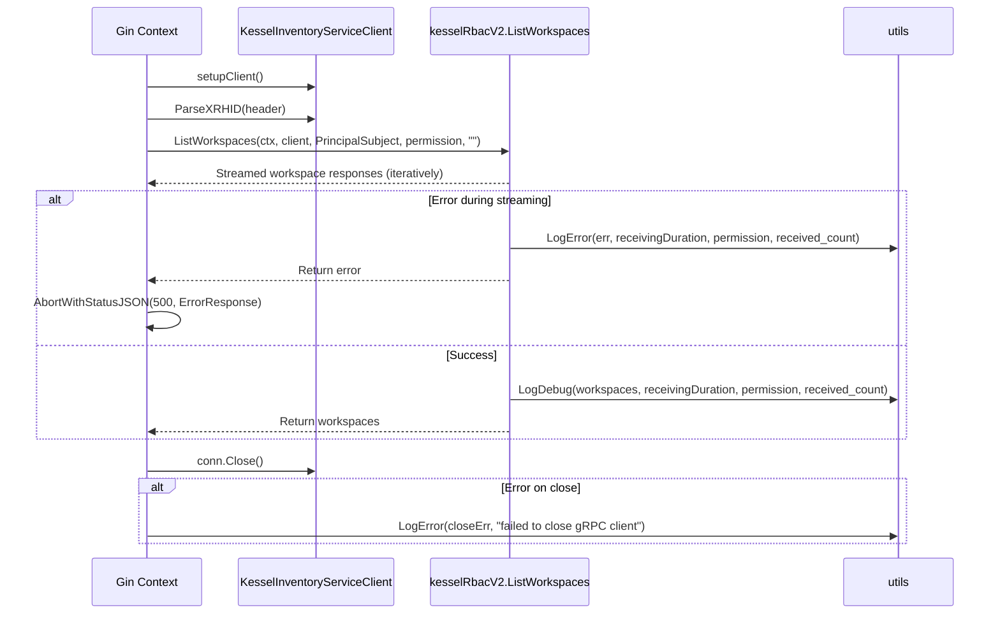
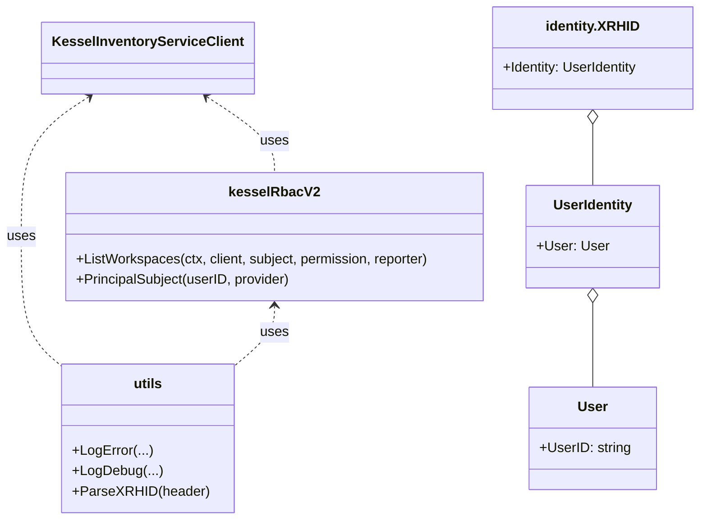
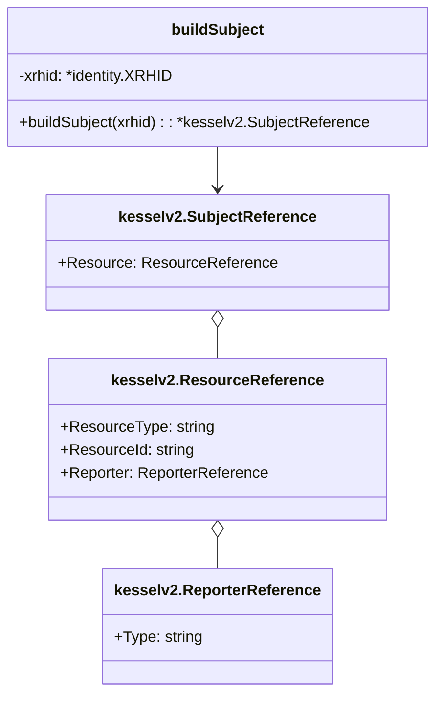

# Pull Request #1938: RHINENG-21760: use helper function and improve logging in kessel middelware

**Author**: @Dugowitch
**Created**: November 19, 2025 at 11:41 AM UTC
**Status**: Merged
**Labels**: None
**Base**: `master` ← **Head**: `kessel-logs`

## Description

## Secure Coding Practices Checklist GitHub Link
- https://github.com/RedHatInsights/secure-coding-checklist

## Secure Coding Checklist
- [x] Input Validation
- [x] Output Encoding
- [x] Authentication and Password Management
- [x] Session Management
- [x] Access Control
- [x] Cryptographic Practices
- [x] Error Handling and Logging
- [x] Data Protection
- [x] Communication Security
- [x] System Configuration
- [x] Database Security
- [x] File Management
- [x] Memory Management
- [x] General Coding Practices

## Summary by Sourcery

Migrate the Kessel RBAC middleware to use the official helper function for workspace listing, strengthen logging and error handling, and streamline stream processing.

Enhancements:
- Replace custom buildSubject and manual StreamedListObjects usage with kesselRbacV2.ListWorkspaces and PrincipalSubject helper
- Add structured debug and error logging in useStreamedListObjects, and wrap gRPC connection close in a defer that logs failures
- Simplify useStreamedListObjects signature by removing the duration return and eliminate redundant logging in hasPermissionKessel

Tests:
- Update kessel middleware test to match the revised useStreamedListObjects signature

---

## Discussion

### Comment by @sourcery-ai on November 19, 2025 at 11:41 AM UTC

<!-- Generated by sourcery-ai[bot]: start review_guide -->

## Reviewer's Guide

Middleware refactored to leverage the SDK’s RBAC helper for streaming workspaces, with custom subject logic removed, structured logging and error handling improved, and tests updated for the revised API signature.

#### Sequence diagram for improved workspace streaming and error handling in Kessel middleware



#### Class diagram for updated Kessel middleware types and helper usage



#### Class diagram for removed buildSubject function



### File-Level Changes

| Change | Details | Files |
| ------ | ------- | ----- |
| Replace manual gRPC stream logic with SDK RBAC helper | <ul><li>Import kesselRbacV2 and remove io import</li><li>Delete buildSubject function and related subject construction</li><li>Substitute client.StreamedListObjects loop with kesselRbacV2.ListWorkspaces call</li><li>Adjust useStreamedListObjects signature to drop duration return value</li></ul> | `manager/middlewares/kessel.go` |
| Enhance structured logging and error handling | <ul><li>Add utils.LogError and utils.LogDebug calls around list streaming errors and results</li><li>Wrap gRPC client Close in a defer with error logging</li><li>Remove redundant LogDebug in hasPermissionKessel and centralize error logs in helper</li></ul> | `manager/middlewares/kessel.go` |
| Update tests for new useStreamedListObjects signature | <ul><li>Remove duration return variable in TestUseStreamedListObjects call</li><li>Adjust assertions to match two-value return of workspaces and error</li></ul> | `manager/middlewares/kessel_test.go` |

---

<details>
<summary>Tips and commands</summary>

#### Interacting with Sourcery

- **Trigger a new review:** Comment `@sourcery-ai review` on the pull request.
- **Continue discussions:** Reply directly to Sourcery's review comments.
- **Generate a GitHub issue from a review comment:** Ask Sourcery to create an
  issue from a review comment by replying to it. You can also reply to a
  review comment with `@sourcery-ai issue` to create an issue from it.
- **Generate a pull request title:** Write `@sourcery-ai` anywhere in the pull
  request title to generate a title at any time. You can also comment
  `@sourcery-ai title` on the pull request to (re-)generate the title at any time.
- **Generate a pull request summary:** Write `@sourcery-ai summary` anywhere in
  the pull request body to generate a PR summary at any time exactly where you
  want it. You can also comment `@sourcery-ai summary` on the pull request to
  (re-)generate the summary at any time.
- **Generate reviewer's guide:** Comment `@sourcery-ai guide` on the pull
  request to (re-)generate the reviewer's guide at any time.
- **Resolve all Sourcery comments:** Comment `@sourcery-ai resolve` on the
  pull request to resolve all Sourcery comments. Useful if you've already
  addressed all the comments and don't want to see them anymore.
- **Dismiss all Sourcery reviews:** Comment `@sourcery-ai dismiss` on the pull
  request to dismiss all existing Sourcery reviews. Especially useful if you
  want to start fresh with a new review - don't forget to comment
  `@sourcery-ai review` to trigger a new review!

#### Customizing Your Experience

Access your [dashboard](https://app.sourcery.ai) to:
- Enable or disable review features such as the Sourcery-generated pull request
  summary, the reviewer's guide, and others.
- Change the review language.
- Add, remove or edit custom review instructions.
- Adjust other review settings.

#### Getting Help

- [Contact our support team](mailto:support@sourcery.ai) for questions or feedback.
- Visit our [documentation](https://docs.sourcery.ai) for detailed guides and information.
- Keep in touch with the Sourcery team by following us on [X/Twitter](https://x.com/SourceryAI), [LinkedIn](https://www.linkedin.com/company/sourcery-ai/) or [GitHub](https://github.com/sourcery-ai).

</details>

<!-- Generated by sourcery-ai[bot]: end review_guide -->

### Comment by @codecov-commenter on November 19, 2025 at 11:47 AM UTC

## [Codecov](https://app.codecov.io/gh/RedHatInsights/patchman-engine/pull/1938?dropdown=coverage&src=pr&el=h1&utm_medium=referral&utm_source=github&utm_content=comment&utm_campaign=pr+comments&utm_term=RedHatInsights) Report
:x: Patch coverage is `61.11111%` with `7 lines` in your changes missing coverage. Please review.
:white_check_mark: Project coverage is 58.80%. Comparing base ([`d6e9b61`](https://app.codecov.io/gh/RedHatInsights/patchman-engine/commit/d6e9b615da76a8548167a9ed4088716e06abba8a?dropdown=coverage&el=desc&utm_medium=referral&utm_source=github&utm_content=comment&utm_campaign=pr+comments&utm_term=RedHatInsights)) to head ([`ff5deb8`](https://app.codecov.io/gh/RedHatInsights/patchman-engine/commit/ff5deb8191d50bf3a109b781058e553c4b282b1c?dropdown=coverage&el=desc&utm_medium=referral&utm_source=github&utm_content=comment&utm_campaign=pr+comments&utm_term=RedHatInsights)).
:warning: Report is 56 commits behind head on master.

| [Files with missing lines](https://app.codecov.io/gh/RedHatInsights/patchman-engine/pull/1938?dropdown=coverage&src=pr&el=tree&utm_medium=referral&utm_source=github&utm_content=comment&utm_campaign=pr+comments&utm_term=RedHatInsights) | Patch % | Lines |
|---|---|---|
| [manager/middlewares/kessel.go](https://app.codecov.io/gh/RedHatInsights/patchman-engine/pull/1938?src=pr&el=tree&filepath=manager%2Fmiddlewares%2Fkessel.go&utm_medium=referral&utm_source=github&utm_content=comment&utm_campaign=pr+comments&utm_term=RedHatInsights#diff-bWFuYWdlci9taWRkbGV3YXJlcy9rZXNzZWwuZ28=) | 61.11% | [6 Missing and 1 partial :warning: ](https://app.codecov.io/gh/RedHatInsights/patchman-engine/pull/1938?src=pr&el=tree&utm_medium=referral&utm_source=github&utm_content=comment&utm_campaign=pr+comments&utm_term=RedHatInsights) |

<details><summary>Additional details and impacted files</summary>


```diff
@@            Coverage Diff             @@
##           master    #1938      +/-   ##
==========================================
- Coverage   58.96%   58.80%   -0.16%     
==========================================
  Files         131      131              
  Lines        8407     8407              
==========================================
- Hits         4957     4944      -13     
- Misses       2916     2929      +13     
  Partials      534      534              
```

| [Flag](https://app.codecov.io/gh/RedHatInsights/patchman-engine/pull/1938/flags?src=pr&el=flags&utm_medium=referral&utm_source=github&utm_content=comment&utm_campaign=pr+comments&utm_term=RedHatInsights) | Coverage Δ | |
|---|---|---|
| [unittests](https://app.codecov.io/gh/RedHatInsights/patchman-engine/pull/1938/flags?src=pr&el=flag&utm_medium=referral&utm_source=github&utm_content=comment&utm_campaign=pr+comments&utm_term=RedHatInsights) | `58.80% <61.11%> (-0.16%)` | :arrow_down: |

Flags with carried forward coverage won't be shown. [Click here](https://docs.codecov.io/docs/carryforward-flags?utm_medium=referral&utm_source=github&utm_content=comment&utm_campaign=pr+comments&utm_term=RedHatInsights#carryforward-flags-in-the-pull-request-comment) to find out more.
</details>

[:umbrella: View full report in Codecov by Sentry](https://app.codecov.io/gh/RedHatInsights/patchman-engine/pull/1938?dropdown=coverage&src=pr&el=continue&utm_medium=referral&utm_source=github&utm_content=comment&utm_campaign=pr+comments&utm_term=RedHatInsights).   
:loudspeaker: Have feedback on the report? [Share it here](https://about.codecov.io/codecov-pr-comment-feedback/?utm_medium=referral&utm_source=github&utm_content=comment&utm_campaign=pr+comments&utm_term=RedHatInsights).
<details><summary> :rocket: New features to boost your workflow: </summary>

- :snowflake: [Test Analytics](https://docs.codecov.com/docs/test-analytics): Detect flaky tests, report on failures, and find test suite problems.
</details>

---

## Reviews

### Review by @sourcery-ai - Commented on November 19, 2025 at 01:31 PM UTC

Hey there - I've reviewed your changes and they look great!

<details>
<summary>Prompt for AI Agents</summary>

~~~markdown
Please address the comments from this code review:

## Individual Comments

### Comment 1
<location> `manager/middlewares/kessel.go:81` </location>
<code_context>
 	workspaces := make([]*kesselv2.StreamedListObjectsResponse, 0)
 	start := time.Now()
-	for res, err := stream.Recv(); err != io.EOF; res, err = stream.Recv() {
+	for res, err := range kesselRbacV2.ListWorkspaces(
+		sloReqContext, client, kesselRbacV2.PrincipalSubject(xrhid.Identity.User.UserID, "redhat"), permission, "",
+	) {
</code_context>

<issue_to_address>
**issue (complexity):** Consider centralizing error handling and logging outside the streaming loop to simplify control flow and reduce side effects.

```suggestion
The core streaming loop and logging can be simplified by removing in‐loop logging and letting errors bubble up. Then handle all logs and grpc‐close errors in one place. For example:

```go
func useStreamedListObjects(
    ctx context.Context,
    client kesselv2.KesselInventoryServiceClient,
    subject *kesselv2.SubjectReference,
    permission string,
) ([]*kesselv2.StreamedListObjectsResponse, error) {
    start := time.Now()

    var workspaces []*kesselv2.StreamedListObjectsResponse
    for res, err := range kesselRbacV2.ListWorkspaces(ctx, client, subject, permission, "") {
        if err != nil {
            return nil, errors.Wrap(err, "list workspaces")
        }
        workspaces = append(workspaces, res)
    }

    utils.LogDebug(
        "streamed workspaces",
        "count", len(workspaces),
        "duration", time.Since(start),
        "permission", permission,
    )
    return workspaces, nil
}

// ---

func hasPermissionKessel(c *gin.Context) {
    client, conn, err := setupClient()
    if err != nil {
        // ...
    }
    // Close + log error in one defer
    defer func() {
        if err := conn.Close(); err != nil {
            utils.LogError("grpc close error", err.Error())
        }
    }()

    xrhid, _ := utils.ParseXRHID(c.GetHeader("x-rh-identity"))
    subject := kesselRbacV2.PrincipalSubject(xrhid.Identity.User.UserID, "redhat")
    permission := buildPermission(c)

    workspaces, err := useStreamedListObjects(c, client, subject, permission)
    if err != nil {
        utils.LogError("failed to list workspaces", err.Error(), "permission", permission)
        c.AbortWithStatusJSON(http.StatusInternalServerError, utils.ErrorResponse{Error: "Communication with RBAC failed"})
        return
    }

    // ...
}
```

This:
- Eliminates per-item logging in the loop
- Centralizes logging of counts/duration once
- Consolidates `conn.Close()` error handling in a single defer
- Makes the streaming function return pure data + error, leaving logging/side‐effects to the caller.
</issue_to_address>
~~~

</details>

***

<details>
<summary>Sourcery is free for open source - if you like our reviews please consider sharing them ✨</summary>

- [X](https://twitter.com/intent/tweet?text=I%20just%20got%20an%20instant%20code%20review%20from%20%40SourceryAI%2C%20and%20it%20was%20brilliant%21%20It%27s%20free%20for%20open%20source%20and%20has%20a%20free%20trial%20for%20private%20code.%20Check%20it%20out%20https%3A//sourcery.ai)
- [Mastodon](https://mastodon.social/share?text=I%20just%20got%20an%20instant%20code%20review%20from%20%40SourceryAI%2C%20and%20it%20was%20brilliant%21%20It%27s%20free%20for%20open%20source%20and%20has%20a%20free%20trial%20for%20private%20code.%20Check%20it%20out%20https%3A//sourcery.ai)
- [LinkedIn](https://www.linkedin.com/sharing/share-offsite/?url=https://sourcery.ai)
- [Facebook](https://www.facebook.com/sharer/sharer.php?u=https://sourcery.ai)

</details>

<sub>
Help me be more useful! Please click 👍 or 👎 on each comment and I'll use the feedback to improve your reviews.
</sub>

### Review by @MichaelMraka - Approved on November 19, 2025 at 02:39 PM UTC

---

*Archived from: https://github.com/RedHatInsights/patchman-engine/pull/1938*
