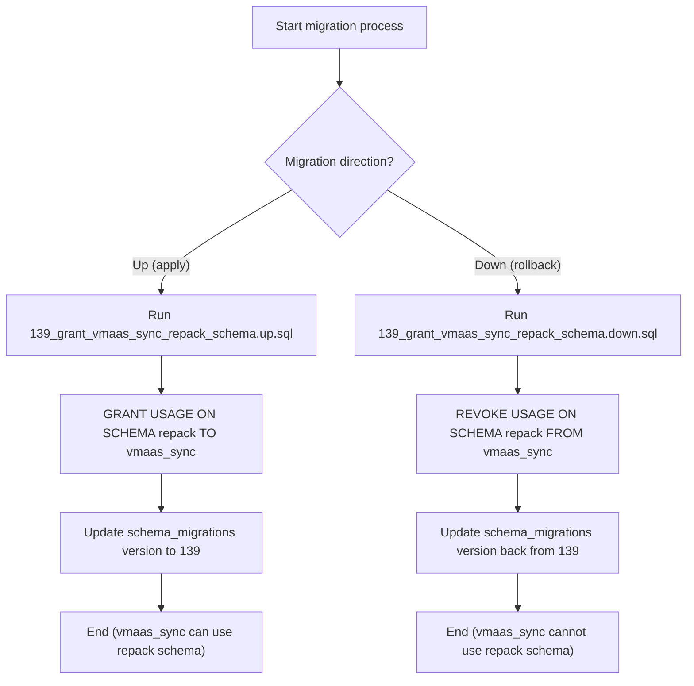

# Pull Request #1941: RHINENG-21627: vmaas_sync need to read size of repack tables

**Author**: @MichaelMraka
**Created**: November 21, 2025 at 05:13 PM UTC
**Status**: Merged
**Labels**: None
**Base**: `master` ← **Head**: `pr5`

## Description

## Secure Coding Practices Checklist GitHub Link
- https://github.com/RedHatInsights/secure-coding-checklist

## Secure Coding Checklist
- [x] Input Validation
- [x] Output Encoding
- [x] Authentication and Password Management
- [x] Session Management
- [x] Access Control
- [x] Cryptographic Practices
- [x] Error Handling and Logging
- [x] Data Protection
- [x] Communication Security
- [x] System Configuration
- [x] Database Security
- [x] File Management
- [x] Memory Management
- [x] General Coding Practices

## Summary by Sourcery

Enhancements:
- Grant repack schema usage to the vmaas_sync role to allow it to access objects within that schema.

---

## Discussion

### Comment by @sourcery-ai on November 21, 2025 at 05:13 PM UTC

<!-- Generated by sourcery-ai[bot]: start review_guide -->

<details>
<summary>Reviewer's guide (collapsed on small PRs)</summary>

## Reviewer's Guide

Updates database schema migration version and grants the vmaas_sync role USAGE on the repack schema, with corresponding up/down migration scripts to manage the new privilege.

#### Flow diagram for migration 139 granting vmaas_sync repack schema usage



### File-Level Changes

| Change | Details | Files |
| ------ | ------- | ----- |
| Advance schema version and grant vmaas_sync access to the repack schema so it can query repack tables. | <ul><li>Increment the schema_migrations version from 138 to 139 to register a new migration.</li><li>Grant USAGE on the repack schema to the vmaas_sync role in the base schema creation script so new environments have the correct permissions.</li><li>Add an up migration script that grants USAGE on the repack schema to vmaas_sync for existing environments.</li><li>Add a down migration script that revokes USAGE on the repack schema from vmaas_sync to allow rollback of the permission change.</li></ul> | `database_admin/schema/create_schema.sql`<br/>`database_admin/migrations/139_grant_vmaas_sync_repack_schema.up.sql`<br/>`database_admin/migrations/139_grant_vmaas_sync_repack_schema.down.sql` |

</details>

---

<details>
<summary>Tips and commands</summary>

#### Interacting with Sourcery

- **Trigger a new review:** Comment `@sourcery-ai review` on the pull request.
- **Continue discussions:** Reply directly to Sourcery's review comments.
- **Generate a GitHub issue from a review comment:** Ask Sourcery to create an
  issue from a review comment by replying to it. You can also reply to a
  review comment with `@sourcery-ai issue` to create an issue from it.
- **Generate a pull request title:** Write `@sourcery-ai` anywhere in the pull
  request title to generate a title at any time. You can also comment
  `@sourcery-ai title` on the pull request to (re-)generate the title at any time.
- **Generate a pull request summary:** Write `@sourcery-ai summary` anywhere in
  the pull request body to generate a PR summary at any time exactly where you
  want it. You can also comment `@sourcery-ai summary` on the pull request to
  (re-)generate the summary at any time.
- **Generate reviewer's guide:** Comment `@sourcery-ai guide` on the pull
  request to (re-)generate the reviewer's guide at any time.
- **Resolve all Sourcery comments:** Comment `@sourcery-ai resolve` on the
  pull request to resolve all Sourcery comments. Useful if you've already
  addressed all the comments and don't want to see them anymore.
- **Dismiss all Sourcery reviews:** Comment `@sourcery-ai dismiss` on the pull
  request to dismiss all existing Sourcery reviews. Especially useful if you
  want to start fresh with a new review - don't forget to comment
  `@sourcery-ai review` to trigger a new review!

#### Customizing Your Experience

Access your [dashboard](https://app.sourcery.ai) to:
- Enable or disable review features such as the Sourcery-generated pull request
  summary, the reviewer's guide, and others.
- Change the review language.
- Add, remove or edit custom review instructions.
- Adjust other review settings.

#### Getting Help

- [Contact our support team](mailto:support@sourcery.ai) for questions or feedback.
- Visit our [documentation](https://docs.sourcery.ai) for detailed guides and information.
- Keep in touch with the Sourcery team by following us on [X/Twitter](https://x.com/SourceryAI), [LinkedIn](https://www.linkedin.com/company/sourcery-ai/) or [GitHub](https://github.com/sourcery-ai).

</details>

<!-- Generated by sourcery-ai[bot]: end review_guide -->

### Comment by @codecov-commenter on November 25, 2025 at 02:48 PM UTC

## [Codecov](https://app.codecov.io/gh/RedHatInsights/patchman-engine/pull/1941?dropdown=coverage&src=pr&el=h1&utm_medium=referral&utm_source=github&utm_content=comment&utm_campaign=pr+comments&utm_term=RedHatInsights) Report
:white_check_mark: All modified and coverable lines are covered by tests.
:white_check_mark: Project coverage is 58.84%. Comparing base ([`73960ce`](https://app.codecov.io/gh/RedHatInsights/patchman-engine/commit/73960cebc6b75089a2b6499ed8f50ce6c0c06f24?dropdown=coverage&el=desc&utm_medium=referral&utm_source=github&utm_content=comment&utm_campaign=pr+comments&utm_term=RedHatInsights)) to head ([`707e957`](https://app.codecov.io/gh/RedHatInsights/patchman-engine/commit/707e957be0c7b66163a2cccaf72307a9d91c418f?dropdown=coverage&el=desc&utm_medium=referral&utm_source=github&utm_content=comment&utm_campaign=pr+comments&utm_term=RedHatInsights)).

<details><summary>Additional details and impacted files</summary>


```diff
@@           Coverage Diff           @@
##           master    #1941   +/-   ##
=======================================
  Coverage   58.84%   58.84%           
=======================================
  Files         131      131           
  Lines        8436     8436           
=======================================
  Hits         4964     4964           
  Misses       2937     2937           
  Partials      535      535           
```

| [Flag](https://app.codecov.io/gh/RedHatInsights/patchman-engine/pull/1941/flags?src=pr&el=flags&utm_medium=referral&utm_source=github&utm_content=comment&utm_campaign=pr+comments&utm_term=RedHatInsights) | Coverage Δ | |
|---|---|---|
| [unittests](https://app.codecov.io/gh/RedHatInsights/patchman-engine/pull/1941/flags?src=pr&el=flag&utm_medium=referral&utm_source=github&utm_content=comment&utm_campaign=pr+comments&utm_term=RedHatInsights) | `58.84% <ø> (ø)` | |

Flags with carried forward coverage won't be shown. [Click here](https://docs.codecov.io/docs/carryforward-flags?utm_medium=referral&utm_source=github&utm_content=comment&utm_campaign=pr+comments&utm_term=RedHatInsights#carryforward-flags-in-the-pull-request-comment) to find out more.
</details>

[:umbrella: View full report in Codecov by Sentry](https://app.codecov.io/gh/RedHatInsights/patchman-engine/pull/1941?dropdown=coverage&src=pr&el=continue&utm_medium=referral&utm_source=github&utm_content=comment&utm_campaign=pr+comments&utm_term=RedHatInsights).   
:loudspeaker: Have feedback on the report? [Share it here](https://about.codecov.io/codecov-pr-comment-feedback/?utm_medium=referral&utm_source=github&utm_content=comment&utm_campaign=pr+comments&utm_term=RedHatInsights).
<details><summary> :rocket: New features to boost your workflow: </summary>

- :snowflake: [Test Analytics](https://docs.codecov.com/docs/test-analytics): Detect flaky tests, report on failures, and find test suite problems.
</details>

### Comment by @MichaelMraka on November 27, 2025 at 09:54 AM UTC

/retest

### Comment by @jira-linking on December 05, 2025 at 07:11 PM UTC

Referenced Jiras:
https://issues.redhat.com/browse/RHINENG-21627


---

## Reviews

### Review by @sourcery-ai - Commented on November 21, 2025 at 05:14 PM UTC

Hey there - I've reviewed your changes - here's some feedback:

- Given the principle of least privilege, consider whether vmaas_sync truly needs USAGE on the entire repack schema or if access can be restricted to only the specific objects it must query for size information.
- If vmaas_sync needs to actually read from tables in the repack schema and not just reference them, you may also need explicit SELECT grants on those tables/views, since USAGE on the schema alone will not allow data access.

<details>
<summary>Prompt for AI Agents</summary>

~~~markdown
Please address the comments from this code review:

## Overall Comments
- Given the principle of least privilege, consider whether vmaas_sync truly needs USAGE on the entire repack schema or if access can be restricted to only the specific objects it must query for size information.
- If vmaas_sync needs to actually read from tables in the repack schema and not just reference them, you may also need explicit SELECT grants on those tables/views, since USAGE on the schema alone will not allow data access.

## Individual Comments

### Comment 1
<location> `database_admin/schema/create_schema.sql:1045` </location>
<code_context>
+GRANT USAGE ON SCHEMA repack TO vmaas_sync;
</code_context>

<issue_to_address>
**issue:** Consider how this behaves when the `repack` schema is not present in a fresh or minimal environment.

If `repack` is created by an extension or optional component, this GRANT will fail in environments where that schema doesn’t exist yet (e.g., local dev or CI). Please either guard this with a conditional check (e.g., DO block checking `pg_namespace`) or ensure deployment ordering guarantees `repack` is created before this script runs.
</issue_to_address>
~~~

</details>

***

<details>
<summary>Sourcery is free for open source - if you like our reviews please consider sharing them ✨</summary>

- [X](https://twitter.com/intent/tweet?text=I%20just%20got%20an%20instant%20code%20review%20from%20%40SourceryAI%2C%20and%20it%20was%20brilliant%21%20It%27s%20free%20for%20open%20source%20and%20has%20a%20free%20trial%20for%20private%20code.%20Check%20it%20out%20https%3A//sourcery.ai)
- [Mastodon](https://mastodon.social/share?text=I%20just%20got%20an%20instant%20code%20review%20from%20%40SourceryAI%2C%20and%20it%20was%20brilliant%21%20It%27s%20free%20for%20open%20source%20and%20has%20a%20free%20trial%20for%20private%20code.%20Check%20it%20out%20https%3A//sourcery.ai)
- [LinkedIn](https://www.linkedin.com/sharing/share-offsite/?url=https://sourcery.ai)
- [Facebook](https://www.facebook.com/sharer/sharer.php?u=https://sourcery.ai)

</details>

<sub>
Help me be more useful! Please click 👍 or 👎 on each comment and I'll use the feedback to improve your reviews.
</sub>

### Review by @TenSt - Approved on November 26, 2025 at 02:41 PM UTC

lgtm

---

*Archived from: https://github.com/RedHatInsights/patchman-engine/pull/1941*
