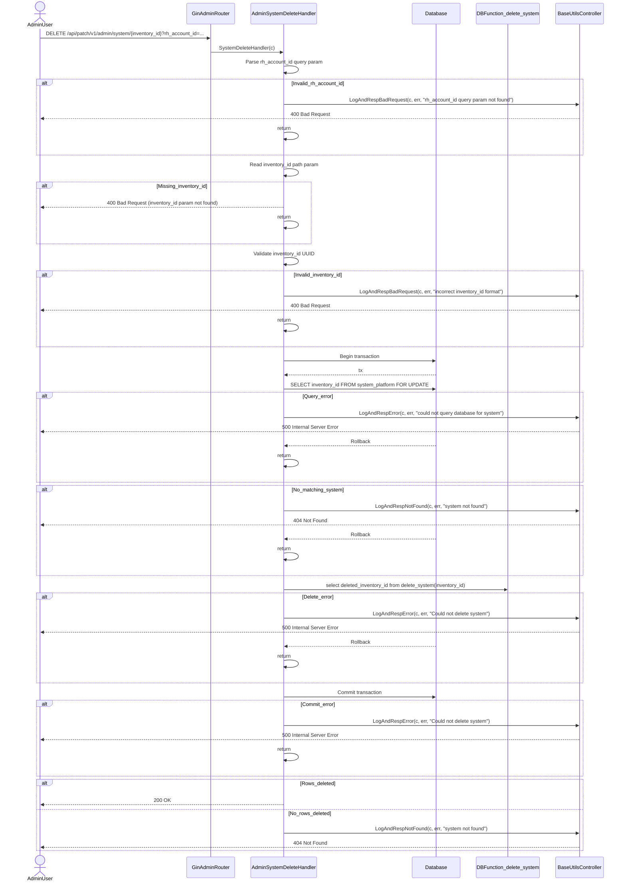

# Pull Request #1960: RHINENG-22023: move system delete endpoint to admin api

**Author**: @Dugowitch
**Created**: December 01, 2025 at 11:55 AM UTC
**Status**: Merged
**Labels**: None
**Base**: `master` ← **Head**: `RHINENG-22023`

## Description

## Secure Coding Practices Checklist GitHub Link
- https://github.com/RedHatInsights/secure-coding-checklist

## Secure Coding Checklist
- [x] Input Validation
- [x] Output Encoding
- [x] Authentication and Password Management
- [x] Session Management
- [x] Access Control
- [x] Cryptographic Practices
- [x] Error Handling and Logging
- [x] Data Protection
- [x] Communication Security
- [x] System Configuration
- [x] Database Security
- [x] File Management
- [x] Memory Management
- [x] General Coding Practices

## Summary by Sourcery

Move the system deletion functionality from the user-facing systems API to the admin API and centralize controller error-handling helpers.

New Features:
- Expose an admin-only DELETE /system/{inventory_id} endpoint to delete systems by inventory ID and account ID.

Enhancements:
- Introduce shared controller utility helpers for logging and HTTP error responses in the base utils package and update manager controllers to use them.
- Add HTTP request/route test helper functions for controller tests in the manager package.
- Update API routing and OpenAPI documentation to reflect the new admin system deletion endpoint and removal of the user-facing deletion route.

Tests:
- Add and update controller tests to cover the new admin system delete endpoint, including success, wrong account, not found, and invalid inventory ID cases.

---

## Discussion

### Comment by @sourcery-ai on December 01, 2025 at 11:55 AM UTC

<!-- Generated by sourcery-ai[bot]: start review_guide -->

## Reviewer's Guide

Moves system deletion into the admin API, centralizes controller error/logging helpers into a shared base utils package, and introduces reusable HTTP test utilities while removing the user-facing system delete route and its controller.

#### Sequence diagram for the new admin system delete endpoint



#### Class diagram for shared controller utils and admin system delete handler

```mermaid
classDiagram
    class BaseUtilsController {
        <<package>>
        +LogAndRespError(c *gin.Context, err error, respMsg string)
        +LogWarnAndResp(c *gin.Context, code int, respMsg string)
        +LogAndRespStatusError(c *gin.Context, code int, err error, msg string)
        +LogAndRespBadRequest(c *gin.Context, err error, respMsg string)
        +LogAndRespNotFound(c *gin.Context, err error, respMsg string)
    }

    class AdminSystemDeleteHandler {
        <<controller>>
        +SystemDeleteHandler(c *gin.Context)
        -parseAccountID(c *gin.Context) int
        -validateInventoryID(inventoryID string) bool
        -deleteSystem(tx *gorm.DB, accountID int, inventoryID string) error
    }

    class ManagerControllersCommon {
        <<controllers>>
        +ExportListCommon(tx *gorm.DB, c *gin.Context, opts ListOpts) (*gorm.DB, error)
        +ListCommonNoLimitOffset(tx *gorm.DB, c *gin.Context, filters Filters, opts ListOpts) (*gorm.DB, *ListMeta, *Links, error)
        +UpdateMetaLinks(c *gin.Context, meta *ListMeta, total int, subTotals map[string]int, params ...string) (*ListMeta, *Links, error)
        +ParseAllFilters(c *gin.Context, opts ListOpts) (Filters, error)
        +OutputExportData(c *gin.Context, data any)
        +systemsIDs(c *gin.Context, systems []SystemsID, meta *ListMeta) (IDsPlainResponse, error)
        +systemsSatelliteIDs(c *gin.Context, systems []SystemsSatelliteManagedID, meta *ListMeta) (IDsPlainResponse, error)
        +isFilterInURLValid(c *gin.Context) bool
    }

    class SystemDetailController {
        <<controller>>
        +SystemDetailHandler(c *gin.Context)
        +SystemVmaasJSONHandler(c *gin.Context)
        +SystemYumUpdatesHandler(c *gin.Context)
        -systemJSONsCommon(c *gin.Context, column string) *models.SystemPlatform
    }

    class TemplateSystemsUpdateController {
        <<controller>>
        +TemplateSystemsUpdateHandler(c *gin.Context)
        -checkTemplateSystems(c *gin.Context, db *gorm.DB, accountID int, template *models.Template, inventoryIDs []string, groups map[string]string) error
        -assignTemplateSystems(c *gin.Context, db *gorm.DB, accountID int, templateID int, inventoryIDs []string) error
        -assignCandlepinEnvironment(c *gin.Context, db *gorm.DB, accountID int, envName string, inventoryIDs []string) error
    }

    class StatusController {
        <<controller>>
        +Status(c *gin.Context)
    }

    BaseUtilsController <.. AdminSystemDeleteHandler : uses
    BaseUtilsController <.. ManagerControllersCommon : uses
    BaseUtilsController <.. SystemDetailController : uses
    BaseUtilsController <.. TemplateSystemsUpdateController : uses
    BaseUtilsController <.. StatusController : uses

    class GORM_DB {
        <<external>>
        +Begin() *gorm.DB
        +Commit() error
        +Rollback()
    }

    AdminSystemDeleteHandler ..> GORM_DB : transaction
    ManagerControllersCommon ..> GORM_DB : queries
    SystemDetailController ..> GORM_DB : queries
    TemplateSystemsUpdateController ..> GORM_DB : queries
    StatusController ..> GORM_DB : health_check
```



### File-Level Changes

| Change | Details | Files |
| ------ | ------- | ----- |
| Add admin-only system delete endpoint and tests while removing the previous user-facing delete handler. | <ul><li>Implement SystemDeleteHandler in the admin controller to delete a system by inventory_id and rh_account_id with validation, transactional locking, and use of the delete_system() DB function.</li><li>Wire the new admin delete route under /admin/api/system/:inventory_id and remove the old DELETE /systems/:inventory_id route from the manager API.</li><li>Move and adapt system deletion tests into turnpike/admin tests, adding rh_account_id query param coverage and using shared manager test utilities.</li></ul> | `turnpike/controllers/admin.go`<br/>`manager/routes/routes.go`<br/>`turnpike/controllers/admin_test.go` |
| Centralize controller logging and error-response helpers into a shared utils package and update controllers to use them. | <ul><li>Introduce base/utils/controller.go with shared LogAndRespError, LogWarnAndResp, LogAndRespStatusError, LogAndRespBadRequest, and LogAndRespNotFound utilities using gin and ErrorResponse.</li><li>Remove duplicate logging/response helper implementations from manager/controllers/utils.go.</li><li>Update manager controller handlers across systems, advisories, packages, templates, status, and exports to call the new utils.* helpers instead of local functions.</li></ul> | `base/utils/controller.go`<br/>`manager/controllers/utils.go`<br/>`manager/controllers/template_systems_update.go`<br/>`manager/controllers/system_detail.go`<br/>`manager/controllers/advisory_systems.go`<br/>`manager/controllers/system_advisories.go`<br/>`manager/controllers/template_systems.go`<br/>`manager/controllers/package_systems.go`<br/>`manager/controllers/system_advisories_export.go`<br/>`manager/controllers/advisory_systems_export.go`<br/>`manager/controllers/package_detail.go`<br/>`manager/controllers/package_systems_export.go`<br/>`manager/controllers/package_versions.go`<br/>`manager/controllers/system_packages.go`<br/>`manager/controllers/system_packages_export.go`<br/>`manager/controllers/advisories.go`<br/>`manager/controllers/advisory_detail.go`<br/>`manager/controllers/systems.go`<br/>`manager/controllers/systems_advisories_view.go`<br/>`manager/controllers/systemtags.go`<br/>`manager/controllers/template_subscribed_systems_update.go`<br/>`manager/controllers/templates.go`<br/>`manager/controllers/advisories_export.go`<br/>`manager/controllers/packages.go`<br/>`manager/controllers/packages_export.go`<br/>`manager/controllers/status.go`<br/>`manager/controllers/systems_export.go`<br/>`manager/controllers/template_systems_delete.go`<br/>`manager/controllers/template_systems_export.go` |
| Add reusable HTTP request/response test helpers for controller tests in the manager package. | <ul><li>Extend manager/controllers test utilities with helpers to prepare requests, create routers with params/path/account, and assert responses.</li><li>Refactor admin deletion tests to use the new CreateRequestRouterWithParams helper pointing at the new admin route and query string.</li></ul> | `manager/controllers/test_utils.go`<br/>`turnpike/controllers/admin_test.go` |
| Update API documentation for the new admin system delete endpoint and removal from the v3 user API. | <ul><li>Adjust admin OpenAPI docs to document DELETE /system/{inventory_id} with rh_account_id query param and expected status codes.</li><li>Update v3 OpenAPI docs to reflect removal of the user-facing system delete operation.</li></ul> | `docs/admin/openapi.json`<br/>`docs/v3/openapi.json` |

---

<details>
<summary>Tips and commands</summary>

#### Interacting with Sourcery

- **Trigger a new review:** Comment `@sourcery-ai review` on the pull request.
- **Continue discussions:** Reply directly to Sourcery's review comments.
- **Generate a GitHub issue from a review comment:** Ask Sourcery to create an
  issue from a review comment by replying to it. You can also reply to a
  review comment with `@sourcery-ai issue` to create an issue from it.
- **Generate a pull request title:** Write `@sourcery-ai` anywhere in the pull
  request title to generate a title at any time. You can also comment
  `@sourcery-ai title` on the pull request to (re-)generate the title at any time.
- **Generate a pull request summary:** Write `@sourcery-ai summary` anywhere in
  the pull request body to generate a PR summary at any time exactly where you
  want it. You can also comment `@sourcery-ai summary` on the pull request to
  (re-)generate the summary at any time.
- **Generate reviewer's guide:** Comment `@sourcery-ai guide` on the pull
  request to (re-)generate the reviewer's guide at any time.
- **Resolve all Sourcery comments:** Comment `@sourcery-ai resolve` on the
  pull request to resolve all Sourcery comments. Useful if you've already
  addressed all the comments and don't want to see them anymore.
- **Dismiss all Sourcery reviews:** Comment `@sourcery-ai dismiss` on the pull
  request to dismiss all existing Sourcery reviews. Especially useful if you
  want to start fresh with a new review - don't forget to comment
  `@sourcery-ai review` to trigger a new review!

#### Customizing Your Experience

Access your [dashboard](https://app.sourcery.ai) to:
- Enable or disable review features such as the Sourcery-generated pull request
  summary, the reviewer's guide, and others.
- Change the review language.
- Add, remove or edit custom review instructions.
- Adjust other review settings.

#### Getting Help

- [Contact our support team](mailto:support@sourcery.ai) for questions or feedback.
- Visit our [documentation](https://docs.sourcery.ai) for detailed guides and information.
- Keep in touch with the Sourcery team by following us on [X/Twitter](https://x.com/SourceryAI), [LinkedIn](https://www.linkedin.com/company/sourcery-ai/) or [GitHub](https://github.com/sourcery-ai).

</details>

<!-- Generated by sourcery-ai[bot]: end review_guide -->

### Comment by @codecov-commenter on December 02, 2025 at 11:47 AM UTC

## [Codecov](https://app.codecov.io/gh/RedHatInsights/patchman-engine/pull/1960?dropdown=coverage&src=pr&el=h1&utm_medium=referral&utm_source=github&utm_content=comment&utm_campaign=pr+comments&utm_term=RedHatInsights) Report
:x: Patch coverage is `44.50867%` with `96 lines` in your changes missing coverage. Please review.
:white_check_mark: Project coverage is 58.85%. Comparing base ([`8cebac0`](https://app.codecov.io/gh/RedHatInsights/patchman-engine/commit/8cebac07d49b45b5c1e4523eef98c20790a04db5?dropdown=coverage&el=desc&utm_medium=referral&utm_source=github&utm_content=comment&utm_campaign=pr+comments&utm_term=RedHatInsights)) to head ([`3694515`](https://app.codecov.io/gh/RedHatInsights/patchman-engine/commit/36945150028330e9a69606503ad49e214fa7eadb?dropdown=coverage&el=desc&utm_medium=referral&utm_source=github&utm_content=comment&utm_campaign=pr+comments&utm_term=RedHatInsights)).
:warning: Report is 369 commits behind head on master.

| [Files with missing lines](https://app.codecov.io/gh/RedHatInsights/patchman-engine/pull/1960?dropdown=coverage&src=pr&el=tree&utm_medium=referral&utm_source=github&utm_content=comment&utm_campaign=pr+comments&utm_term=RedHatInsights) | Patch % | Lines |
|---|---|---|
| [base/utils/controller.go](https://app.codecov.io/gh/RedHatInsights/patchman-engine/pull/1960?src=pr&el=tree&filepath=base%2Futils%2Fcontroller.go&utm_medium=referral&utm_source=github&utm_content=comment&utm_campaign=pr+comments&utm_term=RedHatInsights#diff-YmFzZS91dGlscy9jb250cm9sbGVyLmdv) | 0.00% | [15 Missing :warning: ](https://app.codecov.io/gh/RedHatInsights/patchman-engine/pull/1960?src=pr&el=tree&utm_medium=referral&utm_source=github&utm_content=comment&utm_campaign=pr+comments&utm_term=RedHatInsights) |
| [turnpike/controllers/admin.go](https://app.codecov.io/gh/RedHatInsights/patchman-engine/pull/1960?src=pr&el=tree&filepath=turnpike%2Fcontrollers%2Fadmin.go&utm_medium=referral&utm_source=github&utm_content=comment&utm_campaign=pr+comments&utm_term=RedHatInsights#diff-dHVybnBpa2UvY29udHJvbGxlcnMvYWRtaW4uZ28=) | 55.88% | [10 Missing and 5 partials :warning: ](https://app.codecov.io/gh/RedHatInsights/patchman-engine/pull/1960?src=pr&el=tree&utm_medium=referral&utm_source=github&utm_content=comment&utm_campaign=pr+comments&utm_term=RedHatInsights) |
| [manager/controllers/system\_detail.go](https://app.codecov.io/gh/RedHatInsights/patchman-engine/pull/1960?src=pr&el=tree&filepath=manager%2Fcontrollers%2Fsystem_detail.go&utm_medium=referral&utm_source=github&utm_content=comment&utm_campaign=pr+comments&utm_term=RedHatInsights#diff-bWFuYWdlci9jb250cm9sbGVycy9zeXN0ZW1fZGV0YWlsLmdv) | 25.00% | [6 Missing :warning: ](https://app.codecov.io/gh/RedHatInsights/patchman-engine/pull/1960?src=pr&el=tree&utm_medium=referral&utm_source=github&utm_content=comment&utm_campaign=pr+comments&utm_term=RedHatInsights) |
| [manager/controllers/template\_systems\_update.go](https://app.codecov.io/gh/RedHatInsights/patchman-engine/pull/1960?src=pr&el=tree&filepath=manager%2Fcontrollers%2Ftemplate_systems_update.go&utm_medium=referral&utm_source=github&utm_content=comment&utm_campaign=pr+comments&utm_term=RedHatInsights#diff-bWFuYWdlci9jb250cm9sbGVycy90ZW1wbGF0ZV9zeXN0ZW1zX3VwZGF0ZS5nbw==) | 50.00% | [6 Missing :warning: ](https://app.codecov.io/gh/RedHatInsights/patchman-engine/pull/1960?src=pr&el=tree&utm_medium=referral&utm_source=github&utm_content=comment&utm_campaign=pr+comments&utm_term=RedHatInsights) |
| [manager/controllers/advisory\_systems.go](https://app.codecov.io/gh/RedHatInsights/patchman-engine/pull/1960?src=pr&el=tree&filepath=manager%2Fcontrollers%2Fadvisory_systems.go&utm_medium=referral&utm_source=github&utm_content=comment&utm_campaign=pr+comments&utm_term=RedHatInsights#diff-bWFuYWdlci9jb250cm9sbGVycy9hZHZpc29yeV9zeXN0ZW1zLmdv) | 0.00% | [5 Missing :warning: ](https://app.codecov.io/gh/RedHatInsights/patchman-engine/pull/1960?src=pr&el=tree&utm_medium=referral&utm_source=github&utm_content=comment&utm_campaign=pr+comments&utm_term=RedHatInsights) |
| [manager/controllers/utils.go](https://app.codecov.io/gh/RedHatInsights/patchman-engine/pull/1960?src=pr&el=tree&filepath=manager%2Fcontrollers%2Futils.go&utm_medium=referral&utm_source=github&utm_content=comment&utm_campaign=pr+comments&utm_term=RedHatInsights#diff-bWFuYWdlci9jb250cm9sbGVycy91dGlscy5nbw==) | 58.33% | [5 Missing :warning: ](https://app.codecov.io/gh/RedHatInsights/patchman-engine/pull/1960?src=pr&el=tree&utm_medium=referral&utm_source=github&utm_content=comment&utm_campaign=pr+comments&utm_term=RedHatInsights) |
| [manager/controllers/system\_advisories.go](https://app.codecov.io/gh/RedHatInsights/patchman-engine/pull/1960?src=pr&el=tree&filepath=manager%2Fcontrollers%2Fsystem_advisories.go&utm_medium=referral&utm_source=github&utm_content=comment&utm_campaign=pr+comments&utm_term=RedHatInsights#diff-bWFuYWdlci9jb250cm9sbGVycy9zeXN0ZW1fYWR2aXNvcmllcy5nbw==) | 20.00% | [4 Missing :warning: ](https://app.codecov.io/gh/RedHatInsights/patchman-engine/pull/1960?src=pr&el=tree&utm_medium=referral&utm_source=github&utm_content=comment&utm_campaign=pr+comments&utm_term=RedHatInsights) |
| [manager/controllers/advisory\_systems\_export.go](https://app.codecov.io/gh/RedHatInsights/patchman-engine/pull/1960?src=pr&el=tree&filepath=manager%2Fcontrollers%2Fadvisory_systems_export.go&utm_medium=referral&utm_source=github&utm_content=comment&utm_campaign=pr+comments&utm_term=RedHatInsights#diff-bWFuYWdlci9jb250cm9sbGVycy9hZHZpc29yeV9zeXN0ZW1zX2V4cG9ydC5nbw==) | 0.00% | [3 Missing :warning: ](https://app.codecov.io/gh/RedHatInsights/patchman-engine/pull/1960?src=pr&el=tree&utm_medium=referral&utm_source=github&utm_content=comment&utm_campaign=pr+comments&utm_term=RedHatInsights) |
| [manager/controllers/package\_systems.go](https://app.codecov.io/gh/RedHatInsights/patchman-engine/pull/1960?src=pr&el=tree&filepath=manager%2Fcontrollers%2Fpackage_systems.go&utm_medium=referral&utm_source=github&utm_content=comment&utm_campaign=pr+comments&utm_term=RedHatInsights#diff-bWFuYWdlci9jb250cm9sbGVycy9wYWNrYWdlX3N5c3RlbXMuZ28=) | 25.00% | [3 Missing :warning: ](https://app.codecov.io/gh/RedHatInsights/patchman-engine/pull/1960?src=pr&el=tree&utm_medium=referral&utm_source=github&utm_content=comment&utm_campaign=pr+comments&utm_term=RedHatInsights) |
| [manager/controllers/system\_advisories\_export.go](https://app.codecov.io/gh/RedHatInsights/patchman-engine/pull/1960?src=pr&el=tree&filepath=manager%2Fcontrollers%2Fsystem_advisories_export.go&utm_medium=referral&utm_source=github&utm_content=comment&utm_campaign=pr+comments&utm_term=RedHatInsights#diff-bWFuYWdlci9jb250cm9sbGVycy9zeXN0ZW1fYWR2aXNvcmllc19leHBvcnQuZ28=) | 25.00% | [3 Missing :warning: ](https://app.codecov.io/gh/RedHatInsights/patchman-engine/pull/1960?src=pr&el=tree&utm_medium=referral&utm_source=github&utm_content=comment&utm_campaign=pr+comments&utm_term=RedHatInsights) |
| ... and [21 more](https://app.codecov.io/gh/RedHatInsights/patchman-engine/pull/1960?src=pr&el=tree-more&utm_medium=referral&utm_source=github&utm_content=comment&utm_campaign=pr+comments&utm_term=RedHatInsights) | |

<details><summary>Additional details and impacted files</summary>


```diff
@@            Coverage Diff             @@
##           master    #1960      +/-   ##
==========================================
+ Coverage   58.83%   58.85%   +0.02%     
==========================================
  Files         131      131              
  Lines        8407     8434      +27     
==========================================
+ Hits         4946     4964      +18     
- Misses       2927     2936       +9     
  Partials      534      534              
```

| [Flag](https://app.codecov.io/gh/RedHatInsights/patchman-engine/pull/1960/flags?src=pr&el=flags&utm_medium=referral&utm_source=github&utm_content=comment&utm_campaign=pr+comments&utm_term=RedHatInsights) | Coverage Δ | |
|---|---|---|
| [unittests](https://app.codecov.io/gh/RedHatInsights/patchman-engine/pull/1960/flags?src=pr&el=flag&utm_medium=referral&utm_source=github&utm_content=comment&utm_campaign=pr+comments&utm_term=RedHatInsights) | `58.85% <44.50%> (+0.02%)` | :arrow_up: |

Flags with carried forward coverage won't be shown. [Click here](https://docs.codecov.io/docs/carryforward-flags?utm_medium=referral&utm_source=github&utm_content=comment&utm_campaign=pr+comments&utm_term=RedHatInsights#carryforward-flags-in-the-pull-request-comment) to find out more.
</details>

[:umbrella: View full report in Codecov by Sentry](https://app.codecov.io/gh/RedHatInsights/patchman-engine/pull/1960?dropdown=coverage&src=pr&el=continue&utm_medium=referral&utm_source=github&utm_content=comment&utm_campaign=pr+comments&utm_term=RedHatInsights).   
:loudspeaker: Have feedback on the report? [Share it here](https://about.codecov.io/codecov-pr-comment-feedback/?utm_medium=referral&utm_source=github&utm_content=comment&utm_campaign=pr+comments&utm_term=RedHatInsights).
<details><summary> :rocket: New features to boost your workflow: </summary>

- :snowflake: [Test Analytics](https://docs.codecov.com/docs/test-analytics): Detect flaky tests, report on failures, and find test suite problems.
</details>

---

## Reviews

### Review by @sourcery-ai - Commented on December 02, 2025 at 11:49 AM UTC

Hey there - I've reviewed your changes - here's some feedback:

- In `SystemDeleteHandler`, the error handling after `tx.Exec("select deleted_inventory_id from delete_system...")` and `tx.Commit()` uses the `err` variable instead of `query.Error`/`tx.Commit().Error`, which means the logged error may be nil or unrelated to the actual failure; use the concrete error values from those calls instead.
- The admin delete route is registered as `api.DELETE("/system/:inventory_id", ...)`, but the handler swagger annotation (`@Router /systems/{inventory_id} [delete]`) and tests use `/systems/:inventory_id`; align these paths so the actual route, tests, and documentation are consistent.
- In `SystemDeleteHandler`, parsing `rh_account_id` with `strconv.Atoi` treats any parse failure (including non-numeric values) as "query param not found" and hides the underlying error; consider distinguishing between a missing parameter and an invalid format, and reusing `utils.LogAndRespBadRequest` instead of the custom `c.JSON` call for the `inventory_id` missing case to keep responses consistent.

<details>
<summary>Prompt for AI Agents</summary>

~~~markdown
Please address the comments from this code review:

## Overall Comments
- In `SystemDeleteHandler`, the error handling after `tx.Exec("select deleted_inventory_id from delete_system...")` and `tx.Commit()` uses the `err` variable instead of `query.Error`/`tx.Commit().Error`, which means the logged error may be nil or unrelated to the actual failure; use the concrete error values from those calls instead.
- The admin delete route is registered as `api.DELETE("/system/:inventory_id", ...)`, but the handler swagger annotation (`@Router /systems/{inventory_id} [delete]`) and tests use `/systems/:inventory_id`; align these paths so the actual route, tests, and documentation are consistent.
- In `SystemDeleteHandler`, parsing `rh_account_id` with `strconv.Atoi` treats any parse failure (including non-numeric values) as "query param not found" and hides the underlying error; consider distinguishing between a missing parameter and an invalid format, and reusing `utils.LogAndRespBadRequest` instead of the custom `c.JSON` call for the `inventory_id` missing case to keep responses consistent.

## Individual Comments

### Comment 1
<location> `turnpike/controllers/admin.go:255-257` </location>
<code_context>
-		return
-	}
-
-	query := tx.Exec("select deleted_inventory_id from delete_system(?::uuid)", systemInventoryID[0])
-
-	if query.Error != nil {
-		LogAndRespError(c, err, "Could not delete system")
-		return
</code_context>

<issue_to_address>
**issue (bug_risk):** Use `query.Error` instead of the stale `err` variable when handling the delete call failure.

`tx.Exec` sets `query.Error`, but this branch logs `err`, which still holds the `Pluck` error. That will log the wrong error and hide the real `delete_system` failure. Use `query.Error` here (or assign it to a new `err` before logging).
</issue_to_address>

### Comment 2
<location> `turnpike/controllers/admin.go:262-258` </location>
<code_context>
-		return
-	}
-
-	if tx.Commit().Error != nil {
-		LogAndRespError(c, err, "Could not delete system")
-		return
</code_context>

<issue_to_address>
**issue (bug_risk):** On commit failure, log the commit error instead of reusing the previous `err` value.

Here you’re checking `tx.Commit().Error` but still passing the earlier `err` to `LogAndRespError`. This can log the wrong failure. Assign `tx.Commit().Error` to a new variable and use that in the log/response call.
</issue_to_address>
~~~

</details>

***

<details>
<summary>Sourcery is free for open source - if you like our reviews please consider sharing them ✨</summary>

- [X](https://twitter.com/intent/tweet?text=I%20just%20got%20an%20instant%20code%20review%20from%20%40SourceryAI%2C%20and%20it%20was%20brilliant%21%20It%27s%20free%20for%20open%20source%20and%20has%20a%20free%20trial%20for%20private%20code.%20Check%20it%20out%20https%3A//sourcery.ai)
- [Mastodon](https://mastodon.social/share?text=I%20just%20got%20an%20instant%20code%20review%20from%20%40SourceryAI%2C%20and%20it%20was%20brilliant%21%20It%27s%20free%20for%20open%20source%20and%20has%20a%20free%20trial%20for%20private%20code.%20Check%20it%20out%20https%3A//sourcery.ai)
- [LinkedIn](https://www.linkedin.com/sharing/share-offsite/?url=https://sourcery.ai)
- [Facebook](https://www.facebook.com/sharer/sharer.php?u=https://sourcery.ai)

</details>

<sub>
Help me be more useful! Please click 👍 or 👎 on each comment and I'll use the feedback to improve your reviews.
</sub>

### Review by @MichaelMraka - Changes Requested on December 03, 2025 at 09:53 AM UTC

### Review by @MichaelMraka - Approved on December 03, 2025 at 02:28 PM UTC

---

*Archived from: https://github.com/RedHatInsights/patchman-engine/pull/1960*
