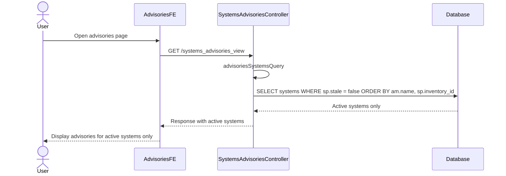

# Pull Request #1961: RHINENG-21470: filter stale systems in sys-adv view

**Author**: @dominikvagner
**Created**: December 03, 2025 at 03:42 PM UTC
**Status**: Merged
**Labels**: None
**Base**: `master` ← **Head**: `fix-per-advisory-different-system-results`

## Description

## Summary
This adds a where condition that will filter out stale systems from the systems advisories view calls. This is done to ensure unified behavior (chosen systems) while planning remediation on the advisories FE page.

## Summary by Sourcery

Bug Fixes:
- Exclude stale systems from systems advisories queries to align the view with expected active system selections.

---

## Discussion

### Comment by @jira-linking on December 03, 2025 at 03:42 PM UTC

Referenced Jiras:
https://issues.redhat.com/browse/RHINENG-21470


### Comment by @sourcery-ai on December 03, 2025 at 03:42 PM UTC

<!-- Generated by sourcery-ai[bot]: start review_guide -->

<details>
<summary>Reviewer's guide (collapsed on small PRs)</summary>

## Reviewer's Guide

Adds a filter to exclude stale systems from the systems advisories view query to ensure only active systems are included when planning remediation.

#### Sequence diagram for filtering stale systems in systems advisories view



### File-Level Changes

| Change | Details | Files |
| ------ | ------- | ----- |
| Filter out stale systems in the systems advisories query while preserving existing ordering. | <ul><li>Extend the advisoriesSystemsQuery GORM chain to add a WHERE clause on sp.stale = false before ordering.</li><li>Keep the existing ORDER BY am.name, sp.inventory_id after the new stale filter.</li><li>Leave surrounding query construction and joins untouched to minimize behavioral changes.</li></ul> | `manager/controllers/systems_advisories_view.go` |

</details>

---

<details>
<summary>Tips and commands</summary>

#### Interacting with Sourcery

- **Trigger a new review:** Comment `@sourcery-ai review` on the pull request.
- **Continue discussions:** Reply directly to Sourcery's review comments.
- **Generate a GitHub issue from a review comment:** Ask Sourcery to create an
  issue from a review comment by replying to it. You can also reply to a
  review comment with `@sourcery-ai issue` to create an issue from it.
- **Generate a pull request title:** Write `@sourcery-ai` anywhere in the pull
  request title to generate a title at any time. You can also comment
  `@sourcery-ai title` on the pull request to (re-)generate the title at any time.
- **Generate a pull request summary:** Write `@sourcery-ai summary` anywhere in
  the pull request body to generate a PR summary at any time exactly where you
  want it. You can also comment `@sourcery-ai summary` on the pull request to
  (re-)generate the summary at any time.
- **Generate reviewer's guide:** Comment `@sourcery-ai guide` on the pull
  request to (re-)generate the reviewer's guide at any time.
- **Resolve all Sourcery comments:** Comment `@sourcery-ai resolve` on the
  pull request to resolve all Sourcery comments. Useful if you've already
  addressed all the comments and don't want to see them anymore.
- **Dismiss all Sourcery reviews:** Comment `@sourcery-ai dismiss` on the pull
  request to dismiss all existing Sourcery reviews. Especially useful if you
  want to start fresh with a new review - don't forget to comment
  `@sourcery-ai review` to trigger a new review!

#### Customizing Your Experience

Access your [dashboard](https://app.sourcery.ai) to:
- Enable or disable review features such as the Sourcery-generated pull request
  summary, the reviewer's guide, and others.
- Change the review language.
- Add, remove or edit custom review instructions.
- Adjust other review settings.

#### Getting Help

- [Contact our support team](mailto:support@sourcery.ai) for questions or feedback.
- Visit our [documentation](https://docs.sourcery.ai) for detailed guides and information.
- Keep in touch with the Sourcery team by following us on [X/Twitter](https://x.com/SourceryAI), [LinkedIn](https://www.linkedin.com/company/sourcery-ai/) or [GitHub](https://github.com/sourcery-ai).

</details>

<!-- Generated by sourcery-ai[bot]: end review_guide -->

### Comment by @codecov-commenter on December 03, 2025 at 03:50 PM UTC

## [Codecov](https://app.codecov.io/gh/RedHatInsights/patchman-engine/pull/1961?dropdown=coverage&src=pr&el=h1&utm_medium=referral&utm_source=github&utm_content=comment&utm_campaign=pr+comments&utm_term=RedHatInsights) Report
:white_check_mark: All modified and coverable lines are covered by tests.
:white_check_mark: Project coverage is 58.84%. Comparing base ([`caf424b`](https://app.codecov.io/gh/RedHatInsights/patchman-engine/commit/caf424be22642297c7d94c11fe5a5802df4b558c?dropdown=coverage&el=desc&utm_medium=referral&utm_source=github&utm_content=comment&utm_campaign=pr+comments&utm_term=RedHatInsights)) to head ([`fa68e5b`](https://app.codecov.io/gh/RedHatInsights/patchman-engine/commit/fa68e5bae8b6e644740dafb12b2bab957e706c26?dropdown=coverage&el=desc&utm_medium=referral&utm_source=github&utm_content=comment&utm_campaign=pr+comments&utm_term=RedHatInsights)).
:warning: Report is 5 commits behind head on master.

<details><summary>Additional details and impacted files</summary>


```diff
@@            Coverage Diff             @@
##           master    #1961      +/-   ##
==========================================
+ Coverage   58.83%   58.84%   +0.01%     
==========================================
  Files         131      131              
  Lines        8407     8436      +29     
==========================================
+ Hits         4946     4964      +18     
- Misses       2927     2937      +10     
- Partials      534      535       +1     
```

| [Flag](https://app.codecov.io/gh/RedHatInsights/patchman-engine/pull/1961/flags?src=pr&el=flags&utm_medium=referral&utm_source=github&utm_content=comment&utm_campaign=pr+comments&utm_term=RedHatInsights) | Coverage Δ | |
|---|---|---|
| [unittests](https://app.codecov.io/gh/RedHatInsights/patchman-engine/pull/1961/flags?src=pr&el=flag&utm_medium=referral&utm_source=github&utm_content=comment&utm_campaign=pr+comments&utm_term=RedHatInsights) | `58.84% <100.00%> (+0.01%)` | :arrow_up: |

Flags with carried forward coverage won't be shown. [Click here](https://docs.codecov.io/docs/carryforward-flags?utm_medium=referral&utm_source=github&utm_content=comment&utm_campaign=pr+comments&utm_term=RedHatInsights#carryforward-flags-in-the-pull-request-comment) to find out more.
</details>

[:umbrella: View full report in Codecov by Sentry](https://app.codecov.io/gh/RedHatInsights/patchman-engine/pull/1961?dropdown=coverage&src=pr&el=continue&utm_medium=referral&utm_source=github&utm_content=comment&utm_campaign=pr+comments&utm_term=RedHatInsights).   
:loudspeaker: Have feedback on the report? [Share it here](https://about.codecov.io/codecov-pr-comment-feedback/?utm_medium=referral&utm_source=github&utm_content=comment&utm_campaign=pr+comments&utm_term=RedHatInsights).
<details><summary> :rocket: New features to boost your workflow: </summary>

- :snowflake: [Test Analytics](https://docs.codecov.com/docs/test-analytics): Detect flaky tests, report on failures, and find test suite problems.
</details>

---

## Reviews

### Review by @sourcery-ai - Commented on December 03, 2025 at 03:43 PM UTC

Hey there - I've reviewed your changes - here's some feedback:

- If `sp.stale` is a nullable boolean, consider using a condition like `sp.stale IS NOT TRUE` instead of `sp.stale = false` to avoid unintentionally excluding rows where `stale` is NULL.
- Since `advisoriesSystemsQuery` is a shared helper, double-check that filtering out stale systems is desired for all current and future callers; if not, consider making the stale filtering behavior configurable via a parameter.

<details>
<summary>Prompt for AI Agents</summary>

~~~markdown
Please address the comments from this code review:

## Overall Comments
- If `sp.stale` is a nullable boolean, consider using a condition like `sp.stale IS NOT TRUE` instead of `sp.stale = false` to avoid unintentionally excluding rows where `stale` is NULL.
- Since `advisoriesSystemsQuery` is a shared helper, double-check that filtering out stale systems is desired for all current and future callers; if not, consider making the stale filtering behavior configurable via a parameter.

## Individual Comments

### Comment 1
<location> `manager/controllers/systems_advisories_view.go:161-163` </location>
<code_context>
 	}
-	query = query.Order("am.name, sp.inventory_id")
+	query = query.
+		Where("sp.stale = false").
+		Order("am.name, sp.inventory_id")

</code_context>

<issue_to_address>
**suggestion (bug_risk):** Consider clarifying the behavior for NULL `sp.stale` values if the column is nullable.

If `sp.stale` is nullable, `sp.stale = false` will drop rows where `stale` is NULL. If NULL should be treated as "not stale", consider `Where("sp.stale IS NOT TRUE")` or `Where("COALESCE(sp.stale, false) = false")`. If the column is non-nullable, this is fine, but please confirm the schema and intended semantics.

```suggestion
	// Treat NULL and FALSE as "not stale" so NULL stale values are included.
	query = query.
		Where("sp.stale IS NOT TRUE").
		Order("am.name, sp.inventory_id")
```
</issue_to_address>
~~~

</details>

***

<details>
<summary>Sourcery is free for open source - if you like our reviews please consider sharing them ✨</summary>

- [X](https://twitter.com/intent/tweet?text=I%20just%20got%20an%20instant%20code%20review%20from%20%40SourceryAI%2C%20and%20it%20was%20brilliant%21%20It%27s%20free%20for%20open%20source%20and%20has%20a%20free%20trial%20for%20private%20code.%20Check%20it%20out%20https%3A//sourcery.ai)
- [Mastodon](https://mastodon.social/share?text=I%20just%20got%20an%20instant%20code%20review%20from%20%40SourceryAI%2C%20and%20it%20was%20brilliant%21%20It%27s%20free%20for%20open%20source%20and%20has%20a%20free%20trial%20for%20private%20code.%20Check%20it%20out%20https%3A//sourcery.ai)
- [LinkedIn](https://www.linkedin.com/sharing/share-offsite/?url=https://sourcery.ai)
- [Facebook](https://www.facebook.com/sharer/sharer.php?u=https://sourcery.ai)

</details>

<sub>
Help me be more useful! Please click 👍 or 👎 on each comment and I'll use the feedback to improve your reviews.
</sub>

### Review by @dominikvagner - Commented on December 03, 2025 at 03:52 PM UTC

### Review by @TenSt - Approved on December 04, 2025 at 11:46 AM UTC

lgtm

---

*Archived from: https://github.com/RedHatInsights/patchman-engine/pull/1961*
