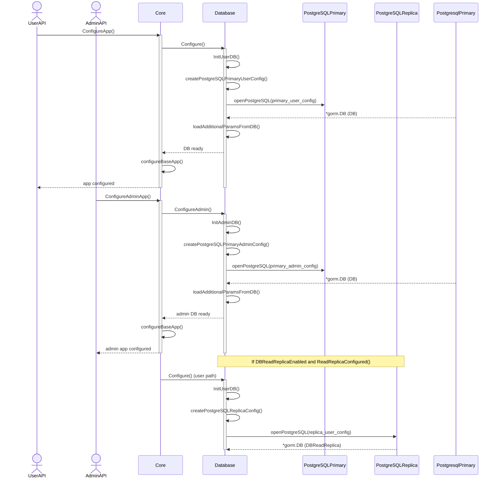
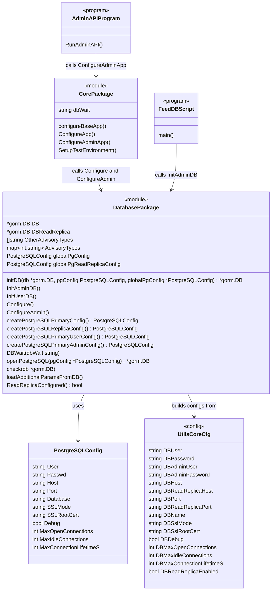
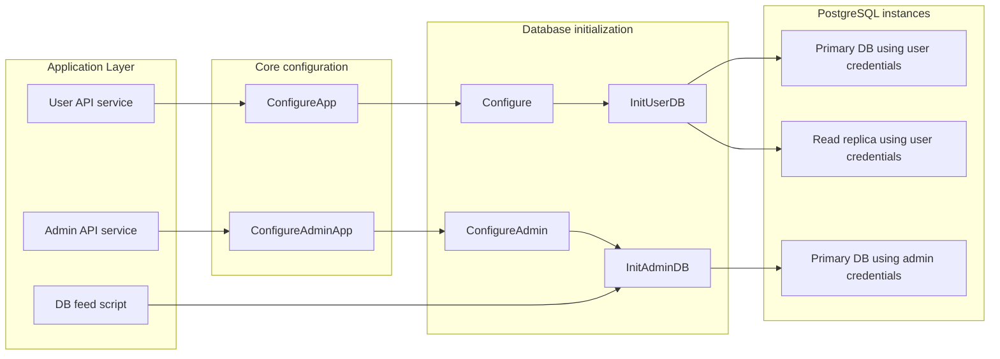

# Pull Request #1962:  RHINENG-22333: fix admin failure in ephemeral

**Author**: @MichaelMraka
**Created**: December 04, 2025 at 02:49 PM UTC
**Status**: Merged
**Labels**: None
**Base**: `master` ← **Head**: `pr1`

## Description

## Secure Coding Practices Checklist GitHub Link
- https://github.com/RedHatInsights/secure-coding-checklist

## Secure Coding Checklist
- [x] Input Validation
- [x] Output Encoding
- [x] Authentication and Password Management
- [x] Session Management
- [x] Access Control
- [x] Cryptographic Practices
- [x] Error Handling and Logging
- [x] Data Protection
- [x] Communication Security
- [x] System Configuration
- [x] Database Security
- [x] File Management
- [x] Memory Management
- [x] General Coding Practices

## Summary by Sourcery

Separate database initialization for admin and user contexts and update dependencies for RPM parsing and Kessel SDK.

New Features:
- Introduce distinct configuration flows for admin and user database connections, including support for separate credentials and read-replica settings.

Bug Fixes:
- Fix admin API and database feed script failures in ephemeral environments by ensuring they use admin-specific database configuration.

Enhancements:
- Refactor database setup into reusable helpers for initializing primary, replica, user, and admin PostgreSQL configurations.
- Adjust core application bootstrap to allow independent configuration of admin and user applications sharing common base setup.

Build:
- Update gorpm dependency to the maintained MichaelMraka module and remove the legacy replace directive.
- Bump project-kessel/kessel-sdk-go dependency from v1.3.0 to v1.4.0.

---

## Discussion

### Comment by @jira-linking on December 04, 2025 at 02:49 PM UTC

Commits missing Jira IDs:
0aced96f3091bf8ae3b2d03d46af81ecfe3e0bc0
255de3ff141554a8f7eb08ff2d2ca39316ffe403
Referenced Jiras:
https://issues.redhat.com/browse/RHINENG-22333


### Comment by @sourcery-ai on December 04, 2025 at 02:49 PM UTC

<!-- Generated by sourcery-ai[bot]: start review_guide -->

## Reviewer's Guide

Refactors database initialization to cleanly separate admin and user PostgreSQL configs (including replica handling), reuses existing DB connections when configs are unchanged, wires admin usages (admin API and feed script) to the new admin-specific path, and updates gorpm and kessel SDK dependencies to maintained versions.

#### Sequence diagram for app vs admin configuration and DB initialization



#### Class diagram for updated PostgreSQL configuration and initialization helpers



#### Architecture diagram for admin vs user DB access with primary and replica



### File-Level Changes

| Change | Details | Files |
| ------ | ------- | ----- |
| Refactor DB initialization to support separate admin and user PostgreSQL configurations with connection reuse. | <ul><li>Introduce a generic initDB helper that opens or reuses a PostgreSQL connection based on a stored global config snapshot.</li><li>Replace InitDB with InitAdminDB and InitUserDB using admin vs user credentials, and track primary and replica global configs separately.</li><li>Move read replica handling into InitUserDB and guard it with both DBReadReplicaEnabled and ReadReplicaConfigured checks.</li><li>Switch Configure to use InitUserDB and add ConfigureAdmin that uses InitAdminDB, both followed by shared base app setup and DBWait.</li></ul> | `base/database/setup.go`<br/>`base/core/config.go` |
| Align admin entrypoints with new admin-specific DB initialization. | <ul><li>Update the DB feed script to initialize the admin database connection instead of the generic one.</li><li>Update the admin API bootstrap to call ConfigureAdminApp so it uses admin DB credentials and configuration.</li></ul> | `scripts/feed_db.go`<br/>`turnpike/admin_api.go` |
| Update RPM parsing and Kessel SDK dependencies to maintained versions and simplify module wiring. | <ul><li>Switch gorpm import paths from github.com/ezamriy/gorpm to github.com/MichaelMraka/gorpm across RPM utilities and evaluator package cache.</li><li>Update go.mod to require the maintained gorpm fork directly and bump github.com/project-kessel/kessel-sdk-go from v1.3.0 to v1.4.0, removing the old gorpm replace directive.</li><li>Refresh go.sum to match the new module versions.</li></ul> | `base/utils/rpm.go`<br/>`evaluator/package_cache.go`<br/>`go.mod`<br/>`go.sum` |

---

<details>
<summary>Tips and commands</summary>

#### Interacting with Sourcery

- **Trigger a new review:** Comment `@sourcery-ai review` on the pull request.
- **Continue discussions:** Reply directly to Sourcery's review comments.
- **Generate a GitHub issue from a review comment:** Ask Sourcery to create an
  issue from a review comment by replying to it. You can also reply to a
  review comment with `@sourcery-ai issue` to create an issue from it.
- **Generate a pull request title:** Write `@sourcery-ai` anywhere in the pull
  request title to generate a title at any time. You can also comment
  `@sourcery-ai title` on the pull request to (re-)generate the title at any time.
- **Generate a pull request summary:** Write `@sourcery-ai summary` anywhere in
  the pull request body to generate a PR summary at any time exactly where you
  want it. You can also comment `@sourcery-ai summary` on the pull request to
  (re-)generate the summary at any time.
- **Generate reviewer's guide:** Comment `@sourcery-ai guide` on the pull
  request to (re-)generate the reviewer's guide at any time.
- **Resolve all Sourcery comments:** Comment `@sourcery-ai resolve` on the
  pull request to resolve all Sourcery comments. Useful if you've already
  addressed all the comments and don't want to see them anymore.
- **Dismiss all Sourcery reviews:** Comment `@sourcery-ai dismiss` on the pull
  request to dismiss all existing Sourcery reviews. Especially useful if you
  want to start fresh with a new review - don't forget to comment
  `@sourcery-ai review` to trigger a new review!

#### Customizing Your Experience

Access your [dashboard](https://app.sourcery.ai) to:
- Enable or disable review features such as the Sourcery-generated pull request
  summary, the reviewer's guide, and others.
- Change the review language.
- Add, remove or edit custom review instructions.
- Adjust other review settings.

#### Getting Help

- [Contact our support team](mailto:support@sourcery.ai) for questions or feedback.
- Visit our [documentation](https://docs.sourcery.ai) for detailed guides and information.
- Keep in touch with the Sourcery team by following us on [X/Twitter](https://x.com/SourceryAI), [LinkedIn](https://www.linkedin.com/company/sourcery-ai/) or [GitHub](https://github.com/sourcery-ai).

</details>

<!-- Generated by sourcery-ai[bot]: end review_guide -->

### Comment by @codecov-commenter on December 04, 2025 at 02:56 PM UTC

## [Codecov](https://app.codecov.io/gh/RedHatInsights/patchman-engine/pull/1962?dropdown=coverage&src=pr&el=h1&utm_medium=referral&utm_source=github&utm_content=comment&utm_campaign=pr+comments&utm_term=RedHatInsights) Report
:x: Patch coverage is `60.00000%` with `16 lines` in your changes missing coverage. Please review.
:white_check_mark: Project coverage is 58.85%. Comparing base ([`1a02243`](https://app.codecov.io/gh/RedHatInsights/patchman-engine/commit/1a02243fe750b65111b1349abdc8bcdc3a350958?dropdown=coverage&el=desc&utm_medium=referral&utm_source=github&utm_content=comment&utm_campaign=pr+comments&utm_term=RedHatInsights)) to head ([`255de3f`](https://app.codecov.io/gh/RedHatInsights/patchman-engine/commit/255de3ff141554a8f7eb08ff2d2ca39316ffe403?dropdown=coverage&el=desc&utm_medium=referral&utm_source=github&utm_content=comment&utm_campaign=pr+comments&utm_term=RedHatInsights)).

| [Files with missing lines](https://app.codecov.io/gh/RedHatInsights/patchman-engine/pull/1962?dropdown=coverage&src=pr&el=tree&utm_medium=referral&utm_source=github&utm_content=comment&utm_campaign=pr+comments&utm_term=RedHatInsights) | Patch % | Lines |
|---|---|---|
| [base/database/setup.go](https://app.codecov.io/gh/RedHatInsights/patchman-engine/pull/1962?src=pr&el=tree&filepath=base%2Fdatabase%2Fsetup.go&utm_medium=referral&utm_source=github&utm_content=comment&utm_campaign=pr+comments&utm_term=RedHatInsights#diff-YmFzZS9kYXRhYmFzZS9zZXR1cC5nbw==) | 64.51% | [10 Missing and 1 partial :warning: ](https://app.codecov.io/gh/RedHatInsights/patchman-engine/pull/1962?src=pr&el=tree&utm_medium=referral&utm_source=github&utm_content=comment&utm_campaign=pr+comments&utm_term=RedHatInsights) |
| [base/core/config.go](https://app.codecov.io/gh/RedHatInsights/patchman-engine/pull/1962?src=pr&el=tree&filepath=base%2Fcore%2Fconfig.go&utm_medium=referral&utm_source=github&utm_content=comment&utm_campaign=pr+comments&utm_term=RedHatInsights#diff-YmFzZS9jb3JlL2NvbmZpZy5nbw==) | 57.14% | [3 Missing :warning: ](https://app.codecov.io/gh/RedHatInsights/patchman-engine/pull/1962?src=pr&el=tree&utm_medium=referral&utm_source=github&utm_content=comment&utm_campaign=pr+comments&utm_term=RedHatInsights) |
| [scripts/feed\_db.go](https://app.codecov.io/gh/RedHatInsights/patchman-engine/pull/1962?src=pr&el=tree&filepath=scripts%2Ffeed_db.go&utm_medium=referral&utm_source=github&utm_content=comment&utm_campaign=pr+comments&utm_term=RedHatInsights#diff-c2NyaXB0cy9mZWVkX2RiLmdv) | 0.00% | [1 Missing :warning: ](https://app.codecov.io/gh/RedHatInsights/patchman-engine/pull/1962?src=pr&el=tree&utm_medium=referral&utm_source=github&utm_content=comment&utm_campaign=pr+comments&utm_term=RedHatInsights) |
| [turnpike/admin\_api.go](https://app.codecov.io/gh/RedHatInsights/patchman-engine/pull/1962?src=pr&el=tree&filepath=turnpike%2Fadmin_api.go&utm_medium=referral&utm_source=github&utm_content=comment&utm_campaign=pr+comments&utm_term=RedHatInsights#diff-dHVybnBpa2UvYWRtaW5fYXBpLmdv) | 0.00% | [1 Missing :warning: ](https://app.codecov.io/gh/RedHatInsights/patchman-engine/pull/1962?src=pr&el=tree&utm_medium=referral&utm_source=github&utm_content=comment&utm_campaign=pr+comments&utm_term=RedHatInsights) |

<details><summary>Additional details and impacted files</summary>


```diff
@@           Coverage Diff           @@
##           master    #1962   +/-   ##
=======================================
  Coverage   58.84%   58.85%           
=======================================
  Files         131      131           
  Lines        8436     8450   +14     
=======================================
+ Hits         4964     4973    +9     
- Misses       2937     2944    +7     
+ Partials      535      533    -2     
```

| [Flag](https://app.codecov.io/gh/RedHatInsights/patchman-engine/pull/1962/flags?src=pr&el=flags&utm_medium=referral&utm_source=github&utm_content=comment&utm_campaign=pr+comments&utm_term=RedHatInsights) | Coverage Δ | |
|---|---|---|
| [unittests](https://app.codecov.io/gh/RedHatInsights/patchman-engine/pull/1962/flags?src=pr&el=flag&utm_medium=referral&utm_source=github&utm_content=comment&utm_campaign=pr+comments&utm_term=RedHatInsights) | `58.85% <60.00%> (+<0.01%)` | :arrow_up: |

Flags with carried forward coverage won't be shown. [Click here](https://docs.codecov.io/docs/carryforward-flags?utm_medium=referral&utm_source=github&utm_content=comment&utm_campaign=pr+comments&utm_term=RedHatInsights#carryforward-flags-in-the-pull-request-comment) to find out more.
</details>

[:umbrella: View full report in Codecov by Sentry](https://app.codecov.io/gh/RedHatInsights/patchman-engine/pull/1962?dropdown=coverage&src=pr&el=continue&utm_medium=referral&utm_source=github&utm_content=comment&utm_campaign=pr+comments&utm_term=RedHatInsights).   
:loudspeaker: Have feedback on the report? [Share it here](https://about.codecov.io/codecov-pr-comment-feedback/?utm_medium=referral&utm_source=github&utm_content=comment&utm_campaign=pr+comments&utm_term=RedHatInsights).
<details><summary> :rocket: New features to boost your workflow: </summary>

- :snowflake: [Test Analytics](https://docs.codecov.com/docs/test-analytics): Detect flaky tests, report on failures, and find test suite problems.
</details>

---

## Reviews

### Review by @sourcery-ai - Commented on December 04, 2025 at 02:53 PM UTC

Hey there - I've reviewed your changes and they look great!

<details>
<summary>Prompt for AI Agents</summary>

~~~markdown
Please address the comments from this code review:

## Individual Comments

### Comment 1
<location> `base/database/setup.go:23` </location>
<code_context>
-		// reuse connection
-		check(DB)
-		return
+func initDB(db *gorm.DB, pgConfig PostgreSQLConfig, globalPgConfig *PostgreSQLConfig) *gorm.DB {
+	if db == nil || pgConfig != *globalPgConfig {
+		// create new connection if not already exists
</code_context>

<issue_to_address>
**issue (complexity):** Consider simplifying the DB initialization and configuration flow by making helpers pure, consolidating config builders, and optionally unifying Configure entry points under a mode-based API.

You can keep the new admin/user + primary/replica capabilities while reducing indirection and duplication with a few small refactors.

### 1. Make `initDB` pure and avoid hidden global mutations

Right now `initDB` both decides and mutates via `globalPgConfig *PostgreSQLConfig`, and also passes a pointer into `openPostgreSQL`, which expects `*PostgreSQLConfig`. This mixes concerns and makes the flow harder to follow.

You can move the config comparison/mutation back to the call site and keep `initDB` as a pure helper:

```go
// pure helper: no globals or side effects
func initDB(current *gorm.DB, cfg PostgreSQLConfig) *gorm.DB {
	if current == nil {
		current = openPostgreSQL(&cfg)
		check(current)
		return current
	}

	// no config comparison here – just reuse
	check(current)
	return current
}
```

Then handle the “reconnect if config changed” logic explicitly in `InitUserDB` / `InitAdminDB`:

```go
func InitAdminDB() {
	newCfg := createPostgreSQLConfig(ModePrimaryAdmin)
	if DB == nil || newCfg != globalPgConfig {
		globalPgConfig = newCfg
		DB = openPostgreSQL(&globalPgConfig)
	}
	check(DB)
}

func InitUserDB() {
	newCfg := createPostgreSQLConfig(ModePrimaryUser)
	if DB == nil || newCfg != globalPgConfig {
		globalPgConfig = newCfg
		DB = openPostgreSQL(&globalPgConfig)
	}
	check(DB)

	if utils.CoreCfg.DBReadReplicaEnabled && ReadReplicaConfigured() {
		newReplicaCfg := createPostgreSQLConfig(ModeReplicaUser)
		if DBReadReplica == nil || newReplicaCfg != globalPgReadReplicaConfig {
			globalPgReadReplicaConfig = newReplicaCfg
			DBReadReplica = openPostgreSQL(&globalPgReadReplicaConfig)
		}
		check(DBReadReplica)
	}
}
```

This keeps the “when do we reconnect?” policy local and explicit, and `initDB` is either trivial or can be removed entirely.

### 2. Collapse the four config constructors into one parametrized function

The `createPostgreSQLPrimaryConfig`, `createPostgreSQLReplicaConfig`, `createPostgreSQLPrimaryUserConfig`, and `createPostgreSQLPrimaryAdminConfig` share most fields and only differ in host/port and user/password. You can keep the same behavior with a single builder:

```go
type DBMode int

const (
	ModePrimaryUser DBMode = iota
	ModePrimaryAdmin
	ModeReplicaUser
)

func createPostgreSQLConfig(mode DBMode) PostgreSQLConfig {
	cfg := PostgreSQLConfig{
		Host:                   utils.CoreCfg.DBHost,
		Port:                   utils.CoreCfg.DBPort,
		Database:               utils.CoreCfg.DBName,
		SSLMode:                utils.CoreCfg.DBSslMode,
		SSLRootCert:            utils.CoreCfg.DBSslRootCert,
		Debug:                  utils.CoreCfg.DBDebug,
		StatementTimeoutMs:     utils.CoreCfg.DBStatementTimeoutMs,
		MaxConnections:         utils.CoreCfg.DBMaxConnections,
		MaxIdleConnections:     utils.CoreCfg.DBMaxIdleConnections,
		MaxConnectionLifetimeS: utils.CoreCfg.DBMaxConnectionLifetimeS,
	}

	switch mode {
	case ModePrimaryUser:
		cfg.User = utils.CoreCfg.DBUser
		cfg.Passwd = utils.CoreCfg.DBPassword
	case ModePrimaryAdmin:
		cfg.User = utils.CoreCfg.DBAdminUser
		cfg.Passwd = utils.CoreCfg.DBAdminPassword
	case ModeReplicaUser:
		cfg.User = utils.CoreCfg.DBUser
		cfg.Passwd = utils.CoreCfg.DBPassword
		cfg.Host = utils.CoreCfg.DBReadReplicaHost
		cfg.Port = utils.CoreCfg.DBReadReplicaPort
	}

	return cfg
}
```

Then your init functions become simpler and more declarative:

```go
func InitAdminDB() {
	cfg := createPostgreSQLConfig(ModePrimaryAdmin)
	// reconnect logic as above...
}

func InitUserDB() {
	cfg := createPostgreSQLConfig(ModePrimaryUser)
	// reconnect logic as above...

	if utils.CoreCfg.DBReadReplicaEnabled && ReadReplicaConfigured() {
		replicaCfg := createPostgreSQLConfig(ModeReplicaUser)
		// reconnect logic for replica...
	}
}
```

This removes almost all duplication in the config builders and makes it obvious how each mode is configured.

### 3. Consider a single Configure entry point with mode

If you don’t need both `Configure` and `ConfigureAdmin` externally, you can keep the API smaller with one mode-based entry point while preserving behavior:

```go
type ConfigureMode int

const (
	ConfigureUser ConfigureMode = iota
	ConfigureAdmin
)

func ConfigureWithMode(mode ConfigureMode) {
	switch mode {
	case ConfigureAdmin:
		InitAdminDB()
	default:
		InitUserDB()
	}
	loadAdditionalParamsFromDB()
}
```

You can keep `Configure()` as a convenience wrapper:

```go
func Configure() {
	ConfigureWithMode(ConfigureUser)
}

func ConfigureAdmin() {
	ConfigureWithMode(ConfigureAdmin)
}
```

This keeps the public surface understandable while still supporting admin vs user DB, and the overall flow becomes easier to follow: `ConfigureWithMode` → `Init*DB` → `createPostgreSQLConfig`.
</issue_to_address>
~~~

</details>

***

<details>
<summary>Sourcery is free for open source - if you like our reviews please consider sharing them ✨</summary>

- [X](https://twitter.com/intent/tweet?text=I%20just%20got%20an%20instant%20code%20review%20from%20%40SourceryAI%2C%20and%20it%20was%20brilliant%21%20It%27s%20free%20for%20open%20source%20and%20has%20a%20free%20trial%20for%20private%20code.%20Check%20it%20out%20https%3A//sourcery.ai)
- [Mastodon](https://mastodon.social/share?text=I%20just%20got%20an%20instant%20code%20review%20from%20%40SourceryAI%2C%20and%20it%20was%20brilliant%21%20It%27s%20free%20for%20open%20source%20and%20has%20a%20free%20trial%20for%20private%20code.%20Check%20it%20out%20https%3A//sourcery.ai)
- [LinkedIn](https://www.linkedin.com/sharing/share-offsite/?url=https://sourcery.ai)
- [Facebook](https://www.facebook.com/sharer/sharer.php?u=https://sourcery.ai)

</details>

<sub>
Help me be more useful! Please click 👍 or 👎 on each comment and I'll use the feedback to improve your reviews.
</sub>

### Review by @TenSt - Approved on December 04, 2025 at 03:05 PM UTC

lgtm

---

*Archived from: https://github.com/RedHatInsights/patchman-engine/pull/1962*
