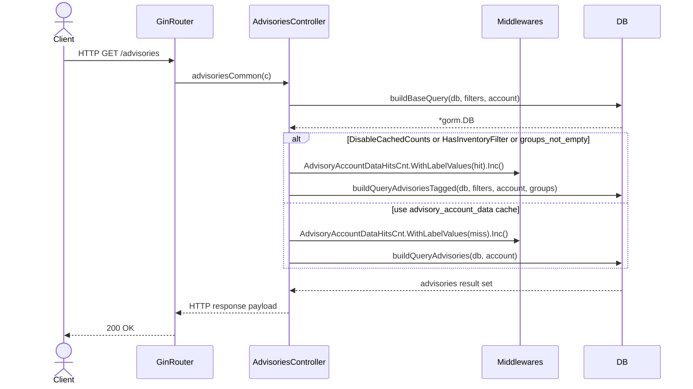
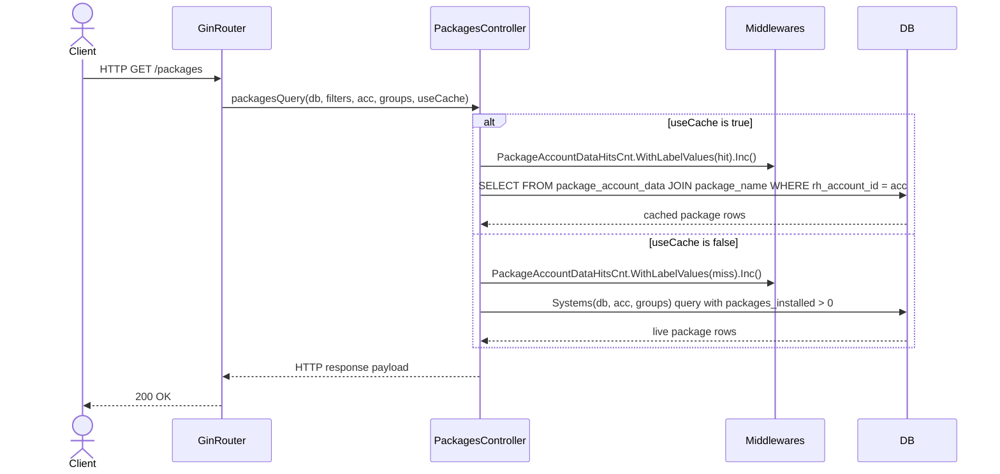
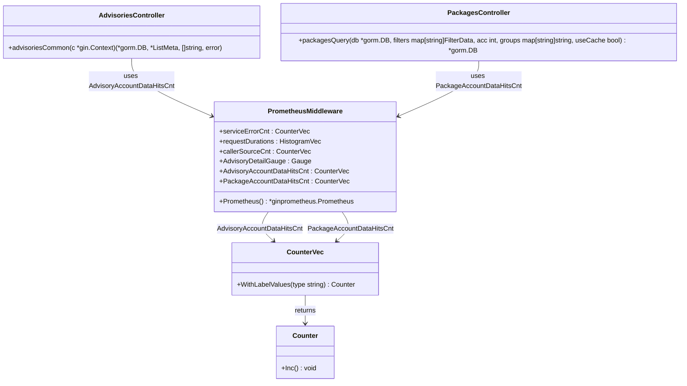

# Pull Request #1963: RHINENG-21447: create metrics to track usage of *_account_data

**Author**: @MichaelMraka
**Created**: December 05, 2025 at 04:20 PM UTC
**Status**: Merged
**Labels**: None
**Base**: `master` ← **Head**: `pr2`

## Description

## Secure Coding Practices Checklist GitHub Link
- https://github.com/RedHatInsights/secure-coding-checklist

## Secure Coding Checklist
- [x] Input Validation
- [x] Output Encoding
- [x] Authentication and Password Management
- [x] Session Management
- [x] Access Control
- [x] Cryptographic Practices
- [x] Error Handling and Logging
- [x] Data Protection
- [x] Communication Security
- [x] System Configuration
- [x] Database Security
- [x] File Management
- [x] Memory Management
- [x] General Coding Practices

## Summary by Sourcery

Add Prometheus metrics to track cache usage for advisory and package account data queries.

New Features:
- Introduce Prometheus counters for advisory_account_data hits and misses.
- Introduce Prometheus counters for package_account_data hits and misses.

---

## Discussion

### Comment by @jira-linking on December 05, 2025 at 04:20 PM UTC

Referenced Jiras:
https://issues.redhat.com/browse/RHINENG-21447


### Comment by @sourcery-ai on December 05, 2025 at 04:20 PM UTC

<!-- Generated by sourcery-ai[bot]: start review_guide -->

<details>
<summary>Reviewer's guide (collapsed on small PRs)</summary>

## Reviewer's Guide

Adds Prometheus metrics to track cache hits and misses for advisory_account_data and package_account_data, and wires them into the advisories and packages query paths.

#### Sequence diagram for advisory_account_data cache hit/miss metrics



#### Sequence diagram for package_account_data cache hit/miss metrics



#### Updated class diagram for Prometheus metrics and controllers



### File-Level Changes

| Change | Details | Files |
| ------ | ------- | ----- |
| Introduce Prometheus counters for advisory_account_data and package_account_data cache usage and register them with the existing middleware metrics. | <ul><li>Define AdvisoryAccountDataHitsCnt as a CounterVec with a 'type' label to distinguish hit vs miss events for advisory_account_data usage.</li><li>Define PackageAccountDataHitsCnt as a CounterVec with a 'type' label to distinguish hit vs miss events for package_account_data usage.</li><li>Ensure the new counters use the existing patchman_engine/manager namespace and subsystem for consistency with other metrics.</li></ul> | `manager/middlewares/prometheus.go` |
| Instrument advisory queries to increment cache hit/miss counters depending on whether advisory_account_data is used. | <ul><li>In advisoriesCommon, treat conditions that disable cached counts or apply inventory/group filters as a cache hit and increment AdvisoryAccountDataHitsCnt with label 'hit' before building the tagged advisories query.</li><li>In the alternative path where cached advisories are used, increment AdvisoryAccountDataHitsCnt with label 'miss' before building the standard advisories query.</li></ul> | `manager/controllers/advisories.go` |
| Instrument package queries to increment cache hit/miss counters depending on whether package_account_data is used. | <ul><li>In packagesQuery, when useCache is true, increment PackageAccountDataHitsCnt with label 'hit' before building the query against package_account_data.</li><li>When useCache is false, increment PackageAccountDataHitsCnt with label 'miss' before building the systemsWithPkgsInstalled query.</li></ul> | `manager/controllers/packages.go` |

</details>

---

<details>
<summary>Tips and commands</summary>

#### Interacting with Sourcery

- **Trigger a new review:** Comment `@sourcery-ai review` on the pull request.
- **Continue discussions:** Reply directly to Sourcery's review comments.
- **Generate a GitHub issue from a review comment:** Ask Sourcery to create an
  issue from a review comment by replying to it. You can also reply to a
  review comment with `@sourcery-ai issue` to create an issue from it.
- **Generate a pull request title:** Write `@sourcery-ai` anywhere in the pull
  request title to generate a title at any time. You can also comment
  `@sourcery-ai title` on the pull request to (re-)generate the title at any time.
- **Generate a pull request summary:** Write `@sourcery-ai summary` anywhere in
  the pull request body to generate a PR summary at any time exactly where you
  want it. You can also comment `@sourcery-ai summary` on the pull request to
  (re-)generate the summary at any time.
- **Generate reviewer's guide:** Comment `@sourcery-ai guide` on the pull
  request to (re-)generate the reviewer's guide at any time.
- **Resolve all Sourcery comments:** Comment `@sourcery-ai resolve` on the
  pull request to resolve all Sourcery comments. Useful if you've already
  addressed all the comments and don't want to see them anymore.
- **Dismiss all Sourcery reviews:** Comment `@sourcery-ai dismiss` on the pull
  request to dismiss all existing Sourcery reviews. Especially useful if you
  want to start fresh with a new review - don't forget to comment
  `@sourcery-ai review` to trigger a new review!

#### Customizing Your Experience

Access your [dashboard](https://app.sourcery.ai) to:
- Enable or disable review features such as the Sourcery-generated pull request
  summary, the reviewer's guide, and others.
- Change the review language.
- Add, remove or edit custom review instructions.
- Adjust other review settings.

#### Getting Help

- [Contact our support team](mailto:support@sourcery.ai) for questions or feedback.
- Visit our [documentation](https://docs.sourcery.ai) for detailed guides and information.
- Keep in touch with the Sourcery team by following us on [X/Twitter](https://x.com/SourceryAI), [LinkedIn](https://www.linkedin.com/company/sourcery-ai/) or [GitHub](https://github.com/sourcery-ai).

</details>

<!-- Generated by sourcery-ai[bot]: end review_guide -->

### Comment by @codecov-commenter on December 05, 2025 at 04:26 PM UTC

## [Codecov](https://app.codecov.io/gh/RedHatInsights/patchman-engine/pull/1963?dropdown=coverage&src=pr&el=h1&utm_medium=referral&utm_source=github&utm_content=comment&utm_campaign=pr+comments&utm_term=RedHatInsights) Report
:x: Patch coverage is `60.00000%` with `2 lines` in your changes missing coverage. Please review.
:white_check_mark: Project coverage is 58.85%. Comparing base ([`73960ce`](https://app.codecov.io/gh/RedHatInsights/patchman-engine/commit/73960cebc6b75089a2b6499ed8f50ce6c0c06f24?dropdown=coverage&el=desc&utm_medium=referral&utm_source=github&utm_content=comment&utm_campaign=pr+comments&utm_term=RedHatInsights)) to head ([`fcd9169`](https://app.codecov.io/gh/RedHatInsights/patchman-engine/commit/fcd9169368060dfc396e7896c4ef87b2658ecb29?dropdown=coverage&el=desc&utm_medium=referral&utm_source=github&utm_content=comment&utm_campaign=pr+comments&utm_term=RedHatInsights)).

| [Files with missing lines](https://app.codecov.io/gh/RedHatInsights/patchman-engine/pull/1963?dropdown=coverage&src=pr&el=tree&utm_medium=referral&utm_source=github&utm_content=comment&utm_campaign=pr+comments&utm_term=RedHatInsights) | Patch % | Lines |
|---|---|---|
| [manager/controllers/packages.go](https://app.codecov.io/gh/RedHatInsights/patchman-engine/pull/1963?src=pr&el=tree&filepath=manager%2Fcontrollers%2Fpackages.go&utm_medium=referral&utm_source=github&utm_content=comment&utm_campaign=pr+comments&utm_term=RedHatInsights#diff-bWFuYWdlci9jb250cm9sbGVycy9wYWNrYWdlcy5nbw==) | 50.00% | [1 Missing :warning: ](https://app.codecov.io/gh/RedHatInsights/patchman-engine/pull/1963?src=pr&el=tree&utm_medium=referral&utm_source=github&utm_content=comment&utm_campaign=pr+comments&utm_term=RedHatInsights) |
| [manager/middlewares/prometheus.go](https://app.codecov.io/gh/RedHatInsights/patchman-engine/pull/1963?src=pr&el=tree&filepath=manager%2Fmiddlewares%2Fprometheus.go&utm_medium=referral&utm_source=github&utm_content=comment&utm_campaign=pr+comments&utm_term=RedHatInsights#diff-bWFuYWdlci9taWRkbGV3YXJlcy9wcm9tZXRoZXVzLmdv) | 0.00% | [1 Missing :warning: ](https://app.codecov.io/gh/RedHatInsights/patchman-engine/pull/1963?src=pr&el=tree&utm_medium=referral&utm_source=github&utm_content=comment&utm_campaign=pr+comments&utm_term=RedHatInsights) |

<details><summary>Additional details and impacted files</summary>


```diff
@@           Coverage Diff           @@
##           master    #1963   +/-   ##
=======================================
  Coverage   58.84%   58.85%           
=======================================
  Files         131      131           
  Lines        8436     8440    +4     
=======================================
+ Hits         4964     4967    +3     
- Misses       2937     2938    +1     
  Partials      535      535           
```

| [Flag](https://app.codecov.io/gh/RedHatInsights/patchman-engine/pull/1963/flags?src=pr&el=flags&utm_medium=referral&utm_source=github&utm_content=comment&utm_campaign=pr+comments&utm_term=RedHatInsights) | Coverage Δ | |
|---|---|---|
| [unittests](https://app.codecov.io/gh/RedHatInsights/patchman-engine/pull/1963/flags?src=pr&el=flag&utm_medium=referral&utm_source=github&utm_content=comment&utm_campaign=pr+comments&utm_term=RedHatInsights) | `58.85% <60.00%> (+<0.01%)` | :arrow_up: |

Flags with carried forward coverage won't be shown. [Click here](https://docs.codecov.io/docs/carryforward-flags?utm_medium=referral&utm_source=github&utm_content=comment&utm_campaign=pr+comments&utm_term=RedHatInsights#carryforward-flags-in-the-pull-request-comment) to find out more.
</details>

[:umbrella: View full report in Codecov by Sentry](https://app.codecov.io/gh/RedHatInsights/patchman-engine/pull/1963?dropdown=coverage&src=pr&el=continue&utm_medium=referral&utm_source=github&utm_content=comment&utm_campaign=pr+comments&utm_term=RedHatInsights).   
:loudspeaker: Have feedback on the report? [Share it here](https://about.codecov.io/codecov-pr-comment-feedback/?utm_medium=referral&utm_source=github&utm_content=comment&utm_campaign=pr+comments&utm_term=RedHatInsights).
<details><summary> :rocket: New features to boost your workflow: </summary>

- :snowflake: [Test Analytics](https://docs.codecov.com/docs/test-analytics): Detect flaky tests, report on failures, and find test suite problems.
</details>

---

## Reviews

### Review by @sourcery-ai - Commented on December 05, 2025 at 04:20 PM UTC

Hey there - I've reviewed your changes - here's some feedback:

- The new AdvisoryAccountDataHitsCnt and PackageAccountDataHitsCnt metrics don’t appear to be registered in the Prometheus() middleware initializer, so they won’t be exposed unless you add them to the MustRegister call.
- Using a very generic label name like `type` for the hit/miss dimension makes the metric harder to interpret; consider a more descriptive label (e.g. `cache_status`) to improve clarity and avoid collisions with other metrics.
- To avoid stringly-typed label values and potential typos, consider defining constants for the `hit` and `miss` label values used with the new counter metrics.

<details>
<summary>Prompt for AI Agents</summary>

~~~markdown
Please address the comments from this code review:

## Overall Comments
- The new AdvisoryAccountDataHitsCnt and PackageAccountDataHitsCnt metrics don’t appear to be registered in the Prometheus() middleware initializer, so they won’t be exposed unless you add them to the MustRegister call.
- Using a very generic label name like `type` for the hit/miss dimension makes the metric harder to interpret; consider a more descriptive label (e.g. `cache_status`) to improve clarity and avoid collisions with other metrics.
- To avoid stringly-typed label values and potential typos, consider defining constants for the `hit` and `miss` label values used with the new counter metrics.

## Individual Comments

### Comment 1
<location> `manager/controllers/advisories.go:95-98` </location>
<code_context>
 	}

 	if config.DisableCachedCounts || HasInventoryFilter(filters) || len(groups) != 0 {
+		middlewares.AdvisoryAccountDataHitsCnt.WithLabelValues("hit").Inc()
 		query = buildQueryAdvisoriesTagged(db, filters, account, groups)
 	} else {
+		middlewares.AdvisoryAccountDataHitsCnt.WithLabelValues("miss").Inc()
 		query = buildQueryAdvisories(db, account)
 	}
</code_context>

<issue_to_address>
**issue (bug_risk):** The hit/miss labels for advisory_account_data appear inverted relative to cache usage.

In `advisoriesCommon`, the branch taken when `DisableCachedCounts` is true, inventory filters are present, or groups are non-empty (the non-cached path) currently increments the `"hit"` label, while the `else` branch (the cached `advisory_account_data` path) increments `"miss"`. This inverts the intended semantics and differs from `packagesQuery`. Please switch the labels so the cached path increments `"hit"` and the non-cached path increments `"miss"` to match the metric description and maintain correct telemetry.
</issue_to_address>
~~~

</details>

***

<details>
<summary>Sourcery is free for open source - if you like our reviews please consider sharing them ✨</summary>

- [X](https://twitter.com/intent/tweet?text=I%20just%20got%20an%20instant%20code%20review%20from%20%40SourceryAI%2C%20and%20it%20was%20brilliant%21%20It%27s%20free%20for%20open%20source%20and%20has%20a%20free%20trial%20for%20private%20code.%20Check%20it%20out%20https%3A//sourcery.ai)
- [Mastodon](https://mastodon.social/share?text=I%20just%20got%20an%20instant%20code%20review%20from%20%40SourceryAI%2C%20and%20it%20was%20brilliant%21%20It%27s%20free%20for%20open%20source%20and%20has%20a%20free%20trial%20for%20private%20code.%20Check%20it%20out%20https%3A//sourcery.ai)
- [LinkedIn](https://www.linkedin.com/sharing/share-offsite/?url=https://sourcery.ai)
- [Facebook](https://www.facebook.com/sharer/sharer.php?u=https://sourcery.ai)

</details>

<sub>
Help me be more useful! Please click 👍 or 👎 on each comment and I'll use the feedback to improve your reviews.
</sub>

### Review by @Dugowitch - Approved on December 08, 2025 at 02:42 PM UTC

---

*Archived from: https://github.com/RedHatInsights/patchman-engine/pull/1963*
