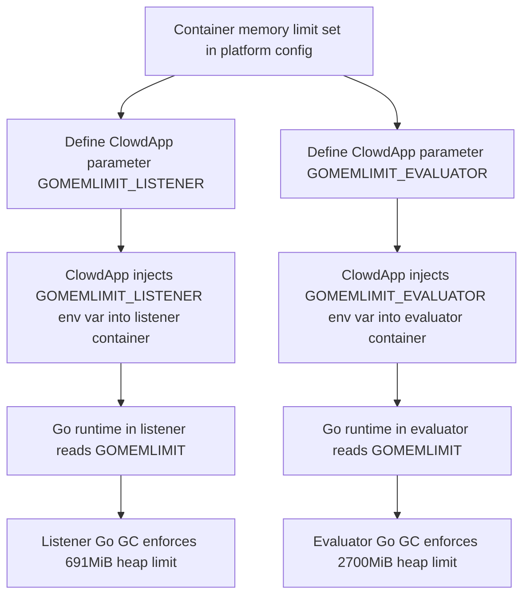

# Pull Request #1970: Update go limits to 90% of mem_limit

**Author**: @jlsherrill
**Created**: December 08, 2025 at 02:12 PM UTC
**Status**: Merged
**Labels**: None
**Base**: `master` ← **Head**: `gommelimit`

## Description

## Secure Coding Practices Checklist GitHub Link
- https://github.com/RedHatInsights/secure-coding-checklist

## Secure Coding Checklist
- [x] Input Validation
- [x] Output Encoding
- [x] Authentication and Password Management
- [x] Session Management
- [x] Access Control
- [x] Cryptographic Practices
- [x] Error Handling and Logging
- [x] Data Protection
- [x] Communication Security
- [x] System Configuration
- [x] Database Security
- [x] File Management
- [x] Memory Management
- [x] General Coding Practices

## Summary by Sourcery

Enhancements:
- Increase GOMEMLIMIT for the listener and evaluator components to match updated container memory allocations.

---

## Discussion

### Comment by @jira-linking on December 08, 2025 at 02:12 PM UTC

Commits missing Jira IDs:
c94fa5a9eb7b4e808df9af99bb38c3b0f30c18c9


### Comment by @sourcery-ai on December 08, 2025 at 02:12 PM UTC

<!-- Generated by sourcery-ai[bot]: start review_guide -->

<details>
<summary>Reviewer's guide (collapsed on small PRs)</summary>

## Reviewer's Guide

Adjusts Go runtime memory limits for the listener and evaluator components to target 90% of their respective container memory limits via ClowdApp parameters.

#### Flow diagram for applying updated GOMEMLIMIT to Go runtime



### File-Level Changes

| Change | Details | Files |
| ------ | ------- | ----- |
| Update GOMEMLIMIT environment variable defaults for Go services to align with 90% of their container memory limits. | <ul><li>Increase GOMEMLIMIT for the listener component from 172MiB to 691MiB while keeping the comment about 90% of the default memory limit.</li><li>Increase GOMEMLIMIT for the evaluator component from 922MiB to 2700MiB while keeping the comment about 90% of the default memory limit.</li><li>Retain existing parameter structure and comments, only adjusting the numeric values and slightly generalizing the comment text.</li></ul> | `deploy/clowdapp.yaml` |

</details>

---

<details>
<summary>Tips and commands</summary>

#### Interacting with Sourcery

- **Trigger a new review:** Comment `@sourcery-ai review` on the pull request.
- **Continue discussions:** Reply directly to Sourcery's review comments.
- **Generate a GitHub issue from a review comment:** Ask Sourcery to create an
  issue from a review comment by replying to it. You can also reply to a
  review comment with `@sourcery-ai issue` to create an issue from it.
- **Generate a pull request title:** Write `@sourcery-ai` anywhere in the pull
  request title to generate a title at any time. You can also comment
  `@sourcery-ai title` on the pull request to (re-)generate the title at any time.
- **Generate a pull request summary:** Write `@sourcery-ai summary` anywhere in
  the pull request body to generate a PR summary at any time exactly where you
  want it. You can also comment `@sourcery-ai summary` on the pull request to
  (re-)generate the summary at any time.
- **Generate reviewer's guide:** Comment `@sourcery-ai guide` on the pull
  request to (re-)generate the reviewer's guide at any time.
- **Resolve all Sourcery comments:** Comment `@sourcery-ai resolve` on the
  pull request to resolve all Sourcery comments. Useful if you've already
  addressed all the comments and don't want to see them anymore.
- **Dismiss all Sourcery reviews:** Comment `@sourcery-ai dismiss` on the pull
  request to dismiss all existing Sourcery reviews. Especially useful if you
  want to start fresh with a new review - don't forget to comment
  `@sourcery-ai review` to trigger a new review!

#### Customizing Your Experience

Access your [dashboard](https://app.sourcery.ai) to:
- Enable or disable review features such as the Sourcery-generated pull request
  summary, the reviewer's guide, and others.
- Change the review language.
- Add, remove or edit custom review instructions.
- Adjust other review settings.

#### Getting Help

- [Contact our support team](mailto:support@sourcery.ai) for questions or feedback.
- Visit our [documentation](https://docs.sourcery.ai) for detailed guides and information.
- Keep in touch with the Sourcery team by following us on [X/Twitter](https://x.com/SourceryAI), [LinkedIn](https://www.linkedin.com/company/sourcery-ai/) or [GitHub](https://github.com/sourcery-ai).

</details>

<!-- Generated by sourcery-ai[bot]: end review_guide -->

### Comment by @codecov-commenter on December 08, 2025 at 02:22 PM UTC

## [Codecov](https://app.codecov.io/gh/RedHatInsights/patchman-engine/pull/1970?dropdown=coverage&src=pr&el=h1&utm_medium=referral&utm_source=github&utm_content=comment&utm_campaign=pr+comments&utm_term=RedHatInsights) Report
:white_check_mark: All modified and coverable lines are covered by tests.
:white_check_mark: Project coverage is 58.84%. Comparing base ([`3a1f632`](https://app.codecov.io/gh/RedHatInsights/patchman-engine/commit/3a1f6325f5216d41985ed9642e47a9d4149d6a25?dropdown=coverage&el=desc&utm_medium=referral&utm_source=github&utm_content=comment&utm_campaign=pr+comments&utm_term=RedHatInsights)) to head ([`c94fa5a`](https://app.codecov.io/gh/RedHatInsights/patchman-engine/commit/c94fa5a9eb7b4e808df9af99bb38c3b0f30c18c9?dropdown=coverage&el=desc&utm_medium=referral&utm_source=github&utm_content=comment&utm_campaign=pr+comments&utm_term=RedHatInsights)).

<details><summary>Additional details and impacted files</summary>


```diff
@@           Coverage Diff           @@
##           master    #1970   +/-   ##
=======================================
  Coverage   58.84%   58.84%           
=======================================
  Files         131      131           
  Lines        8436     8436           
=======================================
  Hits         4964     4964           
  Misses       2937     2937           
  Partials      535      535           
```

| [Flag](https://app.codecov.io/gh/RedHatInsights/patchman-engine/pull/1970/flags?src=pr&el=flags&utm_medium=referral&utm_source=github&utm_content=comment&utm_campaign=pr+comments&utm_term=RedHatInsights) | Coverage Δ | |
|---|---|---|
| [unittests](https://app.codecov.io/gh/RedHatInsights/patchman-engine/pull/1970/flags?src=pr&el=flag&utm_medium=referral&utm_source=github&utm_content=comment&utm_campaign=pr+comments&utm_term=RedHatInsights) | `58.84% <ø> (ø)` | |

Flags with carried forward coverage won't be shown. [Click here](https://docs.codecov.io/docs/carryforward-flags?utm_medium=referral&utm_source=github&utm_content=comment&utm_campaign=pr+comments&utm_term=RedHatInsights#carryforward-flags-in-the-pull-request-comment) to find out more.
</details>

[:umbrella: View full report in Codecov by Sentry](https://app.codecov.io/gh/RedHatInsights/patchman-engine/pull/1970?dropdown=coverage&src=pr&el=continue&utm_medium=referral&utm_source=github&utm_content=comment&utm_campaign=pr+comments&utm_term=RedHatInsights).   
:loudspeaker: Have feedback on the report? [Share it here](https://about.codecov.io/codecov-pr-comment-feedback/?utm_medium=referral&utm_source=github&utm_content=comment&utm_campaign=pr+comments&utm_term=RedHatInsights).
<details><summary> :rocket: New features to boost your workflow: </summary>

- :snowflake: [Test Analytics](https://docs.codecov.com/docs/test-analytics): Detect flaky tests, report on failures, and find test suite problems.
</details>

### Comment by @jlsherrill on December 08, 2025 at 02:26 PM UTC

/retest

### Comment by @jlsherrill on December 08, 2025 at 02:38 PM UTC

/retest

### Comment by @dominikvagner on December 08, 2025 at 04:07 PM UTC

/retest

---

## Reviews

### Review by @sourcery-ai - Commented on December 08, 2025 at 02:13 PM UTC

Hey there - I've reviewed your changes - here's some feedback:

- The new GOMEMLIMIT_* values no longer match 90% of the original defaults shown in the comments; if the default memory limits have changed, consider either updating the comments with the new base values or deriving these limits from a single source to avoid configuration drift.
- If the intent is to keep GOMEMLIMIT at 90% of the corresponding memory limit, you might want to compute or template these values from the MEM_* settings instead of hard-coding them, so future changes to memory limits don’t require manual recalculation.

<details>
<summary>Prompt for AI Agents</summary>

~~~markdown
Please address the comments from this code review:

## Overall Comments
- The new GOMEMLIMIT_* values no longer match 90% of the original defaults shown in the comments; if the default memory limits have changed, consider either updating the comments with the new base values or deriving these limits from a single source to avoid configuration drift.
- If the intent is to keep GOMEMLIMIT at 90% of the corresponding memory limit, you might want to compute or template these values from the MEM_* settings instead of hard-coding them, so future changes to memory limits don’t require manual recalculation.

## Individual Comments

### Comment 1
<location> `deploy/clowdapp.yaml:701` </location>
<code_context>
 # Evaluator
 - {name: GOGC, value: '100'}
-- {name: GOMEMLIMIT_EVALUATOR, value: '922MiB'} # set to 90% of the default memory limit 1024Mi (don't forget `B`)
+- {name: GOMEMLIMIT_EVALUATOR, value: '2700MiB'} # set to 90% of the default memory limit (don't forget `B`)
 - {name: CONSOLEDOT_HOSTNAME, value: localhost}

</code_context>

<issue_to_address>
**suggestion:** Consider aligning the comment with the actual numeric default memory limit for the evaluator.

The previous comment documented `1024Mi`, which made it easy to verify that 90% was correct. Now we only say “default memory limit” and `2700MiB` implicitly suggests ~3Gi without stating it. Please either reference the actual numeric limit (e.g. `3Gi`) in the comment or ensure this value always matches 90% of the configured limit to prevent future drift.

```suggestion
- {name: GOMEMLIMIT_EVALUATOR, value: '2700MiB'} # set to 90% of the default memory limit 3Gi (don't forget `B`)
```
</issue_to_address>
~~~

</details>

***

<details>
<summary>Sourcery is free for open source - if you like our reviews please consider sharing them ✨</summary>

- [X](https://twitter.com/intent/tweet?text=I%20just%20got%20an%20instant%20code%20review%20from%20%40SourceryAI%2C%20and%20it%20was%20brilliant%21%20It%27s%20free%20for%20open%20source%20and%20has%20a%20free%20trial%20for%20private%20code.%20Check%20it%20out%20https%3A//sourcery.ai)
- [Mastodon](https://mastodon.social/share?text=I%20just%20got%20an%20instant%20code%20review%20from%20%40SourceryAI%2C%20and%20it%20was%20brilliant%21%20It%27s%20free%20for%20open%20source%20and%20has%20a%20free%20trial%20for%20private%20code.%20Check%20it%20out%20https%3A//sourcery.ai)
- [LinkedIn](https://www.linkedin.com/sharing/share-offsite/?url=https://sourcery.ai)
- [Facebook](https://www.facebook.com/sharer/sharer.php?u=https://sourcery.ai)

</details>

<sub>
Help me be more useful! Please click 👍 or 👎 on each comment and I'll use the feedback to improve your reviews.
</sub>

### Review by @TenSt - Approved on December 08, 2025 at 02:16 PM UTC

lgtm

---

*Archived from: https://github.com/RedHatInsights/patchman-engine/pull/1970*
