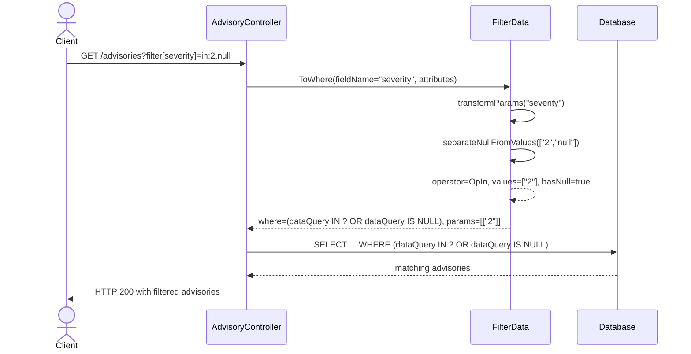
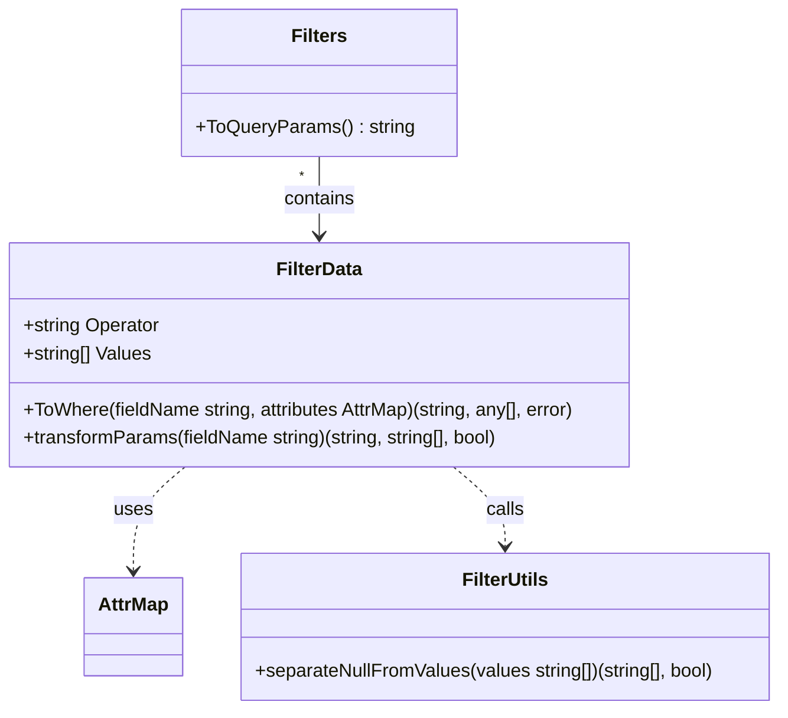

# Pull Request #1972: RHINENG-21755: use null with multiple severity filters

**Author**: @rverdile
**Created**: December 09, 2025 at 04:49 PM UTC
**Status**: Merged
**Labels**: None
**Base**: `master` ← **Head**: `null-filter`

## Description

Adds the ability to filter severity by null and another value i.e. `filter[severity]=in:2,null` or `filter[severity]=notin:2,null`

## Summary by Sourcery

Support combined severity filters that include both specific values and null using IN/NOT IN operators.

New Features:
- Allow filtering advisories by severity using IN/NOT IN operators that can include both explicit severities and null.

Tests:
- Add unit tests for severity IN/NOT IN filters that include null in the manager filters layer.
- Add integration-style test for advisories endpoint to validate combined severity and null filtering behavior.

---

## Discussion

### Comment by @jira-linking on December 09, 2025 at 04:49 PM UTC

Referenced Jiras:
https://issues.redhat.com/browse/RHINENG-21755


### Comment by @sourcery-ai on December 09, 2025 at 04:49 PM UTC

<!-- Generated by sourcery-ai[bot]: start review_guide -->

## Reviewer's Guide

Extends filter parameter transformation and SQL generation to support severity filters that combine null and non-null values for IN/NOT IN operators, while preserving and refactoring existing advisory_type_name handling and adding targeted unit and integration tests.

#### Sequence diagram for request severity filter with combined null and non-null values



#### Class diagram for updated FilterData filtering and transformation



### File-Level Changes

| Change | Details | Files |
| ------ | ------- | ----- |
| Update ToWhere to handle IN/NOT IN filters that include null for severity fields. | <ul><li>Extend transformParams call to return an additional hasNull flag alongside operator and values.</li><li>For OpIn, when hasNull is true, generate a compound SQL condition using `IN ?` combined with `IS NULL` instead of a simple `IN (?)`.</li><li>For OpNotIn, when hasNull is true, generate a compound SQL condition using `NOT IN ?` combined with `IS NOT NULL` instead of a simple `NOT IN (?)`.</li></ul> | `manager/controllers/filter.go` |
| Refactor filter parameter transformation to support null-separation for severity and cleanly handle advisory_type_name 'other' expansion. | <ul><li>Change transformParams signature to return operator, transformed values, and a hasNull indicator.</li><li>Preserve special handling for single-value null/notnull filters, now returning the additional hasNull=false flag.</li><li>Refactor advisory_type_name handling to first expand 'other' into database.OtherAdvisoryTypes, then, when expansion occurs, switch Eq/Neq operators to In/NotIn while keeping the original operator otherwise.</li><li>Introduce severity-specific logic that, for IN/NOT IN operators, calls a new helper to separate null from non-null values and propagates hasNull.</li><li>Add separateNullFromValues helper to split out "null" entries, normalize cases where only null is present to a dummy value, and mark cases where null is mixed with regular values so ToWhere can emit the appropriate SQL.</li></ul> | `manager/controllers/filter.go` |
| Add unit tests for severity filters combining null and non-null values and an integration test for advisory severity filtering. | <ul><li>Add TestFilterSeverityInWithNull to verify the generated SQL for `in:2,null` severity filter, including query shape and argument list.</li><li>Add TestFilterSeverityNotInWithNull to verify the generated SQL for `notin:2,3,null` severity filter, ensuring null is excluded via IS NOT NULL and non-null values remain in the NOT IN list.</li><li>Add TestAdvisoriesFilterSeverityInWithNull integration test to assert the advisories endpoint returns both a specific severity-2 advisory and a null-severity advisory when filtering with `filter[severity]=in:2,null`.</li></ul> | `manager/controllers/filter_test.go`<br/>`manager/controllers/advisories_test.go` |

---

<details>
<summary>Tips and commands</summary>

#### Interacting with Sourcery

- **Trigger a new review:** Comment `@sourcery-ai review` on the pull request.
- **Continue discussions:** Reply directly to Sourcery's review comments.
- **Generate a GitHub issue from a review comment:** Ask Sourcery to create an
  issue from a review comment by replying to it. You can also reply to a
  review comment with `@sourcery-ai issue` to create an issue from it.
- **Generate a pull request title:** Write `@sourcery-ai` anywhere in the pull
  request title to generate a title at any time. You can also comment
  `@sourcery-ai title` on the pull request to (re-)generate the title at any time.
- **Generate a pull request summary:** Write `@sourcery-ai summary` anywhere in
  the pull request body to generate a PR summary at any time exactly where you
  want it. You can also comment `@sourcery-ai summary` on the pull request to
  (re-)generate the summary at any time.
- **Generate reviewer's guide:** Comment `@sourcery-ai guide` on the pull
  request to (re-)generate the reviewer's guide at any time.
- **Resolve all Sourcery comments:** Comment `@sourcery-ai resolve` on the
  pull request to resolve all Sourcery comments. Useful if you've already
  addressed all the comments and don't want to see them anymore.
- **Dismiss all Sourcery reviews:** Comment `@sourcery-ai dismiss` on the pull
  request to dismiss all existing Sourcery reviews. Especially useful if you
  want to start fresh with a new review - don't forget to comment
  `@sourcery-ai review` to trigger a new review!

#### Customizing Your Experience

Access your [dashboard](https://app.sourcery.ai) to:
- Enable or disable review features such as the Sourcery-generated pull request
  summary, the reviewer's guide, and others.
- Change the review language.
- Add, remove or edit custom review instructions.
- Adjust other review settings.

#### Getting Help

- [Contact our support team](mailto:support@sourcery.ai) for questions or feedback.
- Visit our [documentation](https://docs.sourcery.ai) for detailed guides and information.
- Keep in touch with the Sourcery team by following us on [X/Twitter](https://x.com/SourceryAI), [LinkedIn](https://www.linkedin.com/company/sourcery-ai/) or [GitHub](https://github.com/sourcery-ai).

</details>

<!-- Generated by sourcery-ai[bot]: end review_guide -->

### Comment by @codecov-commenter on December 09, 2025 at 06:55 PM UTC

## [Codecov](https://app.codecov.io/gh/RedHatInsights/patchman-engine/pull/1972?dropdown=coverage&src=pr&el=h1&utm_medium=referral&utm_source=github&utm_content=comment&utm_campaign=pr+comments&utm_term=RedHatInsights) Report
:x: Patch coverage is `88.09524%` with `5 lines` in your changes missing coverage. Please review.
:white_check_mark: Project coverage is 58.87%. Comparing base ([`594e39b`](https://app.codecov.io/gh/RedHatInsights/patchman-engine/commit/594e39bba41ffb12f2e313bec756407bb36a3845?dropdown=coverage&el=desc&utm_medium=referral&utm_source=github&utm_content=comment&utm_campaign=pr+comments&utm_term=RedHatInsights)) to head ([`13b3a6a`](https://app.codecov.io/gh/RedHatInsights/patchman-engine/commit/13b3a6a29cf5b13b3ab9a90885d5eef323d7e9bc?dropdown=coverage&el=desc&utm_medium=referral&utm_source=github&utm_content=comment&utm_campaign=pr+comments&utm_term=RedHatInsights)).

| [Files with missing lines](https://app.codecov.io/gh/RedHatInsights/patchman-engine/pull/1972?dropdown=coverage&src=pr&el=tree&utm_medium=referral&utm_source=github&utm_content=comment&utm_campaign=pr+comments&utm_term=RedHatInsights) | Patch % | Lines |
|---|---|---|
| [manager/controllers/filter.go](https://app.codecov.io/gh/RedHatInsights/patchman-engine/pull/1972?src=pr&el=tree&filepath=manager%2Fcontrollers%2Ffilter.go&utm_medium=referral&utm_source=github&utm_content=comment&utm_campaign=pr+comments&utm_term=RedHatInsights#diff-bWFuYWdlci9jb250cm9sbGVycy9maWx0ZXIuZ28=) | 88.09% | [4 Missing and 1 partial :warning: ](https://app.codecov.io/gh/RedHatInsights/patchman-engine/pull/1972?src=pr&el=tree&utm_medium=referral&utm_source=github&utm_content=comment&utm_campaign=pr+comments&utm_term=RedHatInsights) |

<details><summary>Additional details and impacted files</summary>


```diff
@@            Coverage Diff             @@
##           master    #1972      +/-   ##
==========================================
+ Coverage   58.84%   58.87%   +0.03%     
==========================================
  Files         131      131              
  Lines        8436     8457      +21     
==========================================
+ Hits         4964     4979      +15     
- Misses       2937     2942       +5     
- Partials      535      536       +1     
```

| [Flag](https://app.codecov.io/gh/RedHatInsights/patchman-engine/pull/1972/flags?src=pr&el=flags&utm_medium=referral&utm_source=github&utm_content=comment&utm_campaign=pr+comments&utm_term=RedHatInsights) | Coverage Δ | |
|---|---|---|
| [unittests](https://app.codecov.io/gh/RedHatInsights/patchman-engine/pull/1972/flags?src=pr&el=flag&utm_medium=referral&utm_source=github&utm_content=comment&utm_campaign=pr+comments&utm_term=RedHatInsights) | `58.87% <88.09%> (+0.03%)` | :arrow_up: |

Flags with carried forward coverage won't be shown. [Click here](https://docs.codecov.io/docs/carryforward-flags?utm_medium=referral&utm_source=github&utm_content=comment&utm_campaign=pr+comments&utm_term=RedHatInsights#carryforward-flags-in-the-pull-request-comment) to find out more.
</details>

[:umbrella: View full report in Codecov by Sentry](https://app.codecov.io/gh/RedHatInsights/patchman-engine/pull/1972?dropdown=coverage&src=pr&el=continue&utm_medium=referral&utm_source=github&utm_content=comment&utm_campaign=pr+comments&utm_term=RedHatInsights).   
:loudspeaker: Have feedback on the report? [Share it here](https://about.codecov.io/codecov-pr-comment-feedback/?utm_medium=referral&utm_source=github&utm_content=comment&utm_campaign=pr+comments&utm_term=RedHatInsights).
<details><summary> :rocket: New features to boost your workflow: </summary>

- :snowflake: [Test Analytics](https://docs.codecov.com/docs/test-analytics): Detect flaky tests, report on failures, and find test suite problems.
</details>

### Comment by @rverdile on December 09, 2025 at 08:55 PM UTC

not sure about the test failure but this otherwise ready for review

### Comment by @jlsherrill on December 10, 2025 at 03:25 PM UTC

/retest

---

## Reviews

### Review by @sourcery-ai - Commented on December 09, 2025 at 07:09 PM UTC

Hey there - I've reviewed your changes - here's some feedback:

- In `separateNullFromValues`, consider using the `OpNull` constant instead of the string literal "null" to keep the handling of null values consistent with the rest of the filter code.
- The `transformParams` function is now handling both advisory type expansion and severity/null combination logic; consider extracting the severity-specific null handling into a small helper (similar to `separateNullFromValues`) to keep each transformation focused and easier to reason about.

<details>
<summary>Prompt for AI Agents</summary>

~~~markdown
Please address the comments from this code review:

## Overall Comments
- In `separateNullFromValues`, consider using the `OpNull` constant instead of the string literal "null" to keep the handling of null values consistent with the rest of the filter code.
- The `transformParams` function is now handling both advisory type expansion and severity/null combination logic; consider extracting the severity-specific null handling into a small helper (similar to `separateNullFromValues`) to keep each transformation focused and easier to reason about.

## Individual Comments

### Comment 1
<location> `manager/controllers/filter.go:118-129` </location>
<code_context>
 	case OpBetween:
 		return fmt.Sprintf("%s BETWEEN ? AND ? ", attributes[fieldName].DataQuery), values, nil
 	case OpIn:
+		if hasNull {
+			return fmt.Sprintf("(%s IN ? OR %s IS NULL) ",
+				attributes[fieldName].DataQuery, attributes[fieldName].DataQuery), []any{values}, nil
</code_context>

<issue_to_address>
**suggestion (bug_risk):** Inconsistent `IN` placeholder syntax between `hasNull` and non-`hasNull` paths

Here, the `hasNull` branch uses `%s IN ?` / `%s NOT IN ?`, while the non-`hasNull` branch uses `%s IN (?)` / `%s NOT IN (?)`. Depending on the DB driver’s slice expansion rules, this mismatch can change behavior or break queries. Please use a single consistent placeholder style (e.g. always `IN (?)` / `NOT IN (?)`) and only vary the `OR ... IS NULL` / `AND ... IS NOT NULL` logic.

```suggestion
	case OpIn:
		if hasNull {
			return fmt.Sprintf("(%s IN (?) OR %s IS NULL) ",
				attributes[fieldName].DataQuery, attributes[fieldName].DataQuery), []any{values}, nil
		}
		return fmt.Sprintf("%s IN (?) ", attributes[fieldName].DataQuery), []any{values}, nil
	case OpNotIn:
		if hasNull {
			return fmt.Sprintf("(%s NOT IN (?) AND %s IS NOT NULL) ",
				attributes[fieldName].DataQuery, attributes[fieldName].DataQuery), []any{values}, nil
		}
		return fmt.Sprintf("%s NOT IN (?) ", attributes[fieldName].DataQuery), []any{values}, nil
```
</issue_to_address>

### Comment 2
<location> `manager/controllers/filter.go:83` </location>
<code_context>
 func (t *FilterData) ToWhere(fieldName string, attributes database.AttrMap) (string, []any, error) {
 	var err error
-	transformedOperator, transformedValues := t.transformParams(fieldName)
+	transformedOperator, transformedValues, hasNull := t.transformParams(fieldName)
 	var values = make([]any, len(transformedValues))
 	for i, v := range transformedValues {
</code_context>

<issue_to_address>
**issue (complexity):** Consider refactoring the new null-handling and advisory-type logic into smaller, focused helpers with an explicit null-handling mode to keep `transformParams` and `ToWhere` simpler and easier to follow.

You can reduce the added complexity without changing behaviour by:

1. **Splitting `transformParams` into focused helpers**
2. **Removing the `"0"` placeholder coupling from `separateNullFromValues`**
3. **Replacing the `hasNull` boolean with an explicit null-handling mode**

Below are minimal, targeted refactors that preserve all current semantics.

---

### 1. Split `transformParams` into smaller helpers

Instead of mixing null handling, advisory type expansion, and operator conversion in one function, extract the steps:

```go
type NullHandling int

const (
	NullNone NullHandling = iota
	NullOnly
	NullMixed
)

type transformResult struct {
	Operator    string
	Values      []string
	NullMode    NullHandling
}
```

```go
func (t *FilterData) transformParams(fieldName string) transformResult {
	// 1. special case filter=null / filter=notnull
	if op, vals, ok := normalizeNullOperator(t); ok {
		return transformResult{
			Operator: op,
			Values:   vals, // keep existing "0" placeholder behaviour here only
			NullMode: NullOnly,
		}
	}

	op := t.Operator
	values := t.Values

	// 2. advisory_type_name "other" expansion
	if fieldName == "advisory_type_name" {
		op, values = expandAdvisoryTypeOther(op, values)
	}

	// 3. severity null separation for IN / NOT IN
	nullMode := NullNone
	if fieldName == "severity" && (op == OpIn || op == OpNotIn) {
		values, nullMode = separateNullFromValues(values)
	}

	return transformResult{
		Operator: op,
		Values:   values,
		NullMode: nullMode,
	}
}
```

Helpers stay small and single-purpose:

```go
func normalizeNullOperator(t *FilterData) (string, []string, bool) {
	if len(t.Values) == 1 && (t.Values[0] == OpNull || t.Values[0] == OpNotNull) {
		// preserve existing contract: operator is "null"/"notnull", values is ["0"]
		return t.Values[0], []string{"0"}, true
	}
	return "", nil, false
}

func expandAdvisoryTypeOther(op string, values []string) (string, []string) {
	out := make([]string, 0, len(values))
	expanded := false

	for _, v := range values {
		if v == "other" {
			out = append(out, database.OtherAdvisoryTypes...)
			expanded = true
		} else {
			out = append(out, v)
		}
	}
	if !expanded {
		return op, values
	}

	switch op {
	case OpEq:
		return OpIn, out
	case OpNeq:
		return OpNotIn, out
	default:
		return op, out
	}
}
```

---

### 2. Make `separateNullFromValues` only about separation

Remove the `"0"` placeholder and implicit “all-null” handling from the helper; just classify:

```go
func separateNullFromValues(values []string) ([]string, NullHandling) {
	var regular []string
	hasNull := false

	for _, v := range values {
		if v == "null" {
			hasNull = true
			continue
		}
		regular = append(regular, v)
	}

	switch {
	case hasNull && len(regular) == 0:
		return []string{"0"}, NullOnly // preserve current behaviour externally
	case hasNull && len(regular) > 0:
		return regular, NullMixed
	default:
		return regular, NullNone
	}
}
```

If you want to fully remove the `"0"` placeholder coupling, keep `separateNullFromValues` pure:

```go
func separateNullFromValues(values []string) ([]string, NullHandling) {
	var regular []string
	hasNull := false

	for _, v := range values {
		if v == "null" {
			hasNull = true
			continue
		}
		regular = append(regular, v)
	}

	switch {
	case hasNull && len(regular) == 0:
		return nil, NullOnly
	case hasNull && len(regular) > 0:
		return regular, NullMixed
	default:
		return regular, NullNone
	}
}
```

Then encode any placeholder logic in `transformParams` only, where intent is explicit.

---

### 3. Simplify `ToWhere` by switching on `NullMode`

Instead of a loosely-coupled `hasNull` boolean, use the `NullMode` enum in `ToWhere`:

```go
func (t *FilterData) ToWhere(fieldName string, attributes database.AttrMap) (string, []any, error) {
	tr := t.transformParams(fieldName)

	// existing parsing logic...
	values := make([]any, len(tr.Values))
	for i, v := range tr.Values {
		fieldInfo, found := attributes[fieldName]
		if !found {
			return "", nil, errors.Errorf("Unknown field: %s", fieldName)
		}
		parsed, err := fieldInfo.Parser(v)
		if err != nil {
			return "", nil, errors.Wrapf(err, "Invalid filter value %s for %s", v, fieldName)
		}
		values[i] = parsed
	}

	switch tr.Operator {
	// ...
	case OpIn:
		switch tr.NullMode {
		case NullMixed:
			return fmt.Sprintf("(%s IN ? OR %s IS NULL) ",
				attributes[fieldName].DataQuery, attributes[fieldName].DataQuery),
				[]any{values}, nil
		case NullOnly:
			// IN with only nulls -> equivalent to IS NULL
			return fmt.Sprintf("%s IS NULL ", attributes[fieldName].DataQuery), nil, nil
		default:
			return fmt.Sprintf("%s IN (?) ", attributes[fieldName].DataQuery), []any{values}, nil
		}
	case OpNotIn:
		switch tr.NullMode {
		case NullMixed:
			return fmt.Sprintf("(%s NOT IN ? AND %s IS NOT NULL) ",
				attributes[fieldName].DataQuery, attributes[fieldName].DataQuery),
				[]any{values}, nil
		case NullOnly:
			// NOT IN with only nulls -> equivalent to IS NOT NULL
			return fmt.Sprintf("%s IS NOT NULL ", attributes[fieldName].DataQuery), nil, nil
		default:
			return fmt.Sprintf("%s NOT IN (?) ", attributes[fieldName].DataQuery), []any{values}, nil
		}
	// ...
	}
}
```

This removes the implicit contract between `"0"`/`hasNull` and the SQL expression, making the null-handling rules explicit and localised in a small switch.

---

**Net effect:**

- `transformParams` becomes a short, linear composition of three helpers.
- `separateNullFromValues` does one thing and no longer encodes magic placeholders.
- `ToWhere`’s branching is driven by a small enum (`NullMode`) instead of a boolean + magic value, making it easier to see when and how nulls affect the generated SQL.
</issue_to_address>
~~~

</details>

***

<details>
<summary>Sourcery is free for open source - if you like our reviews please consider sharing them ✨</summary>

- [X](https://twitter.com/intent/tweet?text=I%20just%20got%20an%20instant%20code%20review%20from%20%40SourceryAI%2C%20and%20it%20was%20brilliant%21%20It%27s%20free%20for%20open%20source%20and%20has%20a%20free%20trial%20for%20private%20code.%20Check%20it%20out%20https%3A//sourcery.ai)
- [Mastodon](https://mastodon.social/share?text=I%20just%20got%20an%20instant%20code%20review%20from%20%40SourceryAI%2C%20and%20it%20was%20brilliant%21%20It%27s%20free%20for%20open%20source%20and%20has%20a%20free%20trial%20for%20private%20code.%20Check%20it%20out%20https%3A//sourcery.ai)
- [LinkedIn](https://www.linkedin.com/sharing/share-offsite/?url=https://sourcery.ai)
- [Facebook](https://www.facebook.com/sharer/sharer.php?u=https://sourcery.ai)

</details>

<sub>
Help me be more useful! Please click 👍 or 👎 on each comment and I'll use the feedback to improve your reviews.
</sub>

### Review by @MichaelMraka - Approved on December 11, 2025 at 01:36 PM UTC

👍🏼 

---

*Archived from: https://github.com/RedHatInsights/patchman-engine/pull/1972*
