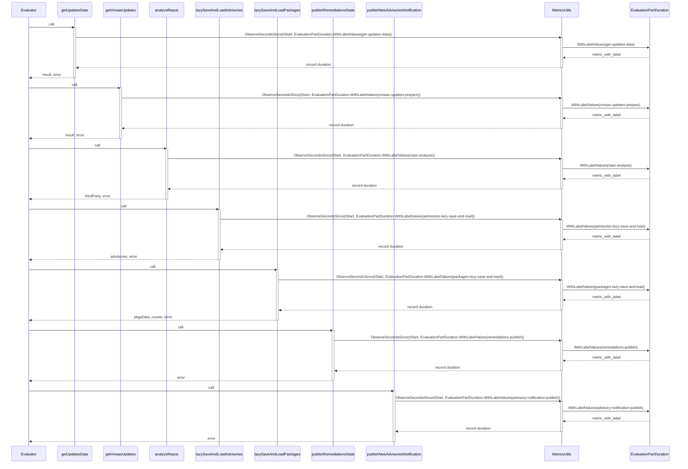
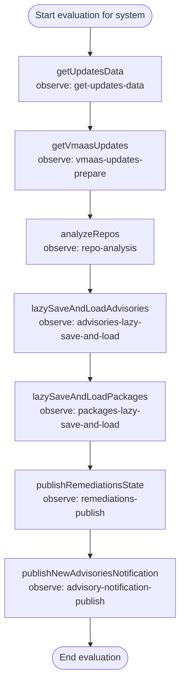

# Pull Request #1973: Add additional time observation for evaluation

**Author**: @jlsherrill
**Created**: December 10, 2025 at 01:00 PM UTC
**Status**: Merged
**Labels**: None
**Base**: `master` ← **Head**: `visibility`

## Description

## Secure Coding Practices Checklist GitHub Link
- https://github.com/RedHatInsights/secure-coding-checklist

## Secure Coding Checklist
- [x] Input Validation
- [x] Output Encoding
- [x] Authentication and Password Management
- [x] Session Management
- [x] Access Control
- [x] Cryptographic Practices
- [x] Error Handling and Logging
- [x] Data Protection
- [x] Communication Security
- [x] System Configuration
- [x] Database Security
- [x] File Management
- [x] Memory Management
- [x] General Coding Practices

## Summary by Sourcery

Instrument evaluation and remediation paths with additional timing metrics to observe the duration of key processing steps.

Enhancements:
- Add duration observation for fetching update data, preparing VMaaS updates, and analyzing repositories during evaluation.
- Add timing metrics around remediations publishing, advisories lazy save/load, packages lazy save/load, and advisory notification publishing to improve performance visibility.

---

## Discussion

### Comment by @jira-linking on December 10, 2025 at 01:01 PM UTC

Commits missing Jira IDs:
9206a3a0243978ceb9b7e3220567319db22095fa


### Comment by @sourcery-ai on December 10, 2025 at 01:01 PM UTC

<!-- Generated by sourcery-ai[bot]: start review_guide -->

## Reviewer's Guide

Adds Prometheus-style duration observations around several key evaluation steps to measure performance of updates retrieval, VMaaS preparation, repository analysis, remediations publishing, advisories handling, and package handling.

#### Sequence diagram for evaluation timing observations during evaluation



#### Flow diagram for metric observation wrapping of evaluation steps



### File-Level Changes

| Change | Details | Files |
| ------ | ------- | ----- |
| Instrument evaluation pipeline steps with duration metrics for performance observability. | <ul><li>Wrap getUpdatesData execution with a deferred ObserveSecondsSince call labeled "get-updates-data".</li><li>Wrap getVmaasUpdates execution with a deferred ObserveSecondsSince call labeled "vmaas-updates-prepare" and ensure it starts timing at function entry.</li><li>Measure analyzeRepos execution time with a deferred ObserveSecondsSince call labeled "repo-analysis".</li><li>Track publishRemediationsState execution time using a deferred ObserveSecondsSince call labeled "remediations-publish" and import time in remediations.go.</li><li>Add timing around lazySaveAndLoadAdvisories with label "advisories-lazy-save-and-load" to capture advisory persistence duration.</li><li>Add timing around lazySaveAndLoadPackages with label "packages-lazy-save-and-load" to capture package persistence duration.</li><li>Measure publishNewAdvisoriesNotification execution time with label "advisory-notification-publish" to monitor notification publishing latency.</li></ul> | `evaluator/evaluate.go`<br/>`evaluator/remediations.go`<br/>`evaluator/evaluate_advisories.go`<br/>`evaluator/evaluate_packages.go`<br/>`evaluator/notifications.go` |

---

<details>
<summary>Tips and commands</summary>

#### Interacting with Sourcery

- **Trigger a new review:** Comment `@sourcery-ai review` on the pull request.
- **Continue discussions:** Reply directly to Sourcery's review comments.
- **Generate a GitHub issue from a review comment:** Ask Sourcery to create an
  issue from a review comment by replying to it. You can also reply to a
  review comment with `@sourcery-ai issue` to create an issue from it.
- **Generate a pull request title:** Write `@sourcery-ai` anywhere in the pull
  request title to generate a title at any time. You can also comment
  `@sourcery-ai title` on the pull request to (re-)generate the title at any time.
- **Generate a pull request summary:** Write `@sourcery-ai summary` anywhere in
  the pull request body to generate a PR summary at any time exactly where you
  want it. You can also comment `@sourcery-ai summary` on the pull request to
  (re-)generate the summary at any time.
- **Generate reviewer's guide:** Comment `@sourcery-ai guide` on the pull
  request to (re-)generate the reviewer's guide at any time.
- **Resolve all Sourcery comments:** Comment `@sourcery-ai resolve` on the
  pull request to resolve all Sourcery comments. Useful if you've already
  addressed all the comments and don't want to see them anymore.
- **Dismiss all Sourcery reviews:** Comment `@sourcery-ai dismiss` on the pull
  request to dismiss all existing Sourcery reviews. Especially useful if you
  want to start fresh with a new review - don't forget to comment
  `@sourcery-ai review` to trigger a new review!

#### Customizing Your Experience

Access your [dashboard](https://app.sourcery.ai) to:
- Enable or disable review features such as the Sourcery-generated pull request
  summary, the reviewer's guide, and others.
- Change the review language.
- Add, remove or edit custom review instructions.
- Adjust other review settings.

#### Getting Help

- [Contact our support team](mailto:support@sourcery.ai) for questions or feedback.
- Visit our [documentation](https://docs.sourcery.ai) for detailed guides and information.
- Keep in touch with the Sourcery team by following us on [X/Twitter](https://x.com/SourceryAI), [LinkedIn](https://www.linkedin.com/company/sourcery-ai/) or [GitHub](https://github.com/sourcery-ai).

</details>

<!-- Generated by sourcery-ai[bot]: end review_guide -->

### Comment by @codecov-commenter on December 10, 2025 at 01:06 PM UTC

## [Codecov](https://app.codecov.io/gh/RedHatInsights/patchman-engine/pull/1973?dropdown=coverage&src=pr&el=h1&utm_medium=referral&utm_source=github&utm_content=comment&utm_campaign=pr+comments&utm_term=RedHatInsights) Report
:white_check_mark: All modified and coverable lines are covered by tests.
:white_check_mark: Project coverage is 58.92%. Comparing base ([`594e39b`](https://app.codecov.io/gh/RedHatInsights/patchman-engine/commit/594e39bba41ffb12f2e313bec756407bb36a3845?dropdown=coverage&el=desc&utm_medium=referral&utm_source=github&utm_content=comment&utm_campaign=pr+comments&utm_term=RedHatInsights)) to head ([`9206a3a`](https://app.codecov.io/gh/RedHatInsights/patchman-engine/commit/9206a3a0243978ceb9b7e3220567319db22095fa?dropdown=coverage&el=desc&utm_medium=referral&utm_source=github&utm_content=comment&utm_campaign=pr+comments&utm_term=RedHatInsights)).

<details><summary>Additional details and impacted files</summary>


```diff
@@            Coverage Diff             @@
##           master    #1973      +/-   ##
==========================================
+ Coverage   58.84%   58.92%   +0.07%     
==========================================
  Files         131      131              
  Lines        8436     8452      +16     
==========================================
+ Hits         4964     4980      +16     
  Misses       2937     2937              
  Partials      535      535              
```

| [Flag](https://app.codecov.io/gh/RedHatInsights/patchman-engine/pull/1973/flags?src=pr&el=flags&utm_medium=referral&utm_source=github&utm_content=comment&utm_campaign=pr+comments&utm_term=RedHatInsights) | Coverage Δ | |
|---|---|---|
| [unittests](https://app.codecov.io/gh/RedHatInsights/patchman-engine/pull/1973/flags?src=pr&el=flag&utm_medium=referral&utm_source=github&utm_content=comment&utm_campaign=pr+comments&utm_term=RedHatInsights) | `58.92% <100.00%> (+0.07%)` | :arrow_up: |

Flags with carried forward coverage won't be shown. [Click here](https://docs.codecov.io/docs/carryforward-flags?utm_medium=referral&utm_source=github&utm_content=comment&utm_campaign=pr+comments&utm_term=RedHatInsights#carryforward-flags-in-the-pull-request-comment) to find out more.
</details>

[:umbrella: View full report in Codecov by Sentry](https://app.codecov.io/gh/RedHatInsights/patchman-engine/pull/1973?dropdown=coverage&src=pr&el=continue&utm_medium=referral&utm_source=github&utm_content=comment&utm_campaign=pr+comments&utm_term=RedHatInsights).   
:loudspeaker: Have feedback on the report? [Share it here](https://about.codecov.io/codecov-pr-comment-feedback/?utm_medium=referral&utm_source=github&utm_content=comment&utm_campaign=pr+comments&utm_term=RedHatInsights).
<details><summary> :rocket: New features to boost your workflow: </summary>

- :snowflake: [Test Analytics](https://docs.codecov.com/docs/test-analytics): Detect flaky tests, report on failures, and find test suite problems.
</details>

---

## Reviews

### Review by @sourcery-ai - Commented on December 10, 2025 at 01:02 PM UTC

Hey there - I've reviewed your changes - here's some feedback:

- The `evaluationPartDuration.WithLabelValues(...)` label strings are now duplicated across multiple functions; consider centralizing them as typed constants or an enum-like structure to avoid typos and ease future refactoring.
- Since the timing pattern (`tStart := time.Now(); defer utils.ObserveSecondsSince(...)`) is repeated in multiple places, you could introduce a small helper (e.g., `deferObservePartDuration(label string)`) to reduce boilerplate and keep the call sites more readable.

<details>
<summary>Prompt for AI Agents</summary>

~~~markdown
Please address the comments from this code review:

## Overall Comments
- The `evaluationPartDuration.WithLabelValues(...)` label strings are now duplicated across multiple functions; consider centralizing them as typed constants or an enum-like structure to avoid typos and ease future refactoring.
- Since the timing pattern (`tStart := time.Now(); defer utils.ObserveSecondsSince(...)`) is repeated in multiple places, you could introduce a small helper (e.g., `deferObservePartDuration(label string)`) to reduce boilerplate and keep the call sites more readable.
~~~

</details>

***

<details>
<summary>Sourcery is free for open source - if you like our reviews please consider sharing them ✨</summary>

- [X](https://twitter.com/intent/tweet?text=I%20just%20got%20an%20instant%20code%20review%20from%20%40SourceryAI%2C%20and%20it%20was%20brilliant%21%20It%27s%20free%20for%20open%20source%20and%20has%20a%20free%20trial%20for%20private%20code.%20Check%20it%20out%20https%3A//sourcery.ai)
- [Mastodon](https://mastodon.social/share?text=I%20just%20got%20an%20instant%20code%20review%20from%20%40SourceryAI%2C%20and%20it%20was%20brilliant%21%20It%27s%20free%20for%20open%20source%20and%20has%20a%20free%20trial%20for%20private%20code.%20Check%20it%20out%20https%3A//sourcery.ai)
- [LinkedIn](https://www.linkedin.com/sharing/share-offsite/?url=https://sourcery.ai)
- [Facebook](https://www.facebook.com/sharer/sharer.php?u=https://sourcery.ai)

</details>

<sub>
Help me be more useful! Please click 👍 or 👎 on each comment and I'll use the feedback to improve your reviews.
</sub>

### Review by @TenSt - Commented on December 10, 2025 at 01:20 PM UTC

Looks good. Can you please also add time observation for the `evaluateWithVmaas` function?

### Review by @TenSt - Approved on December 10, 2025 at 01:24 PM UTC

---

*Archived from: https://github.com/RedHatInsights/patchman-engine/pull/1973*
