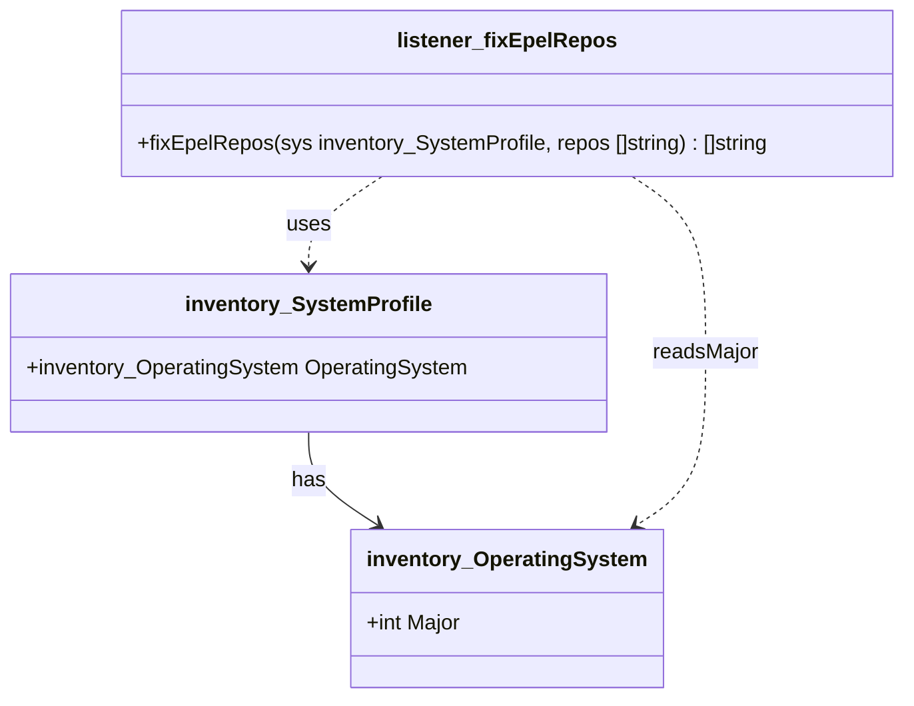

# Pull Request #1974: fix: add support for content style EPEL labels

**Author**: @dominikvagner
**Created**: December 10, 2025 at 01:26 PM UTC
**Status**: Merged
**Labels**: None
**Base**: `master` ← **Head**: `recognize-content-epel`

## Description

## Secure Coding Practices Checklist GitHub Link
- https://github.com/RedHatInsights/secure-coding-checklist

## Secure Coding Checklist
- [x] Input Validation
- [x] Output Encoding
- [x] Authentication and Password Management
- [x] Session Management
- [x] Access Control
- [x] Cryptographic Practices
- [x] Error Handling and Logging
- [x] Data Protection
- [x] Communication Security
- [x] System Configuration
- [x] Database Security
- [x] File Management
- [x] Memory Management
- [x] General Coding Practices

## Summary by Sourcery

Extend EPEL repository normalization to handle both legacy and content-style labels based on the system’s OS major version.

Bug Fixes:
- Normalize content-style EPEL repository labels (e.g., EPEL_9_*) to the expected epel-<major> format.

Tests:
- Add unit coverage to verify that content-style EPEL labels are correctly converted for a given OS major version.

---

## Discussion

### Comment by @jira-linking on December 10, 2025 at 01:26 PM UTC

Commits missing Jira IDs:
f9bdd1f78bcd8eb1ec698443f3cd51fd499abfe2


### Comment by @sourcery-ai on December 10, 2025 at 01:26 PM UTC

<!-- Generated by sourcery-ai[bot]: start review_guide -->

<details>
<summary>Reviewer's guide (collapsed on small PRs)</summary>

## Reviewer's Guide

Adds support for normalizing content-style EPEL repository labels to the expected yum-style format based on the system OS major version, and extends tests accordingly.

#### Class diagram for fixEpelRepos and related types



### File-Level Changes

| Change | Details | Files |
| ------ | ------- | ----- |
| Extend EPEL repo normalization to handle content-style EPEL labels based on OS major version. | <ul><li>Update EPEL repository normalization logic to rewrite labels starting with the content-style prefix for the matching OS major version to the standard yum-style epel-N form</li><li>Preserve existing behavior that rewrites plain 'epel' to 'epel-N' using the system profile's OS major version</li></ul> | `listener/upload.go` |
| Add unit coverage for content-style EPEL label normalization. | <ul><li>Extend existing EPEL repo normalization test to cover conversion from a content-style EPEL label (EPEL_9_Everything_x86_64) to epel-9 using an OS major version of 9</li></ul> | `listener/upload_test.go` |

</details>

---

<details>
<summary>Tips and commands</summary>

#### Interacting with Sourcery

- **Trigger a new review:** Comment `@sourcery-ai review` on the pull request.
- **Continue discussions:** Reply directly to Sourcery's review comments.
- **Generate a GitHub issue from a review comment:** Ask Sourcery to create an
  issue from a review comment by replying to it. You can also reply to a
  review comment with `@sourcery-ai issue` to create an issue from it.
- **Generate a pull request title:** Write `@sourcery-ai` anywhere in the pull
  request title to generate a title at any time. You can also comment
  `@sourcery-ai title` on the pull request to (re-)generate the title at any time.
- **Generate a pull request summary:** Write `@sourcery-ai summary` anywhere in
  the pull request body to generate a PR summary at any time exactly where you
  want it. You can also comment `@sourcery-ai summary` on the pull request to
  (re-)generate the summary at any time.
- **Generate reviewer's guide:** Comment `@sourcery-ai guide` on the pull
  request to (re-)generate the reviewer's guide at any time.
- **Resolve all Sourcery comments:** Comment `@sourcery-ai resolve` on the
  pull request to resolve all Sourcery comments. Useful if you've already
  addressed all the comments and don't want to see them anymore.
- **Dismiss all Sourcery reviews:** Comment `@sourcery-ai dismiss` on the pull
  request to dismiss all existing Sourcery reviews. Especially useful if you
  want to start fresh with a new review - don't forget to comment
  `@sourcery-ai review` to trigger a new review!

#### Customizing Your Experience

Access your [dashboard](https://app.sourcery.ai) to:
- Enable or disable review features such as the Sourcery-generated pull request
  summary, the reviewer's guide, and others.
- Change the review language.
- Add, remove or edit custom review instructions.
- Adjust other review settings.

#### Getting Help

- [Contact our support team](mailto:support@sourcery.ai) for questions or feedback.
- Visit our [documentation](https://docs.sourcery.ai) for detailed guides and information.
- Keep in touch with the Sourcery team by following us on [X/Twitter](https://x.com/SourceryAI), [LinkedIn](https://www.linkedin.com/company/sourcery-ai/) or [GitHub](https://github.com/sourcery-ai).

</details>

<!-- Generated by sourcery-ai[bot]: end review_guide -->

### Comment by @codecov-commenter on December 10, 2025 at 01:32 PM UTC

## [Codecov](https://app.codecov.io/gh/RedHatInsights/patchman-engine/pull/1974?dropdown=coverage&src=pr&el=h1&utm_medium=referral&utm_source=github&utm_content=comment&utm_campaign=pr+comments&utm_term=RedHatInsights) Report
:white_check_mark: All modified and coverable lines are covered by tests.
:white_check_mark: Project coverage is 58.81%. Comparing base ([`594e39b`](https://app.codecov.io/gh/RedHatInsights/patchman-engine/commit/594e39bba41ffb12f2e313bec756407bb36a3845?dropdown=coverage&el=desc&utm_medium=referral&utm_source=github&utm_content=comment&utm_campaign=pr+comments&utm_term=RedHatInsights)) to head ([`f9bdd1f`](https://app.codecov.io/gh/RedHatInsights/patchman-engine/commit/f9bdd1f78bcd8eb1ec698443f3cd51fd499abfe2?dropdown=coverage&el=desc&utm_medium=referral&utm_source=github&utm_content=comment&utm_campaign=pr+comments&utm_term=RedHatInsights)).

<details><summary>Additional details and impacted files</summary>


```diff
@@            Coverage Diff             @@
##           master    #1974      +/-   ##
==========================================
- Coverage   58.84%   58.81%   -0.03%     
==========================================
  Files         131      131              
  Lines        8436     8438       +2     
==========================================
- Hits         4964     4963       -1     
- Misses       2937     2940       +3     
  Partials      535      535              
```

| [Flag](https://app.codecov.io/gh/RedHatInsights/patchman-engine/pull/1974/flags?src=pr&el=flags&utm_medium=referral&utm_source=github&utm_content=comment&utm_campaign=pr+comments&utm_term=RedHatInsights) | Coverage Δ | |
|---|---|---|
| [unittests](https://app.codecov.io/gh/RedHatInsights/patchman-engine/pull/1974/flags?src=pr&el=flag&utm_medium=referral&utm_source=github&utm_content=comment&utm_campaign=pr+comments&utm_term=RedHatInsights) | `58.81% <100.00%> (-0.03%)` | :arrow_down: |

Flags with carried forward coverage won't be shown. [Click here](https://docs.codecov.io/docs/carryforward-flags?utm_medium=referral&utm_source=github&utm_content=comment&utm_campaign=pr+comments&utm_term=RedHatInsights#carryforward-flags-in-the-pull-request-comment) to find out more.
</details>

[:umbrella: View full report in Codecov by Sentry](https://app.codecov.io/gh/RedHatInsights/patchman-engine/pull/1974?dropdown=coverage&src=pr&el=continue&utm_medium=referral&utm_source=github&utm_content=comment&utm_campaign=pr+comments&utm_term=RedHatInsights).   
:loudspeaker: Have feedback on the report? [Share it here](https://about.codecov.io/codecov-pr-comment-feedback/?utm_medium=referral&utm_source=github&utm_content=comment&utm_campaign=pr+comments&utm_term=RedHatInsights).
<details><summary> :rocket: New features to boost your workflow: </summary>

- :snowflake: [Test Analytics](https://docs.codecov.com/docs/test-analytics): Detect flaky tests, report on failures, and find test suite problems.
</details>

---

## Reviews

### Review by @sourcery-ai - Commented on December 10, 2025 at 01:28 PM UTC

Hey there - I've reviewed your changes - here's some feedback:

- In `fixEpelRepos`, consider precomputing the `prefix := fmt.Sprintf("EPEL_%d", sys.OperatingSystem.Major)` and `replacement := fmt.Sprintf("epel-%d", sys.OperatingSystem.Major)` once before the loop instead of rebuilding these strings on every iteration to simplify the logic and avoid repeated allocations.

<details>
<summary>Prompt for AI Agents</summary>

~~~markdown
Please address the comments from this code review:

## Overall Comments
- In `fixEpelRepos`, consider precomputing the `prefix := fmt.Sprintf("EPEL_%d", sys.OperatingSystem.Major)` and `replacement := fmt.Sprintf("epel-%d", sys.OperatingSystem.Major)` once before the loop instead of rebuilding these strings on every iteration to simplify the logic and avoid repeated allocations.
~~~

</details>

***

<details>
<summary>Sourcery is free for open source - if you like our reviews please consider sharing them ✨</summary>

- [X](https://twitter.com/intent/tweet?text=I%20just%20got%20an%20instant%20code%20review%20from%20%40SourceryAI%2C%20and%20it%20was%20brilliant%21%20It%27s%20free%20for%20open%20source%20and%20has%20a%20free%20trial%20for%20private%20code.%20Check%20it%20out%20https%3A//sourcery.ai)
- [Mastodon](https://mastodon.social/share?text=I%20just%20got%20an%20instant%20code%20review%20from%20%40SourceryAI%2C%20and%20it%20was%20brilliant%21%20It%27s%20free%20for%20open%20source%20and%20has%20a%20free%20trial%20for%20private%20code.%20Check%20it%20out%20https%3A//sourcery.ai)
- [LinkedIn](https://www.linkedin.com/sharing/share-offsite/?url=https://sourcery.ai)
- [Facebook](https://www.facebook.com/sharer/sharer.php?u=https://sourcery.ai)

</details>

<sub>
Help me be more useful! Please click 👍 or 👎 on each comment and I'll use the feedback to improve your reviews.
</sub>

### Review by @TenSt - Approved on December 10, 2025 at 01:28 PM UTC

---

*Archived from: https://github.com/RedHatInsights/patchman-engine/pull/1974*
