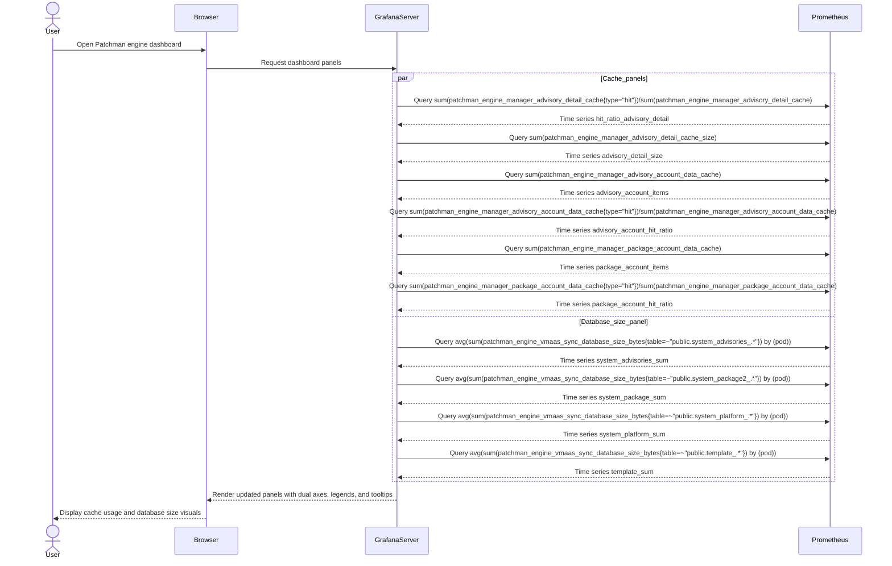

# Pull Request #1984: update grafana definitions

**Author**: @MichaelMraka
**Created**: December 15, 2025 at 01:14 PM UTC
**Status**: Merged
**Labels**: None
**Base**: `master` ← **Head**: `pr5`

## Description

## Secure Coding Practices Checklist GitHub Link
- https://github.com/RedHatInsights/secure-coding-checklist

## Secure Coding Checklist
- [x] Input Validation
- [x] Output Encoding
- [x] Authentication and Password Management
- [x] Session Management
- [x] Access Control
- [x] Cryptographic Practices
- [x] Error Handling and Logging
- [x] Data Protection
- [x] Communication Security
- [x] System Configuration
- [x] Database Security
- [x] File Management
- [x] Memory Management
- [x] General Coding Practices

## Summary by Sourcery

Update Grafana dashboards to show additional cache usage metrics and refine database size queries.

New Features:
- Add advisory account data cache usage timeseries panel.
- Add package account data cache usage timeseries panel.
- Include template table size in the database size panel.

Bug Fixes:
- Update database size Prometheus queries to match fully qualified table name patterns.

Enhancements:
- Show both hit ratio and item counts with separate axes and legends on relevant cache panels.
- Enable legends and adjust axis labels/units for clarity in cache-related graphs.
- Sort multi-metric tooltips in descending order for the database size panel.

---

## Discussion

### Comment by @jira-linking on December 15, 2025 at 01:14 PM UTC

Commits missing Jira IDs:
a0c0841cd44de6525bb14487b85c25d6802edaac
883414e2af0a52447d006119133f3ccce8f20952
Referenced Jiras:
https://issues.redhat.com/browse/RHINENG-21447


### Comment by @sourcery-ai on December 15, 2025 at 01:14 PM UTC

<!-- Generated by sourcery-ai[bot]: start review_guide -->

## Reviewer's Guide

Updates the Grafana Patchman engine dashboard to better represent cache usage and hit ratios, adds new cache usage panels, refines legends/axes, and expands database size metrics to include schema-qualified tables and templates.

#### Sequence diagram for Grafana querying updated metrics



### File-Level Changes

| Change | Details | Files |
| ------ | ------- | ----- |
| Refine advisory detail cache panel to separate count vs hit ratio and improve visualization. | <ul><li>Change primary y-axis label from hit ratio to Items and unit from percent to none, removing the hard max of 1 to reflect item counts correctly.</li><li>Introduce a per-series override for the hit ratio time series so it uses the Hit ratio axis label, percentunit, and right-side axis placement.</li><li>Enable the legend and give the hit ratio query an explicit legend label for clearer series identification.</li><li>Retitle the panel from Advisory detail cache hit ratio to Advisory detail cache and add a second Prometheus target for cache size (sum of patchman_engine_manager_advisory_detail_cache_size).</li></ul> | `dashboards/app-sre/grafana-dashboard-insights-patchman-engine-general.configmap.yaml` |
| Add new cache usage panels for advisory and package account data with dual axes for items and hit ratio. | <ul><li>Add an Advisory account data usage timeseries panel showing total items (sum of patchman_engine_manager_advisory_account_data_cache) and hit ratio (hit/total) with per-series overrides placing hit ratio on a right-side percent axis labeled Hit ratio.</li><li>Add a Package account data usage timeseries panel showing total items (sum of patchman_engine_manager_package_account_data_cache) and hit ratio (hit/total) with the same dual-axis override configuration.</li><li>Standardize axis labels to Items and enable legends on these panels for clearer series differentiation.</li></ul> | `dashboards/app-sre/grafana-dashboard-insights-patchman-engine-general.configmap.yaml` |
| Broaden and refine database size metrics visualization. | <ul><li>Change the tooltip sort mode for the Database size panel from none to desc so larger series appear first in the tooltip.</li><li>Update database size Prometheus expressions to match tables with schema-qualified names (public.system_advisories_.*, public.system_package2_.*, public.system_platform_.*).</li><li>Add a new template_sum series tracking avg sum of patchman_engine_vmaas_sync_database_size_bytes for public.template_.* tables.</li></ul> | `dashboards/app-sre/grafana-dashboard-insights-patchman-engine-general.configmap.yaml` |

---

<details>
<summary>Tips and commands</summary>

#### Interacting with Sourcery

- **Trigger a new review:** Comment `@sourcery-ai review` on the pull request.
- **Continue discussions:** Reply directly to Sourcery's review comments.
- **Generate a GitHub issue from a review comment:** Ask Sourcery to create an
  issue from a review comment by replying to it. You can also reply to a
  review comment with `@sourcery-ai issue` to create an issue from it.
- **Generate a pull request title:** Write `@sourcery-ai` anywhere in the pull
  request title to generate a title at any time. You can also comment
  `@sourcery-ai title` on the pull request to (re-)generate the title at any time.
- **Generate a pull request summary:** Write `@sourcery-ai summary` anywhere in
  the pull request body to generate a PR summary at any time exactly where you
  want it. You can also comment `@sourcery-ai summary` on the pull request to
  (re-)generate the summary at any time.
- **Generate reviewer's guide:** Comment `@sourcery-ai guide` on the pull
  request to (re-)generate the reviewer's guide at any time.
- **Resolve all Sourcery comments:** Comment `@sourcery-ai resolve` on the
  pull request to resolve all Sourcery comments. Useful if you've already
  addressed all the comments and don't want to see them anymore.
- **Dismiss all Sourcery reviews:** Comment `@sourcery-ai dismiss` on the pull
  request to dismiss all existing Sourcery reviews. Especially useful if you
  want to start fresh with a new review - don't forget to comment
  `@sourcery-ai review` to trigger a new review!

#### Customizing Your Experience

Access your [dashboard](https://app.sourcery.ai) to:
- Enable or disable review features such as the Sourcery-generated pull request
  summary, the reviewer's guide, and others.
- Change the review language.
- Add, remove or edit custom review instructions.
- Adjust other review settings.

#### Getting Help

- [Contact our support team](mailto:support@sourcery.ai) for questions or feedback.
- Visit our [documentation](https://docs.sourcery.ai) for detailed guides and information.
- Keep in touch with the Sourcery team by following us on [X/Twitter](https://x.com/SourceryAI), [LinkedIn](https://www.linkedin.com/company/sourcery-ai/) or [GitHub](https://github.com/sourcery-ai).

</details>

<!-- Generated by sourcery-ai[bot]: end review_guide -->

### Comment by @codecov-commenter on December 15, 2025 at 01:20 PM UTC

## [Codecov](https://app.codecov.io/gh/RedHatInsights/patchman-engine/pull/1984?dropdown=coverage&src=pr&el=h1&utm_medium=referral&utm_source=github&utm_content=comment&utm_campaign=pr+comments&utm_term=RedHatInsights) Report
:white_check_mark: All modified and coverable lines are covered by tests.
:white_check_mark: Project coverage is 59.01%. Comparing base ([`b63efad`](https://app.codecov.io/gh/RedHatInsights/patchman-engine/commit/b63efad2c4736825990b36ca0f71ea94fafd16cb?dropdown=coverage&el=desc&utm_medium=referral&utm_source=github&utm_content=comment&utm_campaign=pr+comments&utm_term=RedHatInsights)) to head ([`fd91305`](https://app.codecov.io/gh/RedHatInsights/patchman-engine/commit/fd913051f49d91601d85732e18d9a1a58548a6f9?dropdown=coverage&el=desc&utm_medium=referral&utm_source=github&utm_content=comment&utm_campaign=pr+comments&utm_term=RedHatInsights)).

<details><summary>Additional details and impacted files</summary>


```diff
@@           Coverage Diff           @@
##           master    #1984   +/-   ##
=======================================
  Coverage   59.01%   59.01%           
=======================================
  Files         131      131           
  Lines        8493     8493           
=======================================
  Hits         5012     5012           
  Misses       2947     2947           
  Partials      534      534           
```

| [Flag](https://app.codecov.io/gh/RedHatInsights/patchman-engine/pull/1984/flags?src=pr&el=flags&utm_medium=referral&utm_source=github&utm_content=comment&utm_campaign=pr+comments&utm_term=RedHatInsights) | Coverage Δ | |
|---|---|---|
| [unittests](https://app.codecov.io/gh/RedHatInsights/patchman-engine/pull/1984/flags?src=pr&el=flag&utm_medium=referral&utm_source=github&utm_content=comment&utm_campaign=pr+comments&utm_term=RedHatInsights) | `59.01% <ø> (ø)` | |

Flags with carried forward coverage won't be shown. [Click here](https://docs.codecov.io/docs/carryforward-flags?utm_medium=referral&utm_source=github&utm_content=comment&utm_campaign=pr+comments&utm_term=RedHatInsights#carryforward-flags-in-the-pull-request-comment) to find out more.
</details>

[:umbrella: View full report in Codecov by Sentry](https://app.codecov.io/gh/RedHatInsights/patchman-engine/pull/1984?dropdown=coverage&src=pr&el=continue&utm_medium=referral&utm_source=github&utm_content=comment&utm_campaign=pr+comments&utm_term=RedHatInsights).   
:loudspeaker: Have feedback on the report? [Share it here](https://about.codecov.io/codecov-pr-comment-feedback/?utm_medium=referral&utm_source=github&utm_content=comment&utm_campaign=pr+comments&utm_term=RedHatInsights).
<details><summary> :rocket: New features to boost your workflow: </summary>

- :snowflake: [Test Analytics](https://docs.codecov.com/docs/test-analytics): Detect flaky tests, report on failures, and find test suite problems.
</details>

---

## Reviews

### Review by @sourcery-ai - Commented on December 15, 2025 at 01:15 PM UTC

Hey there - I've reviewed your changes - here's some feedback:

- For the new hit-ratio Prometheus expressions (e.g., `sum(...{type="hit"})/sum(...)`), consider adding a `> 0` guard or `clamp_max()`/`clamp_min()` to avoid potential division-by-zero or NaN values when the denominator series is missing or zero.
- You now have very similar field overrides and legend settings for multiple hit-ratio panels; consider centralizing this via a reusable panel or carefully reusing JSON snippets to reduce duplication and keep axis/unit configuration consistent across dashboards.

<details>
<summary>Prompt for AI Agents</summary>

~~~markdown
Please address the comments from this code review:

## Overall Comments
- For the new hit-ratio Prometheus expressions (e.g., `sum(...{type="hit"})/sum(...)`), consider adding a `> 0` guard or `clamp_max()`/`clamp_min()` to avoid potential division-by-zero or NaN values when the denominator series is missing or zero.
- You now have very similar field overrides and legend settings for multiple hit-ratio panels; consider centralizing this via a reusable panel or carefully reusing JSON snippets to reduce duplication and keep axis/unit configuration consistent across dashboards.

## Individual Comments

### Comment 1
<location> `dashboards/app-sre/grafana-dashboard-insights-patchman-engine-general.configmap.yaml:2550` </location>
<code_context>
                         "editorMode": "code",
                         "expr": "sum(patchman_engine_manager_advisory_detail_cache{type=\"hit\"})/sum(patchman_engine_manager_advisory_detail_cache)",
                         "hide": false,
-                        "legendFormat": "__auto",
</code_context>

<issue_to_address>
**issue:** Guard the hit-ratio expression against a zero denominator to avoid NaN/Inf values.

This divides `sum(...{type="hit"})` by `sum(...)` without handling the zero-traffic case, so periods with no samples will render NaN/Inf and produce confusing/blank panels. Please wrap the denominator (e.g. `sum(hits) / clamp_min(sum(total), 1)` or `sum(hits) / sum(total) OR on() vector(0)`) and apply the same fix to the other new hit-ratio queries (e.g. `advisory_account_data_cache`, `package_account_data_cache`) for consistency.
</issue_to_address>

### Comment 2
<location> `dashboards/app-sre/grafana-dashboard-insights-patchman-engine-general.configmap.yaml:2482` </location>
<code_context>
                         ],
-                        "max": 1,
                         "min": 0,
                         "noValue": "0%",
                         "thresholds": {
</code_context>

<issue_to_address>
**suggestion (bug_risk):** Align `noValue` formatting with the field unit for item-count series.

Here `noValue` is set to "0%" while the unit is `none` and the axis label is "Items", so the UI will show a percent string for a non-percent metric. Please change this to something consistent with the `none` unit (e.g., "0" or "") and, if you need percent formatting, apply it only to the `hit ratio` series via a series-specific override rather than the default config.

Suggested implementation:

```
                        "min": 0,
                        "noValue": "0",
                        "thresholds": {

```

To fully implement the suggestion, you should also:
1. Add or update a series-specific override for the `hit ratio` field in the same panel:
   - Use a matcher (typically `"matcher": { "id": "byName", "options": "hit ratio" }`).
   - In the corresponding `"properties"` array, set the unit to a percent unit (e.g., `{ "id": "unit", "value": "percentunit" }` or your project's standard percent unit string).
   - Optionally set a `noValue` override for that series only (e.g., `{ "id": "noValue", "value": "0%" }`) if you still want `"0%"` for `hit ratio`.
2. Ensure this override is added alongside existing entries in the `"overrides"` array for this panel, following the same structure and conventions already used in the file.
</issue_to_address>
~~~

</details>

***

<details>
<summary>Sourcery is free for open source - if you like our reviews please consider sharing them ✨</summary>

- [X](https://twitter.com/intent/tweet?text=I%20just%20got%20an%20instant%20code%20review%20from%20%40SourceryAI%2C%20and%20it%20was%20brilliant%21%20It%27s%20free%20for%20open%20source%20and%20has%20a%20free%20trial%20for%20private%20code.%20Check%20it%20out%20https%3A//sourcery.ai)
- [Mastodon](https://mastodon.social/share?text=I%20just%20got%20an%20instant%20code%20review%20from%20%40SourceryAI%2C%20and%20it%20was%20brilliant%21%20It%27s%20free%20for%20open%20source%20and%20has%20a%20free%20trial%20for%20private%20code.%20Check%20it%20out%20https%3A//sourcery.ai)
- [LinkedIn](https://www.linkedin.com/sharing/share-offsite/?url=https://sourcery.ai)
- [Facebook](https://www.facebook.com/sharer/sharer.php?u=https://sourcery.ai)

</details>

<sub>
Help me be more useful! Please click 👍 or 👎 on each comment and I'll use the feedback to improve your reviews.
</sub>

---

*Archived from: https://github.com/RedHatInsights/patchman-engine/pull/1984*
