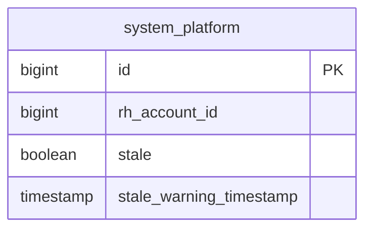
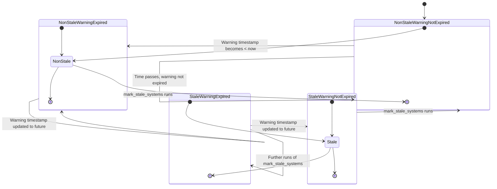

# Pull Request #1986: RHINENG-22546: let mark_stale job also unstale systems

**Author**: @MichaelMraka
**Created**: December 16, 2025 at 03:55 PM UTC
**Status**: Merged
**Labels**: None
**Base**: `master` ← **Head**: `pr5`

## Description

## Secure Coding Practices Checklist GitHub Link
- https://github.com/RedHatInsights/secure-coding-checklist

## Secure Coding Checklist
- [x] Input Validation
- [x] Output Encoding
- [x] Authentication and Password Management
- [x] Session Management
- [x] Access Control
- [x] Cryptographic Practices
- [x] Error Handling and Logging
- [x] Data Protection
- [x] Communication Security
- [x] System Configuration
- [x] Database Security
- [x] File Management
- [x] Memory Management
- [x] General Coding Practices

## Summary by Sourcery

Update database function for marking stale systems to also clear stale flags when systems become fresh again based on their warning timestamp.

Bug Fixes:
- Ensure systems whose stale warning has not yet expired are unmarked as stale instead of remaining incorrectly flagged.

Enhancements:
- Refine mark_stale_systems to toggle the stale flag according to whether the stale warning timestamp is in the past, rather than only marking newly stale systems.

---

## Discussion

### Comment by @jira-linking on December 16, 2025 at 03:55 PM UTC

Referenced Jiras:
https://issues.redhat.com/browse/RHINENG-22546


### Comment by @sourcery-ai on December 16, 2025 at 03:55 PM UTC

<!-- Generated by sourcery-ai[bot]: start review_guide -->

## Reviewer's Guide

Updates the mark_stale_systems database function and associated schema version so that the scheduled job can both mark systems as stale when their warning has expired and revert them to non-stale when appropriate, with proper migration up/down scripts.

#### ER diagram for system_platform staleness fields involved in mark_stale_systems



#### State diagram for system_platform stale status transitions



### File-Level Changes

| Change | Details | Files |
| ------ | ------- | ----- |
| Adjust mark_stale_systems logic so it can both mark and unmark stale systems based on the current time relative to stale_warning_timestamp. | <ul><li>Extend the CTE in mark_stale_systems to compute an expired flag as stale_warning_timestamp < now() for each selected system.</li><li>Change the selection criteria to pick systems whose stale flag does not match whether their warning is expired, instead of only non-stale expired systems.</li><li>Update the system_platform rows by assigning stale to the computed expired flag rather than hard-coding it to true.</li><li>Keep limiting and locking semantics (ORDER BY, LIMIT, FOR UPDATE OF system_platform) unchanged to preserve batch processing and concurrency behavior.</li></ul> | `database_admin/schema/create_schema.sql`<br/>`database_admin/migrations/140_mark_stale_also_unstale.up.sql` |
| Add migration scripts for the new mark_stale_systems behavior with correct schema version bump and a down migration that restores previous behavior. | <ul><li>Bump the schema_migrations version value from 139 to 140 to register the new migration.</li><li>Create an up migration defining the new mark_stale_systems function that can both set and clear the stale flag.</li><li>Create a down migration that restores the prior mark_stale_systems implementation which only marks non-stale systems as stale when their warning has expired.</li></ul> | `database_admin/schema/create_schema.sql`<br/>`database_admin/migrations/140_mark_stale_also_unstale.up.sql`<br/>`database_admin/migrations/140_mark_stale_also_unstale.down.sql` |

---

<details>
<summary>Tips and commands</summary>

#### Interacting with Sourcery

- **Trigger a new review:** Comment `@sourcery-ai review` on the pull request.
- **Continue discussions:** Reply directly to Sourcery's review comments.
- **Generate a GitHub issue from a review comment:** Ask Sourcery to create an
  issue from a review comment by replying to it. You can also reply to a
  review comment with `@sourcery-ai issue` to create an issue from it.
- **Generate a pull request title:** Write `@sourcery-ai` anywhere in the pull
  request title to generate a title at any time. You can also comment
  `@sourcery-ai title` on the pull request to (re-)generate the title at any time.
- **Generate a pull request summary:** Write `@sourcery-ai summary` anywhere in
  the pull request body to generate a PR summary at any time exactly where you
  want it. You can also comment `@sourcery-ai summary` on the pull request to
  (re-)generate the summary at any time.
- **Generate reviewer's guide:** Comment `@sourcery-ai guide` on the pull
  request to (re-)generate the reviewer's guide at any time.
- **Resolve all Sourcery comments:** Comment `@sourcery-ai resolve` on the
  pull request to resolve all Sourcery comments. Useful if you've already
  addressed all the comments and don't want to see them anymore.
- **Dismiss all Sourcery reviews:** Comment `@sourcery-ai dismiss` on the pull
  request to dismiss all existing Sourcery reviews. Especially useful if you
  want to start fresh with a new review - don't forget to comment
  `@sourcery-ai review` to trigger a new review!

#### Customizing Your Experience

Access your [dashboard](https://app.sourcery.ai) to:
- Enable or disable review features such as the Sourcery-generated pull request
  summary, the reviewer's guide, and others.
- Change the review language.
- Add, remove or edit custom review instructions.
- Adjust other review settings.

#### Getting Help

- [Contact our support team](mailto:support@sourcery.ai) for questions or feedback.
- Visit our [documentation](https://docs.sourcery.ai) for detailed guides and information.
- Keep in touch with the Sourcery team by following us on [X/Twitter](https://x.com/SourceryAI), [LinkedIn](https://www.linkedin.com/company/sourcery-ai/) or [GitHub](https://github.com/sourcery-ai).

</details>

<!-- Generated by sourcery-ai[bot]: end review_guide -->

### Comment by @codecov-commenter on December 16, 2025 at 04:01 PM UTC

## [Codecov](https://app.codecov.io/gh/RedHatInsights/patchman-engine/pull/1986?dropdown=coverage&src=pr&el=h1&utm_medium=referral&utm_source=github&utm_content=comment&utm_campaign=pr+comments&utm_term=RedHatInsights) Report
:white_check_mark: All modified and coverable lines are covered by tests.
:white_check_mark: Project coverage is 59.01%. Comparing base ([`67ce524`](https://app.codecov.io/gh/RedHatInsights/patchman-engine/commit/67ce524ac4867fd95d8caa9badd14221eba78854?dropdown=coverage&el=desc&utm_medium=referral&utm_source=github&utm_content=comment&utm_campaign=pr+comments&utm_term=RedHatInsights)) to head ([`6fdf5f6`](https://app.codecov.io/gh/RedHatInsights/patchman-engine/commit/6fdf5f69585d439d5c5fd6255e73b7809ef16082?dropdown=coverage&el=desc&utm_medium=referral&utm_source=github&utm_content=comment&utm_campaign=pr+comments&utm_term=RedHatInsights)).

<details><summary>Additional details and impacted files</summary>


```diff
@@           Coverage Diff           @@
##           master    #1986   +/-   ##
=======================================
  Coverage   59.01%   59.01%           
=======================================
  Files         131      131           
  Lines        8493     8493           
=======================================
  Hits         5012     5012           
  Misses       2947     2947           
  Partials      534      534           
```

| [Flag](https://app.codecov.io/gh/RedHatInsights/patchman-engine/pull/1986/flags?src=pr&el=flags&utm_medium=referral&utm_source=github&utm_content=comment&utm_campaign=pr+comments&utm_term=RedHatInsights) | Coverage Δ | |
|---|---|---|
| [unittests](https://app.codecov.io/gh/RedHatInsights/patchman-engine/pull/1986/flags?src=pr&el=flag&utm_medium=referral&utm_source=github&utm_content=comment&utm_campaign=pr+comments&utm_term=RedHatInsights) | `59.01% <ø> (ø)` | |

Flags with carried forward coverage won't be shown. [Click here](https://docs.codecov.io/docs/carryforward-flags?utm_medium=referral&utm_source=github&utm_content=comment&utm_campaign=pr+comments&utm_term=RedHatInsights#carryforward-flags-in-the-pull-request-comment) to find out more.
</details>

[:umbrella: View full report in Codecov by Sentry](https://app.codecov.io/gh/RedHatInsights/patchman-engine/pull/1986?dropdown=coverage&src=pr&el=continue&utm_medium=referral&utm_source=github&utm_content=comment&utm_campaign=pr+comments&utm_term=RedHatInsights).   
:loudspeaker: Have feedback on the report? [Share it here](https://about.codecov.io/codecov-pr-comment-feedback/?utm_medium=referral&utm_source=github&utm_content=comment&utm_campaign=pr+comments&utm_term=RedHatInsights).
<details><summary> :rocket: New features to boost your workflow: </summary>

- :snowflake: [Test Analytics](https://docs.codecov.com/docs/test-analytics): Detect flaky tests, report on failures, and find test suite problems.
</details>

---

## Reviews

### Review by @sourcery-ai - Commented on December 16, 2025 at 03:56 PM UTC

Hey there - I've reviewed your changes - here's some feedback:

- The predicate `WHERE stale != (stale_warning_timestamp < now())` will skip rows where `stale_warning_timestamp` is NULL (since the comparison yields NULL and `!=` with NULL is unknown); if NULL timestamps should be treated as either always-stale or never-stale, consider making that explicit with `COALESCE` or an `IS NULL` branch.
- You currently compute `stale_warning_timestamp < now()` twice (in the SELECT list and in the WHERE clause); refactoring through a subquery so the WHERE clause uses the `expired` alias (e.g., `FROM (SELECT ..., stale_warning_timestamp < now() AS expired FROM system_platform) s WHERE s.stale != s.expired`) would avoid duplication and make the intent clearer.

<details>
<summary>Prompt for AI Agents</summary>

~~~markdown
Please address the comments from this code review:

## Overall Comments
- The predicate `WHERE stale != (stale_warning_timestamp < now())` will skip rows where `stale_warning_timestamp` is NULL (since the comparison yields NULL and `!=` with NULL is unknown); if NULL timestamps should be treated as either always-stale or never-stale, consider making that explicit with `COALESCE` or an `IS NULL` branch.
- You currently compute `stale_warning_timestamp < now()` twice (in the SELECT list and in the WHERE clause); refactoring through a subquery so the WHERE clause uses the `expired` alias (e.g., `FROM (SELECT ..., stale_warning_timestamp < now() AS expired FROM system_platform) s WHERE s.stale != s.expired`) would avoid duplication and make the intent clearer.
~~~

</details>

***

<details>
<summary>Sourcery is free for open source - if you like our reviews please consider sharing them ✨</summary>

- [X](https://twitter.com/intent/tweet?text=I%20just%20got%20an%20instant%20code%20review%20from%20%40SourceryAI%2C%20and%20it%20was%20brilliant%21%20It%27s%20free%20for%20open%20source%20and%20has%20a%20free%20trial%20for%20private%20code.%20Check%20it%20out%20https%3A//sourcery.ai)
- [Mastodon](https://mastodon.social/share?text=I%20just%20got%20an%20instant%20code%20review%20from%20%40SourceryAI%2C%20and%20it%20was%20brilliant%21%20It%27s%20free%20for%20open%20source%20and%20has%20a%20free%20trial%20for%20private%20code.%20Check%20it%20out%20https%3A//sourcery.ai)
- [LinkedIn](https://www.linkedin.com/sharing/share-offsite/?url=https://sourcery.ai)
- [Facebook](https://www.facebook.com/sharer/sharer.php?u=https://sourcery.ai)

</details>

<sub>
Help me be more useful! Please click 👍 or 👎 on each comment and I'll use the feedback to improve your reviews.
</sub>

### Review by @TenSt - Approved on December 17, 2025 at 11:14 AM UTC

---

*Archived from: https://github.com/RedHatInsights/patchman-engine/pull/1986*
