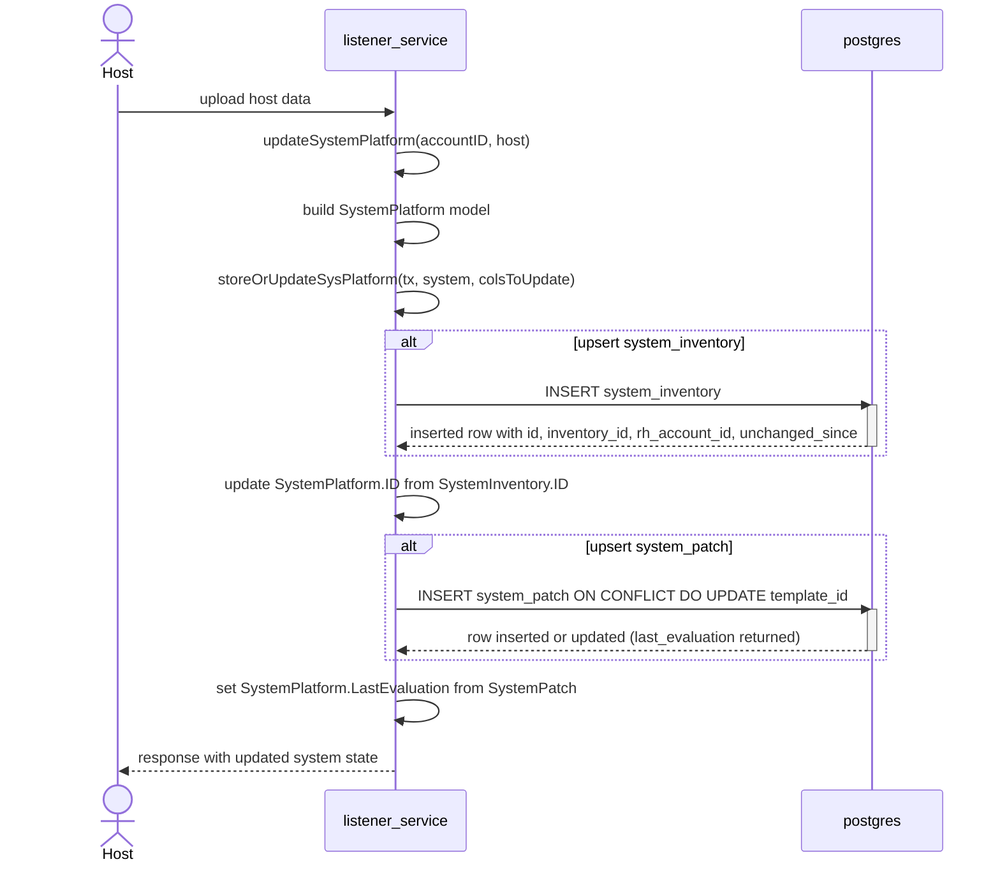
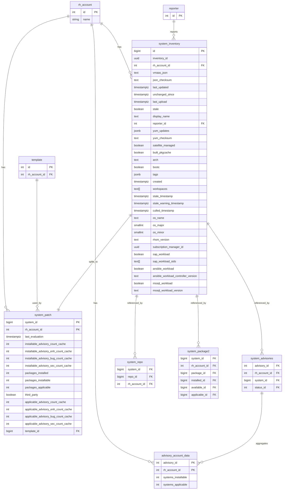

# Pull Request #1988: RHINENG-21214: split system_platform table to reflect cyndi changes

**Author**: @Dugowitch
**Created**: December 18, 2025 at 10:05 AM UTC
**Status**: Merged
**Labels**: None
**Base**: `master` ← **Head**: `split-table`

## Description

## Secure Coding Practices Checklist GitHub Link
- https://github.com/RedHatInsights/secure-coding-checklist

## Secure Coding Checklist
- [x] Input Validation
- [x] Output Encoding
- [x] Authentication and Password Management
- [x] Session Management
- [x] Access Control
- [x] Cryptographic Practices
- [x] Error Handling and Logging
- [x] Data Protection
- [x] Communication Security
- [x] System Configuration
- [x] Database Security
- [x] File Management
- [x] Memory Management
- [x] General Coding Practices

## Summary by Sourcery

Split the monolithic system_platform table into separate system_inventory and system_patch structures, keeping system_platform as a view backed by INSTEAD OF triggers and updating application code to use the new schema.

New Features:
- Introduce system_inventory table to store host inventory, lifecycle, and workload metadata with appropriate indexes, constraints, and permissions.
- Introduce system_patch table to store patch- and advisory-related system state and caches, with partitioning and access controls.
- Expose system_platform as a view over system_inventory and system_patch with triggers to support inserts, updates, and deletes transparently.

Bug Fixes:
- Ensure advisory and system cache refresh logic only considers systems that have a corresponding evaluated entry in system_patch.
- Fix conflict-update helper to safely perform ON CONFLICT DO NOTHING when no columns are provided, avoiding unnecessary updates.

Enhancements:
- Refactor database functions, foreign keys, and culling logic to operate on system_inventory and system_patch while preserving existing behavior.
- Extend models and upload logic to read/write through the split tables and maintain last_evaluation and template relationships correctly.
- Expand candlepin mock handlers and test data to support additional subscription manager IDs and the new schema layout.
- Adjust metrics and controller tests to account for new tables and sequence names while preserving existing APIs.

---

## Discussion

### Comment by @jira-linking on December 18, 2025 at 10:05 AM UTC

Referenced Jiras:
https://issues.redhat.com/browse/RHINENG-21214


### Comment by @sourcery-ai on December 18, 2025 at 10:05 AM UTC

<!-- Generated by sourcery-ai[bot]: start review_guide -->

## Reviewer's Guide

Split the monolithic system_platform storage into a new system_inventory table for host metadata and a system_patch table for patch/advisory state, wire them together via a backward‑compatible system_platform view with INSTEAD OF triggers, and propagate the schema change through migrations, Go models/DAO logic, tests, and dev data so existing APIs continue to behave while aligning with cyndi-backed inventory.hosts.

#### Sequence diagram for listener upload writing to system_inventory and system_patch



#### ER diagram for split system_platform into system_inventory and system_patch



#### Class diagram for Go models SystemPlatform, SystemInventory, and SystemPatch

```mermaid
classDiagram
    class SystemPlatform {
        int64 ID
        string InventoryID
        int RhAccountID
        *string VmaasJSON
        *string JSONChecksum
        *time_Time LastUpdated
        *time_Time UnchangedSince
        *time_Time LastEvaluation
        *time_Time LastUpload
        *time_Time StaleTimestamp
        *time_Time StaleWarningTimestamp
        *time_Time CulledTimestamp
        bool Stale
        string DisplayName
        int PackagesInstalled
        int PackagesInstallable
        *int ReporterID
        bool ThirdParty
        []byte YumUpdates
        int ApplicableAdvisoryCountCache
        int ApplicableAdvisoryEnhCountCache
        int ApplicableAdvisoryBugCountCache
        int ApplicableAdvisorySecCountCache
        bool SatelliteManaged
        bool BuiltPkgcache
        int PackagesApplicable
        *int64 TemplateID
        *string YumChecksum
        *string Arch
        bool Bootc
        string GetInventoryID()
    }

    class SystemInventory {
        int64 ID
        string InventoryID
        int RhAccountID
        *string VmaasJSON
        *string JSONChecksum
        *time_Time LastUpdated
        *time_Time UnchangedSince
        *time_Time LastUpload
        bool Stale
        string DisplayName
        *int ReporterID
        []byte YumUpdates
        *string YumChecksum
        bool SatelliteManaged
        bool BuiltPkgcache
        *string Arch
        bool Bootc
        []byte Tags
        time_Time Created
        pq_StringArray Workspaces
        *time_Time StaleTimestamp
        *time_Time StaleWarningTimestamp
        *time_Time CulledTimestamp
        *string OSName
        *int16 OSMajor
        *int16 OSMinor
        *string RhsmVersion
        *string SubscriptionManagerID
        bool SapWorkload
        pq_StringArray SapWorkloadSIDs
        bool AnsibleWorkload
        *string AnsibleWorkloadControllerVersion
        bool MssqlWorkload
        *string MssqlWorkloadVersion
        string TableName()
        string GetInventoryID()
    }

    class SystemPatch {
        int64 SystemID
        int RhAccountID
        *time_Time LastEvaluation
        int InstallableAdvisoryCountCache
        int InstallableAdvisoryEnhCountCache
        int InstallableAdvisoryBugCountCache
        int InstallableAdvisorySecCountCache
        int PackagesInstalled
        int PackagesInstallable
        int PackagesApplicable
        bool ThirdParty
        int ApplicableAdvisoryCountCache
        int ApplicableAdvisoryEnhCountCache
        int ApplicableAdvisoryBugCountCache
        int ApplicableAdvisorySecCountCache
        *int64 TemplateID
        string TableName()
    }

    SystemPlatform ..> SystemInventory : persisted_as
    SystemPlatform ..> SystemPatch : persisted_as
    SystemInventory "1" -- "1" SystemPatch : split_record
```



### File-Level Changes

| Change | Details | Files |
| ------ | ------- | ----- |
| Introduce partitioned system_inventory and system_patch tables and migrate existing system_platform data into them while keeping system_platform as a view. | <ul><li>Create system_inventory table partitioned by rh_account_id with inventory/metadata fields, constraints, indexes, and role grants, and move foreign keys from system_platform to system_inventory.</li><li>Create system_patch table partitioned by rh_account_id containing last_evaluation, advisory caches, package counts, third_party flag and template_id, with FKs to system_inventory and template.</li><li>Load existing active (non-stale) data from system_platform and inventory.hosts into system_inventory and system_patch in the 142 up migration, and provide a down migration that reconstructs a physical system_platform table and repopulates it from the split tables.</li><li>Replace the physical system_platform table with a view joining system_inventory and system_patch, and add INSTEAD OF triggers plus trigger functions (insert/update/delete) in migration 143 and in create_schema.sql to route writes to the underlying tables.</li></ul> | `database_admin/schema/create_schema.sql`<br/>`database_admin/migrations/142_split_system_platform.up.sql`<br/>`database_admin/migrations/142_split_system_platform.down.sql`<br/>`database_admin/migrations/143_system_platform_instead_of_triggers.up.sql`<br/>`database_admin/migrations/143_system_platform_instead_of_triggers.down.sql` |
| Refactor advisory cache, culling, and stale-marking functions and related logic to work against system_inventory/system_patch instead of system_platform. | <ul><li>Update on_system_update, refresh_advisory_caches_multi, refresh_system_caches, refresh_system_cached_counts, delete_system, delete_systems, delete_culled_systems, and mark_stale_systems to read/write system_inventory and system_patch, ensuring they join patch state via system_id and filter on non-stale inventory.</li><li>Adjust row-locking clauses (FOR UPDATE OF ...) and DELETE/UPDATE statements in these functions to lock/update system_inventory instead of system_platform.</li><li>Ensure advisory_account_data counts now use system_patch.last_evaluation and system_inventory.stale for inclusion logic.</li></ul> | `database_admin/schema/create_schema.sql`<br/>`database_admin/migrations/142_split_system_platform.up.sql`<br/>`database_admin/migrations/142_split_system_platform.down.sql` |
| Update Go data models and upload path to respect the new split schema and continue exposing SystemPlatform at the API level. | <ul><li>Introduce SystemInventory and SystemPatch GORM models (including tags, workloads, workspaces, OS/rhsm metadata) and map them to the new tables with appropriate column types (e.g., pq.StringArray, JSONB byte slices).</li><li>Change listener upload path: split storeOrUpdateSysPlatform so it upserts into system_inventory (via OnConflictUpdateMulti) and then upserts template_id/last_evaluation in system_patch while preserving last_evaluation when template_id is cleared.</li><li>Modify database.OnConflictUpdateMulti helper to support a DoNothing path when no update columns are passed, which is used by the patch upsert logic.</li><li>Ensure tests (upload tests, admin delete tests) construct/use SystemInventory where necessary and point sequence checks at system_inventory_id_seq instead of system_platform_id_seq.</li></ul> | `base/models/models.go`<br/>`listener/upload.go`<br/>`base/database/database.go`<br/>`listener/upload_test.go`<br/>`turnpike/controllers/admin.go`<br/>`turnpike/controllers/admin_test.go` |
| Adjust dev/test data and metrics/tests to reflect the new tables and additional inventory metadata from cyndi. | <ul><li>Replace direct inserts into system_platform in dev/test_data.sql with population of system_inventory and system_patch, including realistic tags, workloads, OS/rhsm fields, workspaces, and subscription manager IDs that align with inventory.hosts_v1_0 data.</li><li>Update culling and sequence-reset statements to operate on system_inventory instead of system_platform, and ensure test candlepin responses handle the new synthetic owner UUID that should return 404.</li><li>Update VMaaS metrics DB test expectations to account for the additional tables (system_inventory, system_patch) and check for their presence instead of system_platform.</li><li>Remove unused insights_id-related filter and field in managers’ system listing controller, since system data now flows through inventory and patch tables.</li></ul> | `dev/test_data.sql`<br/>`platform/candlepin.go`<br/>`tasks/vmaas_sync/metrics_db_test.go`<br/>`manager/controllers/systems.go` |

---

<details>
<summary>Tips and commands</summary>

#### Interacting with Sourcery

- **Trigger a new review:** Comment `@sourcery-ai review` on the pull request.
- **Continue discussions:** Reply directly to Sourcery's review comments.
- **Generate a GitHub issue from a review comment:** Ask Sourcery to create an
  issue from a review comment by replying to it. You can also reply to a
  review comment with `@sourcery-ai issue` to create an issue from it.
- **Generate a pull request title:** Write `@sourcery-ai` anywhere in the pull
  request title to generate a title at any time. You can also comment
  `@sourcery-ai title` on the pull request to (re-)generate the title at any time.
- **Generate a pull request summary:** Write `@sourcery-ai summary` anywhere in
  the pull request body to generate a PR summary at any time exactly where you
  want it. You can also comment `@sourcery-ai summary` on the pull request to
  (re-)generate the summary at any time.
- **Generate reviewer's guide:** Comment `@sourcery-ai guide` on the pull
  request to (re-)generate the reviewer's guide at any time.
- **Resolve all Sourcery comments:** Comment `@sourcery-ai resolve` on the
  pull request to resolve all Sourcery comments. Useful if you've already
  addressed all the comments and don't want to see them anymore.
- **Dismiss all Sourcery reviews:** Comment `@sourcery-ai dismiss` on the pull
  request to dismiss all existing Sourcery reviews. Especially useful if you
  want to start fresh with a new review - don't forget to comment
  `@sourcery-ai review` to trigger a new review!

#### Customizing Your Experience

Access your [dashboard](https://app.sourcery.ai) to:
- Enable or disable review features such as the Sourcery-generated pull request
  summary, the reviewer's guide, and others.
- Change the review language.
- Add, remove or edit custom review instructions.
- Adjust other review settings.

#### Getting Help

- [Contact our support team](mailto:support@sourcery.ai) for questions or feedback.
- Visit our [documentation](https://docs.sourcery.ai) for detailed guides and information.
- Keep in touch with the Sourcery team by following us on [X/Twitter](https://x.com/SourceryAI), [LinkedIn](https://www.linkedin.com/company/sourcery-ai/) or [GitHub](https://github.com/sourcery-ai).

</details>

<!-- Generated by sourcery-ai[bot]: end review_guide -->

### Comment by @Dugowitch on January 19, 2026 at 04:53 PM UTC

/retest

### Comment by @codecov-commenter on January 23, 2026 at 02:05 PM UTC

## [Codecov](https://app.codecov.io/gh/RedHatInsights/patchman-engine/pull/1988?dropdown=coverage&src=pr&el=h1&utm_medium=referral&utm_source=github&utm_content=comment&utm_campaign=pr+comments&utm_term=RedHatInsights) Report
:x: Patch coverage is `63.33333%` with `22 lines` in your changes missing coverage. Please review.
:white_check_mark: Project coverage is 59.32%. Comparing base ([`e9178c5`](https://app.codecov.io/gh/RedHatInsights/patchman-engine/commit/e9178c5f0d740c713d835a55c85a283b67ffcd43?dropdown=coverage&el=desc&utm_medium=referral&utm_source=github&utm_content=comment&utm_campaign=pr+comments&utm_term=RedHatInsights)) to head ([`b2bd819`](https://app.codecov.io/gh/RedHatInsights/patchman-engine/commit/b2bd819b5c95a0b2d62b2140580b934fa49f9754?dropdown=coverage&el=desc&utm_medium=referral&utm_source=github&utm_content=comment&utm_campaign=pr+comments&utm_term=RedHatInsights)).
:warning: Report is 24 commits behind head on master.

| [Files with missing lines](https://app.codecov.io/gh/RedHatInsights/patchman-engine/pull/1988?dropdown=coverage&src=pr&el=tree&utm_medium=referral&utm_source=github&utm_content=comment&utm_campaign=pr+comments&utm_term=RedHatInsights) | Patch % | Lines |
|---|---|---|
| [listener/upload.go](https://app.codecov.io/gh/RedHatInsights/patchman-engine/pull/1988?src=pr&el=tree&filepath=listener%2Fupload.go&utm_medium=referral&utm_source=github&utm_content=comment&utm_campaign=pr+comments&utm_term=RedHatInsights#diff-bGlzdGVuZXIvdXBsb2FkLmdv) | 72.72% | [8 Missing and 4 partials :warning: ](https://app.codecov.io/gh/RedHatInsights/patchman-engine/pull/1988?src=pr&el=tree&utm_medium=referral&utm_source=github&utm_content=comment&utm_campaign=pr+comments&utm_term=RedHatInsights) |
| [base/models/models.go](https://app.codecov.io/gh/RedHatInsights/patchman-engine/pull/1988?src=pr&el=tree&filepath=base%2Fmodels%2Fmodels.go&utm_medium=referral&utm_source=github&utm_content=comment&utm_campaign=pr+comments&utm_term=RedHatInsights#diff-YmFzZS9tb2RlbHMvbW9kZWxzLmdv) | 0.00% | [8 Missing :warning: ](https://app.codecov.io/gh/RedHatInsights/patchman-engine/pull/1988?src=pr&el=tree&utm_medium=referral&utm_source=github&utm_content=comment&utm_campaign=pr+comments&utm_term=RedHatInsights) |
| [base/database/database.go](https://app.codecov.io/gh/RedHatInsights/patchman-engine/pull/1988?src=pr&el=tree&filepath=base%2Fdatabase%2Fdatabase.go&utm_medium=referral&utm_source=github&utm_content=comment&utm_campaign=pr+comments&utm_term=RedHatInsights#diff-YmFzZS9kYXRhYmFzZS9kYXRhYmFzZS5nbw==) | 66.66% | [1 Missing and 1 partial :warning: ](https://app.codecov.io/gh/RedHatInsights/patchman-engine/pull/1988?src=pr&el=tree&utm_medium=referral&utm_source=github&utm_content=comment&utm_campaign=pr+comments&utm_term=RedHatInsights) |

<details><summary>Additional details and impacted files</summary>


```diff
@@            Coverage Diff             @@
##           master    #1988      +/-   ##
==========================================
+ Coverage   59.18%   59.32%   +0.14%     
==========================================
  Files         133      134       +1     
  Lines        8599     8664      +65     
==========================================
+ Hits         5089     5140      +51     
- Misses       2967     2977      +10     
- Partials      543      547       +4     
```

| [Flag](https://app.codecov.io/gh/RedHatInsights/patchman-engine/pull/1988/flags?src=pr&el=flags&utm_medium=referral&utm_source=github&utm_content=comment&utm_campaign=pr+comments&utm_term=RedHatInsights) | Coverage Δ | |
|---|---|---|
| [unittests](https://app.codecov.io/gh/RedHatInsights/patchman-engine/pull/1988/flags?src=pr&el=flag&utm_medium=referral&utm_source=github&utm_content=comment&utm_campaign=pr+comments&utm_term=RedHatInsights) | `59.32% <63.33%> (+0.14%)` | :arrow_up: |

Flags with carried forward coverage won't be shown. [Click here](https://docs.codecov.io/docs/carryforward-flags?utm_medium=referral&utm_source=github&utm_content=comment&utm_campaign=pr+comments&utm_term=RedHatInsights#carryforward-flags-in-the-pull-request-comment) to find out more.
</details>

[:umbrella: View full report in Codecov by Sentry](https://app.codecov.io/gh/RedHatInsights/patchman-engine/pull/1988?dropdown=coverage&src=pr&el=continue&utm_medium=referral&utm_source=github&utm_content=comment&utm_campaign=pr+comments&utm_term=RedHatInsights).   
:loudspeaker: Have feedback on the report? [Share it here](https://about.codecov.io/codecov-pr-comment-feedback/?utm_medium=referral&utm_source=github&utm_content=comment&utm_campaign=pr+comments&utm_term=RedHatInsights).
<details><summary> :rocket: New features to boost your workflow: </summary>

- :snowflake: [Test Analytics](https://docs.codecov.com/docs/test-analytics): Detect flaky tests, report on failures, and find test suite problems.
</details>

### Comment by @MichaelMraka on January 30, 2026 at 09:58 AM UTC

/retest

### Comment by @MichaelMraka on January 30, 2026 at 02:05 PM UTC

/retest

---

## Reviews

### Review by @MichaelMraka - Commented on December 19, 2025 at 03:28 PM UTC

### Review by @MichaelMraka - Commented on January 19, 2026 at 02:07 PM UTC

### Review by @MichaelMraka - Commented on January 19, 2026 at 03:11 PM UTC

### Review by @MichaelMraka - Commented on January 19, 2026 at 03:13 PM UTC

### Review by @MichaelMraka - Commented on January 20, 2026 at 01:29 PM UTC

### Review by @sourcery-ai - Commented on January 23, 2026 at 03:58 PM UTC

Hey - I've found 6 issues, and left some high level feedback:

- In `142_split_system_platform.down.sql`, the `INSERT INTO system_platform SELECT` statement is syntactically and logically broken: there is a missing comma after `si.id`, and the join condition `si.inventory_id = sp.inventory_id` cannot work because `system_patch` does not have an `inventory_id` column (it should be joining on `sp.system_id`).
- The new `upsertSystemPatch` flow in `listener/upload.go` relies on `OnConflictUpdateMulti` with an empty `updateCols` slice to trigger a `DO NOTHING` upsert; consider making this behavior explicit (e.g. a helper or comment) so future readers do not misinterpret the "no columns" case as a bug and accidentally change the conflict behavior.

<details>
<summary>Prompt for AI Agents</summary>

~~~markdown
Please address the comments from this code review:

## Overall Comments
- In `142_split_system_platform.down.sql`, the `INSERT INTO system_platform SELECT` statement is syntactically and logically broken: there is a missing comma after `si.id`, and the join condition `si.inventory_id = sp.inventory_id` cannot work because `system_patch` does not have an `inventory_id` column (it should be joining on `sp.system_id`).
- The new `upsertSystemPatch` flow in `listener/upload.go` relies on `OnConflictUpdateMulti` with an empty `updateCols` slice to trigger a `DO NOTHING` upsert; consider making this behavior explicit (e.g. a helper or comment) so future readers do not misinterpret the "no columns" case as a bug and accidentally change the conflict behavior.

## Individual Comments

### Comment 1
<location> `database_admin/migrations/142_split_system_platform.down.sql:55-64` </location>
<code_context>
+INSERT INTO system_platform SELECT
</code_context>

<issue_to_address>
**issue (bug_risk):** Down migration has a malformed INSERT and joins on a non-existent column in system_patch.

In the `INSERT INTO system_platform SELECT` statement:
- `si.id` is missing a trailing comma before `si.inventory_id`, which will cause a syntax error.
- The join condition incorrectly uses `sp.inventory_id`, but `system_patch` only has `system_id` and `rh_account_id`. The join should likely be `ON si.rh_account_id = sp.rh_account_id AND si.id = sp.system_id`.
As written, the down migration will fail and cannot reconstruct `system_platform` correctly.
</issue_to_address>

### Comment 2
<location> `listener/upload_test.go:351-354` </location>
<code_context>
 	var nextval, currval int
 	database.DB.Model(&models.SystemPlatform{}).Select("count(*)").Find(&oldCount)
-	database.DB.Raw("select nextval('system_platform_id_seq')").Find(&nextval)
+	database.DB.Raw("select nextval('system_inventory_id_seq')").Find(&nextval)

 	colsToUpdate := []string{"vmaas_json", "json_checksum", "reporter_id", "satellite_managed"}
</code_context>

<issue_to_address>
**suggestion (testing):** Add tests that explicitly cover the new `upsertSystemPatch` behavior and the split between `system_inventory` and `system_patch`.

The production behavior of `storeOrUpdateSysPlatform` has changed significantly: it now writes to `system_inventory` and then calls `upsertSystemPatch` with different paths depending on `system_patch` existence and `TemplateID`. `TestStoreOrUpdateSysPlatform` only checks sequence gaps/basic upsert and misses:

- Creating a new `system_patch` when none exists and `TemplateID` is non-nil
- Updating an existing `system_patch` when `TemplateID` changes
- Skipping writes (and reloading `last_evaluation`) when a `system_patch` exists and `TemplateID` is nil
- Correctly populating `system.LastEvaluation` from `system_patch`

Please add/extend tests to cover at least these cases:
1) New `SystemPlatform` with `TemplateID` set → `system_patch` row created with expected `template_id` and `last_evaluation`.
2) Existing `system_patch` → call with different `TemplateID` → row updated.
3) Existing `system_patch` → call with `TemplateID == nil` → `template_id` unchanged and `system.LastEvaluation` loaded from `system_patch`.

Suggested implementation:

```golang
	var oldCount, newCount int
	var nextval, currval int
	database.DB.Model(&models.SystemPlatform{}).Select("count(*)").Find(&oldCount)
	database.DB.Raw("select nextval('system_inventory_id_seq')").Find(&nextval)

	colsToUpdate := []string{"vmaas_json", "json_checksum", "reporter_id", "satellite_managed"}
	json := "this_is_json"

	// make sure we are not creating gaps in id sequences
	database.DB.Model(&models.SystemPlatform{}).Select("count(*)").Find(&newCount)
	database.DB.Raw("select currval('system_inventory_id_seq')").Find(&currval)
	countInc := newCount - oldCount
	maxInc := currval - nextval
	assert.Equal(t, countInc, maxInc)

	// additional coverage for system_inventory / system_patch behavior

	t.Run("new system with TemplateID creates system_patch", func(t *testing.T) {
		tx := database.DB.Begin()
		defer tx.Rollback()

		now := time.Now().UTC()
		templateID := uint(1001)

		system := &models.SystemPlatform{
			// fill required fields as per existing tests/conventions
			TemplateID:     &templateID,
			LastEvaluation: &now,
		}
		if err := tx.Create(system).Error; err != nil {
			t.Fatalf("failed to create system_inventory row: %v", err)
		}

		// exercise production behavior: write to system_inventory and upsert system_patch
		if err := storeOrUpdateSysPlatform(tx, system, colsToUpdate, json); err != nil {
			t.Fatalf("storeOrUpdateSysPlatform failed: %v", err)
		}

		var patch models.SystemPatch
		if err := tx.Where("system_id = ?", system.ID).First(&patch).Error; err != nil {
			t.Fatalf("expected system_patch row to be created: %v", err)
		}

		if patch.TemplateID == nil || *patch.TemplateID != templateID {
			t.Fatalf("expected system_patch.template_id = %d; got %#v", templateID, patch.TemplateID)
		}
		if patch.LastEvaluation == nil || patch.LastEvaluation.IsZero() {
			t.Fatalf("expected system_patch.last_evaluation to be populated")
		}
	})

	t.Run("existing system_patch updated when TemplateID changes", func(t *testing.T) {
		tx := database.DB.Begin()
		defer tx.Rollback()

		initialTemplateID := uint(2001)
		updatedTemplateID := uint(2002)
		now := time.Now().UTC()

		system := &models.SystemPlatform{
			TemplateID:     &initialTemplateID,
			LastEvaluation: &now,
		}
		if err := tx.Create(system).Error; err != nil {
			t.Fatalf("failed to create system_inventory row: %v", err)
		}

		// seed existing system_patch for this system
		initialPatch := &models.SystemPatch{
			SystemID:       system.ID,
			TemplateID:     &initialTemplateID,
			LastEvaluation: &now,
		}
		if err := tx.Create(initialPatch).Error; err != nil {
			t.Fatalf("failed to seed system_patch row: %v", err)
		}

		// change TemplateID and call storeOrUpdateSysPlatform
		system.TemplateID = &updatedTemplateID
		newEval := now.Add(5 * time.Minute)
		system.LastEvaluation = &newEval

		if err := storeOrUpdateSysPlatform(tx, system, colsToUpdate, json); err != nil {
			t.Fatalf("storeOrUpdateSysPlatform failed: %v", err)
		}

		var patch models.SystemPatch
		if err := tx.Where("system_id = ?", system.ID).First(&patch).Error; err != nil {
			t.Fatalf("expected system_patch row to exist: %v", err)
		}

		if patch.TemplateID == nil || *patch.TemplateID != updatedTemplateID {
			t.Fatalf("expected system_patch.template_id to be updated to %d; got %#v", updatedTemplateID, patch.TemplateID)
		}
		if patch.LastEvaluation == nil || !patch.LastEvaluation.Equal(newEval) {
			t.Fatalf("expected system_patch.last_evaluation to be updated to %v; got %#v", newEval, patch.LastEvaluation)
		}
	})

	t.Run("existing system_patch retained when TemplateID is nil and LastEvaluation reloaded", func(t *testing.T) {
		tx := database.DB.Begin()
		defer tx.Rollback()

		templateID := uint(3001)
		lastEval := time.Now().UTC().Add(-10 * time.Minute)

		system := &models.SystemPlatform{
			TemplateID: &templateID,
		}
		if err := tx.Create(system).Error; err != nil {
			t.Fatalf("failed to create system_inventory row: %v", err)
		}

		patch := &models.SystemPatch{
			SystemID:       system.ID,
			TemplateID:     &templateID,
			LastEvaluation: &lastEval,
		}
		if err := tx.Create(patch).Error; err != nil {
			t.Fatalf("failed to seed system_patch row: %v", err)
		}

		// simulate call with TemplateID == nil; production code should:
		// - not change template_id in system_patch
		// - reload last_evaluation from system_patch into system
		system.TemplateID = nil
		system.LastEvaluation = nil

		if err := storeOrUpdateSysPlatform(tx, system, colsToUpdate, json); err != nil {
			t.Fatalf("storeOrUpdateSysPlatform failed: %v", err)
		}

		var patchAfter models.SystemPatch
		if err := tx.Where("system_id = ?", system.ID).First(&patchAfter).Error; err != nil {
			t.Fatalf("expected system_patch row to exist: %v", err)
		}

		if patchAfter.TemplateID == nil || *patchAfter.TemplateID != templateID {
			t.Fatalf("expected system_patch.template_id to remain %d; got %#v", templateID, patchAfter.TemplateID)
		}

		if system.LastEvaluation == nil || !system.LastEvaluation.Equal(lastEval) {
			t.Fatalf("expected system.LastEvaluation to be reloaded to %v; got %#v", lastEval, system.LastEvaluation)
		}
	})

```

These edits assume:

1. `listener/upload_test.go` already imports `time`.  
   If not, add `time` to the imports for this test file.
2. `models.SystemPlatform` has fields `ID`, `TemplateID *uint`, and `LastEvaluation *time.Time` (or compatible types), and GORM is configured so that this model maps to `system_inventory` / `system_platform` as appropriate.
3. `models.SystemPatch` exists with fields `SystemID`, `TemplateID *uint`, and `LastEvaluation *time.Time`, mapped to the `system_patch` table.
4. `storeOrUpdateSysPlatform` is the function under test and its signature matches `func storeOrUpdateSysPlatform(db *gorm.DB, system *models.SystemPlatform, colsToUpdate []string, json string) error` or similar.  
   If the actual signature differs (e.g., extra parameters like reporter, org ID, etc.), adjust the calls accordingly using the same arguments as in the existing tests.

If your existing tests use helper constructors/builders for `SystemPlatform` or `SystemPatch` (or require additional mandatory fields like `Account`, `OrgID`, `InventoryID`), you should replace the bare struct literals here with those helpers or populate the required fields to satisfy NOT NULL / unique constraints in your schema.
</issue_to_address>

### Comment 3
<location> `tasks/vmaas_sync/metrics_db_test.go:20-26` </location>
<code_context>
-	assert.Equal(t, 214, len(tableSizes))
-	assert.Equal(t, 214, len(uniqueTables))
-	assert.True(t, uniqueTables["public.system_platform"]) // check whether table names were loaded
+	assert.Equal(t, 231, len(tableSizes))
+	assert.Equal(t, 231, len(uniqueTables))
+	assert.True(t, uniqueTables["public.system_inventory"]) // check whether table names were loaded
+	assert.True(t, uniqueTables["public.system_patch"])     // check whether table names were loaded
 	assert.True(t, uniqueTables["public.package"])
 	assert.True(t, uniqueTables["public.repo"])
 	assert.True(t, uniqueTables["inventory.hosts_v1_0"])
</code_context>

<issue_to_address>
**suggestion (testing):** Consider making the table count assertion less brittle while still verifying the new tables.

Hard-coding `231` couples this test to the exact schema size, so any unrelated table add/remove will require updating the test. Since you already assert the key tables (including the new ones), consider either:

- Keeping the explicit assertions for the important tables, and
- Relaxing the count check to `>=` some lower bound, or removing it if it isn’t providing extra value.

This keeps the test resilient to schema changes while still ensuring the new tables are covered by the metrics logic.

Suggested implementation:

```golang
	for _, item := range tableSizes {
		uniqueTables[item.Key] = true
	}

	// Keep a lower-bound to ensure we have a reasonably sized schema, but avoid
	// coupling the test to the exact number of tables.
	assert.GreaterOrEqual(t, len(tableSizes), 214)
	assert.GreaterOrEqual(t, len(uniqueTables), 214)

	// Explicitly assert existence of key tables, including newly added ones.
	assert.True(t, uniqueTables["public.system_inventory"]) // check whether table names were loaded
	assert.True(t, uniqueTables["public.system_patch"])     // check whether table names were loaded
	assert.True(t, uniqueTables["public.package"])
	assert.True(t, uniqueTables["public.repo"])
	assert.True(t, uniqueTables["inventory.hosts_v1_0"])

```

1. Ensure that `github.com/stretchr/testify/assert` is already imported in this test file; if not, add it to the imports so that `assert.GreaterOrEqual` is available.
2. If your version of `testify` is too old to have `GreaterOrEqual`, replace those two lines with:
   - `assert.True(t, len(tableSizes) >= 214)`
   - `assert.True(t, len(uniqueTables) >= 214)`
</issue_to_address>

### Comment 4
<location> `turnpike/controllers/admin_test.go:21-25` </location>
<code_context>
 	core.SetupTest(t)

-	assert.NoError(t, database.DB.Create(&models.SystemPlatform{
+	assert.NoError(t, database.DB.Create(&models.SystemInventory{
 		InventoryID: del,
 		RhAccountID: 1,
 		DisplayName: del,
+		Tags:        []byte("[]"),
 	}).Error)
 	utils.TestLoadEnv("conf/manager.env")
</code_context>

<issue_to_address>
**suggestion (testing):** Add an integration-style test to ensure system deletion cleans up both `system_inventory` and `system_patch`.

This change updates the seed to `SystemInventory`, but the test still only covers initialization. With the new `system_inventory`/`system_patch` split, please add a test that creates linked `SystemInventory` and `SystemPatch` rows, runs `SystemDeleteHandler` for that `inventory_id`, and asserts that both records are removed (or otherwise handled as designed). This will verify the delete flow matches the new schema and doesn’t leave orphaned patch data.
</issue_to_address>

### Comment 5
<location> `listener/upload.go:479` </location>
<code_context>
-		// update system
-		err := tx.Select(colsToUpdate).Updates(system).Error
-		return base.WrapFatalDBError(err, "unable to update system_platform")
+	inventoryRecord := models.SystemInventory{
+		ID:                    system.ID,
+		InventoryID:           system.InventoryID,
</code_context>

<issue_to_address>
**issue (complexity):** Consider extracting the platform→inventory mapping, making the patch upsert branches explicit, and using a named templateID to simplify the new flow and avoid duplication.

You can simplify the new orchestration without changing behavior by:

1. **Extracting the `SystemPlatform` → `SystemInventory` mapping into a helper**  
   This removes the field‑by‑field duplication and keeps the structs in sync in one place:

```go
// in models or a small helper file close to the structs
func NewSystemInventoryFromPlatform(p *models.SystemPlatform) *models.SystemInventory {
	return &models.SystemInventory{
		ID:                    p.ID,
		InventoryID:           p.InventoryID,
		RhAccountID:           p.RhAccountID,
		DisplayName:           p.DisplayName,
		LastUpload:            p.LastUpload,
		SatelliteManaged:      p.SatelliteManaged,
		BuiltPkgcache:         p.BuiltPkgcache,
		Arch:                  p.Arch,
		Bootc:                 p.Bootc,
		VmaasJSON:             p.VmaasJSON,
		JSONChecksum:          p.JSONChecksum,
		ReporterID:            p.ReporterID,
		YumUpdates:            p.YumUpdates,
		YumChecksum:           p.YumChecksum,
		StaleTimestamp:        p.StaleTimestamp,
		StaleWarningTimestamp: p.StaleWarningTimestamp,
		CulledTimestamp:       p.CulledTimestamp,
		Tags:                  []byte("[]"),
	}
}
```

Then `storeOrUpdateSysPlatform` becomes:

```go
func storeOrUpdateSysPlatform(tx *gorm.DB, system *models.SystemPlatform, colsToUpdate []string) error {
	if err := tx.Where("rh_account_id = ? AND inventory_id = ?", system.RhAccountID, system.InventoryID).
		Select("id").
		Find(system).Error; err != nil {
		utils.LogWarn("err", err, "couldn't find system for update")
	}

	txi := tx.Clauses(clause.Returning{
		Columns: []clause.Column{
			{Name: "id"}, {Name: "inventory_id"}, {Name: "rh_account_id"},
			{Name: "unchanged_since"},
		},
	})

	inventoryRecord := NewSystemInventoryFromPlatform(system)

	if err := database.OnConflictUpdateMulti(txi, []string{"rh_account_id", "inventory_id"}, colsToUpdate...).
		Create(inventoryRecord).Error; err != nil {
		return base.WrapFatalDBError(err, "unable to insert to system_inventory")
	}

	system.ID = inventoryRecord.ID
	system.InventoryID = inventoryRecord.InventoryID
	system.RhAccountID = inventoryRecord.RhAccountID
	system.UnchangedSince = inventoryRecord.UnchangedSince

	return upsertSystemPatch(tx, system)
}
```

If you later add/remove fields, you only touch `NewSystemInventoryFromPlatform` instead of multiple call sites.

2. **Making `upsertSystemPatch` control flow explicit instead of relying on `RowsAffected` semantics**  
   The three cases are currently implicit. You can keep the same behavior but make it much easier to follow with explicit branches:

```go
func upsertSystemPatch(tx *gorm.DB, system *models.SystemPlatform) error {
	tx = tx.Clauses(clause.Returning{Columns: []clause.Column{{Name: "last_evaluation"}}})

	patchRecord := models.SystemPatch{
		SystemID:    system.ID,
		RhAccountID: system.RhAccountID,
		TemplateID:  system.TemplateID,
	}

	// Case 1 & 2: create or update when we have a template
	if system.TemplateID != nil {
		res := database.OnConflictUpdateMulti(tx, []string{"rh_account_id", "system_id"}, "template_id").
			Create(&patchRecord)
		if res.Error != nil {
			return base.WrapFatalDBError(res.Error, "unable to upsert system_patch with template")
		}
		system.LastEvaluation = patchRecord.LastEvaluation
		return nil
	}

	// Case 3: no template; ensure row exists and load last_evaluation
	var existing models.SystemPatch
	err := tx.
		Where("system_id = ? AND rh_account_id = ?", patchRecord.SystemID, patchRecord.RhAccountID).
		First(&existing).Error
	if err != nil {
		// If the row truly doesn't exist, create it and let RETURNING fill last_evaluation
		if errors.Is(err, gorm.ErrRecordNotFound) {
			res := database.OnConflictUpdateMulti(tx, []string{"rh_account_id", "system_id"}).
				Create(&patchRecord)
			if res.Error != nil {
				return base.WrapFatalDBError(res.Error, "unable to insert system_patch without template")
			}
			system.LastEvaluation = patchRecord.LastEvaluation
			return nil
		}
		return base.WrapFatalDBError(err, "unable to load system_patch last_evaluation")
	}

	system.LastEvaluation = existing.LastEvaluation
	return nil
}
```

This removes the need to reason about `RowsAffected == 0` implying “existing row and no update needed”, and makes each case self‑documenting.

3. **Re‑introducing a named `templateID` for clarity and to avoid repeated work**  
   Keeping the template lookup in a variable makes it obvious that it’s a separate concern and prevents accidental multiple calls later:

```go
templateID := hostTemplate(tx, accountID, host)

systemPlatform := models.SystemPlatform{
	InventoryID:           inventoryID,
	RhAccountID:           accountID,
	DisplayName:           displayName,
	VmaasJSON:             utils.EmptyToNil(&updatesReqJSONString),
	JSONChecksum:          utils.EmptyToNil(&jsonChecksum),
	LastUpload:            host.GetLastUpload(),
	StaleTimestamp:        host.StaleTimestamp.Time(),
	StaleWarningTimestamp: host.StaleWarningTimestamp.Time(),
	CulledTimestamp:       host.CulledTimestamp.Time(),
	ReporterID:            getReporterID(host.Reporter),
	YumUpdates:            yumUpdates.GetRawParsed(),
	YumChecksum:           utils.EmptyToNil(&yumChecksum),
	SatelliteManaged:      host.SystemProfile.SatelliteManaged,
	BuiltPkgcache:         yumUpdates.GetBuiltPkgcache(),
	Arch:                  host.SystemProfile.Arch,
	Bootc:                 isBootc,
	TemplateID:            templateID,
}
```

These changes keep the new inventory/patch split and behavior but reduce duplication and make the control flow around patch upserts much easier to reason about.
</issue_to_address>

### Comment 6
<location> `base/models/models.go:101` </location>
<code_context>
 	return s.InventoryID
 }

+type SystemInventory struct {
+	ID                               int64  `gorm:"primaryKey"`
+	InventoryID                      string `gorm:"unique"`
</code_context>

<issue_to_address>
**issue (complexity):** Consider extracting shared struct fields and adding small helper abstractions so these models are easier to understand and maintain without changing the database schema.

You can reduce the structural duplication and mental overhead without changing behavior or schema by introducing small, shared abstractions and helpers.

### 1. Extract shared fields between `SystemPlatform` and `SystemInventory`

Instead of duplicating the common “shape” in two structs, factor out the non–PK-related fields into a shared struct and embed it.

```go
// shared_fields.go

// SystemCommon holds fields shared by SystemPlatform and SystemInventory.
// No PK / uniqueness / table-specific tags here.
type SystemCommon struct {
	VmaasJSON                        *string
	JSONChecksum                     *string
	LastUpdated                      *time.Time `gorm:"default:null"`
	UnchangedSince                   *time.Time `gorm:"default:null"`
	LastUpload                       *time.Time `gorm:"default:null"`
	Stale                            bool
	DisplayName                      string
	ReporterID                       *int
	YumUpdates                       []byte  `gorm:"column:yum_updates"`
	YumChecksum                      *string `gorm:"column:yum_checksum"`
	SatelliteManaged                 bool    `gorm:"column:satellite_managed"`
	BuiltPkgcache                    bool    `gorm:"column:built_pkgcache"`
	Arch                             *string
	Bootc                            bool
	Tags                             []byte `gorm:"column:tags"`
	Created                          time.Time
	Workspaces                       pq.StringArray `gorm:"type:text[]"`
	StaleTimestamp                   *time.Time
	StaleWarningTimestamp            *time.Time
	CulledTimestamp                  *time.Time
	OSName                           *string
	OSMajor                          *int16
	OSMinor                          *int16
	RhsmVersion                      *string
	SubscriptionManagerID            *string
	SapWorkload                      bool
	SapWorkloadSIDs                  pq.StringArray `gorm:"type:text[];column:sap_workload_sids"`
	AnsibleWorkload                  bool
	AnsibleWorkloadControllerVersion *string
	MssqlWorkload                    bool
	MssqlWorkloadVersion             *string
}
```

Then use it in both models:

```go
type SystemPlatform struct {
	// existing PK / table-specific fields...
	ID          int64  `gorm:"primaryKey"`
	InventoryID string `gorm:"unique"`
	RhAccountID int    `gorm:"primaryKey"`

	SystemCommon
}

type SystemInventory struct {
	ID          int64  `gorm:"primaryKey"`
	InventoryID string `gorm:"unique"`
	RhAccountID int    `gorm:"primaryKey"`

	SystemCommon
}
```

You can centralize mapping logic for any copy operations (e.g. in `listener/upload.go`) so future changes to shared fields are localized:

```go
func NewSystemInventoryFromPlatform(p *SystemPlatform) *SystemInventory {
	if p == nil {
		return nil
	}
	return &SystemInventory{
		ID:           p.ID,
		InventoryID:  p.InventoryID,
		RhAccountID:  p.RhAccountID,
		SystemCommon: p.SystemCommon,
	}
}
```

This keeps the DB schema and behavior intact while removing duplication and risk of divergence.

---

### 2. Add structure / documentation to `SystemPatch` without changing schema

You can reduce the “flat bag of counters” feel by:

1. Adding doc comments that clarify logical grouping and relationship.
2. Exposing small helper types/methods to group related counters, without touching the fields (so no schema impact).

```go
// SystemPatch contains per-system patch/evaluation state.
// It is logically grouped into installable/applicable advisory counts
// and package counts, but stored flat for DB compatibility.
type SystemPatch struct {
	SystemID    int64 `gorm:"primaryKey"`
	RhAccountID int   `gorm:"primaryKey"`

	// Evaluation metadata
	LastEvaluation *time.Time `gorm:"default:null"` // set by DB trigger

	// Installable advisory counts
	InstallableAdvisoryCountCache    int
	InstallableAdvisoryEnhCountCache int
	InstallableAdvisoryBugCountCache int
	InstallableAdvisorySecCountCache int

	// Package counts
	PackagesInstalled   int
	PackagesInstallable int
	PackagesApplicable  int
	ThirdParty          bool

	// Applicable advisory counts
	ApplicableAdvisoryCountCache    int
	ApplicableAdvisoryEnhCountCache int
	ApplicableAdvisoryBugCountCache int
	ApplicableAdvisorySecCountCache int

	TemplateID *int64 `gorm:"column:template_id"`
}

// Logical view over advisory counts to avoid callers dealing with all 8 fields.
type AdvisoryCounts struct {
	Total int
	Enh   int
	Bug   int
	Sec   int
}

func (p SystemPatch) InstallableCounts() AdvisoryCounts {
	return AdvisoryCounts{
		Total: p.InstallableAdvisoryCountCache,
		Enh:   p.InstallableAdvisoryEnhCountCache,
		Bug:   p.InstallableAdvisoryBugCountCache,
		Sec:   p.InstallableAdvisorySecCountCache,
	}
}

func (p SystemPatch) ApplicableCounts() AdvisoryCounts {
	return AdvisoryCounts{
		Total: p.ApplicableAdvisoryCountCache,
		Enh:   p.ApplicableAdvisoryEnhCountCache,
		Bug:   p.ApplicableAdvisoryBugCountCache,
		Sec:   p.ApplicableAdvisorySecCountCache,
	}
}
```

Callers that previously read individual fields can now use `InstallableCounts()` / `ApplicableCounts()` for a clearer, grouped abstraction, while the raw fields stay available and unchanged for GORM and existing code paths.
</issue_to_address>
~~~

</details>

***

<details>
<summary>Sourcery is free for open source - if you like our reviews please consider sharing them ✨</summary>

- [X](https://twitter.com/intent/tweet?text=I%20just%20got%20an%20instant%20code%20review%20from%20%40SourceryAI%2C%20and%20it%20was%20brilliant%21%20It%27s%20free%20for%20open%20source%20and%20has%20a%20free%20trial%20for%20private%20code.%20Check%20it%20out%20https%3A//sourcery.ai)
- [Mastodon](https://mastodon.social/share?text=I%20just%20got%20an%20instant%20code%20review%20from%20%40SourceryAI%2C%20and%20it%20was%20brilliant%21%20It%27s%20free%20for%20open%20source%20and%20has%20a%20free%20trial%20for%20private%20code.%20Check%20it%20out%20https%3A//sourcery.ai)
- [LinkedIn](https://www.linkedin.com/sharing/share-offsite/?url=https://sourcery.ai)
- [Facebook](https://www.facebook.com/sharer/sharer.php?u=https://sourcery.ai)

</details>

<sub>
Help me be more useful! Please click 👍 or 👎 on each comment and I'll use the feedback to improve your reviews.
</sub>

### Review by @MichaelMraka - Commented on January 26, 2026 at 11:58 AM UTC

### Review by @MichaelMraka - Commented on January 26, 2026 at 12:03 PM UTC

### Review by @Dugowitch - Commented on January 26, 2026 at 02:58 PM UTC

### Review by @MichaelMraka - Commented on January 26, 2026 at 03:10 PM UTC

### Review by @MichaelMraka - Approved on January 27, 2026 at 10:31 AM UTC

### Review by @MichaelMraka - Approved on January 30, 2026 at 06:50 PM UTC

---

*Archived from: https://github.com/RedHatInsights/patchman-engine/pull/1988*
