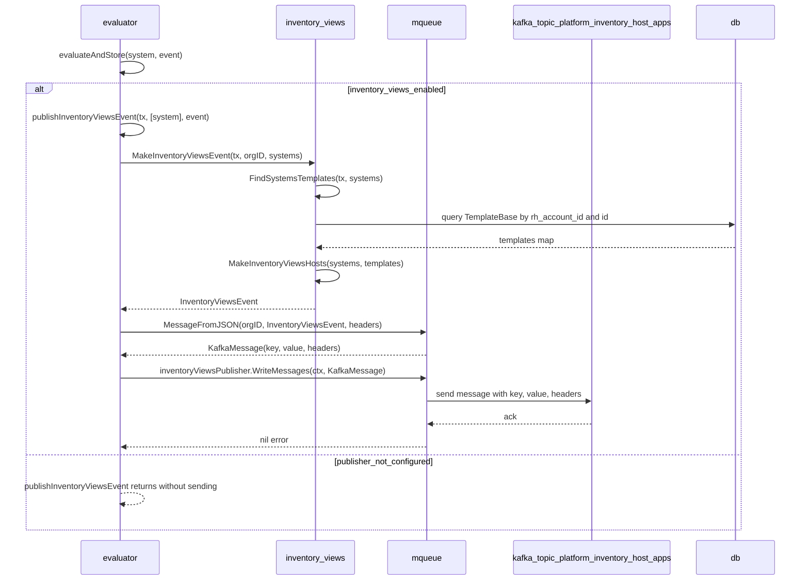
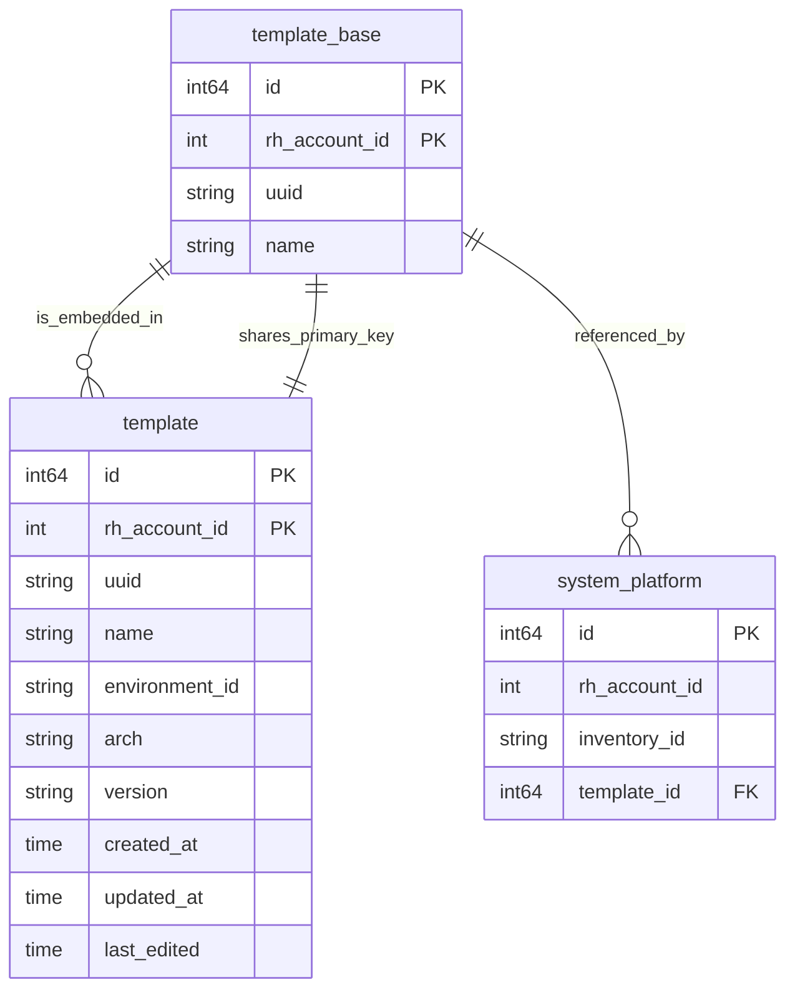
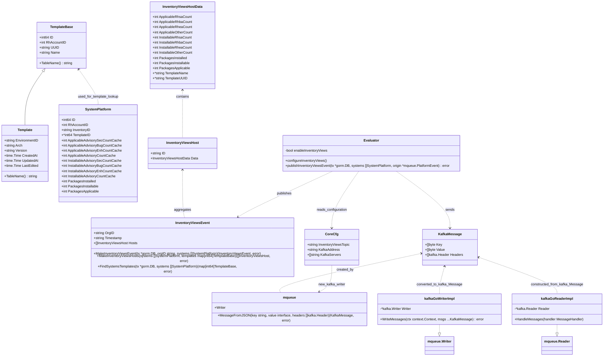

# Pull Request #2014: RHINENG-22325: inventory views

**Author**: @MichaelMraka
**Created**: January 12, 2026 at 10:41 AM UTC
**Status**: Merged
**Labels**: None
**Base**: `master` ← **Head**: `pr1`

## Description

## Secure Coding Practices Checklist GitHub Link
- https://github.com/RedHatInsights/secure-coding-checklist

## Secure Coding Checklist
- [x] Input Validation
- [x] Output Encoding
- [x] Authentication and Password Management
- [x] Session Management
- [x] Access Control
- [x] Cryptographic Practices
- [x] Error Handling and Logging
- [x] Data Protection
- [x] Communication Security
- [x] System Configuration
- [x] Database Security
- [x] File Management
- [x] Memory Management
- [x] General Coding Practices

## Summary by Sourcery

Add support for publishing inventory views Kafka events from the evaluator, including associated configuration, topic setup, and data model utilities.

New Features:
- Introduce inventory views event structures and helpers to build host data from system records and templates.
- Add evaluator logic to generate and publish inventory views events to a configurable Kafka topic with headers.

Enhancements:
- Refactor template modeling by extracting a reusable TemplateBase shared between templates and inventory views helpers.
- Extend Kafka messaging utilities to support headers and optional Kafka address overrides from the environment.
- Update test fixtures and evaluator tests to cover inventory views events and org ID propagation.

Build:
- Provision the platform.inventory.host-apps Kafka topic and wire its name through Clowder parameters and local/dev Kafka setup scripts.

Deployment:
- Configure evaluator deployments to receive the inventory views topic via environment variables.

Tests:
- Add database-backed tests for inventory views event construction, including systems with and without templates.

---

## Discussion

### Comment by @jira-linking on January 12, 2026 at 10:41 AM UTC

Referenced Jiras:
https://issues.redhat.com/browse/RHINENG-22325


### Comment by @sourcery-ai on January 12, 2026 at 10:41 AM UTC

<!-- Generated by sourcery-ai[bot]: start review_guide -->

## Reviewer's Guide

Adds inventory views Kafka event publishing from the evaluator, introduces a shared TemplateBase model, and extends the internal Kafka messaging abstraction to support headers and a new inventory views topic across configuration and deployment artifacts.

#### Sequence diagram for publishing inventory views events from evaluator



#### ER diagram for template and template_base usage in inventory views



#### Updated class diagram for templates, inventory views, and Kafka messaging



### File-Level Changes

| Change | Details | Files |
| ------ | ------- | ----- |
| Introduce inventory views event construction and publishing from evaluator to a dedicated Kafka topic with org-scoped host data. | <ul><li>Add inventory views feature flag and configuration wiring in evaluator, including topic-based publisher initialization.</li><li>Implement inventory views event builder that aggregates per-host advisory/package counts and template metadata, including DB lookups for templates.</li><li>Publish inventory views events after successful evaluation using the internal message queue, with appropriate headers, logging, metrics, and tests for event generation.</li></ul> | `evaluator/evaluate.go`<br/>`evaluator/inventory_views.go`<br/>`base/inventory_views/inventory_views.go`<br/>`base/inventory_views/inventory_views_test.go`<br/>`evaluator/evaluate_test.go`<br/>`deploy/clowdapp.yaml`<br/>`base/utils/config.go`<br/>`dev/kafka/setup.sh` |
| Refactor template model to share base fields between DB queries and listeners and adjust test helpers accordingly. | <ul><li>Extract TemplateBase from Template to contain primary key and identity fields and set its table mapping.</li><li>Update Template usages in listener and database test helpers to embed TemplateBase and populate shared fields correctly.</li></ul> | `base/models/models.go`<br/>`listener/templates.go`<br/>`base/database/testing.go`<br/>`base/inventory_views/inventory_views.go` |
| Extend Kafka messaging abstraction to carry headers and allow configuring Kafka via a single KAFKA_ADDRESS variable. | <ul><li>Add Headers to KafkaMessage and propagate them through kafka-go reader/writer implementation.</li><li>Extend MessageFromJSON to accept and set Kafka headers and update all callers to pass headers (or nil).</li><li>Support overriding KafkaAddress and KafkaServers via KAFKA_ADDRESS env variable and expose INVENTORY_VIEWS_TOPIC in core config, env, and clowder translation/printing.</li><li>Register the new inventory views topic in local/dev Kafka setup and clowdapp kafkaTopics plus parameterize INVENTORY_VIEWS_TOPIC.</li></ul> | `base/mqueue/mqueue.go`<br/>`base/mqueue/message.go`<br/>`base/mqueue/mqueue_impl_gokafka.go`<br/>`evaluator/notifications.go`<br/>`evaluator/notifications_test.go`<br/>`evaluator/remediations.go`<br/>`base/utils/config.go`<br/>`dev/kafka/setup.sh`<br/>`deploy/clowdapp.yaml` |

---

<details>
<summary>Tips and commands</summary>

#### Interacting with Sourcery

- **Trigger a new review:** Comment `@sourcery-ai review` on the pull request.
- **Continue discussions:** Reply directly to Sourcery's review comments.
- **Generate a GitHub issue from a review comment:** Ask Sourcery to create an
  issue from a review comment by replying to it. You can also reply to a
  review comment with `@sourcery-ai issue` to create an issue from it.
- **Generate a pull request title:** Write `@sourcery-ai` anywhere in the pull
  request title to generate a title at any time. You can also comment
  `@sourcery-ai title` on the pull request to (re-)generate the title at any time.
- **Generate a pull request summary:** Write `@sourcery-ai summary` anywhere in
  the pull request body to generate a PR summary at any time exactly where you
  want it. You can also comment `@sourcery-ai summary` on the pull request to
  (re-)generate the summary at any time.
- **Generate reviewer's guide:** Comment `@sourcery-ai guide` on the pull
  request to (re-)generate the reviewer's guide at any time.
- **Resolve all Sourcery comments:** Comment `@sourcery-ai resolve` on the
  pull request to resolve all Sourcery comments. Useful if you've already
  addressed all the comments and don't want to see them anymore.
- **Dismiss all Sourcery reviews:** Comment `@sourcery-ai dismiss` on the pull
  request to dismiss all existing Sourcery reviews. Especially useful if you
  want to start fresh with a new review - don't forget to comment
  `@sourcery-ai review` to trigger a new review!

#### Customizing Your Experience

Access your [dashboard](https://app.sourcery.ai) to:
- Enable or disable review features such as the Sourcery-generated pull request
  summary, the reviewer's guide, and others.
- Change the review language.
- Add, remove or edit custom review instructions.
- Adjust other review settings.

#### Getting Help

- [Contact our support team](mailto:support@sourcery.ai) for questions or feedback.
- Visit our [documentation](https://docs.sourcery.ai) for detailed guides and information.
- Keep in touch with the Sourcery team by following us on [X/Twitter](https://x.com/SourceryAI), [LinkedIn](https://www.linkedin.com/company/sourcery-ai/) or [GitHub](https://github.com/sourcery-ai).

</details>

<!-- Generated by sourcery-ai[bot]: end review_guide -->

### Comment by @codecov-commenter on January 12, 2026 at 10:48 AM UTC

## [Codecov](https://app.codecov.io/gh/RedHatInsights/patchman-engine/pull/2014?dropdown=coverage&src=pr&el=h1&utm_medium=referral&utm_source=github&utm_content=comment&utm_campaign=pr+comments&utm_term=RedHatInsights) Report
:x: Patch coverage is `73.50427%` with `31 lines` in your changes missing coverage. Please review.
:white_check_mark: Project coverage is 59.18%. Comparing base ([`506bc9a`](https://app.codecov.io/gh/RedHatInsights/patchman-engine/commit/506bc9a35a8ce23d87c81dff114f8f8e569e4a65?dropdown=coverage&el=desc&utm_medium=referral&utm_source=github&utm_content=comment&utm_campaign=pr+comments&utm_term=RedHatInsights)) to head ([`e5e30a9`](https://app.codecov.io/gh/RedHatInsights/patchman-engine/commit/e5e30a96e855145aae5392ee701cac5bb4c385d4?dropdown=coverage&el=desc&utm_medium=referral&utm_source=github&utm_content=comment&utm_campaign=pr+comments&utm_term=RedHatInsights)).

| [Files with missing lines](https://app.codecov.io/gh/RedHatInsights/patchman-engine/pull/2014?dropdown=coverage&src=pr&el=tree&utm_medium=referral&utm_source=github&utm_content=comment&utm_campaign=pr+comments&utm_term=RedHatInsights) | Patch % | Lines |
|---|---|---|
| [evaluator/inventory\_views.go](https://app.codecov.io/gh/RedHatInsights/patchman-engine/pull/2014?src=pr&el=tree&filepath=evaluator%2Finventory_views.go&utm_medium=referral&utm_source=github&utm_content=comment&utm_campaign=pr+comments&utm_term=RedHatInsights#diff-ZXZhbHVhdG9yL2ludmVudG9yeV92aWV3cy5nbw==) | 73.33% | [4 Missing and 4 partials :warning: ](https://app.codecov.io/gh/RedHatInsights/patchman-engine/pull/2014?src=pr&el=tree&utm_medium=referral&utm_source=github&utm_content=comment&utm_campaign=pr+comments&utm_term=RedHatInsights) |
| [base/database/testing.go](https://app.codecov.io/gh/RedHatInsights/patchman-engine/pull/2014?src=pr&el=tree&filepath=base%2Fdatabase%2Ftesting.go&utm_medium=referral&utm_source=github&utm_content=comment&utm_campaign=pr+comments&utm_term=RedHatInsights#diff-YmFzZS9kYXRhYmFzZS90ZXN0aW5nLmdv) | 0.00% | [6 Missing :warning: ](https://app.codecov.io/gh/RedHatInsights/patchman-engine/pull/2014?src=pr&el=tree&utm_medium=referral&utm_source=github&utm_content=comment&utm_campaign=pr+comments&utm_term=RedHatInsights) |
| [base/inventory\_views/inventory\_views.go](https://app.codecov.io/gh/RedHatInsights/patchman-engine/pull/2014?src=pr&el=tree&filepath=base%2Finventory_views%2Finventory_views.go&utm_medium=referral&utm_source=github&utm_content=comment&utm_campaign=pr+comments&utm_term=RedHatInsights#diff-YmFzZS9pbnZlbnRvcnlfdmlld3MvaW52ZW50b3J5X3ZpZXdzLmdv) | 88.88% | [3 Missing and 3 partials :warning: ](https://app.codecov.io/gh/RedHatInsights/patchman-engine/pull/2014?src=pr&el=tree&utm_medium=referral&utm_source=github&utm_content=comment&utm_campaign=pr+comments&utm_term=RedHatInsights) |
| [base/utils/config.go](https://app.codecov.io/gh/RedHatInsights/patchman-engine/pull/2014?src=pr&el=tree&filepath=base%2Futils%2Fconfig.go&utm_medium=referral&utm_source=github&utm_content=comment&utm_campaign=pr+comments&utm_term=RedHatInsights#diff-YmFzZS91dGlscy9jb25maWcuZ28=) | 42.85% | [3 Missing and 1 partial :warning: ](https://app.codecov.io/gh/RedHatInsights/patchman-engine/pull/2014?src=pr&el=tree&utm_medium=referral&utm_source=github&utm_content=comment&utm_campaign=pr+comments&utm_term=RedHatInsights) |
| [evaluator/evaluate.go](https://app.codecov.io/gh/RedHatInsights/patchman-engine/pull/2014?src=pr&el=tree&filepath=evaluator%2Fevaluate.go&utm_medium=referral&utm_source=github&utm_content=comment&utm_campaign=pr+comments&utm_term=RedHatInsights#diff-ZXZhbHVhdG9yL2V2YWx1YXRlLmdv) | 50.00% | [3 Missing and 1 partial :warning: ](https://app.codecov.io/gh/RedHatInsights/patchman-engine/pull/2014?src=pr&el=tree&utm_medium=referral&utm_source=github&utm_content=comment&utm_campaign=pr+comments&utm_term=RedHatInsights) |
| [base/mqueue/message.go](https://app.codecov.io/gh/RedHatInsights/patchman-engine/pull/2014?src=pr&el=tree&filepath=base%2Fmqueue%2Fmessage.go&utm_medium=referral&utm_source=github&utm_content=comment&utm_campaign=pr+comments&utm_term=RedHatInsights#diff-YmFzZS9tcXVldWUvbWVzc2FnZS5nbw==) | 0.00% | [2 Missing :warning: ](https://app.codecov.io/gh/RedHatInsights/patchman-engine/pull/2014?src=pr&el=tree&utm_medium=referral&utm_source=github&utm_content=comment&utm_campaign=pr+comments&utm_term=RedHatInsights) |
| [base/models/models.go](https://app.codecov.io/gh/RedHatInsights/patchman-engine/pull/2014?src=pr&el=tree&filepath=base%2Fmodels%2Fmodels.go&utm_medium=referral&utm_source=github&utm_content=comment&utm_campaign=pr+comments&utm_term=RedHatInsights#diff-YmFzZS9tb2RlbHMvbW9kZWxzLmdv) | 0.00% | [1 Missing :warning: ](https://app.codecov.io/gh/RedHatInsights/patchman-engine/pull/2014?src=pr&el=tree&utm_medium=referral&utm_source=github&utm_content=comment&utm_campaign=pr+comments&utm_term=RedHatInsights) |

<details><summary>Additional details and impacted files</summary>


```diff
@@            Coverage Diff             @@
##           master    #2014      +/-   ##
==========================================
+ Coverage   59.01%   59.18%   +0.16%     
==========================================
  Files         131      133       +2     
  Lines        8493     8599     +106     
==========================================
+ Hits         5012     5089      +77     
- Misses       2947     2967      +20     
- Partials      534      543       +9     
```

| [Flag](https://app.codecov.io/gh/RedHatInsights/patchman-engine/pull/2014/flags?src=pr&el=flags&utm_medium=referral&utm_source=github&utm_content=comment&utm_campaign=pr+comments&utm_term=RedHatInsights) | Coverage Δ | |
|---|---|---|
| [unittests](https://app.codecov.io/gh/RedHatInsights/patchman-engine/pull/2014/flags?src=pr&el=flag&utm_medium=referral&utm_source=github&utm_content=comment&utm_campaign=pr+comments&utm_term=RedHatInsights) | `59.18% <73.50%> (+0.16%)` | :arrow_up: |

Flags with carried forward coverage won't be shown. [Click here](https://docs.codecov.io/docs/carryforward-flags?utm_medium=referral&utm_source=github&utm_content=comment&utm_campaign=pr+comments&utm_term=RedHatInsights#carryforward-flags-in-the-pull-request-comment) to find out more.
</details>

[:umbrella: View full report in Codecov by Sentry](https://app.codecov.io/gh/RedHatInsights/patchman-engine/pull/2014?dropdown=coverage&src=pr&el=continue&utm_medium=referral&utm_source=github&utm_content=comment&utm_campaign=pr+comments&utm_term=RedHatInsights).   
:loudspeaker: Have feedback on the report? [Share it here](https://about.codecov.io/codecov-pr-comment-feedback/?utm_medium=referral&utm_source=github&utm_content=comment&utm_campaign=pr+comments&utm_term=RedHatInsights).
<details><summary> :rocket: New features to boost your workflow: </summary>

- :snowflake: [Test Analytics](https://docs.codecov.com/docs/test-analytics): Detect flaky tests, report on failures, and find test suite problems.
</details>

---

## Reviews

### Review by @sourcery-ai - Commented on January 13, 2026 at 12:48 PM UTC

Hey - I've found 1 issue, and left some high level feedback:

- In `MakeInventoryViewsHosts`, when a system has a `TemplateID` that isn't present in the `templates` map, you log a warning but still unconditionally set `TemplateName`/`TemplateUUID` from the zero-value `template` variable; this yields non-nil empty strings instead of `nil`, which contradicts the test expectations and should be guarded by the `ok` flag.
- `MakeInventoryViewsHosts` returns `([]InventoryViewsHost, error)` but never actually produces a non-nil error; consider simplifying the signature to drop the `error` return or add concrete error conditions to make the return type meaningful.

<details>
<summary>Prompt for AI Agents</summary>

~~~markdown
Please address the comments from this code review:

## Overall Comments
- In `MakeInventoryViewsHosts`, when a system has a `TemplateID` that isn't present in the `templates` map, you log a warning but still unconditionally set `TemplateName`/`TemplateUUID` from the zero-value `template` variable; this yields non-nil empty strings instead of `nil`, which contradicts the test expectations and should be guarded by the `ok` flag.
- `MakeInventoryViewsHosts` returns `([]InventoryViewsHost, error)` but never actually produces a non-nil error; consider simplifying the signature to drop the `error` return or add concrete error conditions to make the return type meaningful.

## Individual Comments

### Comment 1
<location> `base/inventory_views/inventory_views_test.go:68-77` </location>
<code_context>
+func TestMakeInventoryViewsEventNoTemplate(t *testing.T) {
</code_context>

<issue_to_address>
**suggestion (testing):** Consider adding a test for systems that reference a non-existent template row

Current tests cover valid templates, an empty systems slice, and `TemplateID == nil`. There’s still an untested path where `TemplateID != nil` but `FindSystemsTemplates` returns no row (e.g. deleted template): we log a warning, but the resulting `TemplateName`/`TemplateUUID` behavior isn’t asserted. Please add a DB-backed test that sets `TemplateID` to a non-existent template ID and verifies that `MakeInventoryViewsEvent` does not error, and that `TemplateName`/`TemplateUUID` match the intended behavior for dangling template references.

Suggested implementation:

```golang
func TestMakeInventoryViewsEventNoTemplate(t *testing.T) {
	utils.SkipWithoutDB(t)
	core.SetupTestEnvironment()

	tx := database.DB.Begin()
	defer tx.Rollback()

	var rhAccount models.RhAccount
	assert.NoError(t, tx.Where("id = ?", rhAccountID).First(&rhAccount).Error)
	assert.NotEmpty(t, *rhAccount.OrgID)
	orgID := *rhAccount.OrgID

	// Use a template ID that does not exist in the templates table to simulate
	// a dangling template reference (e.g. the template was deleted).
	var nonExistentTemplateID uint = 999999999

	system := models.SystemPlatform{
		RhAccountID: &rhAccount.ID,
		OrgID:       &orgID,
		TemplateID:  &nonExistentTemplateID,
	}

	event, err := MakeInventoryViewsEvent(tx, orgID, []models.SystemPlatform{system})
	assert.NoError(t, err)
	assert.Equal(t, orgID, event.OrgID)
	assert.Len(t, event.Hosts, 1)

	host := event.Hosts[0]

	// When a system references a non-existent template row, we only log a warning
	// and still emit the host; template-related fields should reflect the
	// "missing template" behavior (no template data attached).
	assert.Zero(t, host.TemplateUUID)
	assert.Zero(t, host.TemplateName)
}

```

1. Ensure that `models.SystemPlatform` has the fields `RhAccountID`, `OrgID`, and `TemplateID` with compatible types:
   - `RhAccountID` should match the type of `rhAccount.ID` (commonly `uint` or `int64`) and be a pointer if used as `&rhAccount.ID`.
   - `OrgID` should be a `*string` to match `orgID := *rhAccount.OrgID`.
   - `TemplateID` should be a pointer to an integer type (here `*uint`). If it is a different type (e.g. `*int64` or `*uuid.UUID`), adjust the definition of `nonExistentTemplateID` and the field type accordingly.
2. Confirm the `event.Hosts` element type exposes `TemplateUUID` and `TemplateName` fields. If their names or types differ:
   - Update `host.TemplateUUID` / `host.TemplateName` to the correct field names.
   - Keep the `assert.Zero` checks so the test remains agnostic to whether the fields are strings or pointers; `assert.Zero` will pass for `""` or `nil`.
3. If `MakeInventoryViewsEvent` is expected to behave differently for dangling template references (e.g. keep a UUID but clear only the name), adjust the assertions on `host.TemplateUUID` / `host.TemplateName` to match that intended behavior.
</issue_to_address>
~~~

</details>

***

<details>
<summary>Sourcery is free for open source - if you like our reviews please consider sharing them ✨</summary>

- [X](https://twitter.com/intent/tweet?text=I%20just%20got%20an%20instant%20code%20review%20from%20%40SourceryAI%2C%20and%20it%20was%20brilliant%21%20It%27s%20free%20for%20open%20source%20and%20has%20a%20free%20trial%20for%20private%20code.%20Check%20it%20out%20https%3A//sourcery.ai)
- [Mastodon](https://mastodon.social/share?text=I%20just%20got%20an%20instant%20code%20review%20from%20%40SourceryAI%2C%20and%20it%20was%20brilliant%21%20It%27s%20free%20for%20open%20source%20and%20has%20a%20free%20trial%20for%20private%20code.%20Check%20it%20out%20https%3A//sourcery.ai)
- [LinkedIn](https://www.linkedin.com/sharing/share-offsite/?url=https://sourcery.ai)
- [Facebook](https://www.facebook.com/sharer/sharer.php?u=https://sourcery.ai)

</details>

<sub>
Help me be more useful! Please click 👍 or 👎 on each comment and I'll use the feedback to improve your reviews.
</sub>

### Review by @TenSt - Commented on January 15, 2026 at 01:45 PM UTC

### Review by @TenSt - Approved on January 15, 2026 at 01:46 PM UTC

lgtm!

### Review by @MichaelMraka - Commented on January 15, 2026 at 04:35 PM UTC

---

*Archived from: https://github.com/RedHatInsights/patchman-engine/pull/2014*
