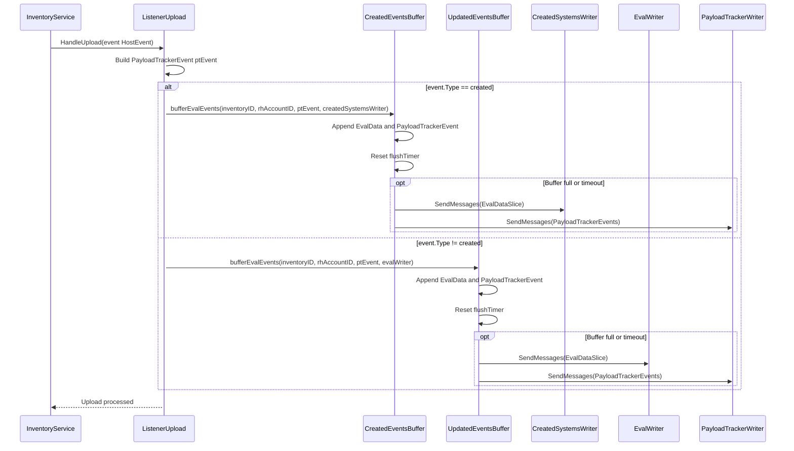
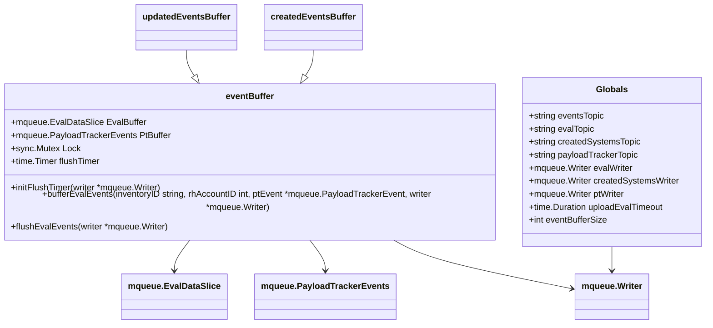

# Pull Request #2029: RHINENG-23045: use user queue for new systems

**Author**: @TenSt
**Created**: January 27, 2026 at 12:21 PM UTC
**Status**: Merged
**Labels**: None
**Base**: `master` ← **Head**: `stepan/RHINENG-23045-use-user-queue-for-new-systems`

## Description

## Secure Coding Practices Checklist GitHub Link
- https://github.com/RedHatInsights/secure-coding-checklist

## Secure Coding Checklist
- [x] Input Validation
- [x] Output Encoding
- [x] Authentication and Password Management
- [x] Session Management
- [x] Access Control
- [x] Cryptographic Practices
- [x] Error Handling and Logging
- [x] Data Protection
- [x] Communication Security
- [x] System Configuration
- [x] Database Security
- [x] File Management
- [x] Memory Management
- [x] General Coding Practices

## Summary by Sourcery

Route evaluation events for newly created systems to a dedicated Kafka topic and buffer, while keeping updates on the existing evaluator queue.

New Features:
- Introduce a separate Kafka topic and writer for evaluation events of newly created systems.
- Add distinct in-memory buffers and timers for created and updated host evaluation events.

Enhancements:
- Refactor event buffering logic into a reusable eventBuffer helper shared by created and updated event queues.
- Extend upload handling to branch on event type so created and updated systems are processed through their respective queues.

Build:
- Wire the new CREATED_SYSTEMS_TOPIC configuration through core config, environment variables, and the ClowdApp deployment template.

Tests:
- Update and extend listener tests to cover both created and updated upload events and the new buffering/writer behavior.

---

## Discussion

### Comment by @jira-linking on January 27, 2026 at 12:21 PM UTC

Referenced Jiras:
https://issues.redhat.com/browse/RHINENG-23045


### Comment by @sourcery-ai on January 27, 2026 at 12:21 PM UTC

<!-- Generated by sourcery-ai[bot]: start review_guide -->

## Reviewer's Guide

Separate buffering and Kafka routing for created vs updated system evaluation events by introducing a reusable eventBuffer helper, wiring a new CREATED_SYSTEMS_TOPIC and writer, and adapting upload handling and tests to pass an event type.

#### Sequence diagram for handling created vs updated upload events



#### Class diagram for the new eventBuffer structure and globals



### File-Level Changes

| Change | Details | Files |
| ------ | ------- | ----- |
| Route created vs updated system upload events through separate Kafka writers and buffers. | <ul><li>Extend HostEvent test helper to accept an explicit event type and update all callers to pass either created or updated.</li><li>Change HandleUpload to select between createdEventsBuffer/createdSystemsWriter and updatedEventsBuffer/evalWriter based on event.Type.</li><li>Initialize both event buffers at listener startup so they share the same timeout and metrics behavior.</li></ul> | `listener/upload.go`<br/>`listener/common_test.go`<br/>`listener/upload_test.go`<br/>`listener/events_test.go`<br/>`listener/listener.go` |
| Refactor event buffering into a reusable eventBuffer struct supporting per-writer flushing. | <ul><li>Extract the previous global eval event buffer and flushTimer logic from upload.go into a new eventBuffer type with its own mutex, slices, and flush timer.</li><li>Implement bufferEvalEvents and flushEvalEvents as methods that work with an injected Kafka writer, and provide two instances for updated and created events.</li><li>Preserve existing batching, timeout-based flushing, and metrics/logging behavior while allowing independent buffers per topic.</li></ul> | `listener/event_buffers.go`<br/>`listener/upload.go` |
| Add configuration and deployment wiring for the new CREATED_SYSTEMS_TOPIC and Kafka writer. | <ul><li>Extend core configuration to include CreatedSystemsTopic and populate it from a CREATED_SYSTEMS_TOPIC env var.</li><li>Create createdSystemsWriter in listener configuration using the new topic and pass it into the created events buffer initialization.</li><li>Update deployment manifest to define CREATED_SYSTEMS_TOPIC and ensure environment wiring for the listener container.</li></ul> | `base/utils/config.go`<br/>`listener/listener.go`<br/>`deploy/clowdapp.yaml` |

---

<details>
<summary>Tips and commands</summary>

#### Interacting with Sourcery

- **Trigger a new review:** Comment `@sourcery-ai review` on the pull request.
- **Continue discussions:** Reply directly to Sourcery's review comments.
- **Generate a GitHub issue from a review comment:** Ask Sourcery to create an
  issue from a review comment by replying to it. You can also reply to a
  review comment with `@sourcery-ai issue` to create an issue from it.
- **Generate a pull request title:** Write `@sourcery-ai` anywhere in the pull
  request title to generate a title at any time. You can also comment
  `@sourcery-ai title` on the pull request to (re-)generate the title at any time.
- **Generate a pull request summary:** Write `@sourcery-ai summary` anywhere in
  the pull request body to generate a PR summary at any time exactly where you
  want it. You can also comment `@sourcery-ai summary` on the pull request to
  (re-)generate the summary at any time.
- **Generate reviewer's guide:** Comment `@sourcery-ai guide` on the pull
  request to (re-)generate the reviewer's guide at any time.
- **Resolve all Sourcery comments:** Comment `@sourcery-ai resolve` on the
  pull request to resolve all Sourcery comments. Useful if you've already
  addressed all the comments and don't want to see them anymore.
- **Dismiss all Sourcery reviews:** Comment `@sourcery-ai dismiss` on the pull
  request to dismiss all existing Sourcery reviews. Especially useful if you
  want to start fresh with a new review - don't forget to comment
  `@sourcery-ai review` to trigger a new review!

#### Customizing Your Experience

Access your [dashboard](https://app.sourcery.ai) to:
- Enable or disable review features such as the Sourcery-generated pull request
  summary, the reviewer's guide, and others.
- Change the review language.
- Add, remove or edit custom review instructions.
- Adjust other review settings.

#### Getting Help

- [Contact our support team](mailto:support@sourcery.ai) for questions or feedback.
- Visit our [documentation](https://docs.sourcery.ai) for detailed guides and information.
- Keep in touch with the Sourcery team by following us on [X/Twitter](https://x.com/SourceryAI), [LinkedIn](https://www.linkedin.com/company/sourcery-ai/) or [GitHub](https://github.com/sourcery-ai).

</details>

<!-- Generated by sourcery-ai[bot]: end review_guide -->

### Comment by @codecov-commenter on January 27, 2026 at 12:34 PM UTC

## [Codecov](https://app.codecov.io/gh/RedHatInsights/patchman-engine/pull/2029?dropdown=coverage&src=pr&el=h1&utm_medium=referral&utm_source=github&utm_content=comment&utm_campaign=pr+comments&utm_term=RedHatInsights) Report
:x: Patch coverage is `90.38462%` with `5 lines` in your changes missing coverage. Please review.
:white_check_mark: Project coverage is 59.25%. Comparing base ([`515671e`](https://app.codecov.io/gh/RedHatInsights/patchman-engine/commit/515671efc8912596be2361a65fa55460cd7056f1?dropdown=coverage&el=desc&utm_medium=referral&utm_source=github&utm_content=comment&utm_campaign=pr+comments&utm_term=RedHatInsights)) to head ([`bee8856`](https://app.codecov.io/gh/RedHatInsights/patchman-engine/commit/bee8856304e069c14942e90fea2380b8f4cb845e?dropdown=coverage&el=desc&utm_medium=referral&utm_source=github&utm_content=comment&utm_campaign=pr+comments&utm_term=RedHatInsights)).

| [Files with missing lines](https://app.codecov.io/gh/RedHatInsights/patchman-engine/pull/2029?dropdown=coverage&src=pr&el=tree&utm_medium=referral&utm_source=github&utm_content=comment&utm_campaign=pr+comments&utm_term=RedHatInsights) | Patch % | Lines |
|---|---|---|
| [listener/event\_buffers.go](https://app.codecov.io/gh/RedHatInsights/patchman-engine/pull/2029?src=pr&el=tree&filepath=listener%2Fevent_buffers.go&utm_medium=referral&utm_source=github&utm_content=comment&utm_campaign=pr+comments&utm_term=RedHatInsights#diff-bGlzdGVuZXIvZXZlbnRfYnVmZmVycy5nbw==) | 88.37% | [3 Missing and 2 partials :warning: ](https://app.codecov.io/gh/RedHatInsights/patchman-engine/pull/2029?src=pr&el=tree&utm_medium=referral&utm_source=github&utm_content=comment&utm_campaign=pr+comments&utm_term=RedHatInsights) |

<details><summary>Additional details and impacted files</summary>


```diff
@@            Coverage Diff             @@
##           master    #2029      +/-   ##
==========================================
+ Coverage   59.18%   59.25%   +0.07%     
==========================================
  Files         133      134       +1     
  Lines        8599     8615      +16     
==========================================
+ Hits         5089     5105      +16     
  Misses       2967     2967              
  Partials      543      543              
```

| [Flag](https://app.codecov.io/gh/RedHatInsights/patchman-engine/pull/2029/flags?src=pr&el=flags&utm_medium=referral&utm_source=github&utm_content=comment&utm_campaign=pr+comments&utm_term=RedHatInsights) | Coverage Δ | |
|---|---|---|
| [unittests](https://app.codecov.io/gh/RedHatInsights/patchman-engine/pull/2029/flags?src=pr&el=flag&utm_medium=referral&utm_source=github&utm_content=comment&utm_campaign=pr+comments&utm_term=RedHatInsights) | `59.25% <90.38%> (+0.07%)` | :arrow_up: |

Flags with carried forward coverage won't be shown. [Click here](https://docs.codecov.io/docs/carryforward-flags?utm_medium=referral&utm_source=github&utm_content=comment&utm_campaign=pr+comments&utm_term=RedHatInsights#carryforward-flags-in-the-pull-request-comment) to find out more.
</details>

[:umbrella: View full report in Codecov by Sentry](https://app.codecov.io/gh/RedHatInsights/patchman-engine/pull/2029?dropdown=coverage&src=pr&el=continue&utm_medium=referral&utm_source=github&utm_content=comment&utm_campaign=pr+comments&utm_term=RedHatInsights).   
:loudspeaker: Have feedback on the report? [Share it here](https://about.codecov.io/codecov-pr-comment-feedback/?utm_medium=referral&utm_source=github&utm_content=comment&utm_campaign=pr+comments&utm_term=RedHatInsights).
<details><summary> :rocket: New features to boost your workflow: </summary>

- :snowflake: [Test Analytics](https://docs.codecov.com/docs/test-analytics): Detect flaky tests, report on failures, and find test suite problems.
</details>

---

## Reviews

### Review by @sourcery-ai - Commented on January 27, 2026 at 12:34 PM UTC

Hey - I've found 2 issues, and left some high level feedback:

- The new buffering helper passes `*mqueue.Writer` around (e.g. `initFlushTimer(w *mqueue.Writer)` and `SendMessages(base.Context, *w, ...)`); since `mqueue.Writer` is already an interface, taking a pointer to it is unnecessary and makes nil-handling and call sites more error‑prone—consider changing the helper to accept `mqueue.Writer` directly and pass `evalWriter` / `createdSystemsWriter` by value.
- In `eventBuffer.bufferEvalEvents` the timer is reset with `b.flushTimer.Reset(uploadEvalTimeout)` without stopping it first; to avoid subtle races where the timer may fire concurrently with `Reset`, it would be safer to call `Stop` and drain the channel (if needed) before resetting, or use a pattern that guarantees single ownership of timer updates.

<details>
<summary>Prompt for AI Agents</summary>

~~~markdown
Please address the comments from this code review:

## Overall Comments
- The new buffering helper passes `*mqueue.Writer` around (e.g. `initFlushTimer(w *mqueue.Writer)` and `SendMessages(base.Context, *w, ...)`); since `mqueue.Writer` is already an interface, taking a pointer to it is unnecessary and makes nil-handling and call sites more error‑prone—consider changing the helper to accept `mqueue.Writer` directly and pass `evalWriter` / `createdSystemsWriter` by value.
- In `eventBuffer.bufferEvalEvents` the timer is reset with `b.flushTimer.Reset(uploadEvalTimeout)` without stopping it first; to avoid subtle races where the timer may fire concurrently with `Reset`, it would be safer to call `Stop` and drain the channel (if needed) before resetting, or use a pattern that guarantees single ownership of timer updates.

## Individual Comments

### Comment 1
<location> `listener/event_buffers.go:59-62` </location>
<code_context>
+	}
+	b.EvalBuffer = append(b.EvalBuffer, evalData)
+	b.PtBuffer = append(b.PtBuffer, *ptEvent)
+	b.Lock.Unlock()
+
+	b.flushTimer.Reset(uploadEvalTimeout)
+	if len(b.EvalBuffer) >= eventBufferSize {
+		utils.LogInfo(FlushedFullBuffer)
+		b.flushEvalEvents(w)
</code_context>

<issue_to_address>
**issue (bug_risk):** Accessing b.EvalBuffer length without holding the mutex can lead to a data race.

The length check on `b.EvalBuffer` happens after the lock is released, so `bufferEvalEvents` and `flushEvalEvents` can mutate `b.EvalBuffer` concurrently with this read. To avoid this race, either keep the length check inside the critical section or store `len(b.EvalBuffer)` in a local variable before unlocking and use that cached value for the threshold check.
</issue_to_address>

### Comment 2
<location> `listener/event_buffers.go:33` </location>
<code_context>
+	Lock:       sync.Mutex{},
+}
+
+func (b *eventBuffer) initFlushTimer(w *mqueue.Writer) {
+	b.flushTimer = time.AfterFunc(87600*time.Hour, func() {
+		utils.LogInfo(FlushedTimeoutBuffer)
</code_context>

<issue_to_address>
**issue (complexity):** Consider tightening the eventBuffer API (locking, timer handling, and writer dependencies) so concurrency behaviour is explicit and internals aren’t exposed at call sites.

You can reduce the concurrency/abstraction complexity without changing behaviour by tightening encapsulation and fixing the timer/race semantics. Three concrete, incremental steps:

---

### 1. Fix race potential and make timer semantics explicit

`bufferEvalEvents` modifies the buffer under lock, then resets the timer and checks `len` outside the lock. That’s both harder to reason about and risks inconsistent behaviour if the timer flush fires concurrently.

Keep all buffer-related mutations + checks under the same lock and initialize the timer with the real interval instead of a dummy huge duration:

```go
func (b *eventBuffer) initFlushTimer(w *mqueue.Writer) {
    b.Lock.Lock()
    defer b.Lock.Unlock()

    if b.flushTimer == nil {
        b.flushTimer = time.AfterFunc(uploadEvalTimeout, func() {
            utils.LogInfo(FlushedTimeoutBuffer)
            b.flushEvalEvents(w)
        })
    } else {
        b.flushTimer.Reset(uploadEvalTimeout)
    }
}

func (b *eventBuffer) bufferEvalEvents(
    inventoryID string,
    rhAccountID int,
    ptEvent *mqueue.PayloadTrackerEvent,
    w *mqueue.Writer,
) {
    tStart := time.Now()
    defer utils.ObserveSecondsSince(tStart, messagePartDuration.WithLabelValues("buffer-eval-events"))

    b.Lock.Lock()
    evalData := mqueue.EvalData{
        InventoryID: inventoryID,
        RhAccountID: rhAccountID,
        OrgID:       ptEvent.OrgID,
        RequestID:   *ptEvent.RequestID,
    }
    b.EvalBuffer = append(b.EvalBuffer, evalData)
    b.PtBuffer = append(b.PtBuffer, *ptEvent)

    // timer + length check happen while holding the lock
    if b.flushTimer == nil {
        b.flushTimer = time.AfterFunc(uploadEvalTimeout, func() {
            utils.LogInfo(FlushedTimeoutBuffer)
            b.flushEvalEvents(w)
        })
    } else {
        b.flushTimer.Reset(uploadEvalTimeout)
    }

    shouldFlush := len(b.EvalBuffer) >= eventBufferSize
    b.Lock.Unlock()

    if shouldFlush {
        utils.LogInfo(FlushedFullBuffer)
        b.flushEvalEvents(w)
    }
}
```

This keeps the lock scope clear and eliminates the “huge disabled timer” trick.

---

### 2. Remove asymmetric dependency on `ptWriter`

`flushEvalEvents` takes `w *mqueue.Writer` for eval messages but reaches out to global `ptWriter` for payload tracker, which makes the buffer harder to test and reason about.

Inject both writers into `eventBuffer` and use them consistently:

```go
type eventBuffer struct {
    EvalBuffer mqueue.EvalDataSlice
    PtBuffer   mqueue.PayloadTrackerEvents
    Lock       sync.Mutex
    flushTimer *time.Timer

    evalWriter *mqueue.Writer
    ptWriter   *mqueue.Writer
}

func newEventBuffer(evalWriter, ptWriter *mqueue.Writer) *eventBuffer {
    return &eventBuffer{
        EvalBuffer: make(mqueue.EvalDataSlice, 0, eventBufferSize+1),
        PtBuffer:   make(mqueue.PayloadTrackerEvents, 0, eventBufferSize+1),
        evalWriter: evalWriter,
        ptWriter:   ptWriter,
    }
}

func (b *eventBuffer) flushEvalEvents() {
    tStart := time.Now()
    b.Lock.Lock()
    defer b.Lock.Unlock()

    if len(b.EvalBuffer) == 0 && len(b.PtBuffer) == 0 {
        return
    }

    if err := mqueue.SendMessages(base.Context, *b.evalWriter, b.EvalBuffer); err != nil {
        utils.LogError("err", err.Error(), ErrorKafkaSend)
    }
    utils.ObserveSecondsSince(tStart, messagePartDuration.WithLabelValues("buffer-sent-evaluator"))

    if err := mqueue.SendMessages(base.Context, *b.ptWriter, b.PtBuffer); err != nil {
        utils.LogWarn("err", err.Error(), WarnPayloadTracker)
    }
    utils.ObserveSecondsSince(tStart, messagePartDuration.WithLabelValues("buffer-sent-payload-tracker"))

    utils.LogDebug(
        "evaluator_messages", len(b.EvalBuffer),
        "payload_tracker_messages", len(b.PtBuffer),
        "flushed buffers",
    )

    b.EvalBuffer = b.EvalBuffer[:0]
    b.PtBuffer = b.PtBuffer[:0]
}
```

Call sites then no longer need to pass `w` into `flushEvalEvents`, and the global `ptWriter` dependency is removed from this type.

---

### 3. Hide internals and avoid duplicated global buffers

The two globals `updatedEventsBuffer` and `createdEventsBuffer` are nearly identical and expose internals (`EvalBuffer`, `PtBuffer`, `Lock`) by using exported field names.

At minimum, keep the current design but make internals private and construct instances through a helper:

```go
type eventBuffer struct {
    evalBuffer mqueue.EvalDataSlice
    ptBuffer   mqueue.PayloadTrackerEvents
    lock       sync.Mutex
    flushTimer *time.Timer

    evalWriter *mqueue.Writer
    ptWriter   *mqueue.Writer
}

func newUpdatedEventsBuffer(evalWriter, ptWriter *mqueue.Writer) *eventBuffer {
    return newEventBuffer(evalWriter, ptWriter)
}

func newCreatedEventsBuffer(evalWriter, ptWriter *mqueue.Writer) *eventBuffer {
    return newEventBuffer(evalWriter, ptWriter)
}
```

Then expose only high‑level operations like:

```go
func (b *eventBuffer) Add(
    inventoryID string,
    rhAccountID int,
    ptEvent *mqueue.PayloadTrackerEvent,
) {
    b.bufferEvalEvents(inventoryID, rhAccountID, ptEvent)
}
```

and keep timer/locking details internal. Existing call sites can be trivially updated to use `Add(...)` instead of directly manipulating buffers, while behaviour remains the same.
</issue_to_address>
~~~

</details>

***

<details>
<summary>Sourcery is free for open source - if you like our reviews please consider sharing them ✨</summary>

- [X](https://twitter.com/intent/tweet?text=I%20just%20got%20an%20instant%20code%20review%20from%20%40SourceryAI%2C%20and%20it%20was%20brilliant%21%20It%27s%20free%20for%20open%20source%20and%20has%20a%20free%20trial%20for%20private%20code.%20Check%20it%20out%20https%3A//sourcery.ai)
- [Mastodon](https://mastodon.social/share?text=I%20just%20got%20an%20instant%20code%20review%20from%20%40SourceryAI%2C%20and%20it%20was%20brilliant%21%20It%27s%20free%20for%20open%20source%20and%20has%20a%20free%20trial%20for%20private%20code.%20Check%20it%20out%20https%3A//sourcery.ai)
- [LinkedIn](https://www.linkedin.com/sharing/share-offsite/?url=https://sourcery.ai)
- [Facebook](https://www.facebook.com/sharer/sharer.php?u=https://sourcery.ai)

</details>

<sub>
Help me be more useful! Please click 👍 or 👎 on each comment and I'll use the feedback to improve your reviews.
</sub>

### Review by @MichaelMraka - Approved on January 28, 2026 at 12:45 PM UTC

great. nice consolidation of buffer logic.

---

*Archived from: https://github.com/RedHatInsights/patchman-engine/pull/2029*
